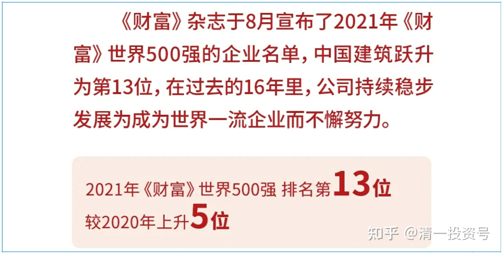
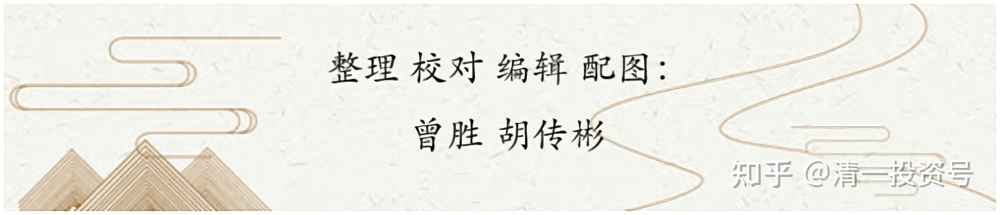

2篇. 赚钱王道：在低估的前提下轮动

清一山长 2017年2月11日～10月27日

**文章导读**

1. 我也喜欢和专业人士的建议反着做；

2. 投资原则：AH套利模式；

3. 本人持有中建，目前依然是A股第一重仓股。

**正文**

**1. 我也喜欢和专业人士的建议反着做**

**[清一山长](http://link.zhihu.com/?target=https%3A//xueqiu.com/9310099567)** [修改于2017-02-11 03:06](http://link.zhihu.com/?target=https%3A//xueqiu.com/9310099567/81037760)

[$中国建筑(SH601668)$](http://link.zhihu.com/?target=http%3A//xueqiu.com/S/SH601668) 今天这70亿元的成交，代表前期被蹂躏了一两个月的跟风盘，今天都“成功”地逃掉了。他们在等中建再次跌回到8元区域的日子，做做短差。他们以为中建的庄家，就是专门给他们送钱的二货。但我认为他们踏空在即！9元的区域，理论上从原来的压力位，现在已经变成了支撑位。下一个压力位，是10元整数了。如果快速突破，就可以出货。如果慢慢盘上去，就继续持仓。理论上，11元才是这一轮争夺的焦点区位，而不是10元。具体如何走？看主力的展示吧！

**[清一山长](http://link.zhihu.com/?target=https%3A//xueqiu.com/9310099567)** [2017-02-24 09:26](http://link.zhihu.com/?target=https%3A//xueqiu.com/9310099567/81636196)

**我也喜欢和专业人士的建议反着做**

2014年年初，很资深的专业人士，说我不该重仓银行股，可是这一年我赚了很多。2015年，他们还是坚持告诉我：就算我赚了钱，也不能说我的投资策略是对的，我只是运气好罢了。我真的是运气好，2015年主仓位靠坚持银行股，不仅躲过股灾，账户资产还创了新高。2016年，我总算放弃一部分银行（只占三分之一仓位）。其他资产用于买了其他非银行股，如重新买进A股的中国建筑、五粮液，H股的中国宏桥等，结果赚到更多。不过这些钱赚完了，回头还是买了没涨的银行。如A股的中国建筑，涨到几乎最高价格后，卖掉拿来换了中国银行H。现在中建跌了，中国银行A涨了，正在想：是不是该反过来操作了，这样使用资金，效率好高。

**感谢中国市场给予的良好机会: 低估，在低估的前提下轮动，是赚钱的王道。**没有专家，没有专家的集体意识，就没有中国这么好赚钱的市场。

**2. 投资原则：A、H套利模式**

**[清一山长](http://link.zhihu.com/?target=https%3A//xueqiu.com/9310099567)** [修改于2017-03-21 17:13](http://link.zhihu.com/?target=https%3A//xueqiu.com/9310099567/82814475)

[$中国银行(03988)$](http://link.zhihu.com/?target=http%3A//xueqiu.com/S/03988) 去年12月初，卖掉重仓的中建持仓后，资金的相当大部分，用来买了中国银行H，持仓4.6M。持仓平均价格是3.432HKD（这一波的中银H最低价是3.32元，由于从3.5元左右就开始买，我没有拿到更低的持仓成本）。这一次投资，我在群内是公布过的。今天执行卖出操作，卖出价4.02元，获得利润2M多。当时中建处于高位，卖出后目前下跌23%。相对于中建不动的话，这笔资金多了40%还多。说明我的运气很好。感谢我的对手盘，感谢一切与我反着做的人！

今天这些资金开始买进中国银行A，以及兴业银行、中国平安A。**投资原则：A、H套利模式。**在两边市场的价格差不多的情况下，就不用去买港股了。我买入A股，长期持股还免红利税。港股通最低要付20%的红利税，很不划算。快要分红了，所以，我还是重新买回A股，把光荣纳税的任务，交给港股们去完成吧！

中银A今天买入价：3.64元。头寸：M级。（由于港股回转资金不能使用来买A股，所以启用融资买入。后续资金两日后回转账上，再用来冲掉融资，维持账户的总负债不变）。是否打脸，看以后的市场走向吧！

**3. 本人持有中建，目前依然是A股第一重仓股**

**[清一山长](http://link.zhihu.com/?target=https%3A//xueqiu.com/9310099567)** [修改于2017-04-06 14:41](http://link.zhihu.com/?target=https%3A//xueqiu.com/9310099567/83600450)

[$中国建筑(SH601668)$](http://link.zhihu.com/?target=http%3A//xueqiu.com/S/SH601668) 今天和近期的盘口分析：

3月24日的意外拉升，已经轻松突破了前期的四个月的盘整平台，按道理继续拉升并不困难。但由于拉升事件很意外，相关的主力准备不足，迎来打压盘，按住不让乱动。随后开始盘整。

3月30日，向下突破盘整平台，有向下破位的趋势。前期平台的跟风盘，在取得少量盈利的基础上被吓走。

24日新买入的技术派投机客，在发现中建开始 “向下破位”的时候，也被迫“止损出局”。

31日，低位十字星盘整，量能非常明显的下降，观望的投机盘出局，但更多的人不愿继续卖出了。这是一个典型的向下洗盘动作。

昨日有利好消息，导致本股跳空高开后，又被主力打下来，回到前期的调整平台。昨天仅仅从盘口走势来看，很像是主力的“拉升出货”手法。前期投机和跟风的盘子，技术派高手们，在看到账面有微利的情况下，怕继续破位，会选择避险出局。但是，这都是本股起跳前的下蹲助跑动作，看不懂主力成本和主力意图的跟风者，就会出局。

今天大涨，彻底突破4个月来的整理平台，打开了中建的上升通道。如果是做短线的投机客，今天应该是买入的时点。欢迎您给我抬轿。如果是长线投资者，会找到更便宜的股来买，应该不会碰该股。我不是长线，也不是短线，所以，我现在是不买，也不卖。静观后市动向！

理论上，这一波突破后，它应该冲击和突破前期高点，甚至是突破2015年的高点。这样就彻底走上了上升通道。但是，这样做的危险是：如果涨快了，不符合国家的“慢牛”大计，会引来证金们的抛盘，我相信如果不符合“国家意志”，中建就不能破前期高点，只会慢慢的上涨，或者前进三步，退后两步的。

万一真的顺利突破了前期高点？就祝福大家，意味着国家通过中建的走势来发通知了: 新一轮的中国牛市已经开启了。大家赶快来买股。这时候，有可能你买什么都会赚钱的！**不过，最好是买国家鼓励的行业和企业。国家控股的大蓝筹，会成为新一轮牛市的主要生长点。**

以上“K线技术和市场心理行为分析”，纯属本人臆测。如有符合，纯属巧合！**本人持有中建，目前依然是A股第一重仓股**，本批持股最新买入成本是8.68元，持仓成本是负10元以上。请小心你的跟风买入，会帮我抬轿。预先多谢了！

**[清一山长](http://link.zhihu.com/?target=https%3A//xueqiu.com/9310099567)** [2017-07-21 11:34](http://link.zhihu.com/?target=https%3A//xueqiu.com/9310099567/89124843)

[$中国建筑(SH601668)$](http://link.zhihu.com/?target=http%3A//xueqiu.com/S/SH601668) 中建价格又再次接近我半年多前抛出的价格了（今天上午的最高价相当于复权价11.12元）。如果是去年年底能够以这个价格出手，我相信是非常让人眼红的。现在该不该走呢？

我的观点是不该。即使是去年我抛出的11.34的价格，想到要与中建分手也是很纠结的。如果不是我看到其他我看中的好股票没有涨，我也舍不得卖出中建的。当时卖出的中建，已经全部买了当时价格很低的中银H。H涨超过4元后，就卖掉换了中银A。现在这笔投资，已经赚了200多万元了。跟现在中建涨起来幅度也不差的。所以，中建本来就不应该卖掉。

我现在重新买回的中建，是看到中建意外大跌到8元多，不买觉得太对不起自己了。但是原有的卖出资金已经用掉了，只好动用融资买入，持仓成本8.66元的中建仓位。持有至今，中间还延期过一次。目前获得远远超过融资成本利息开支的收入。现在手上的存货，既然来之不易，就要好好珍惜。不达到上次的高点，是绝对不卖的。坐等涨价。（不排除我看中的某个潜力股价格低，我被诱惑后卖出中建哦！）。

特别提醒：**我持仓不是因为中建以后还会涨，而是因为我不怕中建重新跌回去**。现价我不会买入，更不会用融资买入10元多的中建。但我账上还有80%的融资额度未动用，我现在会买一些我认为更便宜的其他股。如果你认为中建是你的最爱，你就自己买入，与我无关。赚了你不用谢我，亏了别来说我黑嘴。我会说这种人是“烂嘴”，不值钱的。

