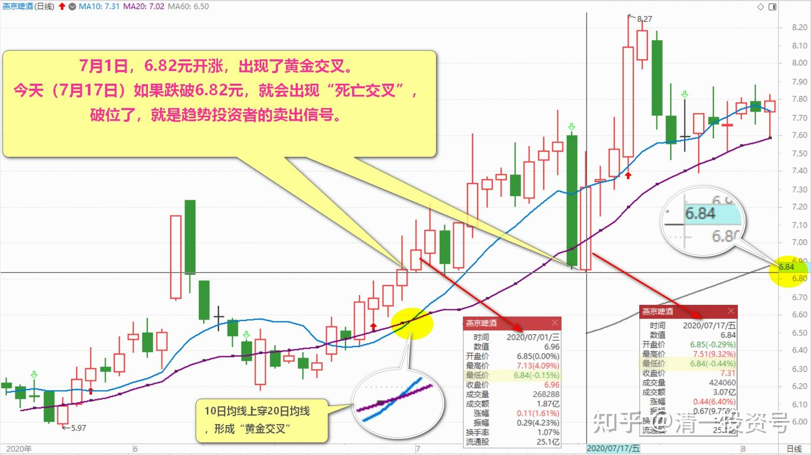
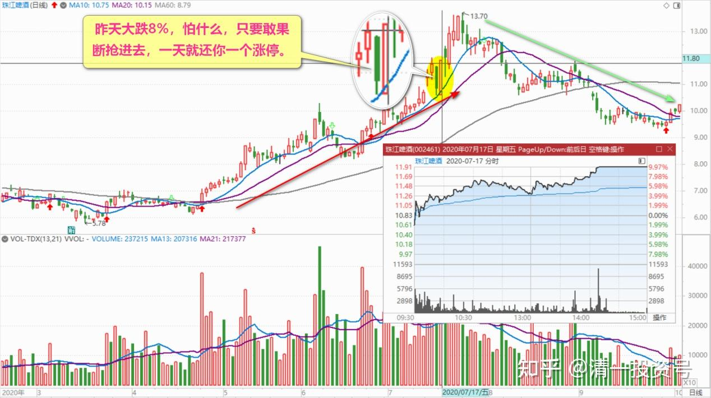
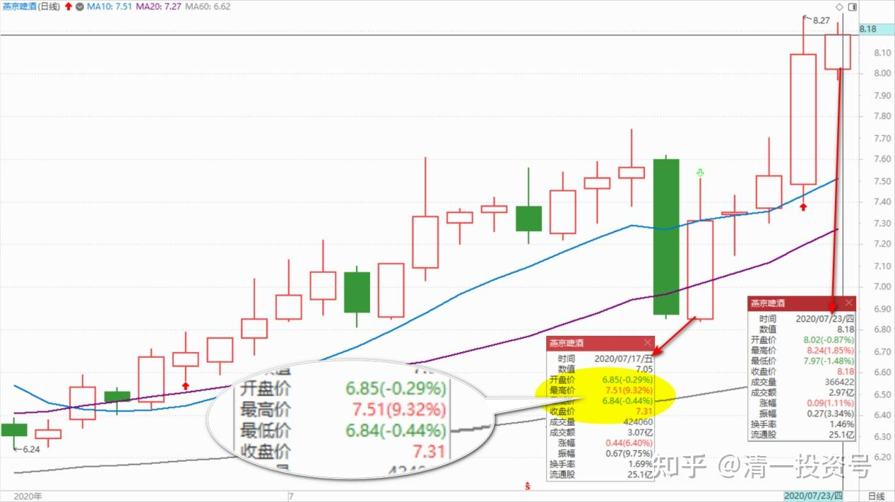
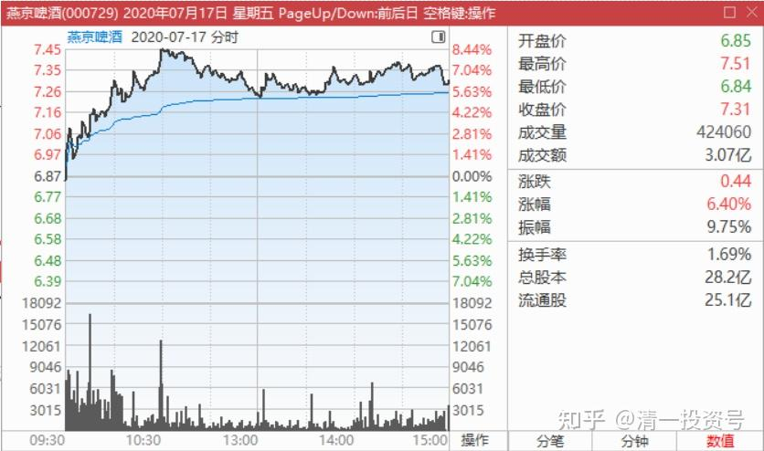

32篇.主力志在长远

清一山长 2020年7月17～23日

一、**急涨，是减仓的机会；急跌，是加仓的机会**

清一山长 2020-07-17 10:31:11

$燕京啤酒(SZ000729)$ 昨天看跌惨了，正想燕京7元以下，是难得的机会，可以多补一点仓，安全度很高。没想到今天就强势拉升。你们是在洗盘么？洗得也真漂亮，动作好大。估计很多乘客已经被吓跑了，换新乘客了。该去新景点了没？

开盘一个小时涨了8个多点。昨天尾盘买入的人，赚翻了。

**急涨，就是减仓的机会。急跌，也是加仓的机会。**可惜燕京一直没急涨，没给我减仓的机会（今天的急涨不算，只是洗盘后的修复K线行为），依然只是看热闹玩。昨天没看盘，晚上才看到燕京居然跌了9个多点，我在现场肯定会买一点的。这两天，账面资产大幅动荡，好玩[大笑]

清一山长 2020-07-17 10:58:09（跟评上贴）

补充一点技术派知识：7月1日，6.82元开涨，出现了黄金交叉。今天如果跌破6.82元，就会出现“死亡交叉”，破位了，就是趋势投资者的卖出信号。对于燕京的趋势投资者来说，就会退出燕京。这对于慢慢涨，培养跟随着赚钱的养股策略是不利的。为了让趋势投资者跟随买卖，未来成为热门股，现在就不能让它变“神经病”，所以今天强势拉回来。K线图呈现出来的长期上升趋势就没有改变。这样子的下跌，洗盘，会吸引更多的技术派跟风盘进入。前期的缓慢上涨，只会让他们想进而没有机会进。今天就给了机会。今天一上午的量，已经跟昨天一天的量差不多了。所以，我说成功吸引了新游客。

一句话：燕京的主力是高手，很知道该干什么。现在燕京已经进入舞台，开始出台秀的表演阶段了，原来的两三年，都是雪藏练功阶段，熬死没耐心的人。以后这段时间，我们就看它的表演的节目精不精彩？会不会比珠江的秀更令人拍案惊奇。**昨天和今天，都比珠江更吸引人（成交量更多）。**

**二、人多的地方不要去**

清一山长 2020-07-17 22:16:19

$珠江啤酒(SZ002461)$ 今天没看盘，回头看看记录，珠江居然涨停了，一个多月来的第三次涨停。弄得我上次涨停卖出2M的行为，看上去像个傻瓜[大笑]。不过，我认为我卖出这批股票，能够帮助一批热爱珠江的人，额外赚了5MRMB，是我的荣幸。

我承认，现在的珠江，到了最迷人，最精彩，最娇艳的时刻，也是回报最丰厚的时候了。多年的小媳妇，熬成明星了。

**今天涨停，传达的盘面语言就是：珠江啤酒，你任何价格敢买进来的，都是股市赢家。在任何价格卖出珠江的，都是蠢货。**昨天大跌8%，怕什么，只要敢果断抢进去，一天就还你一个涨停。而且请大家放心，主力已经彻底控盘，没人愿意卖出珠江，没抛盘了。（今天涨停价的买单，五个价格加在一起才，140万股，还不够给我一个人抛的）。却没人来卖——说明空方彻底投降了。

好吧，我看懂了你们的盘面语言。我认输，我承认自己像个蠢货。幸亏手上还有一些存货，觉得自己还没有蠢到家。我相信，以后读懂了主力语言的，大量聪明的炒家，会蜂拥而来的。我的粉丝们，建议给这些人让让路，去燕京、中建避避风头算了。我妈告诉我：**人多的地方不要去。**

以后，我就不再提珠江了。很怀念原来当珠江十大的时候，坚守5元的珠江，默默等待的日子。未来珠江继续持有，并会寻机逐步的卖出，做T等。如有操作，也不会出来公开通告了。因为珠江走牛了，股神就越来越多了，也不需要我多说了。我只在低迷的时候，给大家打打气。虽然我现在依然持有不少仓位的珠江。都负成本了，就没啥好说的。涨多，涨少，赚多赚少而已。祝福“珠友”们好好赚钱，大发财！我以后去守着没有人关注的燕京、中建好了。

一切有道回复清一山长:（跟评上贴）

山长可否点评下惠泉啤酒呢？您的十大股东身份股，趁没涨前多给大家打打气呗[大笑]

清一山长 2020-07-17 23:07:55回复一切有道:

买惠泉，是我拿其他啤酒上赚的利润，玩的投机股，赌博股。我全输了也不伤本金，万一赢了算是意外之喜。不支持大家跟风。想要跟啤酒的，就跟燕京去。裘国根多牛的人，他才是“国王”。

什么十大，没啥实际意义。我这惠泉的第三大股东，可开会从来没有我的份。发言也没人听，一瓶啤酒都没人送，连个盒饭都要自己买。没啥实惠的。别迷信！[大笑]

清一山长2020-07-23 14:55:27（跟评上贴）

7月17日，我这个帖子，让大家别跟我买惠泉，当十大。**让你们想要啤酒，就跟买燕京去。**当日燕京的开盘价6.85元，收盘7.31元。你们看，才短短几天，燕京就冲过了8元，涨幅10%还不止。我给各位的这个建议，是不是良心贴，金不换？[笑]我为啥没有卖掉惠泉去追燕京？[哭泣]因为我的惠泉持仓太多了，上次就只卖了20万股出去，都把涨停打破了，出点货很不易。不像你们随便玩。

不过，等燕京、珠江都涨了，追不上啤酒的，想买点惠泉，至少风险不大了。我的持仓成本6.11元。

**三、主力志在长远，有钱也不冲动**

清一山长2020-07-17 12:37:56（主贴1）

$燕京啤酒(SZ000729)$ 今天涨到8.49%的时候，其实我很担心：不会冲涨停吧？盘面上压力并不大。要做个涨停，很容易。但如果真做了涨停，局势就不妙了，说明燕京的高度，就达不到裘总的心理预期值了。这个价位，应该还不到做涨停秀的时候。现在走慢牛才是正道理。

涨8%发完贴，就去指导武道馆学生练功了。虽然担心涨停，也不管了。因为涨停我也不想卖。回来吃中饭，看到后来就缓慢的跌下来了，挺好的，回调回来很好，也给昨天逃走的趋势投资人重新上车的机会（涨停就是不给机会了，下车凉快去）。这说明**主力志在长远，有钱也不冲动，给聪明的跟风盘赚钱的机会。**不然我拿燕京的逻辑就出错了，因为我相信主力雄才大略，不是小混混，宁波敢死队这样的小偷小摸的打法。

持有燕京，比拿珠江累多了，至少应该比珠江多赚一点才公平[大笑]。不过拿珠江也有不利之处——总有个燕京在低位抛媚眼，吸引人出轨。拿住上涨的珠江有点难。燕京涨了，一看也没啥替补队员换（惠泉是投机股，不算替补的），说不定燕京会成为比珠江更拿得住的啤酒股。这回我跟重阳跟定了——看你什么时候才走。

（注：以下内容为主贴1底下的跟帖内容，虽然话题不是啤酒，也是有价值的学习内容，所以一并收集进来，以备记录）

**四、题外闲谈——学霸来清一武馆学武的原因**

空虚大和尚回复清一山长:

武道馆，山长公教武术？

清一山长2020-07-17 22:33:55回复空虚大和尚:

我的确是一个武师，我开了个武道馆，教古传太极。目前赔钱中。因为我的武道馆不收学费，主要是收不到学费。目前的学生，都学了一年多了，我就只教了一招“野马分鬃”。我还天天骂学生没学会，让他们继续再学一年的野马分鬃，明年出去给大家表演一下，收点场地费。如果他们明年练好了这招，我再教他们第二招——“搬拦锤”，难度就更大一些了。由于孩子们太笨了，学习效率太低，我也太笨，一年教一招以上就没本事教了。所以没人愿意给我送钱学套路，我只好花钱养人，来专学这一招。

我想，还是得改变一下古传统：要去学点套路，教点套路，什么108式、36路等，才可以赚钱[大笑]。等我买的股票崩盘了，赔钱了，变乐视了，我没钱玩游戏了，我就去学点太极套路，摆个拳摊，收点学费，买盒饭，过过日子了[加油]。说不定将来摆拳摊，要来请雪球的各位爷打赏一点——看在今天，我带大家买珠江，没带沟里去的份上。

东酉回复清一山长:

山长您在泰国办武馆吗？如何申请？有机会向您学习是非常幸福的。

清一山长2020-07-18 09:44:16回复东酉:

首先，我的武馆是职业武馆，学生是职业武术运动员，要去参加国际上的专业搏击赛事的。您真准备好做职业武者了吗？我上个帖子，说我的学生明年会出来公开表演，就是第一批的学生，明年就要出山了，去公开参加专业搏击比赛的意思——职业赛。所以，你们肯定会看到视频的。古谱云：“内家太极，得其一二，足可胜少林”。这是真的。只要学会一招野马分鬃，就可以参加现代格斗比赛了。学会两招，就可以跨界比赛了。但这一招两招，就要你用一年、两年的汗水和血水来浇灌（每天都有功力训练，对战实战练习）。

你们只想拿太极来当业余爱好，玩玩，当然也可以了，自己去公园找个大爹大妈就行了。这种玩法，已经让中国的传武蒙羞了。雷雷、马保国等，最多算个不入流的票友，却想象自己是顶尖的角儿。看热闹的人，也把他们当角儿——太极大师？就因为正角儿缺位——太极武术，也是有专业队和业余爱好的。现在健身房，不就有拳击操吗？您会拿玩拳击操的票友不会实战，来说拳击就不能打吗？业余玩玩搏击的票友，不一样是被专业人员随便就KO吗？**有人故意拿票友来当中国传武的代表，就是对传武的侮辱！是欺师灭祖**。要比，就用专业队员来比专业队员。中国传武界，一直就没有人拿钱出来，组建真正的专业队，我来养一只太极专业队，就这么简单。一堆老武师，都只想用传武去满世界骗钱，卖祖宗的不肖子。

你们只想拿点业余时间来玩玩传武，公园里面舒展一下身体，以为就是学了真太极，就可以想象自己是“杨无敌”，这也是对历代宗师的侮辱。哪一代武林宗师，不是用汗水和血水浸泡出来的？

我的武馆入馆要求：年龄不超过15岁、16岁。老了，就教不出来了。入馆不考你运动成绩，搏击能力，只考你的文课成绩：要求要达到美国前50名大学的入学成绩或者相当的能力，且身体素质良好，有练武的热情和潜力，才可以来我的武馆学武，全奖（免学费，免食宿费，免教材费）。具体就是：SAT官方考试成绩1400分，或者1300分，外加一本二外考试的证书——欧洲语言水平资格B2证书。您就可以来我的武馆练武了[笑]。只要达到了这个文课成绩的学生，身体良好健康的，年龄符合要求的，我都欢迎。

成绩相同，不想全职学武的学生，想要继续上西方大学的学生，我也提供全奖支持，入读我出资支持的三语高中。学生们上高中的时候，也可以有大量的时间用来学传武，当业余爱好，做个票友。由我的武弟子来教学。因为：我的学校，对学生和老师的要求，都是文武双全。他们也很享受武术带给他们的一切！

鸣人coo回复清一山长:

山长，我纯粹很好奇文化课那么优秀的学生为什么会选择全职学武呢？是因为泰国的国情跟中国不一样？

清一山长2020-07-18 12:06:47回复鸣人coo:

因为是泰国？您是不是太过于崇拜泰拳了？播求的拳馆就在我们附近，他们可没兴趣去学。

这些学武者，有大学教授的孩子。你认为他们不懂大学教育的价值吗？

来我的武馆学武的原因：

第一：因为是正宗的中国功夫。

第二：因为是我来教！

第三：因为我们武馆是文武合一的。

(标题、图片为编者所加)

**文章音频：**

[379篇.主力志在长远_清一投资号文章同步音频](http://link.zhihu.com/?target=https%3A//www.ximalaya.com/sound/670775120)

**参考链接：**
[12篇.早期珠江啤酒、燕京啤酒的换仓记录](https://zhuanlan.zhihu.com/p/602033762)

[13篇.买卖操作后的富足之心](https://zhuanlan.zhihu.com/p/604162057)

[14篇.珠江的破位急跌，名曰跌停进货法](https://zhuanlan.zhihu.com/p/606062514)

[22篇.它很可能是下一个重庆啤酒](https://zhuanlan.zhihu.com/p/645392522)

[23篇.危机时刻好公司不用担心](https://zhuanlan.zhihu.com/p/646998882)

[24篇.守住筹码很不易](https://zhuanlan.zhihu.com/p/648860208)

[25篇.筹码收集完毕，正在养股](https://zhuanlan.zhihu.com/p/650255857)

[26篇.现在最应该做的，就是稳稳的做好轿子](https://zhuanlan.zhihu.com/p/651196882)

[27篇.股票交易风格与伴侣选择](https://zhuanlan.zhihu.com/p/653139189)

[28篇.看图要反着看](https://zhuanlan.zhihu.com/p/654521213)

[29篇.行情还没完，后面还有大机会](https://zhuanlan.zhihu.com/p/655878269)

[30篇.给做短线人的建议](https://zhuanlan.zhihu.com/p/657061174)

[31篇.股票也分贫富，贫富会换位](https://zhuanlan.zhihu.com/p/658569494)
