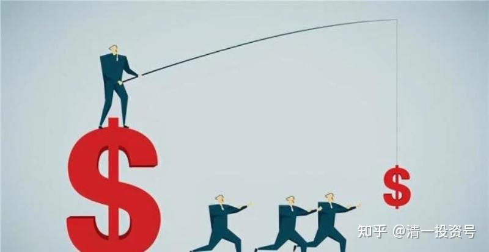
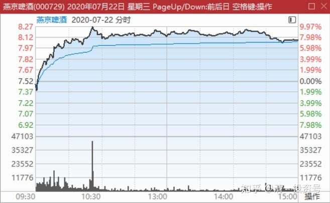
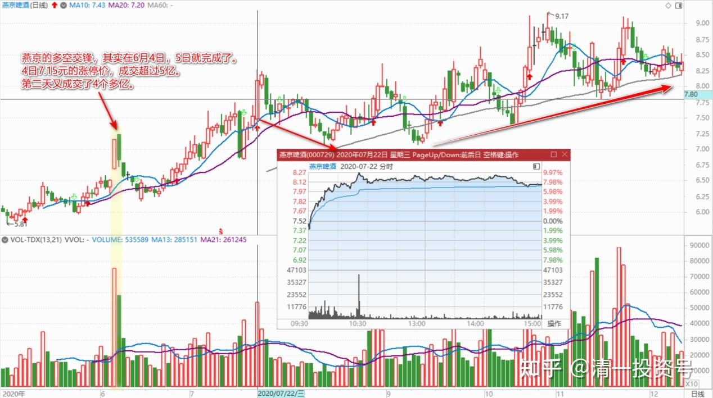
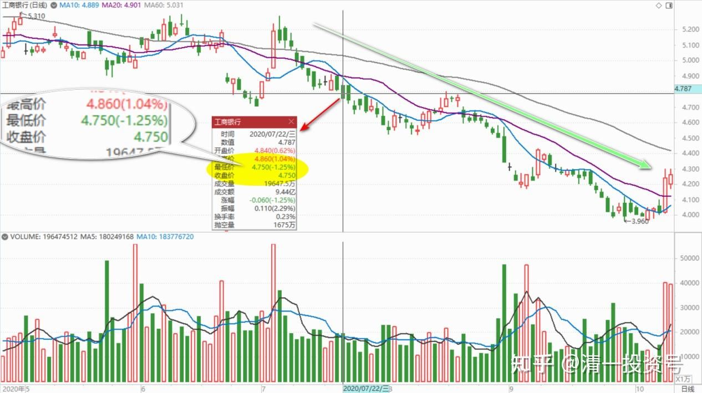

34篇.我的投资不需要别人来打气

清一山长 2020年7月22日

**一、开始突破表演**

清一山长 2020-07-22 09:54:09（上文续）

$燕京啤酒(SZ000729)$ 昨天正说了买你的逻辑，跟珠江相比的优势。今天就来破8元大顶了？表现真积极。不磨磨唧唧了？开盘十几分钟，成交已经过亿。今天才算正式开始突破表演吧！估计马上公布的中期业绩还过得去？

清一山长 2020-07-22 10:43:08

$燕京啤酒(SZ000729)$ 400多万股，一单子就拉上了涨停。居然连维持都没有，马上又掉下来了。盘面语言就是：你看，我已经努力表现了，我竭尽全力冲上涨停去了。但是，我这个小主力，实力实在不够。空方抛盘太强，冲不过去，打不过人家——所以，我还是扯呼，撤吧！于是，兵败如山倒，多方节节败退。让旁观想涨停捡点战利品的人，急死了。赶快抢先撤退，卖掉手上的持仓，生怕跑晚了跌回原地，买入后熬了多久，好容易燕京见一点红色的账面，怕又要绿了——虽然算算账，这些人其实也没赚多少。

另一方面，一些空仓的右侧投资人，却在看燕京的西洋景：什么，多方败了？拉倒吧！玩神马游戏。就差两个点，磨叽半天就不动。明明是故意示弱，背后有名堂。主力实力强劲，只要想拉，随时可以拉个涨停的。去年燕京还连拉两天的涨停呢！现在牛回头，正好买点进来。

山人啥都不干，不多，也不空。就看燕京演出的西洋景了，现在开始好玩了！

借股修行回复清一山长:

感恩老师！涨停价8.27元卖掉了不到十分之一的仓位！在账户里绿了3年的燕京啤酒，这次彻底红了！

清一山长 2020-07-22 10:47:31回复借股修行：

恭喜你们大发财。你们既然卖了，我就不卖了。我继续坐电梯。我不坐电梯，谁做电梯[大笑]如果我的判断不错，今天下午，应该会涨停收市的。如果错了？没关系，我反正继续坐电梯。

**二、啤酒第一重仓**

明达野老2020-06-04（链接：

[$珠江啤酒(SZ002461)$ $燕京啤酒(SZ000729)$ $惠泉啤酒(SH600573)$ 刚开了软件，看了下...](http://link.zhihu.com/?target=https%3A//xueqiu.com/2029742712/150834935)

$珠江啤酒(SZ002461)$ $燕京啤酒(SZ000729)$ $惠泉啤酒(SH600573)$ 刚开了软件，看了下行情，啤酒股全线涨停，真是有意思。A股就是“有中国特色”，经济也是，一个地摊经济，上行下效，都倒腾到股市来了，顺便让我的“账面市值”也大幅受益了，感谢市场提供的好机会，也祝贺支持中国啤酒的其他球友们[献花花]

不过，我可不是提前知晓地摊经济来投机的，要是知道有今天，我可不会在8.5-9元附近大幅减仓珠江[大笑]。从持股数来看，现在燕京才是我的第一重仓啤酒股。**我的投资理由很简单：燕京3倍于珠江的体量，卖个不如珠江的市值。一个中华老字号，光这块牌子都值200亿了。**我想无论外资还是内资的优等生都有“吃下”它的打算，毕竟，啤酒生意太好做不过了——吃下之后换个包装就成功升级了。要么就是另一种可能，那也是有搞头的，那就是北京市人民政府玩玩股权激励、混合所有制等国企改革，给燕京的高管们“涨点工资”（实在有点抠搜了），产品升级也就玩起来了，按照目前的体量，利润绝不是当前这么点（当前靠着子公司贡献利润，母公司一塌糊涂，一个70%市占的首府市场，居然做出亏损的业绩，把递延所得税资产都“打”起来这么多，也是够能耐的）。

现在整个啤酒行业到达什么位置了呢？我翻了下燕京的年报，**从财报中的情况基本可以判断整个行业（包括燕啤）已经出现了较大的拐点。**我的理由是：一个经营这么差的公司，居然2019年的吨酒价（财报显示的是除瓶价，只卖酒不卖瓶子，瓶子塞到存货里了，高手！）开始企稳了，预收在去年也达到了9个亿（从6亿跳升上来的），毛利率也在持续提升，虽然远输珠江的毛利率跳升，但是也可以从“最差”的公司身上看出来整个啤酒行业的大趋势——拐点已经确认。“激水之疾，至于漂石者，势也。”白话点说就是——“站在风口上，猪都能飞起来”。现在猪已经要准备起飞了，说明风已渐劲，那就好好守好自己手里的啤酒股权吧，祝福大家在“中国啤酒资产”上收获满满！[献花花]

明达野老评论上贴2020-07-22

链接：

[$燕京啤酒(SZ000729)$ 今年2月3日大盘跌停时我就在囤积它，从那时起它就已经是我A股持股数最多的公司（比珠江多... - 雪球](http://link.zhihu.com/?target=https%3A//xueqiu.com/2029742712/154660289)

$燕京啤酒(SZ000729)$ 今年2月3日大盘跌停时我就在囤积它，从那时起它就已经是我A股持股数最多的公司（比珠江多），后来卖了大半珠江后，这货就正式晋升为我A股第一重仓，但还不是A、H第一重仓，我的第一重仓在H股，目前也准备起飞了。今天燕京大涨9%，我是不打算卖的，主要是我算来算去，**比起已经飞起来的青岛、重啤、珠江，估值差太多了，**只要盈利稍有改善，凭借它的体量，就是一匹标准的黑马（北京还真是盛产黑马，之前的顺鑫，现在的燕京？）。如果运气好，**再来个“重组”题材就更不得了了**。当然估值低只是我不卖的原因之一，更重要的是，**我不想把我持有的啤酒资产量给扔没了**（毕竟我珠江甩了不少，卖到最高点我做不到，但是“卖飞”我自认为还是有两把刷子的，哈哈），所以暂时选择不动，除非又给一次大的单股投机机会或者投机换股机会。

PS：以下是7月16日抽空跟内部群的朋友简要分享的看法，今日贴出来，只是供有缘的朋友作投机分析参考的。

清一山长2020-07-22 14:57:45评论上贴

祝贺明达君的啤酒花开争艳[很赞]**。目前的燕京，也是我的啤酒第一重仓，比原来持有的珠江还多不少，低位一直在买。**我们两继续在燕京上携手共进[干杯][赞]

**三、真正的主升浪快要来了**

清一山长 2020-07-22 15:15:24

很低调的$燕京啤酒(SZ000729)$ 本来我判断今天会涨停收市的，结果很低调的守住8元就算完事了。K线图上看的很清楚：早上一个小时，空方主力就被干掉了。剩下的就是垃圾时间，空方没啥力量了。股价一直维持在8%左右的涨幅震荡，**多方主力想拉的话，很容易就上去了。这样走，说明主力还不想过于招眼。**点到为止。消化前期的套牢盘，获利盘为主。步伐依然稳健。

燕京的多空交锋，其实在6月4日，5日就完成了。6月4日的三大啤酒公司同步涨停。**可是燕京的成交远远大于珠江，才7.15元的涨停价，成交超过5亿。第二天又成交了4个多亿。这说明燕京的浮筹，要比珠江多得多。**燕京后期走势弱，就很正常了。观察到这个局面，后来燕京跌到6元多，又买入了好几十万股。但因为仓位实在太重，就没有放开手买。其余的资金就去买中建了。

今天的8元以上区间，是历史的顶部区域，最近几年，几次到了这个位置，都会无例外的下跌很久。所以，持有筹码的老手们，都会在这个区间减仓“保住胜利果实”。所以，论理来说要比7.15元的涨停关，要难攻克得多，多空交锋会很严重的。可没想到：也就是4个多亿，就搞定了。早上10:30分以后，没啥像样的空方出击。多方也有趣地维持阵地，没有借机扩大战果，耐人寻味。这可能说明燕京的调整，已经接近尾声了。**真正的主升浪，快要来了，我们静静的等待后面的表现吧。**可能还会有调整，但调整深度可能不会期待太高。想要做T的，要做好踢飞的心理准备[大笑]。

学者类型回复清一山长:（跟评上贴）

看了山长的帖子，今天8.18元下的手。

清一山长2020-07-22 15:38:31回复学者类型：

我最烦你们这种人了！燕京五元不买。6元也不买，7元不买，8元冒出来说是买了。买就买了，没谁拦住你不让买，爱买不买关我屁事。可非要出来说：是看了我的帖子买的！甩锅刷的叮当响。我啥时买过8元的燕京了？

你们都比我聪明，我都套在燕京上两三年不动窝，因为我只喜欢6元买，5元更要买，过7元就不想买。你们现在跑来，不想忍受燕京持有的寂寞，只想明天就来赚个涨停。这么聪明的人，跟我根本就不是一路人。你们是右侧人。别来装我的粉丝！

**四、我的投资不需要别人来打气**

[鲁久安2020-07-21 22:13:27](http://link.zhihu.com/?target=http%3A//xueqiu.com/9310099567/154625133)：$美团点评-W(03690)$ 一家帮人送外卖，送盒饭的公司，比专门帮人点钱的公司（银行）市值更高。实在弄不清里面的投资逻辑[为什么]。我认输了。

[$美团点评-W(03690)$ 美团点评泡沫太大，一个送盒饭的，市值1.2万亿。2018亏损1千亿，2019盈利20亿。... - 雪球](http://link.zhihu.com/?target=https%3A//xueqiu.com/5155907601/153637432)

鲁久安回复清一山长：（评论上贴）

希望山长能给我们持有内银股的投资者打打气[很赞]

清一山长 2020-07-22 16:58:17回复鲁久安：

**如果您的投资，居然需要别人来打气，您才有坚持下去的勇气。我的建议就是：您现在就放弃好了，至少保证心理健康。**直到有一天，您找到可以在所有人都不支持您的情况下，您依然愿意持有下去的股票，您再买入！

我就是这样的人，我不需要别人跟我打气。**我五元买珠江，长期套牢在燕京上，我听到的，都是不支持啤酒的逻辑。**直到昨天，依然有不少人，说我的燕京是选错了，这股太烂等等。我问过大家来帮我打气了吗？

清一山长2020-07-22 18:10:54

$工商银行(01398)$ 今天的尾盘突然下跌，传说是美国要求：休士顿中国领事馆必须在三天内关闭，等于驱逐出境。非常严重的敌对行为了。我很奇怪发生了什么事情。我在国外，上网也没查到什么正当的理由。BBC的新闻，应该比较客观吧？【胡锡进表示，休斯敦总领馆是中国在美国开的第一个总领馆，美方不仅要求关闭它，而且只给出中方3天的撤离时间，这完全是“丧心病狂的表现”。】，BBC表示，美国方面，没有做出反应。中国的使馆人员，在紧张的连夜烧掉机密文件，几乎“引起了火灾”。像是打仗一样。美国消防车出动了，可是不让进去。三天时间没到，美国人算是“讲信用”？

香港市场做出了反应。红筹股尾盘急跌。成交放大。民生银行的股息率，已经8.32%了。公司还是股价，我认为都极其诱人了。**希望燕京快点涨上去，我就有机会换股票吃利息了。**还是啤酒好，跟美国没啥关系。中国的银行啥的，都认为会被美国人给整死的。虽然民生似乎根本就没跟美国人玩，又不是靠美国人吃饭的。（中国银行勉强跟跌一点，还算是有点道理）[俏皮]。

估计明天全世界的股市都不安生了，都要大波动一回了。啤酒也乘机洗洗盘吧！祝福今日涨停卖出的人，明天可能有更好的买入做T的机会。

文章音频：

[385篇.我的投资不需要别人来打气_清一投资号文章同步音频](http://link.zhihu.com/?target=https%3A//www.ximalaya.com/sound/674706820)

**参考链接：**
[12篇.啤酒系列5：早期珠江啤酒、燕京啤酒的换仓记录](https://zhuanlan.zhihu.com/p/602033762)

[13篇.啤酒系列6：买卖操作后的富足之心](https://zhuanlan.zhihu.com/p/604162057)

[14篇.啤酒系列7：珠江的破位急跌，名曰跌停进货法](https://zhuanlan.zhihu.com/p/606062514)

[22篇.啤酒系列15：它很可能是下一个重庆啤酒](https://zhuanlan.zhihu.com/p/645392522)

[23篇.啤酒系列16：危机时刻好公司不用担心](https://zhuanlan.zhihu.com/p/646998882)

[24篇.啤酒系列17：守住筹码很不易](https://zhuanlan.zhihu.com/p/648860208)

[25篇.啤酒系列18：筹码收集完毕，正在养股](https://zhuanlan.zhihu.com/p/650255857)

[26篇.啤酒系列19：现在最应该做的，就是稳稳的做好轿子](https://zhuanlan.zhihu.com/p/651196882)

[27篇.啤酒系列20：股票交易风格与伴侣选择](https://zhuanlan.zhihu.com/p/653139189)

[28篇.啤酒系列21：看图要反着看](https://zhuanlan.zhihu.com/p/654521213)

[29篇.啤酒系列22：行情还没完，后面还有大机会](https://zhuanlan.zhihu.com/p/655878269)

[30篇.啤酒系列23：给做短线人的建议](https://zhuanlan.zhihu.com/p/657061174)

[31篇.啤酒系列24：股票也分贫富，贫富会换位](https://zhuanlan.zhihu.com/p/658569494)

[32篇.啤酒系列25：主力志在长远](https://zhuanlan.zhihu.com/p/659254835)

[33篇.啤酒系列26：宁愿套牢也不想踏空](https://zhuanlan.zhihu.com/p/660596526)?
