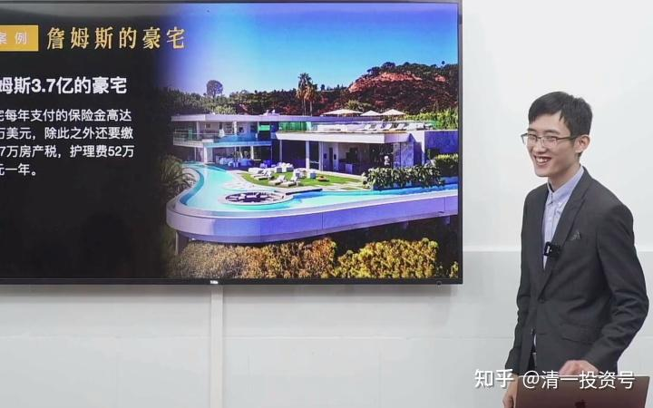
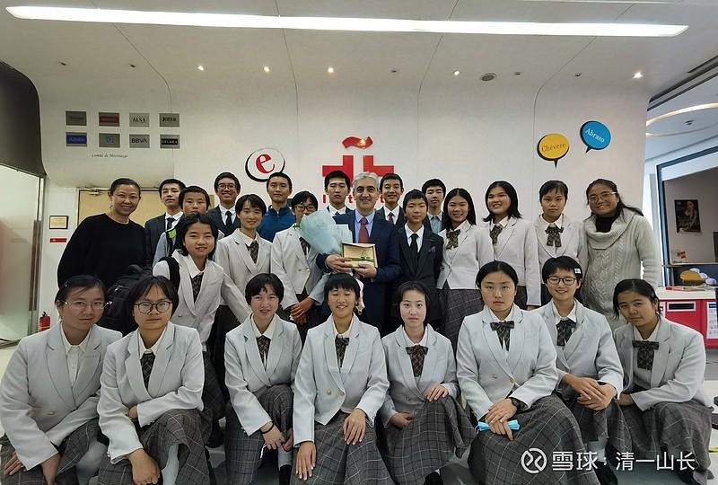

**原专栏90篇.示范课——财富的奥秘！你真的知道这些奥秘吗？**

[清一山长](http://link.zhihu.com/?target=https%3A//xueqiu.com/9310099567/column)2020年11月30日

这是“清一商学院”毕业的20多岁的学生，在给示范班讲“财富的奥秘”

哔哩哔哩[网页链接](http://link.zhihu.com/?target=https%3A//www.bilibili.com/video/BV1nD4y1X7nY/%3Fspm_id_from%3D333.788.videocard.1)：

[https://www.bilibili.com/video/BV1nD4y1X7nY/](http://link.zhihu.com/?target=https%3A//www.bilibili.com/video/BV1nD4y1X7nY/)

他不是学堂的专职教师，只是来客串一下老师，他的职业，是“个人资本管理人”。他现在为自己的家族，管理几千万的资本。他的持仓中，[万华化学](http://link.zhihu.com/?target=https%3A//xueqiu.com/S/SH600309%3Ffrom%3Dstatus_stock_match)，还有[迎驾贡酒](http://link.zhihu.com/?target=https%3A//xueqiu.com/S/SH603198%3Ffrom%3Dstatus_stock_match)占了较大比例。账户稳定获利中，比不少基金的收益率更好。比如，迎驾贡酒他是十几元买进的，是当时分红率最高的酒股。因为我教的是“躺赚”。他没啥事干，就兼职做做教师。因为他基本上不需要做什么，只需要偶尔调整一下股份。他买的这些股，都是每年分红很稳定的，收到分红，再买入一些股票，就行了。

有一点个人信息：**清一商学院**，是我个人开办的商学院。为了不贬低自己的身份，该商学院的学费，是**7万美金一年。**因为我认为我自办的商学院，不亚于世界名校，所以也要收世界名校一样的学费。认同这个观点的家长，就可以送孩子来我的清一商学院上学。认为不值钱的，自然就不会送来了。

目前为止，不断有人申请入学。不过，我的入学标准，对学生和家长的要求都很高，家庭的经济条件，达不到一定的要求，是没有资格入读商学院的，给学费也不收。曾经有学生，说家里面愿意卖房来上我的商学院。我的回答是：你们家卖房我没意见，但不会收你入学的。因为需要卖房才能上学的家庭不符合我的教学对象。我们只收愿意卖几个包包，一块手表，来换商学院学费的家庭。

这可能是中国收费最高的大学吧？按照国际标准来收费的私人商学院，还是不发文凭的。我自办的私人商学院，到底值不值这个学费？真的比名校的商学院更好吗？你可以看看这个小伙子的讲课就知道了。如果他讲的这些“财富的奥秘”，其实你都知道，你认为他就是讲废话，那么，显然我的商学院就是不值钱的，这所商学院是骗人的。

如果你发现这小伙子讲的东西，不少你是不知道的，甚至是你从来就不知道的财富概念。就说明，我的私人商学院，应该是值钱的。

*图片为：清一大学外国语学院，西语专业的学生。他们在北京参加DELE考试的时候，与塞万提斯学院的馆长，交流和学习的合影。*

**图片为：清一大学外国语学院，西语专业的学生。他们在北京参加DELE考试的时候，与塞万提斯学院的馆长，交流和学习的合影。**
