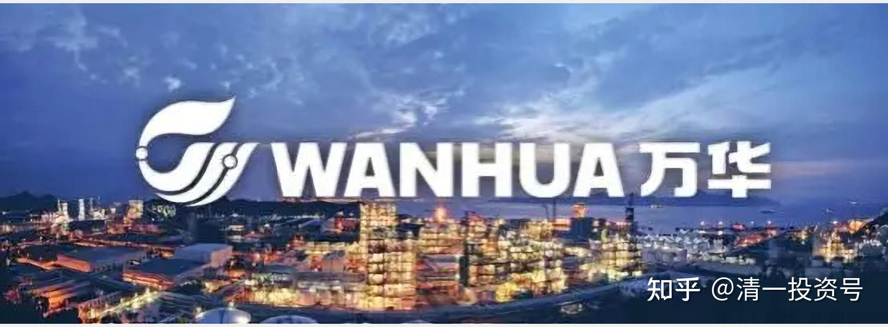
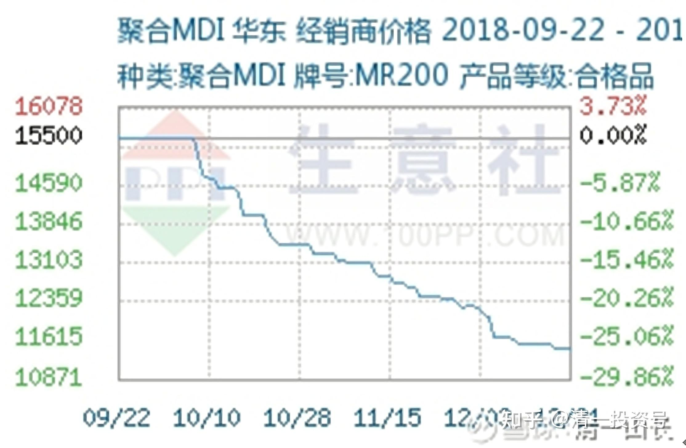
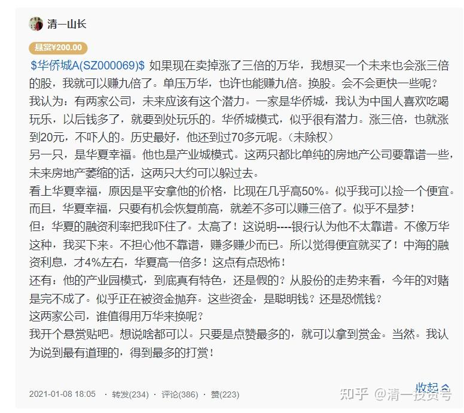
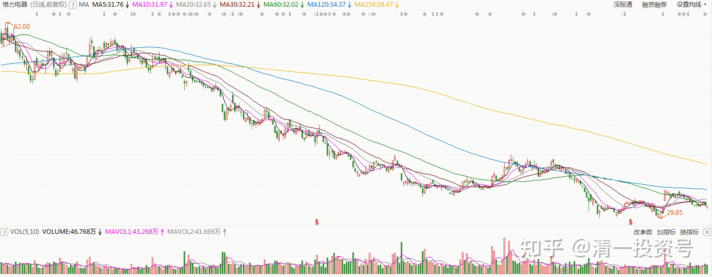
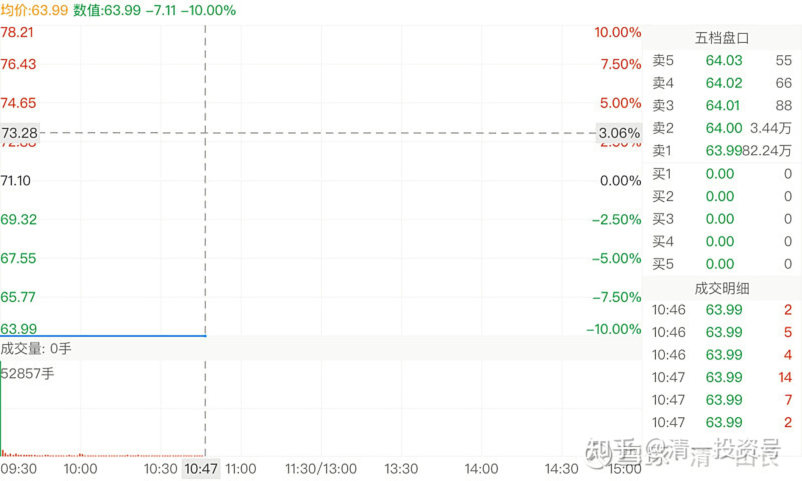

36篇.万华化学投资实操

清一山长2018年10月30日～2021年2月2日

**一、买入万华化学的前期基本面研究**

[大生投资](http://link.zhihu.com/?target=https%3A//xueqiu.com/u/9709448326)[发布于2018-10-21 22:15](http://link.zhihu.com/?target=https%3A//xueqiu.com/9709448326/115380342)

再看万华，一匹被猎杀的白马[https://xueqiu.com/9709448326/115380342](http://link.zhihu.com/?target=https%3A//xueqiu.com/9709448326/115380342)

[清一山长](http://link.zhihu.com/?target=https%3A//xueqiu.com/9310099567)2018-10-30 14:19评论上帖：

我刚打赏了这篇帖子￥66.00，也推荐给你。楼主分享了很多辛苦查找的数据，居然还有人看了骂人，怀疑人吹票，实在是德性太差了。文章觉得有用就参考一下，没用就走开。不服气就自己拿自己的方案出来。**只知道对别人的心血胡说八道，但自己又拿不出任何有价值思维的人，就属于人类的渣。**

我未持有万华，正在观望中。

[清一山长](http://link.zhihu.com/?target=https%3A//xueqiu.com/9310099567)2018-12-22 16:26

$万华化学(SH600309)$这个MDI的价格走势，很不乐观。有可能万华的2019年一季度的利润表是很难看的。9月份到现在，每吨掉了5000元左右，全都是纯利润。杀利润杀得很厉害。

[享个豆腐](http://link.zhihu.com/?target=https%3A//xueqiu.com/u/2426390710)[2018-12-25 19:34](http://link.zhihu.com/?target=https%3A//xueqiu.com/2426390710/118845909)

$万华化学(SH600309)$为什么百万吨乙烯项目是丙烷路线

[https://xueqiu.com/2426390710/118845909](http://link.zhihu.com/?target=https%3A//xueqiu.com/2426390710/118845909)

[清一山长](http://link.zhihu.com/?target=https%3A//xueqiu.com/9310099567)2018-12-28 21:50评论上贴：

“公司PDH装置产出乙烷8万吨/年，二期乙烯装置中就有乙烷裂解炉”。从这个安排可以看出来：如果乙烷经济性更高，万华可以随时采用乙烷来生产，两手准备。因此，竞争对手是无法取得优势的。

**二、格力换股万华，买在行业低点时**

[清一山长](http://link.zhihu.com/?target=https%3A//xueqiu.com/9310099567)2019-05-16 10:57

$格力电器(SZ000651)$今天56.48，首次开始卖出几万股格力。这是去年底以35元多买入的格力。但为了保证自己长期持有白马股的头寸，就咬咬牙，以40元多几毛的“高价”，换入了老白马万华化学（跌破30元的时候，我居然没有买。一直感到对不起万华）。我**一直担心今年一季度的业绩万华会比较难看，想等一个跌下来的低价的。现在就不等了。**

提示：我这种换股操作示范，是蠢蛋才干的。因为这有双重的错误可能，做得越多，错得越多。请同学们不要模仿[滴汗]。还持有部分格力，准备等时机继续换股，没机会就持有到永远。

[@**-孤舟](http://link.zhihu.com/?target=http%3A//xueqiu.com/n/%25E4%25B8%2580%25E5%258F%25B6-%25E5%25AD%25A4%25E8%2588%259F)回复[清一山长](http://link.zhihu.com/?target=http%3A//xueqiu.com/n/%25E6%25B8%2585%25E4%25B8%2580%25E5%25B1%25B1%25E9%2595%25BF):

我觉得卖的时候要谈自己多少成本来的，就贴图拿证据，要么就只谈卖出的基本面逻辑，否则会觉得你在吹牛逼。

[清一山长](http://link.zhihu.com/?target=https%3A//xueqiu.com/9310099567)2019-05-16 11:47回复[@**-孤舟](http://link.zhihu.com/?target=http%3A//xueqiu.com/n/%25E4%25B8%2580%25E5%258F%25B6-%25E5%25AD%25A4%25E8%2588%259F):

说这种话，就是你信念系统太特别了——**见别人赚钱心情就不好**。我在去年年底首次买入格力，是公开公布过操作的，我也不知道几乎是抄了这一轮的底。你不知道这事，也不为奇。但你要出来说话，就要负点责任。由于我赚钱的时候比赔钱多，为了保护您的小小心理，我就主动拉黑您了。建议您以后最好去买买阿胶，做做原味男的粉丝。这样您心情就会好些！来我这里太不合时宜[大笑]！

[@一路向南0](http://link.zhihu.com/?target=http%3A//xueqiu.com/n/%25E4%25B8%2580%25E8%25B7%25AF%25E5%2590%2591%25E5%258D%25970)回复[清一山长](http://link.zhihu.com/?target=http%3A//xueqiu.com/n/%25E6%25B8%2585%25E4%25B8%2580%25E5%25B1%25B1%25E9%2595%25BF):

感谢前辈持股万华，您对万华的认可，是对我等小小散持仓万华的一种肯定。

[清一山长](http://link.zhihu.com/?target=https%3A//xueqiu.com/9310099567)2019-05-16 11:54回复[@一路向南0](http://link.zhihu.com/?target=http%3A//xueqiu.com/n/%25E4%25B8%2580%25E8%25B7%25AF%25E5%2590%2591%25E5%258D%25970):

您买入万华的股票，是不需要任何人肯定的。万华的管理层会为您负责的。另外，如果您真的买入万华后，我建议就不用看盘了，不管别人肯定否定啥的。因为你就不打算卖。我的万华就是不打算卖的。只要您把万华当茅台给收藏起来，放个10年陈、20年陈的，我相信想要不赚钱，不赚大钱都难。我原来没有买万华的原因，就是买入后不好玩股票做游戏了。我目前还有点爱玩，等不想玩了，就买入这些大白马，等红利收入过日子就行了。

[@*叉](http://link.zhihu.com/?target=http%3A//xueqiu.com/n/%25E5%2588%2586%25E5%258F%2589)回复[清一山长](http://link.zhihu.com/?target=http%3A//xueqiu.com/n/%25E6%25B8%2585%25E4%25B8%2580%25E5%25B1%25B1%25E9%2595%25BF):

你65的时候怎么不卖？卖就卖，发出来别人以为你是哑巴么？逗b！

[清一山长](http://link.zhihu.com/?target=https%3A//xueqiu.com/9310099567)2019-05-16 14:37回复[@*叉](http://link.zhihu.com/?target=http%3A//xueqiu.com/n/%25E5%2588%2586%25E5%258F%2589):

我刚打赏了这条评论￥1.00，也推荐给你。我65没卖的原因，是因为我比你傻呀[大笑]！而且我还老不看盘，特别不爱看格力之类的盘。看你这么聪明，就赏你一元，拿上后就走吧[大笑]！以后你这样的聪明人，就别来这里犯傻了。

@陌汝回复[清一山长](http://link.zhihu.com/?target=https%3A//xueqiu.com/9310099567):

哈哈，格力万华都是好票，不过感觉楼主一卖，格力就要涨了[大笑][大笑][大笑]。

[清一山长](http://link.zhihu.com/?target=https%3A//xueqiu.com/9310099567)2019-05-16 14：57回复@陌汝:

一般来说就是这样的。我一卖就涨，一买就跌。所以最好等更好的逃顶、抄底机会。

格力是个好股票。我买万华，就是觉得**万华的行业竞争力更强、更霸气！**所以才换股。而且我判断万华未来可能会有跌破40元的时候。这时候再用自有资金买入更多。很遗憾没有在万华跌破30元的时候用桶去接[大笑]。

[清一山长](http://link.zhihu.com/?target=https%3A//xueqiu.com/9310099567)2020-07-17 23:11

$万华化学(SH600309)$我的万华[很赞]。这是我的中国龙头股的收藏仓位，只买不卖的。当年我56元卖出格力（35元左右买入的），换入40的万华（分红后成本38元），被人笑话我疯了。今天来看，其实没有疯！我算的账没错：格力的天花板，比万华低一点。

[清一山长](http://link.zhihu.com/?target=https%3A//xueqiu.com/9310099567)2021-[01-05 17:18](http://link.zhihu.com/?target=https%3A//xueqiu.com/9310099567/167691838)

[$中国海外发展(00688)$](http://link.zhihu.com/?target=http%3A//xueqiu.com/S/00688)不可思议：创2012年以来的最低价了。9年白干！今年开年就跌超过6%了。

我还没买！挂眼科，看港股的疯狂大甩卖。再看国酒疯狂大抢买！

我手上还有酒，白酒、黄酒、啤酒都有。可惜就是不太涨的啤酒最多[哭泣]。卖酒换房子？还是拿着酒换面子？TO BE？NOT TO BE？真心难。看到38元成本的万华化学，马上就要破百元了。脑袋也一阵一阵的发晕？中国人到底缺钱，还是不缺钱？涨到发疯，跌到发晕！就是没个正常的“估值中枢”，涨了拿着不敢动。跌了不敢下手买！这个日子。真难过！

**三、用万华换谁好**

[清一山长](http://link.zhihu.com/?target=https%3A//xueqiu.com/9310099567)2021-[01-08 14:58](http://link.zhihu.com/?target=https%3A//xueqiu.com/9310099567/168076875)

[$万华化学(SH600309)$](http://link.zhihu.com/?target=http%3A//xueqiu.com/S/SH600309)我实在弄不清，我是不是该卖掉你了。**原来买入，是计划拿十年的，你涨得也太快、太多了，有点受不了。**换啤酒喝吗？似乎觉得太不务正业了。好好的全球顶尖化学企业不拿，喝什么不入流的啤酒？

买入成本：38元！再涨就三倍了。

要继续拿成10倍股吗？[为什么]谁给支个招？

[清一山长](http://link.zhihu.com/?target=https%3A//xueqiu.com/9310099567)2021-[01-12 12:32](http://link.zhihu.com/?target=https%3A//xueqiu.com/9310099567/168441264)

奖金分配完毕，我是按照跟帖的“精彩评论”十个人分配的打赏。前两名33，后面是22，最后的三名8元。正好。

谢谢大家给我的建议。我的选择是什么呢？

其实，我原来内心，自己认为比较靠得住的，我觉得最有潜力的，是华侨城。但是看了回帖之后，我就晕了。这十个最佳答案，都是一边倒，全是支持华侨城的，看好华侨城的。不仅仅是这十个人支持华侨城，他们得到的点赞数是最多的，其实就代表雪球上的风向标，是“极度看好华侨城”的。但**我知道股市中的“反身性理论”，如果大家都看好，就应该扶摇直上的。但为啥一直不涨？长期低迷？看好的能量，如果都无法把他推高，就一定有“不看好的能量”在把它打低，谁在打低它？而股价低迷，说明“不看好的能量”占优势。这是什么原因？**有什么我们忽略了的地方？

所以，几乎全体一致的支持买华侨城，反而让我有些担忧了。下手有点困难了。

那么：华夏幸福怎样呢？从左侧思维来看，似乎选华夏幸福更值得博弈。因为：**既然所有人都不看好，而金融市场上，高手就要与大多数人的想法反着干，才能得到最大收益。所以，用博弈的眼光来看，似乎要买入华夏幸福，才更有前途！可能，万一大家的判断是对的呢？**华夏幸福破10怎么办？

到底该买谁？我弄不清楚了。还好，现在拿不定主意，我就继续坐在万华化学的车上，慢慢等想清楚再说。实在想不清楚，就一样买一点！[大笑]

谢谢大家！[献花花][干杯]

**四、高位都要警惕、远离**

[@股灾亲历者](http://link.zhihu.com/?target=http%3A//xueqiu.com/n/%25E8%2582%25A1%25E7%2581%25BE%25E4%25BA%25B2%25E5%258E%2586%25E8%2580%2585)回复[@清一山长](http://link.zhihu.com/?target=http%3A//xueqiu.com/n/%25E6%25B8%2585%25E4%25B8%2580%25E5%25B1%25B1%25E9%2595%25BF):

我现在满仓满融单一个格力电器，也有点像赌。不会像他没成富翁，变负翁吧？

[清一山长](http://link.zhihu.com/?target=https%3A//xueqiu.com/9310099567)2021-01-27 11:15回复[@股灾亲历者](http://link.zhihu.com/?target=http%3A//xueqiu.com/n/%25E8%2582%25A1%25E7%2581%25BE%25E4%25BA%25B2%25E5%258E%2586%25E8%2580%2585):

爆不爆仓不知道。但20倍的PE，覆盖不掉融资的利息。赚不赚就很难说了。一两年前，格力冲56元我就跑了，换了40元的万华化学，因为我认为万华的赛道更好！你融资持有，理由是啥呢？

跟你赌一把！满仓满融格力，我认为跑不过满仓满融5PE的中国建筑。三年为期！输了打赏1元[大笑]。

*（格力电器2021年-2022年日K线）*

[清一山长](http://link.zhihu.com/?target=https%3A//xueqiu.com/9310099567)[2021-01-27 13:18](http://link.zhihu.com/?target=https%3A//xueqiu.com/9310099567/170050640)

[$仁东控股(SZ002647)$](http://link.zhihu.com/?target=http%3A//xueqiu.com/S/SZ002647)看新闻中，报道曾经的亿万牛散张留洋爆仓变“亿万负翁”，倒欠券商近亿元。我查了一下：张留洋是仁东股份的去年三季度第七大股东。三季度持仓788万股，收盘价是56元每股。他持仓的金额超过4个亿！妥妥的亿万牛散！

今天咋样了？个人资产清零，还倒欠券商近亿元，还上了法院。家庭总资产，恐怕也清零了——法院执行。一个轻轻松松的大富豪，从此成为月光族。划得来吗？

我奇怪的是：已经有这么多的资产，犯得着去赌吗？老老实实地拿个高息的大蓝筹，每年分红一千多万，还要赚多少钱才够？

凡是在股市上有点经历，都做到牛散了，不至于这么弱智吧？去追买垃圾股？这就是要找抽的股。

查看了一下：2季度仁东股份收盘35元的时候，没见到张留洋的持股记录。也就是说：这人拿着超过两个亿的自有资产，去豪赌一把庄股，还融资了。这种动静，也太不成熟了。追涨是无知小散的特性，张留洋也这样玩？资金大，未必就头脑好呢！

再查看他的投资历史，查不到了。似乎张留洋，来市场上总共就做了这么一次牛散，一个季度的牛散，就爆仓了。他留下的历史，就是一个笑话！

不像唐建华，查得到很多年的持股投资历史，特别的稳健。也基本上算得出他赚的钱。从上一次当牛散退出的资本，看得出这一次基本上全仓了燕京。

张留洋，难道是个富二代，是被庄家的推销员忽悠进来的超级大韭菜吗？很可能！中国的富二代，就是市场大鳄们猎取的对象。我的商学院，经常提醒学生们注意的，就是：**小心成为猎物。**否则你们注定是别人的猎物。**进入资本市场，别想去猎取别人，别以为自己多牛，首先要保证自己不要成为猎物。**所以——我**永远不追高，宁肯错过大牛股，再去找趴在地上的“垃圾股”，也不去“跑赛道”。只要抱着吃利息的心来炒股，不贪心，就不会有危险。**

**其实，我比唐建华还要保守，因为我比他更担心。**不仅仅选择低位才进入，而且就算是重仓啤酒，并没有单选全仓一只，而是四只。我还买了银行，买了中国建筑等，这些分散操作，都是避免“爆仓”的保护性措施。当然，我也知道：如果我全仓珠江或者惠泉，我的利润就更高了，几倍的利润。但万一我全仓了燕京，就很难看了。所以，**分散持仓的结果，我得到了一个相对平庸的回报。最大的好处，就是不会爆仓。**

如果您不想动脑子，想单选一只A股，还想融资持有，多赚一点，选谁呢？建议您选5元以下的中国建筑。每年10%～15%的资产增值，抵消了融资利息的消耗，长期拿着，是不会失败的标的。如果两只？加上江苏银行吧！这个价，应该亏不了。

只要保证你不亏，你就有机会！风一来，你肯定就赚了。

啤酒，其实也亏不了。低位进入，就不用担心。**高位，无论什么好股，包括贵州茅台、万华化学，啥的，全都要警惕、远离。**更别说仁东股份这样的烂股了！

[清一山长](http://link.zhihu.com/?target=https%3A//xueqiu.com/9310099567)[2021-02-02 13:22](http://link.zhihu.com/?target=https%3A//xueqiu.com/9310099567/170689488)

[$上海机场(SH600009)$](http://link.zhihu.com/?target=http%3A//xueqiu.com/S/SH600009)今天压盘的跌停单，比昨天更多，达80多万手。抱团股，跌起来就这样，出都出不去。看你们小散还敢进去。赚就赚几个点、十几个点，一跌就几十个点。关键是走不掉！连散户都走不掉。昨天我的发言，就预测要继续跌。但你知道了都没用的，因为今天你依然走不掉。等你终于走掉的时候，可能又要回头了[捂脸]。

所以，记住老话：**人多的地方不要去！提防踩踏事故！**

*（上海机场2021年2月2日）*

[清一山长](http://link.zhihu.com/?target=https%3A//xueqiu.com/9310099567)2021-[02-02 11:24](http://link.zhihu.com/?target=https%3A//xueqiu.com/9310099567/170695884)

一大堆吹股手，吹了一年的好票票，好不容易才合力抬到了80元，每天20～30亿的成交，其乐融融。现在才两天，就把一年的涨幅全跌掉了。估计还有第三个跌停，要不就必须找到50亿的资金来翘板。不过，我认为基金没这么傻的，估计这一年，原来的主力已经撤退了。小散以及准备滚地雷的新基金来接盘了。我认为真正套住的不是主力，应该是这一年通过各种媒体、自媒体，各路大V们吹嘘忽悠进来的小散户们。因为这一年时间太长了，足够运作的了。这群金融大鳄，绝对不会比我更傻的。

我喜欢上海机场，是个好股，但为什么不买？因为：**好股票涨多了，就不是好股票了。**如果低位持有的股，还可以装傻，继续持有，看它能有多傻。但**如果没有持股，用现金买入，我要算的就是：如果跌了我是否受得了？如果股息有5%以上，成长率有10%以上，跌多少我都不在意。**但是上机才1个多点的股息率，我受不了，所以我不会买的。

昨天买了一点华侨城A,，第一次开仓。买了20多万股，持仓价6.59元。理由就是：再跌我也不怕，股息率，成长速度放在这里。我估计这家公司是不会垮的。如果再跌，我就装死算了，反正我就是不卖股。

这笔钱，是**卖掉一部分万华化学买入的**。我认为：**华侨城A涨到13元的概率，应该比万华涨到240元的概率高。**现在的股息率不如，ROE也是华侨城占优，更别说PB、PE了。万华是我卖掉56元的格力，40元买入的。可惜买少了。现在，**万华似乎已经“走上赛道”了**。[献花花]恭喜，我就不贪，逐步下车吧！好股，我也愿意在欢呼中慢慢离场。

（标题为编者所加）

