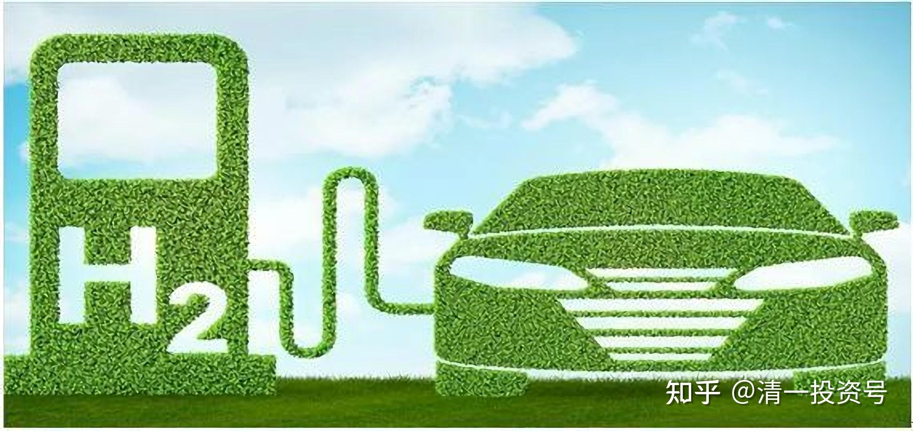
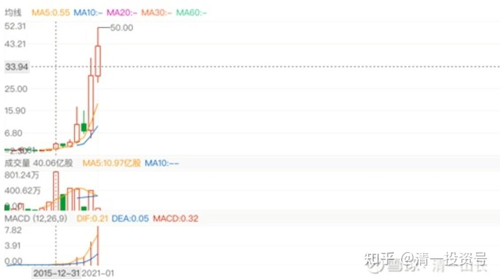

38篇.投资新能源的正确方式

清一山长2017年11月18日～2021年4月19日

**一、看好新能源的未来，却不敢投资新能源车企业**

[清一山长](http://link.zhihu.com/?target=https%3A//xueqiu.com/9310099567)2017-11-1814:31:10

我一直不敢买汽车股。造车的不敢买，卖车的股，倒是低位买了（正通），现在也基本上卖掉了。因为我认为，十年后，现在的燃油汽车，就要开始被替换掉，甚至可能政府出台文件，不许生产新的燃料汽车了。今年我换车买本田URV的时候，就告诉老婆：这辆车，应该是我们在国内买的最后一辆传统汽车了。我相信十年之后，满大街都是“非传统车”，说不定连司机都没有了。现在的传统汽车企业积累了上百年的优势，可能转眼间就完全消失了。就像是沃尔玛面对阿里巴巴们一样，原来的历史积累越厚实，实力越强大，可能未来的新前途就越差。**屌丝逆袭传统贵族的故事，将在汽车业中冒出来。数百年来，一直来用资金和技术堆积自己优势的传统汽车柏林墙，会快速地挂掉，传统汽车业不得不毫无防御地投降屈服！**

未来一定属于电动车，或者燃料电池车。但谁会赢，我不知道。这里面的利润大极了。你问我：现在敢不敢投资传统汽车企业，敢投资新能源汽车吗？比如像巴菲特投比亚迪，外国人买特斯拉一样？

我真的很想这样做——投资未来会成功的新能源汽车。如果赢了，回报率可以达到100倍。不过赢家通吃，输家连裤子都没有的。问题是：我不知道谁会赢。特斯拉？比亚迪？我看未必！

**电动汽车，核心元素，并不是汽车，而是电池，是人工智能控制系统。**这个东西，随时出新的概念。现在无论投多少钱，都无法维持“护城河”。新东西一出来，原来的投资越大，越倒霉，转身都转不过来的。

所以，我知道这个行业会赢，但我不知道谁会赢，大概率不是现在的玩家。谁冒出来了真说不定的。

比如，宁德时代，是目前最有可能赢的电池专家。比亚迪的技术已经被它超越了。目前很多人已经投了很多钱在它身上。但它未来会赢吗？我看未必。假如下面这一家万向的新技术出来，它怎么办？恐怕未来只有“去死”了。“各领风骚数几年”，大约就是这些领袖者们的命运了。

下面这家很有可能赢。但也许明天你又会看到新的“专利突破”。所以，我永远无法弄清谁最终会赢。未来太复杂。唯一不复杂的，就是未来的世界教育方向，我觉得更容易把握一些。我觉得我会赢[大笑]。

转发：近日，中国万向集团旗下、位于美国加州的电动车制造商菲斯科（Fisker）提交的专利申请文件显示，其固态电池技术将实现2.5倍于传统锂电池的能量密度，续航里程长达500英里（805公里），相当于从北京一口气开到西安或者安徽那么远。且充满电仅需1分钟！该公司计划在2023年前将该电池商业化应用。

相比之下，特斯拉ModelS如果使用充电速度最快的超级充电桩，充满电目前也需要1个小时15分钟，续航为300英里（483公里）。

[清一山长](http://link.zhihu.com/?target=https%3A//xueqiu.com/9310099567)2018-01-29 23:41:02

我国新能源汽车领域最高规格的智库——中国电动汽车百人会陈清泰理事长直言，电动汽车与可再生能源的结合将是第三次工业革命的重要支柱之一。**孤立的把汽车动力从燃油转向电力并没有太大意义。**

什么意思？就是未来中国的新能源汽车，恐怕不是你们想象的**电动汽车**，而是——**氢能源电池汽车**！顺便说一句：我已经提前布局了氢能源车的入口[大笑]。

[远妈杂谈](http://link.zhihu.com/?target=https%3A//xueqiu.com/7065713096)[发布于2018-08-20 17:52](http://link.zhihu.com/?target=https%3A//xueqiu.com/7065713096/112423642)

上汽集团跌至28元，还值得持有或购买吗？[https://xueqiu.com/7065713096/112423642](http://link.zhihu.com/?target=https%3A//xueqiu.com/7065713096/112423642)

[清一山长](http://link.zhihu.com/?target=https%3A//xueqiu.com/9310099567)[2018-10-1820:01评论上贴：](http://link.zhihu.com/?target=https%3A//xueqiu.com/7065713096/112423642)

对汽车行业最大的冲击，不仅仅是油和新能源，还包括驾驶方式的革命。未来肯定是无人驾驶，就像是现在大城市里，很少人使用记路来开车，大多数都是靠导航了。十几年前，根本就难以想象。未来恐怕大多数人都用自动驾驶，不再开车，甚至有可能不再购车，因为毫无购车必要了。约车比买车更方便，更容易，甚至更省钱。5G时代，将开启这个驾驶新革命。这个大趋势，对于现在的汽车购买逻辑来说，打击更重！未来谁是赢家？真看不懂的。

另外一个逻辑：就算油车没有未来，上汽也许有未来。但是上汽现在资产3400多亿，大多数是油车的资产。将来值多少钱呢？资产减值之后，上汽值多少呢？各种遣散费用，会不会把企业压垮呢？没负担的新行业人员，将占据绝对的优势。新能源汽车的思路，就像是马车和汽车的思路一样。第一辆汽车的外形，真的就跟马车一样，看起来像是马车的模仿品。但汽车很快就形成了自己的特点，马车时代过去了。尽管用行政手段——“红旗法规”，让汽车不能开得比马车快。但也无法挡住汽车的兴起。

**未来时代，很可能是一样的。原来风光的“马车”大咖们，恐怕无一能够存活（我个人的观点）**。

[@远远妈理财](http://link.zhihu.com/?target=http%3A//xueqiu.com/n/%25E8%25BF%259C%25E8%25BF%259C%25E5%25A6%2588%25E7%2590%2586%25E8%25B4%25A2)回复[@清粉傻猫](http://link.zhihu.com/?target=http%3A//xueqiu.com/n/%25E6%25B8%2585%25E7%25B2%2589%25E5%2582%25BB%25E7%258C%25AB):

油车的未来肯定没有了，现在越来越多的国家预备在2025年禁售燃油车。

上汽有在做新能源汽车的。

上汽的新能源不仅有轿车还有小货车，我在北京，经常能看到上汽新能源的小货车。

[清一](http://link.zhihu.com/?target=https%3A//xueqiu.com/9310099567)山长2020-[05-2418:30](http://link.zhihu.com/?target=https%3A//xueqiu.com/9310099567/150018641)

[$退市锐电(SH601558)$](http://link.zhihu.com/?target=http%3A//xueqiu.com/S/SH601558)几年前很热门的股票，2015涨了五六倍的“优质股”，远远超过我当年重仓的银行股。当时很多人认为它是“前途无量”的新锐。我因为不懂风电，根本就不介入（不是不懂风电的市场价值，而是谁是风电里面的格力，谁是奥克斯，我根本没有能力判断）。很多热门基金都持有这个股。今天看到它居然从最高价跌落了97%以上，想到当初持有的投资者，以及一路抄底的投资者，现在可惨了，查了十大股东，不少基金和个人持有数千万股，几年前，这可是数亿的市值。现在呢？几百万都没有人接手。

提醒各位：历史依然在重复。现在的新能源车，当然是未来的趋势。两年前我新买了一辆本田汽油车，当时就告诉太太：这应该是我们在中国买的最后一辆传统汽油车了。10年后，最差的也是开新能源车，甚至小女18岁我说送她一辆汽车。她还告诉我：她只想要一辆会自动驾驶的车。我看有了自动驾驶以后，连车都没有必要买了，出行手机上定一下就够了。这就是未来——充满想象力的未来，我认为中国的汽车行业未来取得真正的世界地位，要靠新能源车，而非燃油汽车。这个预期，弄得我连最热门的石油股都不敢买，逃过了现在全球石油股大跌的劫难[笑]。

可是，看好新能源，却不敢投资新能源车企业，一个都不敢。因为我根本不知道谁是赢家。我就只敢买一点未来10年我们中国人还会继续喝的酒，这种投资很简单，看懂不难。新能源车，太高大上了，我看不懂，就远离吧！这笔钱不该我赚。我今天投资的“守旧”，固然失去了未来的一个大牛股，但也避免了被贾会计的梦想窒息。我买过的两家房企，许家印、孙宏斌，这么聪明的人，都被他忽悠了数百亿，虽然他们这些钱丢了也没事。但我可玩不起这种烧钱游戏。

所以，新技术真的很好，但真的不是适合理性的人来投资。它更像是赌博，赢了赚取十倍、百倍，输了也输掉十倍、百倍。今天的华锐风电，再涨一百倍，也回不到刚上市价格的高点，连回到最低点，都要涨20倍才行！

**二、看空传统车企，投资新能源的正确方式**

[汽车要闻发布于2020-10-31 12:25](http://link.zhihu.com/?target=https%3A//m.jiemian.com/article/5201944_sina.html)

不造车的华为发布了一整套智能汽车解决方案

[https://m.jiemian.com/article/5201944_sina.html](http://link.zhihu.com/?target=https%3A//m.jiemian.com/article/5201944_sina.html)

[清一山长](http://link.zhihu.com/?target=https%3A//xueqiu.com/9310099567)[2020-10-3118:08:47评论上贴](http://link.zhihu.com/?target=https%3A//xueqiu.com/6023110967/162189966)

[$特斯拉(TSLA)$](http://link.zhihu.com/?target=http%3A//xueqiu.com/S/TSLA)未来是新能源车的时代，这是毫无疑问的。华为也有进入汽车行业的动作。但以为华为会像特斯拉，以及贾会计、恒大等，一干人一样，去傻乎乎的造车，就太小瞧华为的智商了。它干嘛要去做别人也可以做的事情？永远去做别人没做的事情，才是高明。昨天，消息出来了：华为不造车。华为只为造车的提供大脑和神经系统，传感系统！

简单地说：**智能汽车，有两个是核心。一个是大脑；智能时代汽车的三大操作系统AOS（智能驾驶操作系统）、HOS（智能座舱操作系统）和VOS（智能车控操作系统）。才是智能汽车的核心**。特斯拉汽车降价，卖车不要钱，他都要卖出去，加入市场的竞争。因为这一块其实没啥高技术含量，对手也很多，难以有真正的优势。但他的汽车软件，却相反要涨价，要一万美元一套，就是要守住这一块核心。造汽车的硬件，其实附加值不高。比它高的是算法、软件等。这才是汽车的高技术。但您认为，这个领域，特斯拉真的比华为更强吗？或者说，特斯拉还能够垄断这块市场吗？世界上其他车企，谁还可能比华为更懂AI智能系统的构造？华为提供了这一块国产造车企业的短板补强工作（这是特斯拉绝对不肯分享给别人，也很难简单模仿的技术），软件上去了，硬件上，中国制造商们，分分钟就可以拿出足以媲美特斯拉，甚至超越特斯拉的整车来。这对中国人来说不难。

**智能汽车的另一块高技术，是车载电池部分**：这相当于汽车的心脏！谁能做好电池，谁就能占据智能汽车的制高点。这一部分内容，连特斯拉都没有具备真正的护城河。他自行制造的电池，要两年后出来，还不知道能不能如期出现。这两大块，才是智能汽车的精髓，干其他的部份，都只能是寒酸的打工仔！没啥技术含量了，只能赚点力气活的钱。

可惜，很多买智能汽车股票、买蔚来、买特斯拉股票的人，忘记了智能汽车的本质是什么。仅仅是会造车，是个苦力活，而且是重资产，投机巨大，风险奇高。拼死了，也赚不了多少油水。而且目前传统车企，资金实力更强。就像是多年前的手机，很多“山寨手机”,性能都差不多，谁好都很难说。真正赚钱的，是苹果用“超级大脑”赢得了大笔的利润，高通、联发科用“手机心脏”——芯片取走了大笔利润。中国的一众手机厂商，干了最苦的活儿，但只得到惨淡的利润。因为，核心技术没有掌握，就只能沦为打工的命。

现在拼电池赛道，已经渐渐有点赢家出来了。比亚迪的刀片电池，起码比特斯拉外购电池更有竞争力。华为提供智能汽车解决方案，大脑工程。更是占据智能汽车制造技术的高端，相当于它是最高端的芯片提供者。你不用它的方案，就相当于拒绝高通的方案一样。要么自己去打造一个自己的高级麒麟芯片出来（这个投资可不低）。要么承认落后，乖乖当打工仔。

我一直非常看好智能汽车的未来。但因为一直搞不清谁会赢。所以不敢投。固然失去了很多机会，特别是比亚迪，关注很久，都没敢下手。但华为智能汽车解决方案杀出来后，真的是应了智能时代找到赢家的困难，真正的竞争对手，可能根本就是个你根本就不注意的业外人——“羊毛真的可以出在猪身上”。我认为：也许，华为公布这个消息的这一天，所有的智能汽车厂商，都发现自己贬值了，都变成了鸡肋！许家印的几百亿，也许丢水里去了。最好的命，就是像地产一样，继续苦苦的打工赚钱。一辆车一辆车的去拼去。

我知道：这是谷歌一直在试图做的事情。但华为看来抢先推出来了，挟它独有的五G技术之威，其他企业望尘莫及。华为一旦抢先，我相信绝不会再给美企机会的。谷歌不可能成为高通第二，最多成为“美国的高通”。但美国人在制造业上的劣势，使得美国无法与中国的新能源汽车竞争。**中国会在智能汽车时代，成为全面的赢家！电池，方案的制高点，如果都在中国，美国拿什么出来拼？**

祝福我的中国！

[清一山长](http://link.zhihu.com/?target=https%3A//xueqiu.com/9310099567)2021-01-0910:40:04

看空特斯拉，从逻辑上是对的，虽然从市场上看是错的。芒格也一直看空特斯拉。芒格50元就看空它，认为特斯拉不值得投资，现在880元了。

所以，巴菲特一派的特征，就是看空不做空，是有道理的。做空，需要和人性的疯狂来对抗，这是没有胜算的事情。

而价值投资者的“做多买入”，相对就简单多了。只需要对市场进行理性的分析和计算，只需要对自己的能力圈负责，所以风险是可控的。做空，会超出所有人的能力圈和判断力，因为疯涨需要的只是激情。我们无法判断激情能够维持多久，什么时候会到顶。

现在A股的酒疯，也一样，做空必然遭到损失。所以绝对不能做空。但也不能反过来做多。我们只能观望了。就像对特斯拉，我们只能观望一样！

逻辑上，我不相信新能源车和旧能源车有啥本质的不同。在技术上，的确是新的革命。但它们在商业本质上，在功能上，我不认为两者有啥不同的。随着电池技术的提升，充电桩配套的完善，以及氢动力技术的完善，特斯拉的对手，只会越来越多。特斯拉目前靠亏本来维持市场地位的做法，是互联网思维模式。但是，汽车只是一个消费品，工具罢了，它不太可能获得互联网的顾客粘性。而且维持顾客的成本很高，不像网络的用户，增加服务并不会带来成本的增加。汽车最多像苹果手机一样，拥有一大批忠粉。但就算是苹果，也无法将竞争者挡在外面。而且，苹果是靠高利润来维持的，不是靠低价赔本拼命提升销量来赚吆喝的。所以，看好特斯拉，不如看好苹果（当然，我真正看好的，是华为，可惜买不到）。

[$特斯拉(TSLA)$](http://link.zhihu.com/?target=http%3A//xueqiu.com/S/TSLA)的空头太惨了。做空特斯拉的资金一直都汹涌，目前已经亏了快3000亿了，这个数字还在不断扩大中。做空的理由大概就是觉得要么贵了，要么涨多了股价高高在上了所以就要跌。

这种想法在这两年的行情之下是很危险的，为什么右侧趋势投资者去年到现在赚钱特别容易赚得盆满钵满，因为强势股的趋势的延续性非常非常好，他们只跟随趋势而不去预测，而那些喜欢不断去预测顶部的空头自然变成了炮灰。

[@月光66666666](http://link.zhihu.com/?target=http%3A//xueqiu.com/n/%25E6%259C%2588%25E5%2585%258966666666)回复[清一山长](http://link.zhihu.com/?target=http%3A//xueqiu.com/n/%25E6%25B8%2585%25E4%25B8%2580%25E5%25B1%25B1%25E9%2595%25BF):

借山长的楼问个问题，电车对碳中和有用吗？一次能源主要还是煤炭啊！能源效率更好，不一定吧。

[清](http://link.zhihu.com/?target=https%3A//xueqiu.com/9310099567)一山长2021-01-0913:04:13回复[@月光66666666](http://link.zhihu.com/?target=http%3A//xueqiu.com/n/%25E6%259C%2588%25E5%2585%258966666666):

您这个问题，就是丰田董事长对新能源汽车的质疑，对特斯拉路线的质疑[很赞]。

他认为：**现在的新能源，发展电池车，无非是把汽油消耗，改成了煤炭的消耗（发电），但对地球环保本质上没有差别，甚至可能更糟糕（因为制造电池额外的需要耗费大量能源）。**

丰田的思路，是“氢能汽车”。使用氢气来做电力供应，排出的废气是H₂O，这才是真正的环保车。丰田是这个路线的领先者。但被美国为代表的利益集团压制得很厉害（想想看特朗普怎样对待华为的？只要对自己不利，就拼命打击，才不管对地球有啥好处呢）。日本国小，根本没机会发展氢能技术，也不敢跟美国人对刚。所以，很无奈，丰田就在前两年，把氢能汽车的专利，全部都公开了。实际上是想让中国来接手这一烫手的山芋。中国缺能源、缺汽油，也敢于和美国对着干。所以，以后我认为，中国会是新能源氢能技术的引领者。比特斯拉要有价值得多。就是不知道该投谁？

氢能汽车还有一个好处，就是它其实就是一个移动的发电机，所以，将来家里有汽车的，就可以连上汽车，用自己发的电照明等。需要多少就发多少，不用储能的。这样，全球的电力企业，也会受到巨大的冲击。所以，因为**氢能路线对现有的能源集团冲击太大，才被冷置的。中国政府，正在悄悄地布局氢能，只做不说，也是为了避免引起过多的注意。**

顺便说一句：**中国中车，就正在做氢能汽车**。12月份发货量增加了很多倍。我认为：这些任务，国家会交给国企来做的，**现在这些热热闹闹的新能源企业，也许将来怎么死的都不知道！所以，我一家都不敢投[大笑]。只能看着！**

[清一山长](http://link.zhihu.com/?target=https%3A//xueqiu.com/9310099567)2021-01-3020:19:33

[$恒大汽车(00708)$](http://link.zhihu.com/?target=http%3A//xueqiu.com/S/00708)这种股，可以从8年前的1-2分钱一股，涨到今天的42.35元。原来一直持有的话，收益率比巴菲特高得多。8-9年前，买上一万元的这只股，今天就可以卖出4235万元。最高5000万元。十年4000-5000倍！还用得着去打工吗？[大笑]

**新能源汽车已经疯了。未来死在新能源汽车上的投机家，肯定比死在中国石油上的多得多。现在杀进去，我绝对不相信新能源汽车能够取得什么正回报。**

（恒大汽车2015-2021年K线）

[新能车ETF](http://link.zhihu.com/?target=https%3A//xueqiu.com/u/7270425042)515700[2021-04-1918:26](http://link.zhihu.com/?target=https%3A//xueqiu.com/7270425042/177489073)

【悬赏】首款车inside发布，华为的入局对传统汽车行业会有什么样的影响呢？

[https://xueqiu.com/727](http://link.zhihu.com/?target=https%3A//xueqiu.com/7270425042/177489073)0425042/177489073

[清一山长](http://link.zhihu.com/?target=https%3A//xueqiu.com/9310099567)2021-04-1910:49评论上贴

居然[@了我](http://link.zhihu.com/?target=http%3A//xueqiu.com/n/%25E4%25BA%2586%25E6%2588%2591)，就说几句把：**“不做噱头，马上量产，不是PPT”**。

这句话大有深意。**华为是“悄悄的进村”，不大张旗鼓的显耀，显然是实力过人。**跟实力不足，要用PPT来获得支持，获得资金的其他对手相比，一开始就拉开了距离。这个自动驾驶项目，原来很少听见华为的消息，只知道华为在做汽车智能配套。一下子就“量产”了，很让人意外。而且华为眼里，[特斯拉](http://link.zhihu.com/?target=https%3A//xueqiu.com/S/TSLA%3Ffrom%3Dstatus_stock_match)根本就没有值得尊重的地位，只是一个超越的对象罢了，我相信华为造车，超越特斯拉毫无问题。因为华为选的路线，比特斯拉单打独斗的造车不一样。华为天然具备超越的条件。

另外，以为华为只提供“软件”的，大概是太低估华为的竞争方式了。别以为华为只是提供了一套软件，就像电脑上提供了一个[微软](http://link.zhihu.com/?target=https%3A//xueqiu.com/S/MSFT%3Ffrom%3Dstatus_stock_match)操作系统一样。很多人这样理解。

实际上，华为提供的是**“[人工智能](http://link.zhihu.com/?target=https%3A//xueqiu.com/S/SZ161631%3Ffrom%3Dstatus_stock_match)解决方案”**，相当于软件和硬件的结合。比如探测器（激光雷达和超视距雷达之类的）。以及相应设备的软硬件组合。**相当于最核心的部件，软件硬件组合，最高端的技术解决方案，都在华为手里。简单地比喻，相当于华为把[高通](http://link.zhihu.com/?target=https%3A//xueqiu.com/S/QCOM%3Ffrom%3Dstatus_stock_match)的[芯片](http://link.zhihu.com/?target=https%3A//xueqiu.com/S/SZ159813%3Ffrom%3Dstatus_stock_match)和微软的软件都集成在一起，整合供应给电脑厂商了。让你造电脑当然更容易——也就更没啥利润了。**

为啥一些大厂就是不跟华为合作？因为这是最核心的部份。谁掌控了这些关键技术和软硬件，谁就掌控了汽车行业。所以其他大厂费劲砸钱，也必须砸出来。但是，一些二流的品牌，却可以利用这个机会翻盘，把一线的大厂、名厂超越掉。**汽车业的大洗牌，马上来临。大厂砸钱，除非你肯定他们拼得过华为，否则根本没希望。**恒大造车？在华为这种战略下，我看就是一个笑话。我知道未来造车有很大的利润，超过手机多多。但真不知道谁会赢。一定要押宝，我压华为，不压恒大之类的“造车新势力”，不压传统车企，甚至不压特斯拉。我认为基本上都会输掉的。

最终结果：**造车也必将成为红海，由于互相谁都不服谁，无法形成汽车联盟对战现在IT行业的高手，最终是谁都无法最终取胜。全都只能沦落为普通制造业，不再享受行业的丰厚利润。**就只能像富士康一样，活着，但只能挣一份本分钱。超额利润没有了。

华为宣称不造车，不是秀道德。商场上，有何道德可言？华为秀的是智商：**华为将像手机业的高通一样，低调存在，可能消费者都不知道它是何人。但任何一个手机大牌子，谁离得开高通？谁的利润比它高？**包括苹果，都是给高通打工的。而且摆脱它很难！谁都想摆脱它，但就是做不到。苹果为了摆脱高通，找[英特尔](http://link.zhihu.com/?target=https%3A//xueqiu.com/S/INTC%3Ffrom%3Dstatus_stock_match)合作造芯片，都没有成功。反而造成苹果手机一度的负面评价，给了对手超越的机会。

一句话：**如果我持有汽车行业的企业股票，我现在想的，就是该怎样卖掉了。未来的利润，已经看不清楚了！我不会去跟你们抢股票的，就算[北汽蓝谷](http://link.zhihu.com/?target=https%3A//xueqiu.com/S/SH600733%3Ffrom%3Dstatus_stock_match)也不要。如果手上有，就乘机卖掉算了（哈哈，我没有，因为不敢买汽车，我不知道10年后谁会赢）。**

[@蛰伏2020](http://link.zhihu.com/?target=http%3A//xueqiu.com/n/%25E8%259B%25B0%25E4%25BC%258F2020)回复[清一山长](http://link.zhihu.com/?target=https%3A//xueqiu.com/9310099567):

有幸在2018年国庆财富课上听到山长[@清一山长](http://link.zhihu.com/?target=http%3A//xueqiu.com/n/%25E6%25B8%2585%25E4%25B8%2580%25E5%25B1%25B1%25E9%2595%25BF)，当时还带着些许“疑惑”给我们分析着[新能源车](http://link.zhihu.com/?target=https%3A//xueqiu.com/S/SZ399417%3Ffrom%3Dstatus_stock_match)的未来，让我印象深刻。山长当时指出“新能源汽车胜出者不会是传统汽车厂商，有可能是一个从不造车的入局者，判断大概率会是华为，可惜华为没上市，所以不知道谁会赢，华为买不了，只能大买特买给车提供更轻更好材质的**中国宏桥**，因为**不管谁赢，都需要铝板来造车，中国宏桥都是最大的收益者，传统汽车股一个都不敢买。**”三年过去了，一切迷雾都在慢慢地一层层解开，答案也快出现了。感恩山长再次对新能源汽车的分享[献花花]。

[清一山长](http://link.zhihu.com/?target=https%3A//xueqiu.com/9310099567)2021-04-1911:59回复[@蛰伏2020](http://link.zhihu.com/?target=http%3A//xueqiu.com/n/%25E8%259B%25B0%25E4%25BC%258F2020):

[献花花]，你们都记得这么清楚。我都忘了，当年我如此精准的预测华为会造车，而且会成为赢家。当年，华为还没有要造车的任何消息出来呢！**押宝[中国宏桥](http://link.zhihu.com/?target=https%3A//xueqiu.com/S/01378%3Ffrom%3Dstatus_stock_match)，的确帮我赚了很多钱，实现了超过原来的A股第一重仓[中国建筑](http://link.zhihu.com/?target=https%3A//xueqiu.com/S/SH601668%3Ffrom%3Dstatus_stock_match)的利润冠军记录。所以，看样子眼光还是很重要的。**看不清，赚钱赚小钱，赔钱赔大钱；看得清，未必不会赔钱，起码赔钱赔小钱，赚钱赚大钱。

