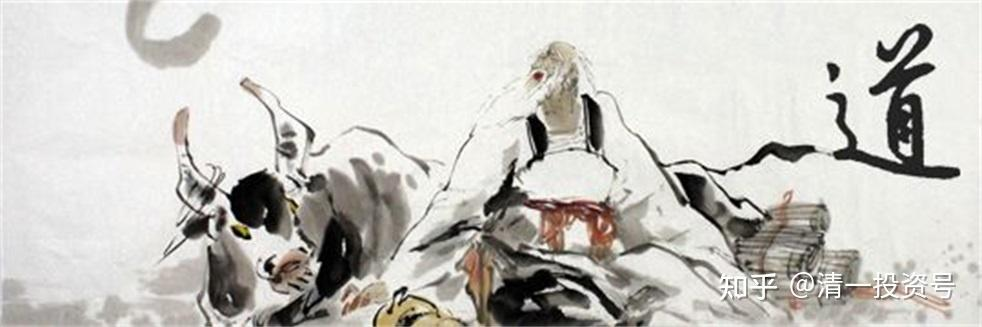

38篇.老子股经（一）持而盈之，不如其已；揣而锐之，不可长保（上）

清一山长 2007年6月3日

王弼版原文：持而盈之，不如其已；揣而锐之，不可长保；

帛书版原文：持而盈之，不若其已。揣而锐之，不可长葆之。

**一、原文讲解**

“持而盈之”，“盈”就是满，对什么事情都要求“盈”，什么事情都要求往一个方向走，老子认为这是错的，所以告诉你“不如其已”，要求你“已”，停住，停下来。在第一章讲老子的思维模式中已经说出来了，**老子认为事物没有只往一个方向走的，一定有另外一个方向，所以他往一个方向走的时候，就随时想另外一个方向也可能发生**。这就是“持而盈之，不若其已”的意思。

“揣而锐之”，有两种传统的讲法。

一种说法，“揣”也叫“zhuī”，就是把一个尖尖的东西拿去敲，把它敲得越来越尖。这种说法也有道理，就是把它弄得越来越尖。

另外一种说法，“揣”（chuǎi）是一种很尖锐的东西，“揣而锐之”意思是尖锐的东西再加上尖锐的东西。就相当于我的剑本来很尖，我再加一个尖的东西在一起。这样尖上加尖，还尖不尖？那就不尖了。所以，**“揣而锐之”就“不可长保”，一件事物你把它弄得太精、太尖了之后，它就没办法长期保留**。

同样我们也发现，你把一把刀弄得非常锋利的时候，它就很容易折。钝钝的砍刀是不是比较长久呢？这点金庸小说里面写得倒很有意思，他说：“年轻的时候喜欢用宝剑，后用竹剑，最后用木剑。木剑再高——无剑，手上无剑，心中有剑。”这个过程说的其实是跟“揣而锐之”相反的，把切金断玉的宝剑逐步钝化，钝化成一把钝剑、铁剑，最后变成木剑。他持的是道家的境界，境界越高，就越不露锋芒。

**二、投资运用**

刚才讲的都是常识，都是基本概念。这些基本概念都很简单，都能够理解。今天我就顺便跟时事结合一下，讲讲这一章目前的用途。

**1、持而盈之，不如其已**

晓莉挺好玩的，那天我碰到她，跟她说：“股市大跌，你知道吗？”她说：“我知道。”我问她：“你怎么知道？”她说她老公给她打电话，事先给她打了强心针，说股市大跌。因为我做晓莉的委托代理人，帮她操作股票。她老公跟她说：“你要做好心理准备，可能市值狂跌，你原来的钱哗哗哗损失得差不多了。”她说她已经做好心理准备了，无非就是她的钱变成零而已。就算跌成零也无所谓，不影响生活嘛！已经做好准备了。

然后我就告诉她，其实没有损失，不但没有损失，还多了一点。多了一点还不是股票而是现金，静静地躺在账上。小莉大吃一惊，她觉得像做梦一样，不可能有这种事情。她接着问：“那别人呢？”她的意思是问别人是不是也成功地着陆了？我说：“在我手上的所有账户都成功着陆。包括亲戚的，我打了几个电话，听我话的都成功着陆，唯一不听我话的是我的妹夫。”（众人哄笑）

我妹夫就是那个博士后，现在深深被套，他不但不听我的话，还加码买进。我告诉他退的时候，他反而在进。他想证明他自己的手段比我聪明得多。晓莉丈夫后来打电话来问我怎么回事？他想学会其中的道理——张老师怎么知道全身而退的？到底有什么高明之处？

另外一个亲戚，我退的当天告诉他，他偷懒，当天不退，第二天退。第二天退完后，第三天大跌，跌停了。第四天、第五天都是跌停。他就打个电话来问：“你是不是知道消息？知道财政部在逃税？”我说我不知道。我哪知道？我在财政部又没亲戚，有亲戚可能也不会告诉我。他们一直觉得这里面很神奇，觉得我好像很了不起。

其实蛮简单的，就是这一章教的本事。这一章教了什么本事呢？你们自己想想。这一章的头几个字啊——“持而盈之，不如其已”，我现在给你翻译成老子股经：**你持有一个股票，盈利已经比较多了，这个时候就要停下来，把它变成账面利润**。是不是这样解读？“持而盈之”，持有而取得了足够的盈利，已经比较满了，我觉得已经“盈”到尖子上去了，已经不错了，这个时候“不如其已”，这个时候就应该停下来了。我一看，该停了，就把它一停。

后面那句话“揣而锐之，不可长保”，这就不是我的故事了。我做了第一条“持而盈之，不如其已”，因此保住了胜利果实。其实在这次大跌当中，我不但没有损失，反而取得了一定的成效。股市这几天正在跌停，我正在睁大了眼睛，准备等它再跌的时候，重新再杀进去——专门等到别人损兵折将、尸骸遍野的时候，再杀进去。这就得到了双面的好处。

**2、揣而锐之，不可长保**

**①高价信庄托，损失近半**

但是，另外一个故事就不太好听了，叫“揣而锐之，不可长保”。在我退出股市的那一天，也就是大跌的前一天，我身边发生了一个故事。

我身边能够全身而退的人很稀少，包括跟我在一起炒股的一个大户房间的人。我身边的这个老板，他自己的身价其实也不太高，可能也就一两百万，这回好不容易涨到一两百万，但他吃了一个大亏。

那天，他的一个朋友打电话来，神秘兮兮地问他：“你旁边有没有人？”我们两个天天在一起，他朋友也知道的。那个人说，不能告诉别人，这个股特别好，一定会涨的，让他把所有的股票卖掉，全仓买入它。

他认为我是他好朋友，就告诉我，说我也可以考虑打一点资金进去。我要打资金可能一下打几十万也难说。但是我看了一下，我说算了，我现在不动，怎么都不动。我说，**不管他有多好的消息，我都决定不动。现在不是动的时候。为什么不是动的时候？现在是“揣而锐之”的时候，已经到了尖处。尖处就相当于如履薄冰、如临深渊的感觉，这个时候我退还来不及，还进去？**关键是这个股票是什么东西，我还不知道呢！结果我就死不碰，我就是不动。包括上一个交易日回调了一点，他又再次买进去了，我说我还是不动。但是他不听，又进去了。进去之后，到今天为止连跌了五天，其中三天是跌停的。就几天工夫，他的账面资产一下子损失了40%以上。他现在气得要死，说那个人害了他。

其实，我知道那个人的目标可能不是害他，而是害我。为什么？因为好奇心。比如这东西是绝密消息，有内幕，有背景，再看看旁边这家伙有点钱，让他跟进去。我的这个朋友，他周围有帮朋友，都是有钱人，大家经常在一起。那个人想把我朋友包括我在内都拖下水去。我分析的结果是这样。

其结果是那个人失望了，只有我朋友买了点。买了就被套，脸色都是绿的，特别难看。这就犯了一个错误——“揣而锐之”。

同时，我也告诉他，这是一个陷阱。因为分析下来我觉得奇怪，这个人我了解他的人性。我见过他，武大的一个人，他不是热心快肠之人。既然他不是热心快肠之人，就算一件事情对你有好处，他也不会一天打七八个电话来催你的。但是我知道这个人，我看他的眼神，是个闪烁不定之人。

我就说这个人很奇怪，他说他自己全仓，我觉得怀疑，他可能在做托。他跟证券公司老总、庄家是有联系，但他有联系不见得是帮你赚钱，可能是帮你赔钱。我认为他是帮庄家做托儿的，到处散发消息，让你买，买了就把你套牢，等于把你的钱换作他手上的东西。

我认为他是干这样的事情的，而且他居然把手下到他的朋友身上去。这个朋友帮他操作赚了一倍多的利润，但是一个月前，他把账户拿走自己操作去了。自己操作之后就出了这种怪事，非常恶心！我判断的结果是这样的，但没有得到证实，也证实不了。

这就是庄托，我告诉大家庄托的操作模式：他们会先诱惑一些人，比如证券部的人，告诉你买多少股，然后每股给你多少钱。比如，每股他赚十块钱，然后给你两块钱。如果这些人一下子买几十万股，那他一下子就赚了一大笔钱。这就叫庄托。但是对我来说，套我没效，能把我套住算你有本事。

**②操盘手再遇滑铁卢**

但是有一人在这个事情上吃了一个很大很大的亏，就是来过我们这边的李经理，他是个操盘手、基金经理。当时他管理的资金大概有上亿了。他的盈利已经可以私募一个小团队了，他就做了一个私募团队。

他曾经在上海经历了一个事故，资金在一夜之间打光了。他从十来万起步，赚到了一千多万。一千多万在一夜之间变成零了。他是打光了之后从上海回来的。他结婚的时候，老婆有一点原始股，攒了很少一点钱，大概十来万，现在重新又慢慢地做起来。他现在的总资产我不知道，大概也不会太多，了不起就二三百万。但是他管理的资金大概有上亿，我估计他实际资产还可以，他靠给别人操盘来赚取管理费之类的。

如果世道比较好、操作比较好，到今年年底，他赚一笔很容易的。但这个时候他吃了一次亏，这是他第二次吃亏，跟第一次非常相像。所以，他等于在类似的地方翻船了两次了。

这个事情是这样发生的：别人委托他卖出手上的一千五百多万股，一大笔股份给他，这些资金相当于三个亿。就是有个人告诉他，你来帮我操作，你把它卖掉。他是操盘手嘛！然后他把三个亿就“哗哗”地往外卖，他想价格应该拼命往下掉吧，一般东西拼命卖价格是不是就要往下滑？他发现股价不但不往下滑，还往上涨。

你们觉得怎么样？如果是你，你会怎么想？他就判断这个股不得了，一千五百万股砸下去就像泥牛入海一样，一点动静都没有；不但不往下滑，还往上涨，到尾市的时候还冲击涨停。他想砸但砸不下去，而且他是用别人的钱来玩，玩不下去。

这个时候他就做了一个反向操作。他就通知自己的两个朋友杀进去，包括自己的资金也杀进去，他想既然今天砸不下去，明天肯定是涨停，这个股绝对有大名堂，所以全杀进去了。

你们觉得这个思维判断有没有什么问题？首先，思路对不对？对的，但如果出问题，会出在哪里？

这个股是武汉的一个股，它一天的成交量也就是两三千万而已。那么一千五百万股砸下去，应该会砸个跌停，而且几个跌停都有可能；但没砸成跌停，还往上涨。所以这个时候正常的操作是，既然趋势卖是卖不动的，那么他就反向操作。是不是？

他的思路是对的，但是要考虑另外一个问题，这是不是“揣而锐之”？股价在尖尖上，**这个股从股价3块钱涨到那天的16块钱以上，这就叫“揣而锐之”了。这个时候已经在尖子上了——它的股值在尖子上，他自己也在尖子上，这个时候是“揣而锐”，在这个基础上叫“不可长保”**。

**这种事情用我自己经常说的话，就是在刀口上舔血。又不是没饭吃，也不是生命受到影响，干吗去舔这种血啊？不能舔的**。当时他告诉我这个消息，意思是这个东西非常好，他告诉我这个消息的时候还兴高采烈的。因为他知道我有时候也会果断操作，进出也很快。但是我看了，我不动。接着第二天跌停，第三天跌停，第四天跌停，每天都是跌停。

你们觉得问题在哪里？（学生答：被别人诱惑进去的）怎么诱的？三个亿啊！三个亿的筹码直接砸进去的啊！别人用三个亿来诱惑他的几百万股？他大概进了一个亿。我损失三个亿来赚你一个亿，有没有可能？

想不清楚，是吧？你们一般都想不清楚。他自己到现在有没有想清楚，我不知道。我不敢跟他说话，最近他的脸色特别难看，他等于是遭到了第二次滑铁卢。

最近这次大跌消灭掉很多庄家和大户。因为有些人看到这种消息、得到这种机会的话，他是透支进去的。如果他一旦透支30%，就打不赢了。比如，他现在有一千万，他看到这个机会，觉得包赚不赔，所以他就透支三千万，去买三千万的股。碰到这次三天大跌，他马上一分钱都没有了，一下就变成零了！上次那个李经理就是这样打到零的。这回会不会有人也这样做，我不知道。

当时我也觉得奇怪，看了三天的跌停，昨天晚上我突然想清楚问题出在哪里了。我觉得他上了别人的当，为什么呢？别人是做庄的，给他一千五百万股，别人什么时候收集到这一千五百万股不知道，肯定成本很低，但是他往外卖的时候卖不下去，反而往上涨。我做个笼子价格就不会往下掉，反而会上涨。怎么做？

假如我有一千五百万，我把小燕叫过来，把钱拿给她。因为没人接啊，别人不接的话我就要诱别人进来，**我要出来就要诱别人进来。我就悄悄地卖，小燕在那儿接，所以我只出了什么？我只出了手续费。对我来说，我的成本就只是手续费**。

你看我怎么砸都砸不倒，那是因为我在护盘，所以等于是我们俩之间的内幕交易。但是你看砸不下去，然后你自己就起了一个贪念，你觉得肯定有后市，就以市价跟着我去买。但是你跟着我进的那批，你是实实在在拿着真金白银去换了一个垃圾股，对不对？

我这边搞定了几百万股，他那边当天进了几百万股。他是当天告诉我的，好几百万股都已经进去了，他觉得这个东西他不怕，他觉得未来一定会涨，几千万股砸下去砸不倒的这种股，将来会涨10%、20%，还有一个大幅度的涨幅。

这样完了没有？没完啊！现在该小燕来唱戏了，可能还不止一个小燕，可能有几个小燕，小燕实际上就是另一家公司的操盘手。我呢，我拿了一个亿放在你这儿，再拿一个亿放在她这儿，再拿一个亿放在他这儿，但是你们肯定在不同的营业部，而且你周围肯定有一个消息圈，你在这个营业部肯定有一定的影响力。

现在我告诉你，小燕，我们来做庄，我拿一个亿的资金给你，我们来打这个股票，那天无论什么价位，只要能买就尽量买进，把一个亿买光为止。所以你表面上是我的同谋，其实我也不会告诉你我到底做什么阴谋，我是你的幕后指使人。

你就得到了指令，你看账上“哗”地进了一个亿。让你买，反正不是你的钱，你管它好不好。他给的指令就是买光、买掉而已，你就去“哗哗”地买进来，你在不停地买。你一看是换庄，大部分都是买进去，买进就开始涨停。你会怎么想？

然后你心想，这个股不得了啊，一个亿的现金啊！这就是东家在坐庄啊！所以他既然要坐这个庄，是不是你也可以跟着他一起去跟庄？你还告诉你的朋友也一起跟庄，好不好？所以买的这些人是不是一定要跟庄？这个一亿，那个一亿，共三个亿，我刚才说这一票股票是三个亿。这三个人，再加上卖的那些人，买和卖加在一起至少四个庄，四个地方就搞完了。

这些人其实都是我主使的人，其实都是我自己的钱在里面跑来跑去，但是我影响了周围一大批人。这个营业部影响了几百万股，那个营业部再影响几百万股，你那边再几百万股，加在一起，我不但把我的一千五百万股消耗得一干二净，可能还有多的，甚至还有别的东西。所以庄家肯定大赚，但是跟庄的人就会大赔。这就叫杀人不见血。

那这个庄家，他别的地方我不知道，我只知道在这个营业部他是一千五百万股，估计总量还不止这个数字，是很大的一个数字。那么，仅仅从一个营业部来看，他每天就赚到了两千万左右，但这赚的是黑钱哦！

这就叫虚拟经济，“虚以控实，虚以杀实”。而且也代表着阴谋所在。

（标题、图片为编者所加)

**参考链接：**

[40篇.老子股经（一）持而盈之，不如其已；揣而锐之，不可长保（下）](https://zhuanlan.zhihu.com/p/642329173)

[42篇.老子股经（二）——强分违背天性](https://zhuanlan.zhihu.com/p/643941532)

[44篇.老子股经（三）——善于管理、治理](https://zhuanlan.zhihu.com/p/644751640)

[46篇.老子股经（四）——“无为”的智慧](https://zhuanlan.zhihu.com/p/646940810)

[48篇.老子股经（五）——无之以为用](https://zhuanlan.zhihu.com/p/648281618)

[59篇.老子股经（六）——炒股炒的是“阴阳”](https://zhuanlan.zhihu.com/p/677787344)

