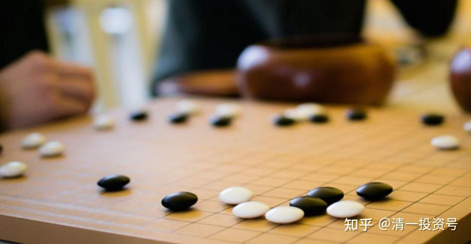

原26篇.入界宜缓，逢危须弃

[清一山长 2021年 4月29日](http://link.zhihu.com/?target=https%3A//xueqiu.com/9310099567%2522%2520%255Ct%2520%2522_blank)

[清一山长雪球非专栏帖子整理文章 第26篇《入界宜缓，逢危须弃》](http://link.zhihu.com/?target=https%3A//xueqiu.com/9310099567%2522%2520%255Ct%2520%2522_blank)
**[清一山长](http://link.zhihu.com/?target=https%3A//xueqiu.com/9310099567%2522%2520%255Ct%2520%2522_blank)**[04-29 21:44 · 来自雪球](http://link.zhihu.com/?target=https%3A//xueqiu.com/9310099567/178685457):

我刚打赏了这篇帖子 ¥21.00，也推荐给你。这个数字的意思，就是希望晕总的2021年分红增长预测，继续超预期，达到增长21%的目标！

**中国建筑，拿着安心。涨跌无心，练内功！练修养，好！**跌了我就当吹鼓手，涨了不吭气。被人骂傻子的有我。以后大涨了，有人自然会来领功的。

希望中建PB破净时刻，至暗时刻，晕总与我们同在。

[https://xueqiu.com/1845773477/178659041](http://link.zhihu.com/?target=https%3A//xueqiu.com/1845773477/178659041)

//@晕娜:回复@清一山长:

回复山兄，

2021年度：中建分红同比增长16-20%，本人认为是靠谱的。是分红，不是业绩增长。

中建股价真的回到了净资产值时，本人肯定离开雪球。说过很多次了。

本人一大把的年龄了，来雪球真的不是混网红的...不屑！

[清一山长](http://link.zhihu.com/?target=https%3A//xueqiu.com/9310099567) [04-29 22:17 · 来自雪球](http://link.zhihu.com/?target=https%3A//xueqiu.com/9310099567/178689662):

回复[@晕娜](http://link.zhihu.com/?target=http%3A//xueqiu.com/n/%25E6%2599%2595%25E5%25A8%259C): 感谢有您！您对中国建筑的坚守，让我学到了我原来不具备的一些东西。投资体系更完善了。拿现在这么大的仓位来守候中建，是我近30年的投资历史上从来没有过的。虽然暂时还没有赚钱，但另有一番收获,一些无法用金钱来衡量的收获。未来，也许中建会成为我赚钱最多的股票。我认为：我未来的投资模式，会更多的学习您的这种坚守模式。现在我的模式，虽然是能赚钱，但有点不够大气。更像是好玩。

[清一山长](http://link.zhihu.com/?target=https%3A//xueqiu.com/9310099567) [04-29 22:31 · 来自雪球](http://link.zhihu.com/?target=https%3A//xueqiu.com/9310099567/178691593):

我刚打赏了这篇帖子 ¥88.00，也推荐给你。

借您本文的吉言：中建的（24个月）目标价是10.35-13.50，兴业的目标价是38.55-42.85祝福林地兄借助此两只股票的预期落地，实现投资20年增值200倍的目标（目前您是15年76倍，要实现这个目标很有希望）。

[https://xueqiu.com/9564664610/174998438](http://link.zhihu.com/?target=https%3A//xueqiu.com/9564664610/174998438)

//[@归隐林地](http://link.zhihu.com/?target=http%3A//xueqiu.com/n/%25E5%25BD%2592%25E9%259A%2590%25E6%259E%2597%25E5%259C%25B0):回复[@清一山长](http://link.zhihu.com/?target=http%3A//xueqiu.com/n/%25E6%25B8%2585%25E4%25B8%2580%25E5%25B1%25B1%25E9%2595%25BF):

谢谢山长打赏。我的业绩没有那么高啊（那个76倍是假设今年净值能够上涨47%，我的中国梦），现在大概是15年多一点的时间53倍（最近兴业回撤不少），而且也是因为起点刚好是大牛市，去掉06-07年的大牛市，比如最近10年，只剩下8倍了。我现在的目标更是低得多，5年1倍（年化15%），10年3倍就满足了。

不管多少倍，只要能够实现在14亿国民中的资产排名略有增长，所谓保值增值就很满意。

[清一山长](http://link.zhihu.com/?target=https%3A//xueqiu.com/9310099567) [04-30 08:54 · 来自雪球](http://link.zhihu.com/?target=https%3A//xueqiu.com/9310099567/178715734) 回复[@归隐林地](http://link.zhihu.com/?target=http%3A//xueqiu.com/n/%25E5%25BD%2592%25E9%259A%2590%25E6%259E%2597%25E5%259C%25B0):

打赏您的帖子，是希望看我帖子的人，去学您和晕娜的方式：云淡风轻地就把钱赚了。财不入急门！主要是我得到的粉丝打赏太多了，需要用出去发挥价值。你的投资方式，是值得大家学习和模仿的，希望大家都向您学习这种投资风格——闲适从容。

但有些人就是喜欢跟着我，看我分析盘面、跟庄、看K线，买进卖出做T。其实这是不务正业。虽然我的确能看懂庄家的心意，也会与狼共舞，抢点庄家的饭吃。中国股市玩了三十年的老股民，活下去的老兵，都或多或少会一点。但绝大多数人，是学不会我的。与狼共舞的结果，基本上是被狼吃了。但他们学你，是学得会的。

我大约与@晕娜 是同时进入中国建筑的。过去七年，我进出中建大概是五次，最后一次也是5元进入，但6元就跑，居然还成功了。赚到了超额收益，成为我在A股的利润王。看起来比晕娜做得好，其实我内心真正佩服的是晕娜。我是运气好——中建如果不是安邦被抓，不会是现在的价格让我进来的。中建今天，很可能就是建筑行业的招商银行。我就放走了招商银行，一直感到遗憾。原来，我是重仓招商银行的，我内心深深的知道这一点差别。所以，我不会认为做中建的T很成功（五次，都是低点进入，高点退出的）。但我认为晕娜你们这种死死坐电梯的方式，才是正确的投资方式。

他笑话我是交易者，不是投资者。其实是对的。交易者，成功100次，只要失败一次，就把100次的成功抹去了。2015年，93老股民就是这样消失的。长长久久，还是你们的方式更好。中建我马上就快坐了一年的电梯了，越坐，我的股票越多。因为我的其他投机资金，正在慢慢进入中。我正在从交易者的身份，慢慢转变成投资者。

就算您说的，保守一点，您未来10年只有三倍，你就有投资25年150倍的业绩了，不比拿着茅台差。中国建筑的ROE，是可以保障你获得这种结果的。所以基本上是预期的最低结果。这十年，难说会有估值重估的时刻。您就可以“双击”一把。给个10PE给中建，10年就是超过6倍了，您就有300倍收益了。这是一种很稳妥的资产增值方式，也是我大仓中国建筑的原因。（不好意思，目前我也只有30%仓位，不如您的80%多）。如果不涨，我会占比越来越多的。主要是啤酒和低残的港股，拖住我的换股步伐了。

//[@归隐林地](http://link.zhihu.com/?target=http%3A//xueqiu.com/n/%25E5%25BD%2592%25E9%259A%2590%25E6%259E%2597%25E5%259C%25B0):回复[@清一山长](http://link.zhihu.com/?target=http%3A//xueqiu.com/n/%25E6%25B8%2585%25E4%25B8%2580%25E5%25B1%25B1%25E9%2595%25BF):

不管是我，还是晕娜，都是从交易者转型，主要还是老了，我们可以赚无数次100%，但只够赔1次100%，胡雪岩的教训告诉我们，晚年是经不起失败的。

我在雪球也写过很多类似于“F=MA”，“一慢二看三通过”等技术分析（赌概率）的文字。所以有人说我是左右手互搏。现在不搏了，不仅左右手不互搏，跟谁都不搏。就等公司分红，等某一天机构来抬轿。

[清一山长](http://link.zhihu.com/?target=https%3A//xueqiu.com/9310099567) [04-30 10:33 · 来自雪球](http://link.zhihu.com/?target=https%3A//xueqiu.com/9310099567/178736767) 回复[@归隐林地](http://link.zhihu.com/?target=http%3A//xueqiu.com/n/%25E5%25BD%2592%25E9%259A%2590%25E6%259E%2597%25E5%259C%25B0):

**【胡雪岩的教训告诉我们，晚年是经不起失败的】！**

我去看过胡雪岩在杭州的老宅。据说，连建房的钉子，都是从德国进口的，应该是他顶峰时候的得意之作。估计当年，有点得意忘形了。可惜，刚建成，他就破产了。似乎他并没有住多久。可叹！局势的风云变化，是我们无法掌控的。随时保持警惕，是很有必要的。

这都是别人的教训，花了多少亿万资产买的教训，就是我们的教训！不要自己去经历。

一时的成败不算什么。晚年平淡如水，并不是失败。莫混个晚年凄凉，才是真的失败。

//[@归隐林地](http://link.zhihu.com/?target=http%3A//xueqiu.com/n/%25E5%25BD%2592%25E9%259A%2590%25E6%259E%2597%25E5%259C%25B0):回复[@人间五十年](http://link.zhihu.com/?target=http%3A//xueqiu.com/n/%25E4%25BA%25BA%25E9%2597%25B4%25E4%25BA%2594%25E5%258D%2581%25E5%25B9%25B4):

以我的经验来看，大多数人对股市赚钱方法都是有很大误解的。要么就说技术分析很管用，盘面说明一切；要么就说基本面最了不起，价值投资才是正途。我以前说过一句话，所谓估值低（价值高）都是走夜路唱歌，自我壮胆，中国建筑五年来的走势，包括今天在季报超预期依然下跌的走势，可以算是印证了我的话。其实还可以再补充一句，所谓技术指标走好，更是走夜路唱歌，自我壮胆。坚持技术分析交易到破产的，应该是比比皆是。

如果做基本面和做技术面都不一定靠谱，大家可能会问，我之前赚了那么多倍，都只是靠运气吗？真的是幸存者偏差吗？实事求是的说，运气是很重要的，比如我有个账户是2006年初开户，长期下来的收益率就很高，而我最早却是从1997年入市的，整体绩效就差很多。但是运气不可能总是站到自己一边，所以最最重要的还是要有概率思维，做好资金管理，即所谓的风险敞口管理，不要输掉自己输不起的钱，这才是真正的专业化。市场上讲投资的书，很少讲这方面。**真正的保守不是买最低估值的股票，而是在买入任何品种后，不要亏掉太多的钱。“入界宜缓”，“逢危须弃”，这些围棋口诀，在股市中也是一样有用。**

我之所以那几年敢在国投电力中投入7成仓位，现在敢在中建上投入8成仓位，是我自己风险评估之后的结果。**每个人都有自己输得起的标准，但千万不要无原则的在股市中“赌”。**[@清一山长](http://link.zhihu.com/?target=http%3A//xueqiu.com/n/%25E6%25B8%2585%25E4%25B8%2580%25E5%25B1%25B1%25E9%2595%25BF) [@晕娜](http://link.zhihu.com/?target=http%3A//xueqiu.com/n/%25E6%2599%2595%25E5%25A8%259C) 点滴体会，供两位兄批评。

[清一山长](http://link.zhihu.com/?target=https%3A//xueqiu.com/9310099567) [04-30 15:25 · 来自雪球](http://link.zhihu.com/?target=https%3A//xueqiu.com/9310099567/178778703) 回复[@归隐林地](http://link.zhihu.com/?target=http%3A//xueqiu.com/n/%25E5%25BD%2592%25E9%259A%2590%25E6%259E%2597%25E5%259C%25B0):

林兄这种对股市的理解，是多少股市洗礼换来的。很对！一般人，看不到这种体悟的价值。

**【千万不要无原则的在股市中“赌”】**

是的，买入中建，就是看他的ROE能否保持。根据过去的记录，以及现在的表现，15%是没有问题的。所以，不赌的就是：它跌到一元，我们也能接受。十年后，每股分红都一元了。股价给多少钱？市场先生您看着办，反正市场给一元，我是不卖手上这笔股权的！给个2PB。可以考虑卖一些。

这就是不赌！

赌就是：我猜明天一元，现价4元，我就赶快做空。要不我猜明天6元。我赶快买入，做多！

不赌就是：管你是1元，还是6元。我都不卖！不理。

假如手上有钱，都可以继续买！

//@速隐刀:回复@清一山长:

“分析盘面、跟庄、看K线、买进卖出做T”，这些都是你的优势，做的那么成功，赚钱的效率多高啊，多少人想学而不得，真的要放弃？

[清一山长](http://link.zhihu.com/?target=https%3A//xueqiu.com/9310099567) [04-30 09:36 · 来自雪球](http://link.zhihu.com/?target=https%3A//xueqiu.com/9310099567/178722169) 回复[@速隐刀](http://link.zhihu.com/?target=http%3A//xueqiu.com/n/%25E9%2580%259F%25E9%259A%2590%25E5%2588%2580):

就是因为原来的历史太成功了（我28年是增值了数千倍），所以我怕自己太依赖这种方式。一得意，就钻进别人精心构造的陷阱里面去了。老习惯在陷阱旁边抢食吃，难说有一天不会掉进去！

人生，能够富裕一次，就已经足够了。别不知足，还想到处抓钱。要太多，没有意义，我又不给子女留钱的，都要捐给教育基金会的。我真的不想，再来一次“重新富裕”的努力。曾经的93老股民，就是我的警告。看别人生病，我要提前吃药！别到了这一天，回不来了。**中国建筑，就是我的人生保险股。**就算是别的投资全都赔光了，持有的中国建筑，还可以让我重新翻身做人，再度恢复元气的。所以她是我的第一重仓股。

您说，有这种好处，我难道不应该改邪归正，好好学归隐兄和晕兄吗？

[ellhll李华丽](http://link.zhihu.com/?target=https%3A//xueqiu.com/3931532042)04-30 16:48回复[@清一山长](http://link.zhihu.com/?target=http%3A//xueqiu.com/n/%25E6%25B8%2585%25E4%25B8%2580%25E5%25B1%25B1%25E9%2595%25BF):

感谢山长的分享。

感谢归隐林地老师的分享，非常真诚，非常珍贵的经验。

1. 不要输掉自己输不起的钱，这才是真正的专业化

2. 真正的保守不是买最低估值的股票，而是在买入任何品种后，不要亏掉太多的钱

3. 【入界宜缓】【逢危须弃】在股市中也是一样有用

4. 每个人都有自己输得起的标准，但千万不要无原则的在股市中“赌”

这四句话，不仅仅是股市，也是人生珍贵的警句，我要花时间好好消化。

非常感谢您的分享，祝您如愿。[@归隐林地](http://link.zhihu.com/?target=http%3A//xueqiu.com/n/%25E5%25BD%2592%25E9%259A%2590%25E6%259E%2597%25E5%259C%25B0)
