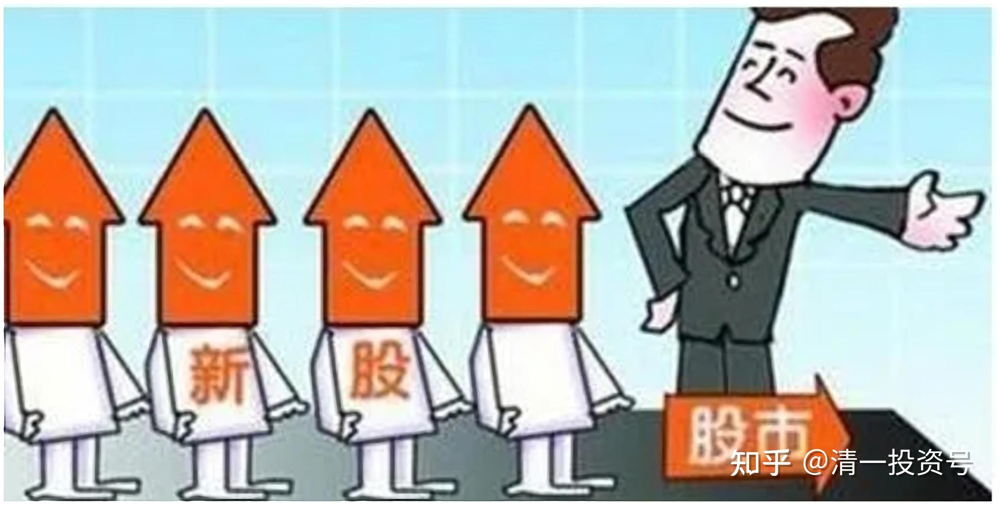
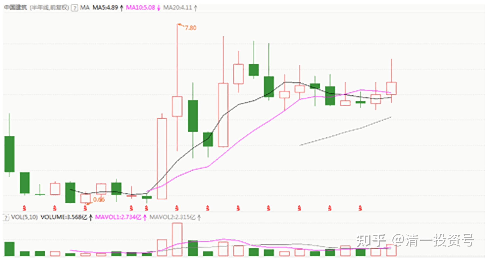
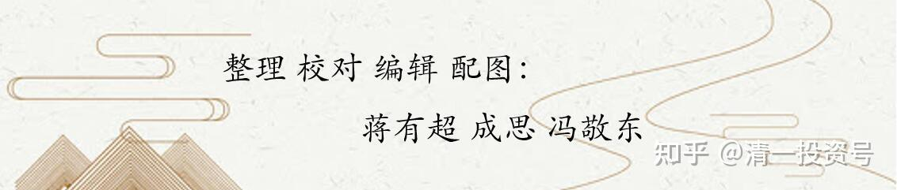

40篇.打新违背我的投资原则

清一山长 2017年4月25日～2020年7月29日

**一、投资回忆和记录**

[清一山长](http://link.zhihu.com/?target=https%3A//xueqiu.com/9310099567) 2017-04-25 13:37:34

投资回忆和记录：我的股市之路，起点是多少？

提供一点信息：当年（1993年）炒股的人，全都是屌丝。说起来入市的资金都很可怜，都是只拿得出一点点小钱，比现在的年轻人差很多的。起码都是上万元吧？

比如我当年入市，是花两千元买了一千张【武凤凰A】（000520）的中签表入市的，中了两签。当时周围的武汉大学的同事们，大约买五张的最多（正好10元）。我当时拿了两千元去，一下子买了1000张，很厚的一大叠。似乎我是同事中唯一买这么多的人，现场没见有别人这样买中签表的。当时周围很多人排队买中签表，惊呼“土豪出手”，可能觉得我赌性很重，大赌客一个。其实我算清楚了：当时的中签率，只有0.2%～0.3%左右。如果只买几张，就等于赌博。我买1000张，就是“确定性投资”，至少可以中两个签。是概率上确定会赢的投资行为，而且确定一定赚钱的（中国打新不败，一直维持到今天）。

当时记得中了两张，每签可以买1000股，每股配售价格是6元。上市后，就涨到12元左右，我就卖掉了，赚到了一笔钱。这个股上市的时间，是1993年10月25日，这就是我正式入市的时点。我上市后抛掉这些股，开始了一直持续到今天的，不断地卖卖买买的股海生涯。

记得当初我投入的总资金，就是一万元出头的样子，当年的一万元也不错了。不过，这些钱，还不是我自己真正的本金。我记得是高利息（30%的年率）借了同事的钱来买的股票（我一入市，就违背巴菲特的核心教导，俺当时真不知道此人是何路神仙的）。所以，我实际投入自己的钱，只有几千元（两千元买中签表，肯定是我自己的本金）。不过由于不好算，我就算成一万左右本金投入了。如果我算我最初的投入，真的就是两千元，外加办证的费用，大约是十几元？现在都免费了。跟今天的资产净值相比，就更惊人了。我就马马虎虎的算一万元好了，这样好算账，好比较。按这个比例，的确超越了巴菲特24年的投资业绩，不管是前期还是后期。甚至选出他最好的24年来比都这样。我只是希望今后能够维持60年不败。**金融市场上，你只要活得足够长，你就能够击败很多看上去很牛的对手。**

所以，我现在很胆小，不求进取，只想“活着就好”！[大笑]

看我买的股票，都是“虽然跌不下去，但也涨不上来”的股票。有进取心的人，千万别学我。

@pathfinder789回复[清一山长](http://link.zhihu.com/?target=https%3A//xueqiu.com/9310099567):

1993年，武凤凰和武汉长印两支股票在武汉同时发行，联合抽签。中签率是0.196%，也就是千分之一点九六。我当时也买了1000张，在同事中是属于买得最多的，由于中签号码不是均匀分布（后来报纸上还有专门讨论），我只中了一张签，我有同事买300张中了2签，因为中签号分布设计不合理，印象很深，所以记得。虽然只中了一签，股票上市后仍然盈利大概2000元，如果中2签，应该可以盈利5000元。

当时入市后，直到1997年，感觉股市类似赌场，从第一次中签率看，我又没有赌运，参与其中会影响主业，因此在不盈不亏的情况下退出了股市。

2008下半年受同事的影响，又重新开户进入股市，小有收获，成绩不值一提。投资能力与楼主有很大差距。

看到楼主提到武凤凰，有感而发。

[清一山长](http://link.zhihu.com/?target=https%3A//xueqiu.com/9310099567) 2017-04-25 21:17回复@pathfinder789:

您错过了最近20多年中国资本市场带来的暴富机会[不赞]。您也错过了破产的机会[很赞]。

我觉得很可惜：当年，您随便买一只肯定可靠的大公司的股票，不一定是万科，今天都赚死了。比如如果买了深圳的001深发展，不死不活的一恶搞股，今天复权看看多少钱了？国电电力，复权看看多少钱了？就算是死拿武凤凰到今天，也不会吃亏的。企业亏本，重组成功。您照样可以赚钱，虽然这样很傻！

我的运气很好，有可能当年武凤凰的中签小股东中，我是最幸运的一个，甚至可能是最赚钱的一个。**我的运气来自于不相信运气，只相信耐心，以及得到收获后就“过冬睡觉去”，不再“勤奋”播种。**我的主要资金，2008年以后，大量现金在账上躺了三年都没动。2010年买低价的民生，2012年一季度卖掉。2013年～2014年大举入市，上融资，大量买入一系列的大蓝筹。一般人，恐怕没这耐心，所以，也失去了这份收获的机会。

**二、正式入市后，我就从不打新了**

[@Hugo海](http://link.zhihu.com/?target=http%3A//xueqiu.com/n/Hugo%25E6%25B5%25B7)回复[清一山长](http://link.zhihu.com/?target=https%3A//xueqiu.com/9310099567):

卖了平安银行后还有什么其他有价值的深市打新表的？

[清一山长](http://link.zhihu.com/?target=https%3A//xueqiu.com/9310099567) 2017-11-23 17:35回复[@Hugo海](http://link.zhihu.com/?target=http%3A//xueqiu.com/n/Hugo%25E6%25B5%25B7):

我对打新没兴趣[滴汗]。目前**我还不想破坏我的投资原则——去买自己都不知道是啥的东西，而且价格还贵得离谱。**虽然号称是“确定性的打新稳定利润”。另外，我对要随时花心思了解新股上市的节奏，努力去赚15%一年的“确定性收益”也根本看不上。我愿意睡觉、玩，不费力去赚5%的收益，不小心还赚了50%以上就好。比如平安银行就是典型的案例。

这种对打新的态度，仅仅是个人的投资怪癖，不适合大家参考！只是公布一下，表示我有这个怪癖罢了。

[清一山长](http://link.zhihu.com/?target=https%3A//xueqiu.com/9310099567) 2018-11-21 19:48:52

$张家港行(SZ002839)$ 看看这家一年前上市的银行股，一家很不起眼，也看不出什么特色的银行股，上市居然冲到30元，现在跌倒6元。最低跌到4元多。市盈率还十几倍，一路上套死了多少人。

**我不打新，就是不玩这种游戏。玩久了，心态都会变掉，投资逻辑都会丢掉，就只剩下瞎买瞎卖的本事了。赚钱就全凭运气了。**

[@二马由之](http://link.zhihu.com/?target=http%3A//xueqiu.com/n/%25E4%25BA%258C%25E9%25A9%25AC%25E7%2594%25B1%25E4%25B9%258B)回复[@宁恩贵](http://link.zhihu.com/?target=http%3A//xueqiu.com/n/%25E5%25AE%2581%25E6%2581%25A9%25E8%25B4%25B5):

打新是对持仓的馈赠，没搞清楚为什么不打新！

[清一山长](http://link.zhihu.com/?target=https%3A//xueqiu.com/9310099567) 2018-11-22 10:07回复[@二马由之](http://link.zhihu.com/?target=http%3A//xueqiu.com/n/%25E4%25BA%258C%25E9%25A9%25AC%25E7%2594%25B1%25E4%25B9%258B):

没错，**打新有“确定性收益”，但是会破坏掉自己的投资思维逻辑。**为了保护自己的“知识产权”，我必须放弃这笔收益。宁肯用闲置的钱去买货币基金都行。谁都别想用一点小钱就买我“**变节**”[大笑]。

[@大唐中兴](http://link.zhihu.com/?target=http%3A//xueqiu.com/n/%25E5%25A4%25A7%25E5%2594%2590%25E4%25B8%25AD%25E5%2585%25B4)回复[清一山长](http://link.zhihu.com/?target=https%3A//xueqiu.com/9310099567):

有钱人，拿一万手做T，羡慕[赚大了] [赚大了]！

[清一山长](http://link.zhihu.com/?target=https%3A//xueqiu.com/9310099567) 2020-05-11 11:46 回复[@大唐中兴](http://link.zhihu.com/?target=http%3A//xueqiu.com/n/%25E5%25A4%25A7%25E5%2594%2590%25E4%25B8%25AD%25E5%2585%25B4):

1993年，拿2000元一次就买了一千张认购证(排队买的时候，就我买了一千张，周围的人10张、20张的买，我被视为土豪[滴汗]，现场惊动。**其实我只是计算了赔率，知道买一千张不会赔，买少了都是赌博的**）。中签后再多花了1万多一点买入正股，上市后赚了6000多元卖掉。就这样进入中国股市的,最终就得到现在的结果。您只要跟随中国股市做个20多年后，也可以拿一万手来做T玩了。说明，中国是一个伟大的国家，只要有耐心，踏实肯干，在正确的道路上坚持走下来了10年、20年、30年，就会出现奇迹[笑]。

中建是极少数可以一单就成交100万股的股票，难得的流动性良好！（四大行也可以这样T，但确定性不如中建）。这样做T的好处是——每天只要T出来2分钱的差价，你就净赚一万多元。我知道香港不少大户，就专门赚这两分钱，上下都挂单，买卖同时。这样每天都有进账，够香港一天的开销了。

（不过我不擅长赚这两分钱，一般会等出现10%涨幅才会T）

清一山长 2020-05-11 12:05

（相当于现在打新，现在不要钱，那时一张表要两元，没中就算扔了）。懂得去买1000张，而不是10张、20张。后者赚了就大赚（我当初买中签表成本大大降低）,亏了也亏得不多。**我是老老实实的算了中签率，买了一千张连号的，保证是可以中签的**（记得实际的中签率是千分之1.96%，我中了两张签，可以买一千股IPO）。**说明我当年就不是赌徒，今天更不是了。都要算账算好了才买股票的。**

[@声学小卡](http://link.zhihu.com/?target=http%3A//xueqiu.com/n/%25E5%25A3%25B0%25E5%25AD%25A6%25E5%25B0%258F%25E5%258D%25A1)回复[清一山长](http://link.zhihu.com/?target=https%3A//xueqiu.com/9310099567):

认真你就输了，为什么打新不能按照户头一户一个号而是按照市值，穷人只能看着富人吃肉，感觉打新就是市场发钱，参与中签的都是富人。

[清一山长](http://link.zhihu.com/?target=https%3A//xueqiu.com/9310099567) 2020-07-09 0:35回复[@声学小卡](http://link.zhihu.com/?target=http%3A//xueqiu.com/n/%25E5%25A3%25B0%25E5%25AD%25A6%25E5%25B0%258F%25E5%258D%25A1):

您的思维，就是**典型的穷人思维模式**[滴汗]，比如您居然**相信这种“穷人只能看着富人吃肉”、“我就是没机会”的信念**。而**富人的思维模式是：世界提供了很多机会，我可以去找到我需要的任何机会**。我原来就是穷人，中国现在年龄大一点的富人，全都是从穷人时代走过来的。但我一直相信后面的一种信念，而不是您拥有的“我就是没有机会”这种穷人思维。所以，今天我已经不同于99%以上的人。2014～2015年，我的收益，比上面的帖子中调查公布的富人平均收益率要高得多，十倍都不止。这就是**上天会给拥有正确信念的人更多的赏钱。**（富人2014～2015年赚钱31%是被平均了，是很多富人也在2015年爆了仓，只是整体这个层次的收益还行，因为富人相对没有穷人贪婪）。

好了，给您一个不打新的案例：我是1993年打新入市的，起点2000元，中签武凤凰入市。虽然如此，后来**正式入市后，我就从不打新了。但因为我市值高，我的券商客户经理，知道我怕麻烦，所以告诉我，公司有业务，会帮忙我这种客户打新的。被我谢绝了他们的好意。**

**因为：打新违背了我的投资原则。我认为，打新，培养的是无脑投机思维模式。其实很多高净值客户不打新，不只是我一个人。**

[@归隐林地](http://link.zhihu.com/?target=http%3A//xueqiu.com/n/%25E5%25BD%2592%25E9%259A%2590%25E6%259E%2597%25E5%259C%25B0)回复[@归隐林地](http://link.zhihu.com/?target=http%3A//xueqiu.com/n/%25E5%25BD%2592%25E9%259A%2590%25E6%259E%2597%25E5%259C%25B0)：

不过股市是最体现世界多样性的，@清一山长 山长不打新没错，炒家接盘开板新股也应该没错，他们都赚到了适合自己的钱。至于亏钱的，那也是凭本事亏掉的。

[清一山长](http://link.zhihu.com/?target=https%3A//xueqiu.com/9310099567) 2020-07-10 10:27回复[@归隐林地](http://link.zhihu.com/?target=http%3A//xueqiu.com/n/%25E5%25BD%2592%25E9%259A%2590%25E6%259E%2597%25E5%259C%25B0):

**打新是博弈，而且是主导权操在别人手里的博弈。买股票是投资。两者思维模式不一样。**

有人专心打新，就是坚决不买二级市场的股。这也是一个投资逻辑。他只相信博弈，不相信投资。他就是对的，因为他拥有一套完整的投机博弈模型。只要一旦失去机会，会马上放弃的。

小散户认为打新是“包赚不赔”的生意，就是无脑了。看看香港的打新结果？多数上市就跌破面值。

[@晕娜](http://link.zhihu.com/?target=http%3A//xueqiu.com/n/%25E6%2599%2595%25E5%25A8%259C)回复[@巅东北](http://link.zhihu.com/?target=http%3A//xueqiu.com/n/%25E5%25B7%2585%25E4%25B8%259C%25E5%258C%2597):

给你做重要补充：2009年7月29日，收盘价6.53元。PE是51.29倍。

只知其一，不知其二，不严谨。

*(中国建筑 2009～2022年K线)*

**中建**：上市11年（2009-07-29～2020-07-29）

**营收**：2604～14198亿元。（增长：5.45倍）

**净利润**：57.3～418.8亿元。（增长：7.31倍）

**分红**：8.7～77.63亿元。（增长：8.92倍）累计分红金额为514.44亿元

**员工**：11.1587～33.5038万人。（增长：3.00倍）

**市净率**：0.81

[$中国建筑(SH601668)$](http://link.zhihu.com/?target=http%3A//xueqiu.com/S/SH601668)

清一山长2020-07-29 21:47回复[@晕娜](http://link.zhihu.com/?target=http%3A//xueqiu.com/n/%25E6%2599%2595%25E5%25A8%259C)：

这个补充说明非常好。非常充分地说明了我坚持“不打新股”的原则。因为我认为：**打新，就是培养韭菜，建立“新股必赚”的信念系统。这个严重违反股市投资原则。**

我更愿意在二级市场上，等待跌到合理的位置，买入打新的韭菜们受不了煎熬，下跌割肉的时候再进入。比如三年后中建跌倒了2元多，我在3元多一点买入，不觉得贵。

**5倍PE的中建不要，去抢51倍PE的中建，以及现在的准中建们。我实在想不出什么人，才会这么聪明。他们的智力，我大致上算得出来。但他们的疯狂，我实在弄不清。**

参考链接：

[清一投资号：21篇.【股灾来了怎么办】系列之一](https://zhuanlan.zhihu.com/p/481788728)（整理文）

[清一投资号：22篇.【股灾来了怎么办】系列之二](https://zhuanlan.zhihu.com/p/482419070)（整理文）

[清一投资号：23篇.【股灾来了怎么办】系列之三](https://zhuanlan.zhihu.com/p/483024400)（整理文）

[清一投资号：24篇.【股灾来了怎么办】系列之四](https://zhuanlan.zhihu.com/p/484791228)（整理文）

[清一投资号：25篇.【股灾来了怎么办】系列之五](https://zhuanlan.zhihu.com/p/487164089)（整理文）

