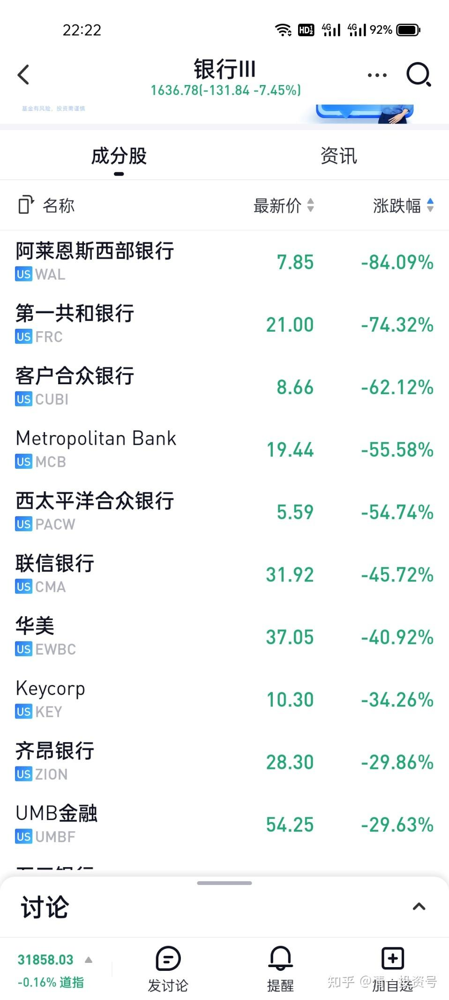
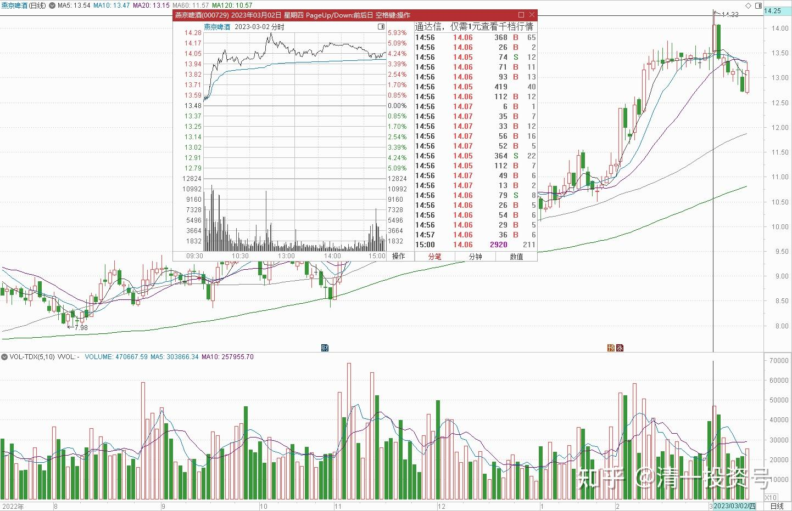
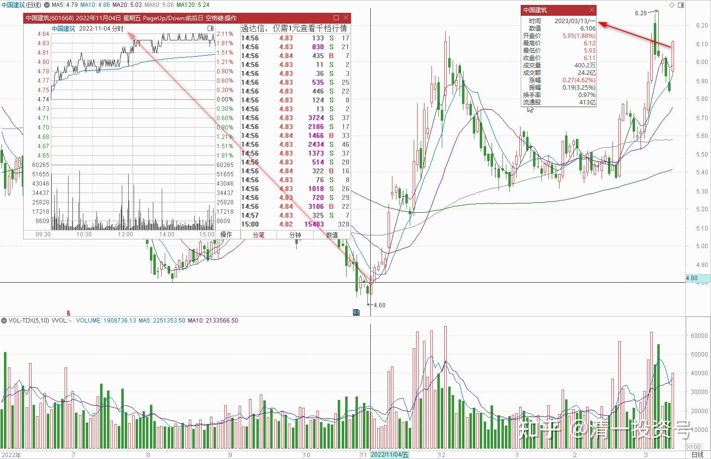

43篇.减仓不是好主意，但还融资天经地义

清一山长 2023年3月14日

***化广水 2023/3/13 22:23:56
美股部分银行股，开盘就倾家荡产了，真是恐怖！

山长 清一 2023/3/13 22:33:22
银行这样跌，会引发重大危机的。上一次金融危机的引爆点是雷曼投行的破产。这一次就是硅谷银行吧？一万多亿资产破产清算！引起全球的金融行业剧烈震动，很快会波及全球的，金融风暴就要来了。**这就是我国一直强调的：系统性金融危机！硅谷银行只是一个引爆点罢了！**

山长 清一 2023/3/13 22:33:30

今天6.11元卖掉了100万股中国建筑。减掉一些融资心理踏实些！尽管看趋势还要涨。理论上：**美股危机，会逼资金向安全的地方转移。**目前来看。中国建筑这类收益可靠的大蓝筹，是海外资金避险的最佳选择。我认为期待已久的中国大蓝筹春天快来了！目前减仓不是好主意，是馊主意。但**还融资天经地义**，**这个价格融资买入不符合我的要求**！

***闲成都 2023/3/13 22:53:17

山长每次的减仓操作，都是风向标，上次的燕京14.33元那天减仓，第二天就大跌[赞]

谢谢山长的及时提醒，没有融资，为了不操心风暴问题，也考虑明天陆续减仓一些，有得赚已经很不错了[抱拳]

山长 清一 2023/3/13 23:11:50

我减了是运气，不是智慧。不然多减一点，低位买回多好。当天最高只卖到14.25元的价格，没有卖到14.33元！[流泪]

山长 清一 2023/3/13 23:20:42

今天查看中国建筑的融资记录，是一单子就买入100万股的一些单子。买入价格4.79元。这样算起来一笔融资就赚了一百多万。算是几乎不要成本的空手白捡的钱。这种钱会有瘾的。所以要防止上瘾，见好就收了。燕京的融资早就还光了。持仓千万都是自己的本金。目前价位用融资持有就是不要命的做法。虽然可能涨。但万一跌了呢**？投资宁可少赚，不赚，也不要赔钱！起码尽量减少赔钱的机会！**

