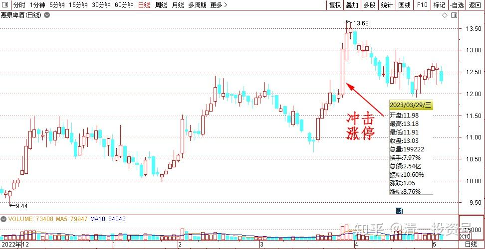
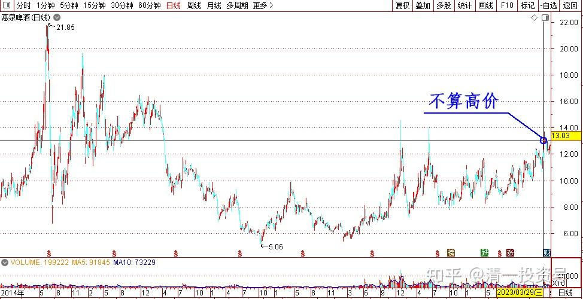
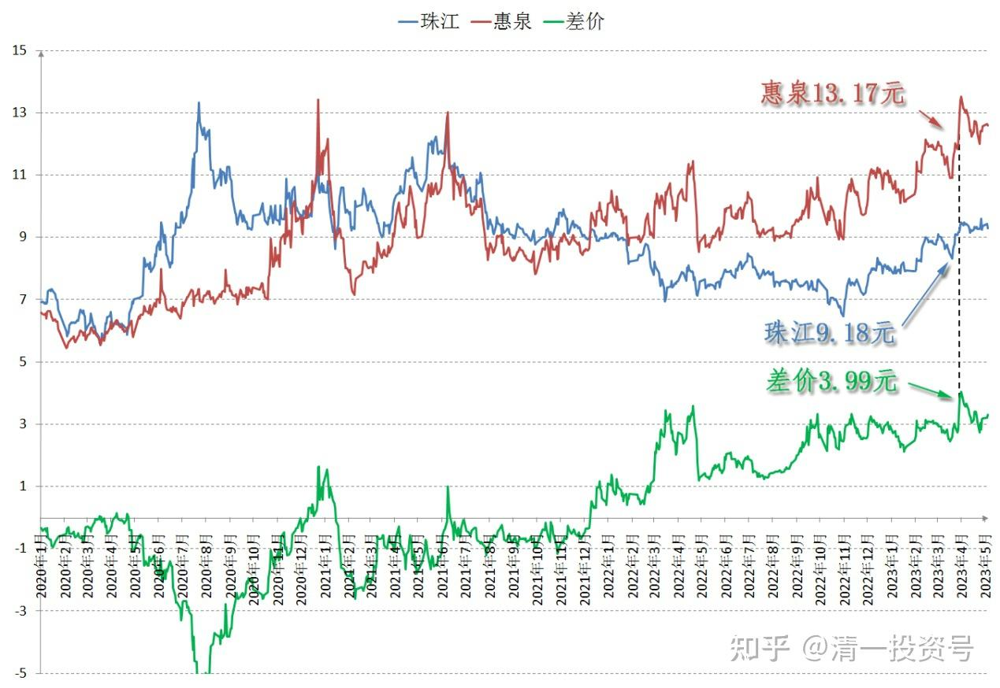
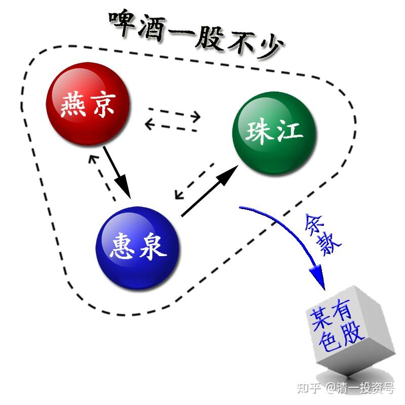

45篇.惠泉冲击涨停的应对之策

清一山长 2023年3月29日

惠泉今日冲击涨停：啤酒股开始活跃

今天睡完午睡起来，居然发现惠泉正在冲击涨停，挺意外的。我想：马上就到三月底了。主力肯定知道我一向有涨停出货的习惯，难道主力非要在一季度末，把我的两个十大都用涨停手段来清退吗？我认为：虽然13元多的惠泉也不算啥高价，前次高都不算呢。但**如果今天冲涨停，我肯定要走掉**，不当十大了。我才不期待它连续来两个涨停呢！虽然原来的确有过这种记录，但我也只吃到了第一个涨停。后来的涨幅都送人了（当然后来的后来，又全都跌回来了）。我对于“出来秀肌肉”的股票，都不留恋。喜欢走了去找个无人搭理的乞丐股。

我看当时的买卖榜单上，买单有7万多股13.17元的买单。涨停价13.18上挂有50多万股的压盘。按道理，主力一口吃掉这几十万股是毫不费劲的，但主力居然迟迟不动。就是不肯吃。成交单也只有几千股，一万股的回报，没有大单的买卖。这是啥意思呀？

管他的，我看珠江今天几乎没有咋涨，就考虑用惠泉换一点珠江，锁定今天上涨的收益。于是，就开单挂出了10万股惠泉，以13.17元卖出，没多久就吃完了这十万股。后来就上下拉锯，我又再次分两单，挂出了三万股13.17元，因为我不想大量挂出来卖单，干扰主力的心情。这些股虽然卖完了。但惠泉也不再维持股价，居然就慢慢地往下走了。我再想多卖一点，也卖不掉了。

我也不管，**惠泉不涨停，就是涨不停的意思**。好彩头，说明未来看好，我今天就不用操心卖股的事情了。于是就转手，分几次买入了13万股珠江啤酒，价格最低是9.18元，最高是9.19元成交。

我卖掉的这批惠泉，原来就是9元多成本我买进来的（准确地说，是用涨高的燕京换进来的）。现在再继续用相同的价格，买入珠江啤酒，我认为不算亏本生意。反正**我今天卖了惠泉，账上的啤酒依然一股不少**，将来珠江跌破9元我也不卖。这样以免踏空**未来肯定要到来的，等待了好几年的“中国啤酒行情”**。至于多出来的利润，接近每股4元，买完珠江后总共还有50多万的余款，我就拿来买了十几万股某有色股，计划长期持有。**因为现在全世界都在放水，都在印票子。我认为把票子拿在手里特别的不靠谱。不如拿来买成一些实物，买成矿物等等，这种生意不会亏**。钱以后真的会不值钱的，现在地产也凉凉了，资金池已经满溢。将来大量的资金往何处去？不可能用来买粮食的。连银行的钱，现在都多到贷不出去了。因此未来资产荒，是必然到来的---钱到处找可以保值增值的地方。**我这样换实物股、资源股，我认为将来肯定是包赚不赔的，越换股票越多**。至于账上赚的钱多不多，我倒是不在乎！实际上的账户表现倒是比较良好，总在“节节高”，只要路是对的，总会慢慢的爬上山。除非选错了路，就只能滚下山了。追赛道股、热门股，我认为就是悬崖上玩蹦极，没收拾好降落伞，当心直接爆仓玩完。

特别强调说明：今日惠泉冲涨停，最终低调收市，无非是上周珠江跳涨走势的复制罢了，说明惠泉的主力，现在也吃饱饭了。但主力并不想多要货，只想拉高价格，脱离成本区。因此现在是吞吞吐吐的走法——主力现价不要钱（不出货），也不要货（不买股）。只是持仓拉升，尽量吸引更多的跟风盘进来。涨价是为了提升本股的吸引力。目前虽然是喂食阶段，养股阶段，风险还不是太大。但利益与风险已经谈不上平衡了。风险大于利益。所以**主力和我，都是不要股的（不新买股，如买入珠江，并不是纯买入，只是跨品种做T补仓的，并不多买一股）**。但惠泉目前这个价格，目前这种热度，想要出货也出不掉，我的一点小货在手上都出不掉，何况主力大仓？所以——真要出货，还要看后续的热点制造。未来，惠泉一定会有涨停的。所以我还可以耐心继续等等！

