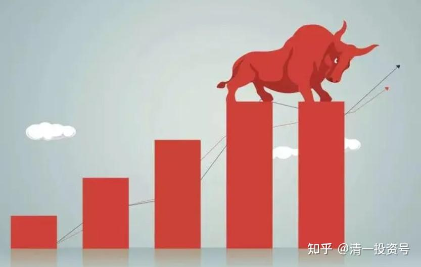

4篇.上一个牛市的思路及具体操作系列之一：不可思议的市场机会与大资金入场布局

清一山长2013年10月12日～2014年2月6日

清一山长2013-10-12 11:59:06

**1、2013年我们面临什么样的财富和投资的机会？**

我认为：中国人现在拥有一个不可思议的绝佳赚钱机会——甚至会出现引领全世界财富潮流的机会。一旦把握好，中国人就真的“站起来了”。

**2005年底的时候，我告诉周围的人：我发现了一个可能是我一生中再也见不到的轻松赚钱的机会。因此我“心动且行动”了——我不仅投入了我企业的全部剩余经营资金，还高利息借了数百万元投入股市，且被暂时“套牢”（轻度，账面浮亏从未超过10%）。**这种疯狂的行为，让我付出了“惨重的代价”，周围的人都认为我疯了，会把做生意十几年的积累全部赔光。甚至我原来的家庭解体与这件事情都有很大的关系。

不过，**最后的事实证明我对了——那时候，正是中国股市的千点大底。我一路持有下来，享受了中国资本市场上最丰盛的一次大餐。**其中一个账户开设不到一年，峰值的时候资产居然增值了20倍。我一年证劵投资的收益，比我辛辛苦苦做企业十年的利润总和还高很多。

我曾经以为：这样轻松赚钱，简直就是“送钱”的机会，我恐怕一生都遇不到了。**没想到还有——就是现在。不仅仅机会更好，甚至更多、更大。对于我个人来说，如果把握好这次机会，总的收益会比我上一个轻松赚钱点（2006-2007年度）要高五至十倍。**

**2、一些颇有眼力的资金，正在低位进入接盘**

清一山长2014-02-06 11:03:09

最近几个月，我为了让资金找到最合适的投资渠道，研究了中国的市场，发现了很多不可思议的事情，都不敢相信这真的会发生在身边。**2005年股市1000点的时候，我不仅把自己所有能动用的资金投入股市，而且还借了一大笔钱入市，买入低估的汽车、煤炭和钢铁股。我当时告诉朋友们：这可能是我这一生中都不再能够遇到的机会了。**然而，却没有人相信我，周围朋友们觉得我买进这些被市场抛弃的股票是疯了。**而我却认为，这些仅仅靠分红都比资金存银行利率还高的股票价格，怎么可能会有风险？**果然，这些投资为我在后面的一两年，赚到了接近十倍的收益。

没想到，这些我认为不再可能会有的好事，居然今天又再现了：**沪深股市居然有比2005年更好、更安全的机会——在中国，你需要理解很多超越常识的“不正常”是正常的。你真的需要有超凡的想象力和理解力。**

比如：你来做下面的算数题，看看哪一种才是“正常的”思维：

假如你有一万元，请问如何才能获取更合理的回报？

方案一：买一种票据，该票据为国家保证级别，只要国家不倒闭，就最终是无风险的，可以兑现的。持有该票据的人，一年可以分1000元现金给你，另外还有一千元分红作为账目记在你的账上。也就是说：一年后你可以分到1000元的现金，另外你的资产投资记录为现金11000元。这是你在最差的预期下能够获得的好处（收益是每年10%的现金和10%的权益）。额外的好处是：两三年内，应该有很大的概率，某一天别人会拿两万甚至三万元买你的票据。如果愿意，你可以卖出，获益高达300%。（该公司出售一种你每天都需要的产品，每天重复购买，比巴菲特的可口可乐销量更可靠和更受欢迎）。

方案二：买一种票据，也是国家保障型的，除非国家完蛋了，否则你的钱不会消失。不过现金购入后的分红收益比较少，只有7%。另外的15%非现金收入帮你存在银行里面。也就是说：您投资的一万元，每年可以得到700元的现金分红，另外还有1500元的账帮你存在银行，你的总资产一年后就变成了12500元。还有机会获得额外的收益：概率上两三年内，应该会有一次让你以两万元或者三万元收回本金的可能。但没有人为您保证这一点的实现日期，您只能等待“市场先生”发意外的红包。

方案三：你可以获得6%的年化收益率，而且不保证你的今后长期收益。一年后你可以拥有10600元，但是其他收益或增值可能性统统没有。

如果你是正常人，你会选哪一种？

**我认为选第三种的人一定是傻瓜。这种人应该不会存在的，特别是在我们这个特别爱钱的国家，大家算账都很精明的。**

**你认为还会有比这种人更傻的人吗？当然有。就是把自己本来已经持有的第一和第二类资产，低价赔本卖掉，然后去买第三种资产的人。**

**不幸的是：这种人还很多——成千上万的。**我实在弄不懂：中国人脑子要有多笨，才会干出这种笨事情？

不过，说老实话：如果不是有大量这种笨人存在，也就不可能出现上面第一或第二类的机会。这种不可思议的市场机会，就是由这些不可思议的傻子提供的。恐怕只能出现在中国。

不知道各位知不知道我在说什么？因为，过年前，我一直在持续买入第一和第二类资产，我很奇怪：怎有人这么怪，会把这些很值钱的资产如此低价卖给我？

春节的时候，我与一个大型基金公司的老总交流，我问：“你们发行的这么多基金，是不是年底遭遇了很多赎回？基金份额缩水不少吧？”老总回答：“今年股票基金遭遇的赎回压力的确很大，不过货币基金增加了不少。”

货币基金是什么？就是大家刚刚熟悉的什么宝，比如“余额宝”等等。

“宝”唯一的好处就是：每天都在“增长”，而且每天都在报告你账上增加的钱，即使只有几角钱。

虽然目前看来，投资货币基金还是很“稳定且不错的收益”的（虽然在我看来连通胀都跑不过的6%收益，根本就谈不上好处），但基民们千万不要认为这就是与银行存款一样的“可靠”，实际上它从来就没有保证过一年的稳定收益，只是“目前的年化收益率”，与“定期一年利率”不是一回事的。它可能每天都在变，既然可能变高，也可能变低，甚至消失掉。长期来看，货币基金并不比股票更稳定。更何况投资货币基金基本上算不上一种“投资”，你根本就无法分享企业成长和经济上升所带来的好处。

第一、二类资产的缺陷就是：**你看不到你账户金额的增加，只看到账户每天不停地上下波动。另外，虽然你很可能未来某一天会获得额外的大笔收益，但是你可能需要耐心等待一两年时间才能遇到机会，而且没有任何人会保证你一定有这笔收益。因此你很担心会没有这种机会。不过，考虑到能够保证的每年分红，远远比“宝”们要高，你没有什么好担心的。**只是因为每年才分一次红，也不会天天把这些分红的365分之一给你看，可能让心急的人无法忍耐。

我总算理解了为什么一些质地很好的大盘蓝筹股会跌破最起码的支撑位了（比如跌破6～8%的“息率支撑位”），总算理解为什么这么低的价格，还有人在不停地“卖出”的原因了：就是过去的一年，特别是下半年，中国很多人，把原来投资在股票基金上的钱抽回，去买“收益更稳定”的各种各样“宝”们了。因为这是“今年的市场热门”，虽然收益仅仅6%左右。考虑到仅仅余额宝就超过了2500亿，加上基金公司发行的“货币基金”，以及银行的理财产品等等，总额肯定上万亿元，其中有不少来自于股市的存量资金。因此股市的资金自然越抽越少了，自然不可思议的廉价货，就不断地出现在市场上了。

**当然，我也看到了一些颇有眼力的资金，正在低位进入接盘……包括外资。**

您认为这种市场正常吗？

