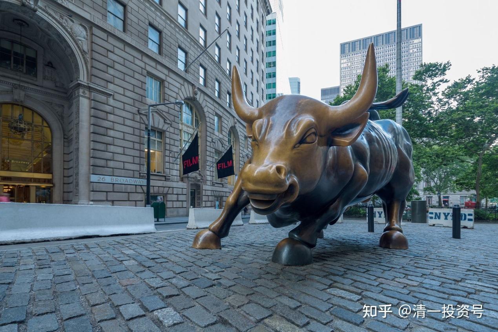

53篇.今日网校课程：华尔街金融专员赚钱之道（3）中美的投资环境有什么差异？

清一山长 2016年9月6日

张钟瑞的回答基本上是对的，第一他采取的思维模式非常正确，依据2014年是多少点？2000点，2015年达到了5000多点，所以涨幅大幅超过美国。现在又跌到3000点左右。

中国股市，我曾经告诉过大家，23年来我的投资业绩远远超过巴菲特，原因并不是我比巴菲特更聪明，而是中国股市像个疯子，大起大伏。美国股市是很平稳的上升的那种感觉，我们是大起大落、大起大落、大起大落。

我们在10年前就达到了6000点，现在还只有3000点。所以6000点不跑的人，到现在倒大霉，除非你选择了好公司。

6000点我选择了好公司，我选了中集集团和万科的B股，那时候我觉得A股太高了，我就把钱转到B股里面去了，然后这些都赚到了钱，逃过了一个大劫。

**在中国你随时要有着很清醒的头脑，不随大流，因为中国的傻瓜特别的多，所以在中国赚钱特别容易；而且未来马上要开始一个收拾傻瓜、骗傻瓜的游戏。现在是骗子在启动、现在是骗子在忽悠人，骗子已经潜伏进去了，但是未来要把傻瓜们都拉进去。**

现在骗子骗大家买房产，我知道骗子在骗大家买房产，所以我买了房地产公司，但是房地产公司会在最近两年之内全部出光。因为中国的房产泡沫很大，以后是靠不住的。但是中国人都傻乎乎的、都受了骗、都在拼命买房子，房地产的成交均价也很高，像恒大这个月——8月份它的营业额跟去年同期相比增长了92%，是不是很吓人的数字？几乎翻番。

它一个月的成交额就等于其他家公司成交额的总和。就是它卖了那么多的房子，卖了190多亿的房子出去，这家公司吓不吓人？那就证明这些中国人还在拼命地买房子，是不是？

**中国人买这些房的钱最终要沉淀。国家在做这件事情，就是要把中国人的钱、要把你们父母手上的钱，变成钢筋、水泥固定在这，没法用。现在二手房的成交手续越来越复杂了，交易越来越困难，但是你们的钱存在那，资金被锁定，免得这笔钱拿来出去害人。**

所以现在你们父母账户上会有一笔非常漂亮的资产——房地产资产，但是未来肯定不值钱，未来什么时候我不知道。但是现在因为中国股市不好、中国缺乏投资渠道，这些人拿着钱存银行也觉得不是路，他们就拼命买房子，这就是中国的一个奇怪现象。

当然，我也在买房子，我这两天去昆明又买了一套房子。有点傻是吧？**（学生1），要不要说，我有点傻？我在说这些傻瓜在买房子，但是我也当了傻瓜，我也去买了房子。

好了，现在告诉大家，我买的这个房子就在我们未来要搬去的地方。挺好的！非常好！我买的是1楼，还有花园呢！

房主是2009年买的房子，请注意，2009年是股市最低迷的时候。如果是像我一样的投资，我2012年的投资到现在增长了10倍，2009年到现在也是10倍，2009年到2012年没赚什么钱。那我的资产增长了10倍，是不是？

这个房主的原始单据、原始发票这些全都给我了，2009年他买的这个房子，他花的价钱是142万，你们要不要问我现在多少钱把它买过来的？160多万。当然我最终拿到房产的时候还要给国家交十几万的款，但是这个房主他当初买的时候是142万，他现在收回去的是162万。

张老师：**（学生2），7年，你算得出来吗？他现在是赚还是亏？

学生2：亏。

张老师：为什么亏呢？

学生2：这么多年的收益不到……

张老师：按5%算吧！银行最保险的理财基金最后是多少呢？

学生2：……

张老师：也就是说这笔钱，如果他不买房子，他存在银行里面他都可以得到一个比较好的收益，对吧？

学生2：对。

但是到现在他居然只赚了20万，他觉得还是赚了20万，还是不错的。他也无奈，因为这个房子他买了，他本来就没打算住，所以他买下来到现在是亏了。

好了，实际上告诉大家现在的结果是什么呢？现在的结果是用我买这套房子的钱，重新把它建出来，我都建不出来了。重新再把它建出来，我的钱都不够了。因为现在过了7年，人工、材料、地价，各方面都在涨，所以我重新去建都无法建出这套房子了。

这房子面积是300多平方，不是小房子，是很大的房子，但是他卖得特别便宜。正常情况下，他应该要卖200万的，这个房东自己就拼命地想把它甩、甩、甩出来，就甩了一个低价。

我们看他标的价就是160多万，并不是我们压下来的。我们说“再便宜两万？”，他说“好好好，再便宜两万。”本来也不高，但就是亏死了，因为他觉得没有用，对他的确没有用。

因为那个地方是在郊区，离市区比较远，生活不方便。但是我们又不需要成天逛超市、逛城市，我们也不在城里面工作，那个地方就是我们生活和工作的地方，拿过来未来会是我们的教室，会是我们的生活社区。

所以对我们来说，我们是买来用的，不是买来投资的。投资那个地方很难卖出去，但我们的目标不是为了卖，目标是拿来使用的。而且卖价那么便宜，我们干嘛不拿来使用。这就是我们投资的目的不一样。而且我算的账是，我现在买它，相当于160多万元买了这套房子。160多万买一个300多平方的房子，划不划算？

**因为我算的是2009年的钱，我的钱不是相当于2009年的160多万吗？对不对？**

**那简直超级便宜，因为我们的钱已经增值了——增值了很多。但现在我们学堂其实也不该买房子的，说老实话，现在的钱应该拿来买股票，但是咱们现在需要给自己投资一个基地——游学基地。**所以我们总共买了1千多万的房子，但是我买了之后，这笔钱是拿来做事情的，要做我们学堂的，所以它是有价值的。

现在怎么投资？现在告诉大家了，这就是中国。中国的人是疯的——不算账的。当初我在武汉的房子大概是2004年、2005年买的，我差不多赚了10倍。但是我买我就跟这个人不一样哦！我买了，不是买来住的。这个人刚开始觉得环境很好，但是又觉得生活不方便。我就买生活方便的，结果那些房子后来很抢手，为什么抢手？周围人全都想要，都觉得这些房子很实惠，价格涨了很多，他们还很开心，然后我很快就把它们卖掉了。

如果是在郊区，买了一个所谓的别墅，就很难卖。我是买一栋楼的，从1楼起，一个单元全部买下来了。但是周围是个社区，而且是个很繁荣的社区，所以它就很好卖。

因此你的眼光不一样，就决定了你的房子好不好卖。所以不要看我买房子，我赚了钱。为什么这个人2009年买的房子，他不赚钱？因为他不是这个概念。

2009年我在这边也买了房子，你们住的房子，还有包括我们的房子，差不多就是2009年买的。但是现在都增值了，这个房子我大概是120万买的，现在的价格应该是200万左右。

所以**增不增值取决于什么？不取决于房子，取决于它未来的需求的地位。需求的地位决定了它未来的增值！**如果你不会看，不清楚房子的需求的地位，你以为你在买房子，结果可能是一个灾难性的房子，可能你买了一个鬼城、买了一个没人去的地方。对还是不对？

中国人会不会像我这样算账呢？大多数人不会。比如，我们就说买房子的案例，我买房子的时候，我正在练车，练车开到一个郊县地区去了，当时开到江夏区了，那边正好第一个楼盘开盘，在做开盘推演，我一看价格好便宜呀！

我告诉你们才多少钱，你想都想象不到。我买的时候800块钱/平方，你能想象吗？但是我拒绝泡沫，我说建筑费要多少？算起来光建筑费这一块至少要600块钱，老板最多赚200块钱。200块钱还有土地费、契税费，还有各种各样的钱。对还是不对？

然后我说，这200块钱都给他算了。所以我就说，买！第一天看了，我说决定买。第二天也带你妈（张钟瑞妈妈）去看了一下，第三天把支票拿过来，把半栋楼买下来了。本来我的目标是要把一栋楼全都买了的，结果你妈（张钟瑞妈妈）说，不行。她喜欢给我投资折一半，结果折了一半，买了半栋——一整个单元，买下来了。三天就决定了买，快不快？而且买来不是为了自己住的。当初我怎么算的？

当初我是这样算账的，我说我的资金要分配，一部分做生意、一部分做投资、一部分买最稳定的房产。这个房产我算了算，它只有两百块钱的空间，这两百块钱我认为人工会上涨、材料会上涨、地价也会上涨，这些上涨的话，成本很快就会超过这两百块钱。买了之后，到底它能够涨多少，我不知道。但是我只知道一点，就是这些东西都会上涨，所以我买这些东西应该不会吃亏，我就把它当存钱存在那里，存了10年。结果10年之后，它的价格到了四、五千了，然后我再把它们卖掉，把这笔钱拿来投资股市，股市上你们知道又涨了6倍。所以我这笔钱相当于原始投资，是不是涨了好多倍？而且当初我还是贷款买的，我只出了20%-30%，所以花了很小的小钱去买了这个大房产，而且房产还在不停的增值，因为我算了它的节点，它是个社区，而且是将来一定会繁荣的社区，它相当于“卫星城市”。

当时房地产老板是第一次开盘，江夏区的政府想把这个房地产老板扶植起来，他也想在当地做一些事情，所以这块土地几乎接近于免费给他的。你们都知道后来土地涨了很多很多，是吧？所以当时政府把土地接近于免费给他，就是想把价格降低，把势给造起来。

结果他第一批开盘开完之后，第二批马上就涨到1000元/平方，第三批马上涨到1300元/平方，然后就到1500元/平方，很快就往上涨了。第一批就是别人拿一个鱼饵来给我吃的时候，我就把饵吃掉，把钩子还回去。

这要求你有什么样的素质？要求你有思维力，对不对？你知道你在做什么，而不是说你买房子就有钱赚。而同时有很多人在武汉买了房子，到现在他的房子也卖不出去。有价无市，没人买，根本卖不出去，没人要。像汤逊湖那些别墅，没人要的。结构又差又难看，虽然顶着个别墅的名字，人若住进去又很难受，结果没人住、没人买、也没人卖。然后傻乎乎的一直放在那，一直荒废着，他的钱投出去全是废物了。这就是：**人没有脑子，处处都是陷阱；人有脑子，处处都是机会——到处都是赚钱的机会。**

我去选瓷砖，结果瓷砖都是厂家白送我的；我去买个车，造车的厂商又白送我十几辆车。这些东西都代表了有眼光，处处都是机会。但是只有在中国才有这样的机会，为什么？因为大多数人不会算账，他们才会把机会让给你。如果每个人都像我这样算账，我就只能得到一个平均利润了，就没有这种明显的套利空间给我赚了。所以我们要找傻瓜多的地方去。

而我们现在学会了中国文化的这些本事，假如中国人都变聪明了，咱们就要到一个比中国人还笨的地方去。比如印度人是不是比中国人还笨？不知道。有可能！反正**到教育不好的地方、人均素质不高的地方，到笨蛋多的地方去赚钱是最容易的**。傻瓜才往聪明人多的地方走。像我，都不愿意去美国，为什么不去美国？美国人都贼精贼精的，一个个的圈套全都给你设计好了，全都等着你往里面钻，那我到里面去赚什么钱？

你们自己也知道，中国人到美国去，很少有人在里面赚得到钱的。对不对？只会把中国人的钱赚了，到那边去花，在傻瓜多的地方赚的钱到富裕的地方去花。然后，被别人宰了，那不是傻瓜吗？所以，我要走，我只走什么地方？**我只走比我们更落后的地方、比我们更傻的地方，到那些地方去，我们才可以赚到钱。**

这东西就告诉你们一种**投资策略，比如说第三条，“你如何才能利用这种差异特征来获得更大的投资收益？”怎么样利用？这种钱叫“聪明钱”，“聪明钱”是赚笨蛋的钱。因此要找笨的地方，谁笨我就找谁。中国比美国要笨，所以我们应该在中国赚钱。如果中国缺乏赚钱的机会，已经竞争白热化了之后，我们就找比中国更笨的地方去赚钱。比如中国人大多数都不懂金融，所以我们应该在中国金融市场赚钱。**但是中国人开超市怎么样？中国人开超市，美国人都竞争不赢。对不对？因此，你要不要去开个超市？

中国人做东西——制造，中国人做手机，弄得日本人、韩国人都头疼，现在连美国苹果公司也开始头疼了。对还是不对？

华为现在已经让苹果公司的份额开始下降，你要不要去做手机？在这个行当里面他们是最聪明的，所以**不要往聪明人扎堆的地方走，往笨蛋多的地方走。但是自己要变聪明。第一，自己一定要变聪明。第二，往笨蛋多的地方走。这就是投资策略。**

**人也一样，做教育，中国的教育正因为那么烂，所以我们才可以在这边做得很好。你还可以把它做得更好，比美国人还好，我们就能得到比美国人更好的机会。但是我们如果往美国跑，我们就没多大的好处的。美国就算不比我们好，但是别人起码认为它好，但是中国现在的体制教育没人会说它好，所以我们在这边才有机会。**

**因此，这就是佛家讲的那个道理，莲花从哪里长出来的？从臭泥巴里面长出来的。对不对？所以不要去排斥臭泥巴、不要排斥落后、不要排斥愚昧、不要排斥傻瓜，老子说的，“善者，吾善之；不善者，吾亦善之，德善。”就是说，你是聪明人我就跟你做朋友，你是聪明人我就像你学习，你就是我的老师。你是蠢货，我就利用你。**对不对？

利用他，不见得是你骗他。比如这个人2009年买的这套房子，现在假定这套房子在房产公司手里面，比如说这是恒大的房子，恒大的老板许家印会不会以这个价格卖给我？

他绝对不会，他的新房价格比这还高，高多了，他的新房的价格是5000多/平方。我买的旧房的价格——二手的房价格，而且比他的新房要豪华得多的，豪华套房的价格才3000多/平方。那是不是有点傻呀？这就是差异。差异就是，因为他自己不算账的，他随便挂个价格，“反正我不想要它了，因为我不想住它，所以我就把它随便卖掉算了。”但在这边卖高价没人要，因为没人识货，也没人想要这地方的房子，而且他也没有宣传能力。恒大公司拼命宣传，还有些傻瓜去买。但他这边，他没法宣传，所以他只好低价卖。

**所以，我们利用了什么？利用了市场的愚蠢、利用了别人的愚蠢。这就是巴菲特的原则，他说市场先生就像个疯子，它疯的时候，我们不要跟它疯。但是它愚蠢的时候，我们可以利用它的愚蠢。所以这就是大家在中国的好处。**在中国大家可以很容易成为一个大师，在美国你几乎没可能。在美国你要花很大的精力，跟美国的教育体系去“斗法”，而且很可能还斗不赢。但在中国我们家长能够支持我们，我们可以把更多的精力集中来提升我们的水平，而不是集中精力去做一些乱七八糟的东西。

比如说我们如果把精力用在跟中国的体制大学比，我们要搞各种各样的论文、要做各种各样的评比、要参加各种各样的竞赛，然后填各种各样的表格的时候，我们还有没有精力来好好地发展我们的教育呢？我们就会做成个“四不像”！现在我们全部不理它，只用我们的方法去做可能更好。我们重新树立我们的标准，不要它的标准，它的标准我们把它踢到一边去。

文章音频链接：[268篇. 今日网校课程华尔街金融专员赚钱之道(3)](http://link.zhihu.com/?target=https%3A//www.ximalaya.com/sound/664163305)

**参考链接：**

[39篇.今日网校课程：查理•芒格的成功秘诀1——逆向思维](https://zhuanlan.zhihu.com/p/641398367)

[41篇.今日网校课程：查理·芒格的成功秘诀2——清一派成功学思维模式](https://zhuanlan.zhihu.com/p/642327054)

[43篇.今日网校课程：查理·芒格的成功秘诀3——理性（1）](https://zhuanlan.zhihu.com/p/642327095)

[45篇.今日网校课程：查理•芒格的成功秘诀4——理性（2）](https://zhuanlan.zhihu.com/p/643847923)

[47篇.今日网校课程：查理•芒格的成功秘诀5——自尊](https://zhuanlan.zhihu.com/p/643859353)

[50篇.今日网校课程：华尔街金融专员赚钱之道——朴海娜课题课前作业](https://zhuanlan.zhihu.com/p/650492818)

[51篇.今日网校课程：华尔街金融专员赚钱之道（1）西方金融业的本质](https://zhuanlan.zhihu.com/p/651194732)

[52篇.今日网校课程：华尔街金融专员赚钱之道（2）西方金融业的游戏规则及应对之策](https://zhuanlan.zhihu.com/p/653593258)
