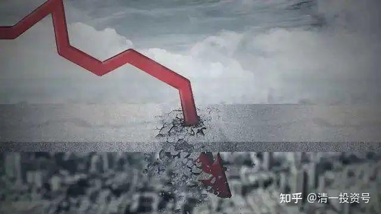
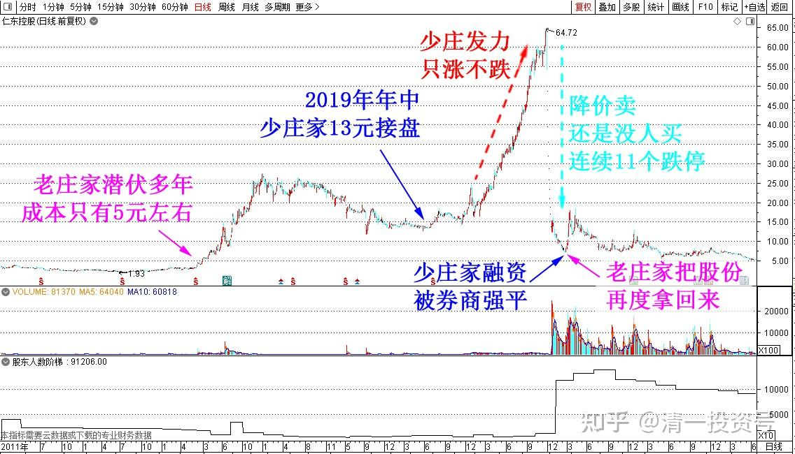
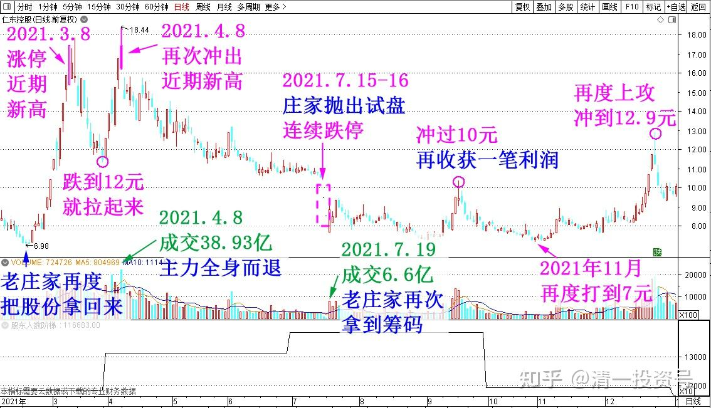
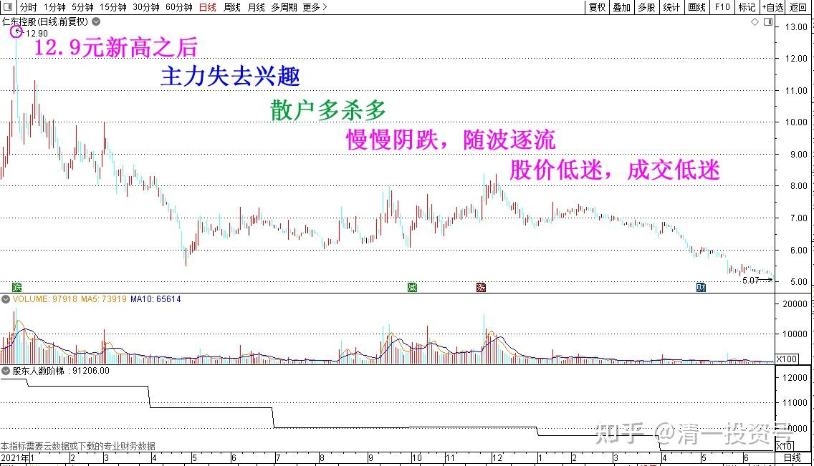
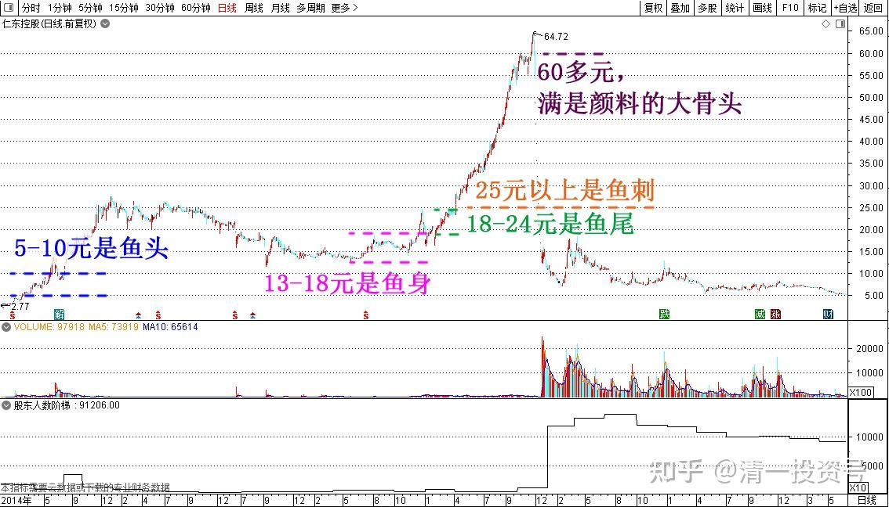

54篇.坐庄幻想：20亿家产荡尽换来的教训（配图版）

清一山长 2023年3月12日

我炒股32年，从来没有做过庄，第一没实力，第二也是没本事，第三是没有庄家朋友。虽然认识过一些我怀疑是庄家的人，但别人从来不承认自己坐庄，也不可能告诉我坐庄。所以——就当我不认识吧！

庄家不仅仅需要心狠手辣，还要“庄有庄道”。必须合道，才能赚钱。孤立主义，自我中心，是赚不到钱的。【有一家我怀疑会坐庄的，搞金融的朋友，接待我定的房子是杭州的总统套房，去过特别的只有省部级才有资格去的会所。似乎他们最主要的任务，是接待各界朋友。所以——真庄，很可能是朋友遍天下的。比如某庄，显然不喜欢我说话，就禁言我有9万粉丝的雪球号，他只要一句话我就开不了口，肯定他到处都是朋友呀！所以我现在都不敢提他了。】

没见过庄家，并不意味着我不去研究庄家。没吃过鸡，也看过鸡跑。32年来，我一直想弄清庄家是怎么回事。一直在努力理解庄家。因为——中国骨子里面，还是一个非正常的市场，庄家、机构在其中的地位极高，不是看财报就能赚钱的。看懂庄家，比看懂财报更重要。**如果我理解庄家的思维、行为，我看对了，我就赚钱，我理解错了，我就赔钱**！

比如：一般人以为的坐庄，就是有钱任性就行了。有钱就可以坐庄！只要低位买下股票，然后控盘，使劲拉升。然后高位卖给别人，你就赚钱了——你做梦吧！小散才会这样想，傻庄才会这样干。真以为是这样玩的，多少钱都不够你玩的。

上一个这样干的傻庄，是仁东控股。我几年前就观察到他了。当时正在拉升，他最红的时候，一路不断上涨。特别的牛气！别人告诉我他多牛，多赚。据说要冲100元。我一看就说——这是个傻庄，不懂做庄之道，自以为是，将来他自己都不知道咋死的。我是绝对不会碰这种股的，也劝了朋友不要投机取巧，别看他天天涨就眼馋，要离开他远点。

他是怎么当傻庄，傻玩一气的？我就猜猜看故事。因为我没关系，没背景，肯定没人告诉真实信息，我也不知道啥内幕，我就只能瞎猜了。

**一、以下仁东控股的故事，是我虚构的故事。如有雷同，纯属巧合！**

**1、新老换庄，少庄家暗自窃喜**

2019年年中，低位收集筹码的老庄家，找到一个傻庄接盘，他在13元左右，把手上成本不高于5元的货倒给他。说自己实力不够，但愿意协助他坐庄。这傻庄估计是个富二代，继承了父母创业40年，留下来的20多亿资产。但他认为：父母做实业的，太辛苦了，不如搞金融更高大上，自己坐庄更划得来，来钱更快。如果他操作好了，几十亿现金，就变几百亿了。他就可以证明自己比父母更强悍，更有本事，更现代化了。毕竟父母是土包子，勤奋苦干加上机会好赚到的钱。而他是出国留洋，喝过洋人口水的“高华人才”！

正好一些金融掮客，各种靠忽悠大户的金融专家，机构操盘手，都纷纷表示可以帮他坐庄，还可以找到主力正在坐庄的一只股票。告诉他：由于老主力的实力不够，这个股做到中间，就没钱了。现在这个股题材特别好，但做下去钱不够，进退两难。愿意把手中的筹码低价转让给他，自己就退出江湖。他们一看少东家骨骼清奇，是个难得的大人才。因此愿意为他效劳，把庄家手上的筹码低价拿过来，现价十几元的底部，拉到100元去，就可以赚大钱。

这少东家一听有这好事，就热血沸腾：好！本少侠就把家里的几十个亿拿出来，好好的干一大票。但他也不是傻子：他精明地表示——16元价格太高，绝对不接盘，要主力打到13元给他筹码，他才肯接手。原老庄“痛苦异常”，13元我就赔了呀！苦苦哀求能不能16～18元接手？但少侠信奉“有钱任性”，根本就不给老庄钱赚，谁让你资金不够还来坐庄？做梦——金融市场是有钱人的天下。因此——他成功了。原主力只好继续打压，跌到13元前后，然后让他在13～14元接手，完全不费力地就得到了一大笔筹码。少股东不禁得意地想：还是金钱的力量大。他们要费尽力气的洗盘、拉升、打压，费了天大的劲，才收集这些筹码。我只要拿钱出来，就把他们费劲一年才搞定的筹码弄到手了。钱都不给别人赚，我多牛！【其实老庄潜伏多年，成本只是5元左右。但少庄主以为坐庄就是半年几个月就完成一轮了，短期看仁东的持仓成本，的确是13元以上】。

**2、少庄家志得意满，一路拉升，浮盈200亿**

老庄假装“资金实力差”一些，只好把手上的股票，“不赚钱”转给少庄主了。把手上价值20多亿的股票卖给了新庄。少庄家拿出20多亿接货后，又在银行搞了一些贷款，加上券商的融资，这只当时80多亿市值，只有20%股票到手，少庄家第一次，就一共拿到了40多亿的股票，差不多控制了50%的筹码。但现在还需要更多的资金，才能拉升股票。少庄家毕竟手眼非凡，银行和金融机构看他家几十亿资产的份额上，都愿意借钱给他，只是利息必须高一点，风险借款嘛！前前后后不断倒腾资金，2019年12月，做了一次拉升。拉到了24元，又回踩17元，赚了一笔钱。一个小目标到手——他发现坐庄不难嘛！而且盘子很轻，不难拉。2020年春节过后，少庄家就正式发力了。一路慢慢的涨，只涨不跌，他要学庄家吕梁，再创奇迹！一路上仁东从20元一直涨到65元。成功地把仁东的市值，从80亿做到了接近355亿。

仁东的持股人，此时账面全是赚的，特别是少庄家账户上，浮盈200亿。因为市面上的浮筹，90%以上都拿到他手里了。此时少庄家得意非凡，如此轻松容易，不到一年就赚了200亿，轻松实现了超越父辈，一辈子都没赚过的钱。市场上都在传说【仁东控股】的传奇，仁东成为市场热议的“热股”，但麻烦的是：很多人就是光看不买。所以，少庄家大笔的账面盈利，就是无法提现。

很快一年的坐庄，就到了年底了。少庄家借的钱，就只有一年期，少庄家不得不卖股还钱。这一卖才知道——花钱买股的时候，人特别爽，有钱任性，要多少筹码，就有人卖给你。不卖，改天再加点钱，筹码就一定到手。但少庄主卖股的时候就麻烦了——居然跌了一点，也没有人买？打折，七折怎么样？我就不要200亿了，我只要100亿也行。

**3、庄家难做，大梦初醒：几近破产！**

但是——降价卖，还是没人买？

少庄家这才发现不妙：**原来自己的200多亿，赚的是假钱。但借的钱到期了，2021年新年之前，他必须把欠款还清**。他不得不卖，只好不断减价，卖一点算一点。他心想不再是赚200亿了，只要能够回本拿回钱来就行。他从64元，一直跌到12元～15元，才总算有人接盘了。少庄家一看：我操，原来账上赚的200多个亿，全亏光了，自己虽然股票仅仅跌回原价，持仓也是持有原来刚接受老庄家的份额，表面上应该不赚不赔才对。但由于拉升中高价买股的钱，以及一年借的高息，全都是成本。一下子，他自己原来投入的30亿本金，就只剩20亿了。还有券商的融资，要他补上。如果不补上钱，就要强行平仓。

一年前志得意满的少庄家，一年后的任务就是到处借钱收仓。因为再跌他就要破产了。但是该死的股价，居然突破了他认为是“铁底”的13元买入最低价，一路下跌到了2021年2月份，跌破了7元的低价。而且是11天连续跌停，直接打穿少庄主的仓位。市场用少东家自己的钱来杀自己！6.98元这个价格，就是少庄最后的融资被券商强平打出来的底价——股价这一天也真的是到底了。但少庄家的家族，用了几十年积累下来的几十亿资产，就这样完全被金融大鳄们洗光了。几个月前账面上的200亿浮盈，就像天上的月亮一样，看着很美。但——拿不到手！

[惨烈爆仓！仁东控股连续11个跌停板，股民自曝倒欠券商200万！交易所也紧急出手了 _ 证券时报网](http://link.zhihu.com/?target=https%3A//company.stcn.com/gsxw/202012/t20201209_2611271.html)

[https://company.stcn.com/gsxw/202012/t20201209_2611271.html](http://link.zhihu.com/?target=https%3A//company.stcn.com/gsxw/202012/t20201209_2611271.html)

[30亿融资盘随时爆仓：仁东控股连续9个跌停 穿仓倒欠券商怎么办？](http://link.zhihu.com/?target=https%3A//finance.sina.com.cn/stock/s/2020-12-07/doc-iiznezxs5698477.shtml)

[https://finance.sina.com.cn/stock/s/2020-12-07/doc-iiznezxs5698477.shtml](http://link.zhihu.com/?target=https%3A//finance.sina.com.cn/stock/s/2020-12-07/doc-iiznezxs5698477.shtml)

​**4、老庄家再现，进退浮沉，成功赚得50亿！**

最可气的就是，跌破7元爆仓后，这只股票居然掉头向上走了。因为——原来13元多卖给少庄家的老庄，此时打了一个回马枪，以大约7～8元多的成本，在少庄家爆仓的时候，把原来13～15元卖给少庄家的股份再度的拿回来了。一进一出，老庄此时的持仓成本是零。

高位平台震荡后，老庄开始出货。跌到12元，老庄再度拉升，2021年3月8日涨停创出17.47元的近期新高，然后震荡出货。但由于股民心有余悸，因此老庄安抚人心，跌到12元就拉起来了。让人认为“有人兜底，不怕跌”。

2021年4月8日，上一次涨停之后正好一个月，仁东再次冲高，冲出了近期新高18.44元。股民们一看——就算上上次涨停敢死队，庄家都给了解套的机会，因此认为此股不怕套。大量散户积极地涌进来，大量买入仁东控股。仅仅是4月8日这一天，就成交了38.93亿元。比2000多亿的大盘股中国建筑的悦春天成交值都高几倍——差不多就是今天的仁东的全部市值了——当时市值的50%。可以说——当天，能够走动的流动筹码，都全部换手了一遍了。主力肯定全身而退了。

这一天，老庄手上低价从少庄家爆仓时拿到的7～8元的筹码，已经在获得一倍多的利润情况下全身而退。**成功地把大批的散户套在了18元的山顶**。因为**这批傻乎乎的散户，以为“山顶”是64元，都在做梦再出现一个“少庄主”，他们将来全部把股票高价卖给他就走**。没想到被“怂货庄家”算计了个惨。这一笔进出，“怂货庄家”从少庄主手中抢了20多个亿，从散户手中抢了30多亿，非常成功地赚了50多个亿。2021年4月后，高位接盘的散户们，发现庄家已经撤离的信号，脑子快的人赶快动手斩仓自保，断手断脚总比断腰好。仁东控股演出了一场“多杀多”的典型戏码！

三个月后，仁东庄家手上还有一点零头股票，突然抛出打压试盘，2021年7月15、16日，突然连续跌停。但敢于抢入的人极为稀有。7月19日看盘就封死第三个跌停，三天内就从接近11元跌倒了7元多——少庄主爆仓的价位，吓得战战兢兢的散户觉得仁东肯定要破产了。一些人就赶快跟随挂跌停价卖出。突然间。跌停的筹码被一扫而光，股票绝地反击，开始上攻。显然有新主力进场了，当日成交6.6亿。难道是仁东又要开始新一轮上攻吗？没错——老庄家再次拿到7元多收获的筹码，冲过了10元，再收获一笔利润。2021年11月，再度把仁东打到7元的低价，之后再度上攻，又冲到12.9元。让散户们发现：被高位套牢也不急，只要耐心守住股票，就可以云开雾散。再度被庄家拯救。跟庄的人——又赚了。

大家都说：仁东是个好庄，做盘很漂亮，跟对了有钱赚，套牢了也有机会解套。大家都很喜欢仁东。只要把握7～8元买进，10元以上卖出的节奏，不贪心，仁东控股就能成为大家的提款机！不断反复的赚钱。这是经过多年的观察研究得出的结论！一些老油条，也真的从庄家反复拉升中赚了钱！

只是散户们再度失望了，装怂、装傻的老主力，在仁东创出12.9元的近期新高后，似乎失去了再做仁东的兴趣。此后这些跟庄赚钱的小股民，再次成为没有庄家照顾的孤儿。互相之间多杀多，陷入了慢慢阴跌的状态，随波逐流，再也没啥可圈可点之处了。一直到今天，还真没看到庄家再次进入的迹象，股价低迷，成交低迷。这一地鸡毛，不知道何时才有人来收拾了。

只是粗略的计算一下：仁东的老庄，这几年从20亿的本金，赚到了60亿以上的利润。少庄主如果还没有羞愤自杀，这才见识到什么是真正的“坐庄”。就是——**不能像被宠坏的少庄主一样，只会吃独食，要学会分享利润**。跟大家一起分，至少跟聪明人一起分钱。不要过于自以为是。另外——**做股票也要学会阴阳变化，要会涨涨、跌跌、打打有节奏**。只会买股就一路涨价，卖股就一路杀跌，缺乏阴阳变化，就是死路一条。不如随市场而动，随波逐流，推波助澜，不要兴风作浪。只要跟随自然进进退退的坐庄，才有群众基础，才能最终赚钱。

**5、有钱莫任性，恐灰飞烟灭**

只会“有钱任性”，别以为钱多了就可以任性——不管你有多少钱进来，都会被资本大小鳄鱼们闷杀的。别忘了曾经举牌万科、围猎格力、收缴南玻的姚老板，当年拥资数百亿，以为手上有钱就可以“任性”一点。今天安在？

别说姚老板了：拥资万亿的吴小辉又如何？得罪了超级庄家，照样死都不知道怎么死的。就算手上拿到了最好的股票（招商银行的二股东，中国建筑的二股东），自己照样灰飞烟灭！

因此，想坐庄，最好掂量自己几斤几两，不要自以为是。勤奋一点，谦虚一点，认真学习，体会、理解庄家，可以设法跟庄。如果庄家赚大钱，你就赚一点小钱。有点剩下的汤水吃就够了。散户就别玩什么“猎庄”游戏，真不知谁猎谁呢！**如果脑子不够，跟庄都不会跟。看不懂盘面，看不懂局势，就老老实实地买股吃利息。本分人，就本分活，没人能吃你。就怕自己以为自己是狼，想跟狮虎平起平坐，没想到狼皮一脱，被人看到原来是羊，你就麻烦了**！

YJ股票的价格，现在正好是13元。我观察的结果正在换庄！问题是：他会换个啥庄来呢？我倒是希望来个傻傻的富二代，但看样子可望而不可求。我估计是狮子换了一群狼吧？未来的走势，狼群互博，互抢，会是啥局面？不知道，我挂眼科慢慢看好了！

**二、股票小常识：换庄，分享是美德！**

为啥主力要换庄？因为**每个庄家的擅长不一样**。有些擅长吃透行业，埋伏多年；有些擅长快进快出；有些人资金实力强；有些人善于鼓动宣传，拉人头做传销，必须所有人都互相配合，才能弄出一台大宴出来，让所有参与者都吃得满意。**最早的，最有耐心，最不想买单的人，吃鱼头**；**个性稳重，自信的人，吃鱼身子（中段）；耐心差的，吃鱼尾巴**。但大家都是会吃的人——鱼尾巴最香甜，但肉特别薄，不小心容易吃到刺。只有最聪明的人才会吃鱼尾巴，比如徐翔这类人，是吃鱼身子、鱼尾巴的高手。但最蠢的人，是看到别人吃啥，自己就跟着吃，特别没脑子。他一旦发现（其实是被人传销的）人家吃大鱼吃得很美，就赶快花钱买票，冲进去豪华餐厅，专门吃服务员端上来的剩下的鱼刺。但毕竟厨师水平高，舔舔鱼刺也有鱼肉的味道，只是不太管饱。他们饥饿难耐，吃相也难看，就忘记注意周围的人吃饱了，正在从容离开。**这些吃相难看，最贪婪，最舍不得走的舔鱼刺的人，最终为所有吃鱼肉的人买单**！

庄家绝对不能一条鱼从头吃到尾。他如果不肯给人分吃食物，最终就得自己买单了，自弹自唱。比如仁东就是这样的傻庄——以为自己很聪明，想要自己吃完所有的鱼肉，让别人高价吃鱼刺。结果发现别人都看透了他的游戏，没人来吃他开的饭店。他自己只好自己做，自己吃，鱼刺也吃，最终卡死自己了。

聪明的庄家，会在要开始吃鱼身子的时候，发出请帖邀请客人来一起吃。这时候的肉最厚，让傻瓜都看得见的实在的大肉。就到处发英雄帖，邀请大家一起来吃大鲸鱼。第一批来的人，就吃鱼身子。虽然不如鱼脑、鱼头的营养价值高，但鲸鱼是老庄猎杀的，不能指望别人请你来吃鱼肉也够意思了。有些关系比较差，消息不太灵通的人，来晚了，就只能吃鱼尾巴了。但这种游戏的本质，就是留下来的人买单。所以——庄家邀请来的人越多，自己的单子就会被别人买了，可以白吃一顿。后来的人，也一样要邀请人来吃。只是来的越晚的人，越蠢，钱就会越少。所以就需要更多的人一起来买单才行。最后一批来吃鲸鱼的人，其实已经没肉了，只剩一个大大的骨头架子。但调味料不断用在骨头上，舔起来也很有味道。所以有人就高价吃鱼骨头，以为是大鲸鱼，最终别人都走了，他们为所有人买单。这些人营养严重不良，不小心还会挂掉。破产、离婚、跳楼等等故事都是这些贪味道吃鱼刺的人。

勉强要说：仁东5～10元是鱼头，13～18元是鱼身子，18～24元是鱼尾，25元以上，是鱼刺。60多元的仁东，就是满是调料的大骨头，一点肉都没有的。

YJ股票，仁东是没法比的。勉强比起来，我认为YJ真的是一条大鲸鱼，有很多肉可以吃。如果YJ的鱼肉价格不贵，你想买回家慢慢吃，可以吃很多年。所以，它是真的有大肉的。但仁东控股，就是一条假装是鲸鱼的罗非鱼！它的味道，全是调料弄出来的。一旦没有厨师（庄家）帮忙了，就一点味道都没有了。这就是两种股票的区别。因此——**仁东这种鱼，多便宜我都不吃，鱼头、鱼尾都不要**。**我有点挑鱼——我只找“价值鱼”，不吃“概念鱼”**。

真正的好庄家，必须是有能力找到大鱼的实力派。然后猎取到手之后（完全控盘）。会邀请第一批人来分食鱼身子。这些人自动会替他找来吃鱼尾、鱼刺的人。他就不会为以后买单的事情操心了。**让利给人，风险也自动让给别人了。来吃越晚，风险越大**。

