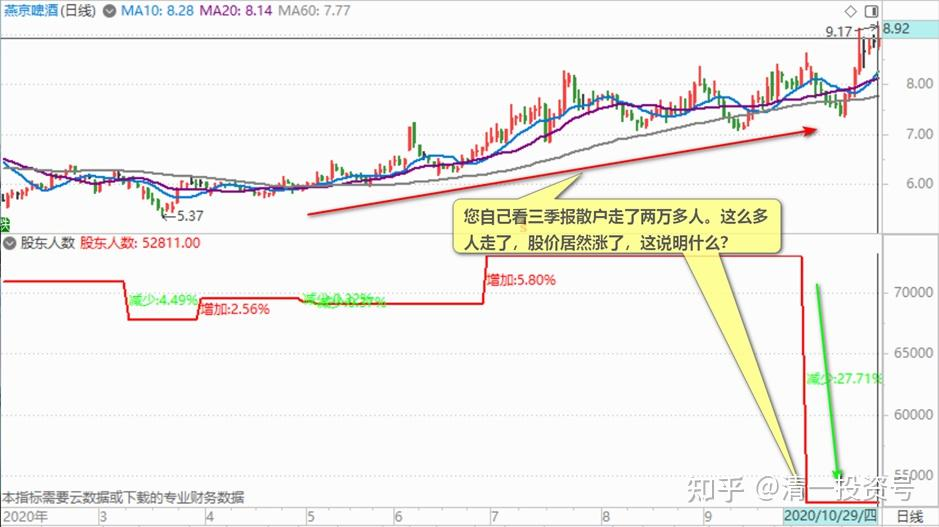

54篇.黑文滚滚或是粉红一片

清一山长2020年10月29日

《燕京啤酒 北京人都不喝？》撰文/财经天下周刊作者

[燕京啤酒 北京人都不喝？](http://link.zhihu.com/?target=https%3A//finance.sina.com.cn/chanjing/gsnews/2020-10-28/doc-iiznezxr8622038.shtml)

清一山长评论上文：

我喜欢看黑燕京的文章，本来9元以上，还准备出一点的，看到这样高级、详实、落地的分析燕京啤酒的文章出来，弄得我都觉得：卖出燕京，是不是正好上了别人的当[为什么]？因为：这些问题的确存在，早就存在了。如果公司现在已经发现了，媒体都愿意公开出来了，就不是真正的问题了。说明新领导，跟原来的老领导要彻底划清界限了。燕京要迎来大改革了。不然，为啥这样的文章，原来就见不到？

燕京真不行吗？为啥漓泉市场这么好？比珠江更好？（以比珠江更少的营业额，赚到了跟珠江差不多的利润）。燕京口感真的不好？把漓泉的配方拿过来用不就得了？

另外，黑燕京，居然说北京人都不喝，真的太过分了，是事实，还是骗炮？这等于是骂每年喝燕京三百多万吨的人，都是一群傻叉？都不懂啤酒？就您作者几个人懂啤酒口味好坏？销量这么大（中国第三），证明市场是接受的。啤酒苦很正常，没苦味还叫啤酒？德国啤酒就很苦。这个是特色。不喜欢的，另外提供不苦的味道。以一种味道，一种口感，来给燕京全体下结论，这种文章居心不良！

燕京的问题，文中说得对：内耗太多。燕京品牌本身销量很大，但却是亏本的，这很不正常，赵晓东很不正常。**一旦纠正了内部的“老鼠问题”，燕京啤酒的销量就算不增，但利润大幅增长是正常的。**何况现在的燕京销量，利润是双增的。证明燕京已经走在正确的道路上了。

虽然本文居心不良，但不能说他在造谣。一件事情，永远可以从粉、黑两个角度来写的。关键看他们希望你是粉，是黑。**主力需要你交出筹码，自然就是黑文滚滚；主力希望您买入筹码，自然是粉红一片。**甚至会动用大V来站台。原来帮融创站台的某雪球大V，帮艾吉科技站台的某老股民，难道仅仅是“看错了”吗？特别融创，5元的时候没见他吹票，40元的时候天天嚷嚷8848（编者注：融创40元时，网上流行【88.48元，8848亿】的说法）。至于这么夸张吗？是不是替人代言的？不瞒各位说：现在几乎每天，都有人私信找我“合作”。明说一点，就是有人愿意给我一笔钱，让我说对他们有利的话，影响粉丝。我不缺这钱，我不会做这种事情。但很多人会做，他们要做也很正常。你们这群粉丝，给了我啥？是的，有一点打赏，有多少？几元、几百元。可我们这些人，别人一拿，就是给我们几十万元、几百万元，甚至千万元的提成（看我们实际卖力度有多高），这么多钱，我不要才是傻子！所以，**看到高位推票的，不管这人原来是多么的“靠谱”，您也小心。**只要是粉丝多的人，都会有别人找到给“推广费”的。如果您带来了几个亿元的好处，主力会非常乐意分个几百万元、几千万元给你的。这是分享经济的时代，他们只要做一次就够了，以后换个名字再来！所以，你每年都看到一些大V倒下，失去了影响力。而另一些新的大V，收益超高的，呼呼呼的又冒出来，我告诉，这些全是假的！包装出来的。连真的都可以弄成假的，直接弄假的就更正常了。

同样，写文章给您看的人，既然不是您给他们发钱，他这么辛辛苦苦地写这些文章干啥？还要卖力推送给您，一定有目的。我写的文章，有谁大大方方的，主动推送到您面前了？**最近燕京黑文不断推出，但燕京的价格不断上涨。您不觉得：这有点不正常吗？小散户们明明在不断卖出，到底谁在买进？**您自己看三季报散户走了两万多人。这么多人走了，股价居然涨了，这说明什么？

黑文出台，这是好事，总比原来几年根本没人理燕京要好。**我最怕“红燕京”的文章大批量推出来了，这意味着要走了。**正通汽车冲到10元的时候，很多券商出来说：正通的汽车金融等等很有前途，公司各种好，是新经济。股价要到14～16元等等。我一看这些写文章的股市“文豪们”都出来了，赶快全卖掉了，赚了几十辆汽车的钱。但如果我听信了这些人的忽悠，居然持仓不动到现在，就算我低价买入（成本2.55港币），到现在不但不赚钱，还要赔掉十几辆车钱。如果我在他们吹票的价格，买进我相同的持仓量（200～300万股），我现在要亏两千多万元。所以，**在中国，脑子别长在媒体身上。这种不动脑的习惯，很危险。**

燕京，我继续看好，冲破10元没毛病（当然，跌到五元也有可能）。看得懂的就赚这份钱，看不懂的就亏。我现在是赚的，而且大赚（虽然不久前燕京账户还是绿的）。6元多的时候，我公开说过的，你们都可以来抄我的底，我自己也在大买、特买。如果你们现在才来抬我的轿，亏了赚了，都自己认吧！[大笑]

庄周若愚回复清一山长：

原来大V还有这一层获取利益途径，感谢山长提醒！

清一山长回复庄周若愚：

你们居然真的不知道？[俏皮]。

明说：有钱不赚神鬼厌！来雪球，就是求财的。我能卖股票赚钱，干嘛不能卖粉丝赚钱？如果有人按照我的粉丝数量，给我一个粉丝100元，甚至给个两三百元，一次性支付。您觉得我不把你们都卖掉，对得起我自己辛辛苦苦码字这么几年吗？

而庄家，一旦发现：如果我影响粉丝可以去当接盘侠，一个人就可以让他们赚到一千元，甚至一万元，这不难吧？只需要给我一百元、两百元来买这些粉丝影响力，难道他们不认为是一笔好生意？

您给个理由：让我坚持就是不卖粉丝。这样对我有好处，有利益？您说得出来吗？

**所以，卖粉丝是正常的，不卖是不正常的！**

如果我来雪球的目的，就是为了赚钱。就算我不缺钱，我也肯定会赚这笔钱的，因为不赚白不赚。我分享这么多年，你们粉丝，也没给我啥好处。靠你们的赏钱过日子，我连饭都吃不上的。如果有人百万、千万的给我，我不要，是不是有毛病？

**这个叫做“流量变现”。有人经营网络平台很多年，就是为了等一个流量变现的时机。**相当于把公司做好了，有人气了，就卖出去！这是一种正常的商业行为，法律上也许可的，无法认定是违法行为。只是不那么讲良心罢了。这世界上，良心不值钱！能卖就卖，反正卖得高明一点，你们被卖了还高高兴兴的呢！万一套牢了，无非是大V找找理由，看错了难道要进监狱吗？您不满意，那我就消失算了。

卖粉丝，甚至于自己都不用说话。只需要自己悄悄的，把号卖给买家就够了。相当于借名。谁要写什么，发布什么，让他们自己来操作。原来的真主儿，自己重新开贴，换个名字重新创业！**这就是互联网的新行业。先设法创流量，然后等一个流量变现的时机**。**网红不白红的，有流量，就应该换算成金钱。天经地义！**

您说：这生意，不是好生意吗？以为大V们靠写书？打赏，赚您一点小钱钱？

我不要这钱的原因，别说千万，就是上亿也买不动我的原因，是因为：我的主业是教师。**做教师的，一般要讲一点面子，不是那么爱钱如命的样子。**而且，我等于是实名上网的。我在自媒体上，和现实中，名字都是通的。我的家长，我的学生，都可以看到我的雪球号。我的生活、事业圈，是合一的。我跟那些网名叫做“00兵”之类的人不一样。你根本不知道他是谁，他在哪里工作，他的企业、家庭都不知道的人。我无法这个“兵”没做好，就换个“00将”，再出来创个新号。**我这个号，要用来维护我的教育信誉，所以，上亿资金给我也不卖。**

但难说：有人真给我几十亿元，我也一定不卖你们吗？因为：我如果拿了几十亿元，可以立马去建我的大学了，我也没时间在雪球混了。我的道德良心，最终还是抵不过大把的金钱。幸运的是：不可能有人会出几十亿来买我的号。所以，我目前对你们来说，还算是安全的[俏皮]。

别的大V，多少钱就会卖掉你们？你们自己算算帐去，你们在他们心里面，你们到底值100元，还是1000元。我的账，清清楚楚的，就在这了！（按我的账，有人给我几万元，我就愿意卖掉您了。但庄家认为：你们每个人，只值几千元，几百元，他只能从你们身上弄这么多钱。所以，他最多只给合作者几百元，几十元。这点钱我还瞧不上[大笑]）

PS：**我因为不想卖你们，所以你们粉不粉我，我根本就不关心。**掉粉，加粉，我都不管的。反正你们卖不出钱来。如果我想卖粉丝，我一定天天说你们喜欢听的话，把你们哄得开开心心的。现在没钱赚，我花功夫天天哄你们开心，划不来。所以我经常不理粉丝，特别问些莫名其妙的话还会不客气地怼回去。我也不回私信。除非您想送给我钱，否则别私下找我！[俏皮]

(标题、图片为编者所加)

**文章音频**：

[428篇.黑文滚滚或是粉红一片_清一投资号文章同步音频](http://link.zhihu.com/?target=https%3A//www.ximalaya.com/sound/715702516)

**参考链接：**

[46篇.风险是涨出来的，机会是跌出来的](https://zhuanlan.zhihu.com/p/677785950)

[47篇.主力的动向，说明了此股的利空利好](https://zhuanlan.zhihu.com/p/677786129)

[48篇.涨停是否要减持：时机、成交量、基本面配合情况](https://zhuanlan.zhihu.com/p/680828476)

[49篇.报表已经证明燕京正在重新崛起](https://zhuanlan.zhihu.com/p/681475572)

[50篇.惠泉股性活跃，喜欢刺激的人有福了](https://zhuanlan.zhihu.com/p/682717047)

[51篇.是风险赌博还是稳定投资？](https://zhuanlan.zhihu.com/p/684479170)

[52篇.惠泉、珠江、燕京的换手率](https://zhuanlan.zhihu.com/p/685682634)

[53篇.三只股轮动，谁涨停卖谁，谁跌停买谁](https://zhuanlan.zhihu.com/p/686904967)
