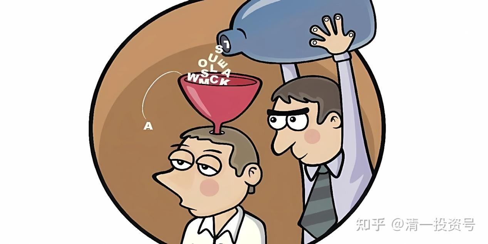
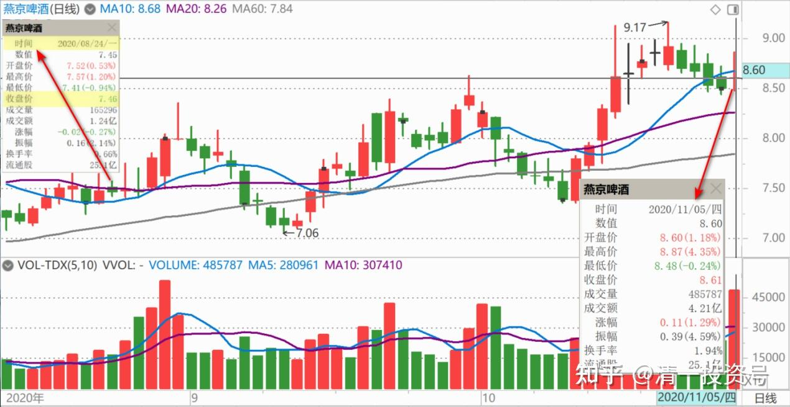
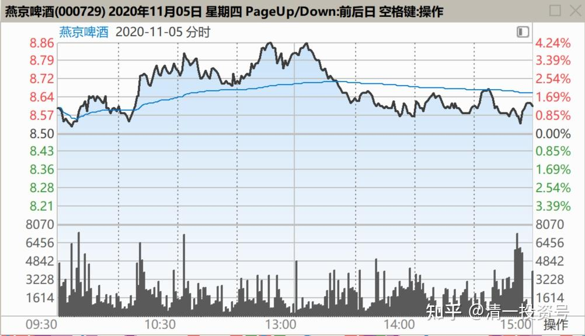
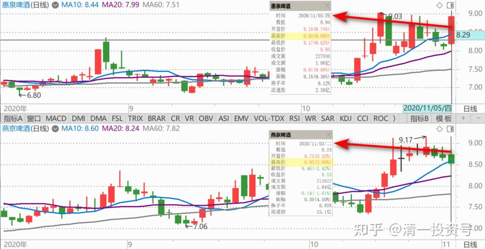
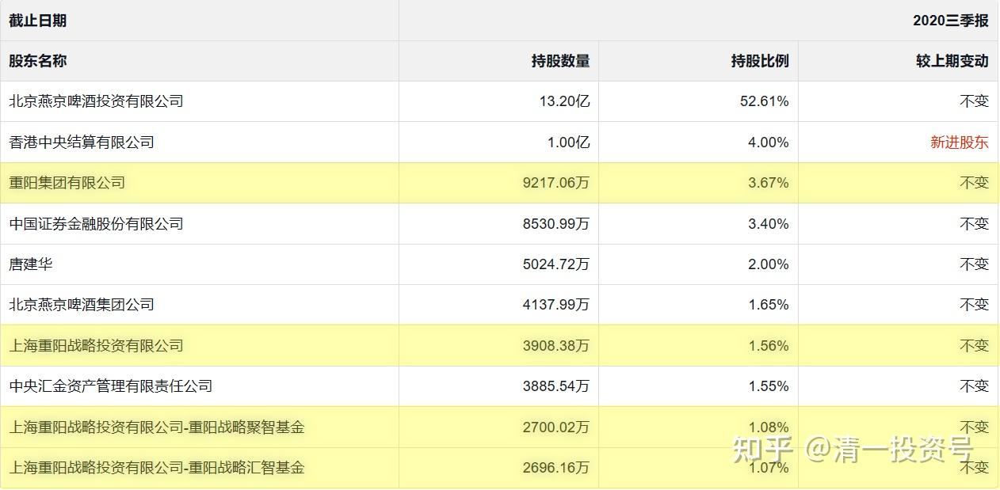
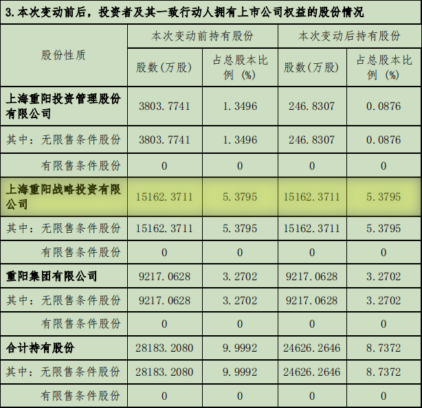

56篇.高明的人，会用真实的事实来误导你的决策

清一山长2020年11月5日

$燕京啤酒(SZ000729)$ 重阳的减持，是一件非常怪异的事情。刚开始我以为是今天的，减持了三千多万股，但今天的盘面成交才四千八百万股，似乎比例太大了。这么大的比例，勉强压住股价不大涨，也够不容易了。后来仔细看，是从8月24日就开始减持了。到今天减持超过1%才公告的（[关于股东减持比例超过1%的提示性公告](http://link.zhihu.com/?target=https%3A//www.szse.cn/disclosure/listed/bulletinDetail/index.html%3F8ea5203a-7f76-47a7-ab62-f5fd2e5b735b)）。而8月24日，燕京根本就没涨呢！才7.46元的收盘价。这么长时间，三个多月，减持这么一点也不够。而且价格根本就是重阳的持仓价附近，没啥盈利的。更奇怪的是：9月底公布的股东名单，重阳系是“未变”，是不是三季度只是减持了100万股？几乎忽略不计？

不过，最近一周多，盘面明显是减持出货的迹象走势，特别是今天非常的典型。我也在纳闷：这燕京在玩什么，还没到出货的时候呀？我认为可能：重阳减持最多的一天，可能是今天。**但可以肯定，重阳没有到出货点。燕京，绝对不可能低于珠江的市值。**因为燕京要比珠江价值高一倍，甚至是两倍。重阳不会这笔账都算不清吧？

另外，重阳战略、重阳集团的持仓量都更高。为啥没有减持？一股未少。反而是重阳持仓最少的重阳投资减持了？是不是重阳故意向外界展示什么态度？（外围不参与燕京的原因，会不会就是重阳态度不明朗？重阳此举表达某种跟外围的配合态度？）

如果我心中想的是正确的，明天的走势，就是低开，然后震荡，向上走。这才符合重阳减持的目的。如果明天走势是一路向下的，说明我的判断失误。需要重新考虑。但目前这个价格，**就算是重阳放弃了，我也不会放弃的。燕京现在是五年来最好的时刻，**没理由放弃的。除非燕京给我五年来最好的股价！

哀叹：我对燕京看好的程度远远超过惠泉。现在看来，真不如买惠泉靠谱，如果把燕京的仓位全部换成惠泉，我都要赚死了！可惜今天我涨停卖出惠泉的钱，都用来加仓了燕京，最低8.56元买入。不过反正是昨天减持燕京换的股，今天换进来我也没吃亏。如果我昨天没有减持燕京的话，我今天也没这么多惠泉可以卖的。这操作没毛病。只是我猜：如果我知道重阳会卖的话，可能今天就啥都不买了。[滴汗]

谢谢各位提醒重阳三季报的持股数量，和公告的持股数量不一致。我重新研究了一下，才发现关键的问题所在：**重阳虽然公告是减持，其实是大量增持的，相当于举牌了。**因为9月30日以后，重阳战略的三只基金，显然都在大幅增持，总共增持了一亿股左右。而持仓量最大的重阳集团未动。今天这个正式公告发生减持行为的重阳投资，三季报并未进入四只重阳持仓单位里面，是一只新的控股公司。也许就是专门拿来做短线的。

公告说的是“本次公告变动前持股”，并没有说是8月24日前的持股，故意含糊其词。就是说。**三季度之前，重阳持股未变。三季度之后，重阳大幅增仓。**但价格上，三季报收盘价是8.43元，7、8、9三个月，股价都在稳步上移。而重阳的股数未变。最新一个多月，重阳虽然大幅增加了五成的仓位，但股价并没有明显提升，而是一直在震荡。这足以证明重阳的操盘水平一流。而且一个多月来，董事长被抓后，逃跑的浮筹，主要被重阳收走了。现在实际上的持仓，是远远高于三季报数字的。就算减持了这一次，也是多了六千多万股。今天的股价，并不是真的在“减持”，因为减持不需要今天这种动作。明天顺势而为，明天大幅减仓，才是最有利的节奏。今天实际上是刻意地压制燕京股价，也是为了配合今天的消息。就是说，**重阳今天，是不希望燕京涨起来的，因为公告今晚要出来。**当然，公告完了，燕京就可以涨上一波了。

我不知道对重阳的管理，证监会的要求是怎样的规定。按道理：5%以上的持股人，变动仓位是需要通告的。重阳四季度以来，增加了这么多的仓位，居然没有公告？可能是私募股权基金可以豁免公告？

另外，持股5%以上的股东，以及持仓不到5%的管理人员，都有一个对他们买卖股票很不利的规定，就是规定变动仓位必须公告。而且，三个月之内，不许反向操作。也就是说：假如我是5%以上的股东，我上次涨停，如果我9.03元卖掉了股票，后来跌到8元之后，我是不能买的，只能在三个月之后才能买回来。（当然，我是微股东，不受规定限制，可以随便买卖。只是我反向，异常操作的话，可能会被查“操纵市场”）。所以，很多高级的管理人员，并不愿意买自己公司的股，受到的限制太大了，很不方便。

重阳基金，应该是不受这种限制的。可能是私募基金的关系，他们是可以随时增仓、减仓，而且不用公告的。那么，**原来增加了一亿股，并不用公示的重阳，现在却出来公告减仓三千多万股，有啥毛病？**

这就真的很有意思了。**我原来就猜测，重阳在下一盘大棋，**所以我说明天会低开高走。现在看来，这个可能性还是很大的。一句话就是：重阳在董事长被抓之后大量吃进股票，他疯了吗？我甚至怀疑，也许董事长被抓，正好合了重阳的心意，所以反而大量买进。（据说这个董事长很懒，混日子型的）。重阳是看到了燕京的机会大幅增仓的，现在减仓只是作秀，不是真心卖股！**燕京，真有成为牛股的可能！**

**高明的人，会用真实的事实来误导你的决策。他们不需要用谎言，就可以让你自己来骗自己！**[俏皮]**，**所以，我们不要上当。

(标题、图片为编者所加)

**文章音频**：

[432篇.高明的人，会用真实的事实来误导你的决策_清一投资号文章同步音频](http://link.zhihu.com/?target=https%3A//www.ximalaya.com/sound/720287015)

**参考链接：**

[48篇.涨停是否要减持：时机、成交量、基本面配合情况](https://zhuanlan.zhihu.com/p/680828476)

[49篇.报表已经证明燕京正在重新崛起](https://zhuanlan.zhihu.com/p/681475572)

[50篇.惠泉股性活跃，喜欢刺激的人有福了](https://zhuanlan.zhihu.com/p/682717047)

[51篇.是风险赌博还是稳定投资？](https://zhuanlan.zhihu.com/p/684479170)

[52篇.惠泉、珠江、燕京的换手率](https://zhuanlan.zhihu.com/p/685682634)

[53篇.三只股轮动，谁涨停卖谁，谁跌停买谁](https://zhuanlan.zhihu.com/p/686904967)

[54篇.黑文滚滚或是粉红一片](https://zhuanlan.zhihu.com/p/687874750)

[55篇.啤酒行业，已经有大鳄进来了](https://zhuanlan.zhihu.com/p/689415289)
