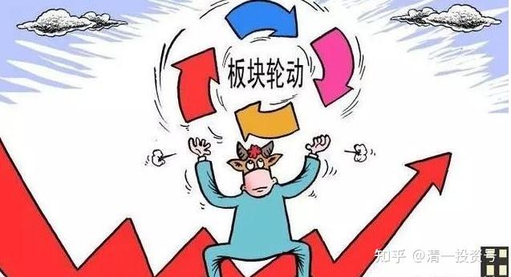

57篇.“价值投机派”心法之运用——板块轮动与股票切换

2017年6月30日～2018年1月29日

一、银行板块与其他板块的轮动

二、跌了就耐心持有，只要是好股，就不用担心不涨

三、股票比价，买入更便宜的标的

**一、银行板块与其他板块的轮动**

清一山长2017-06-30 15:13:23

$五粮液(SZ000858)$今天55.69元卖出五粮液，还剩下不到两万股。心理有点失落。卖出资金换股平安银行，但入手的价格不太好，9.40元。就是“九死一生”的意思。但我怎么算，都觉得未来等**五粮液涨到100元的时候，平安银行也应该涨到20元了。应该不会是一笔亏损的生意。**

**清一山长**2017-07-13 14:09:16

$平安银行(SZ000001)$我还没买够呢！你这么急，就开始涨了？**A股我还指望再买谁呀[哭泣]，都找不到便宜货了。难道让我都去买港股吗？**

**清一山长**2017-11-17 15:07:37

$平安银行(SZ000001)$今天卖出20%的平安银行持仓，卖出价13.18元，挺吉利的。这是半年多前以8.99元买进来的银行股，我也弄不清为啥就它涨了很多，否则当初应该把兴业全换成平安的。反正，涨了就卖掉吧！赚得也不少了。主要要用这些资金，去挽救一个还停留在2005年价格的失足股票[加油]。

今天买入60万股燕京啤酒，价格是5.87元。价格似乎不太吉利。**燕京啤酒，是我A股目前唯一的亏损股。就不换银行了。减一点金融的仓位，万一我换了个黑马呢？万一又回到2005年，燕京从五元多冲上30元，也许我就可以封“股神”了。现在先当“股疯，股傻”。**

**清一山长**2017-11-23 17:15:28

**$正通汽车(01728)$今年我买的正通是一个亮点，成功的投机游戏。**上涨中几次抛出都是高点，可惜不敢在随后的下调中重新买进头寸做T。**因为我看不懂这股值多少钱，只能想卖掉就是赚到。重新买进后，命运如何实在难料。说不定把赚到的钱重新贴回去了。**虽然上次9月20日9元多抛出后，居然跌破了8元，是个完美的做T的机会，赚15%以上很划算。只是想想就放弃了。结果很快看到它重新回头，再次突破了10元，我感觉图形走势不对，不像正常的上涨，就在11月9日至11日，决定彻底的清仓正通。

这一次，我干脆在9.89元抛出了几乎所有的持仓，彻底结束了这一次正通汽车的投机行为。所得资金大部买入了还在七元多的民生银行H，持仓已经超过1M股。以及部分3元的中国信达。这一次我改邪归正，**把投机资金改为投资资金，一股正通，换1.2股民生。当初买入的正通才2元多呢。算起来民生相当于用2元买进了**。怎么算都觉得太划算了[大笑]。就只留了五万股正通看戏玩，涨跌无心了。最近看到正通大跌，民生涨了一点。

可惜昨天还计划要今天卖掉50%持仓的平安银行，换不涨的中国信达的。还没来的及操作就掉下去了。就继续等吧。

**二、跌了就耐心持有，只要是好股，就不用担心不涨**

**清一山长**2018-01-10 18:16:23

$中信银行(00998)$今天算是一个真正的突破。量很大。不过2007年2月也来过一次的，一年后再来一次，我相信会让人认为历史重新演绎。中信真是磨人，越磨我的股越多。**磨叽的时间越长，潜在的回报也相应越高。只要是好股，就不用担心不涨。比国家队买的成本低，没什么好担忧的。**

**清一山长**2018-01-10 18:51:29

$兴业银行(SH601166)$居然我的自选股里面没有兴业[大笑]。今天涨幅真大，成交也很大。如果11月16日是一次洗盘，就太不成功了，因为成交很小。今天如果是洗盘的话，效果超级好。65亿的资金，说明今天大多数长期苦战的小散，被兴业玩得没了耐心，应该都跑掉了。今天冲进来的，大概率不是小散。

俗话说：事不过三。在去年4月制造黄金坑之后，兴业冲击18元多的位置，最近半年，已经五次了。超级有耐心的主儿。我都被玩得差点失去耐心，差点被培养成：“一旦兴业过18元以上，就应该走掉的”这种思维。可惜我不看盘，所以无效，明天也不想卖。

我用20元以上的招商，换了15～16元的兴业，“损失”惨重。所以，我可以再玩半年。**如果还是不涨，我就继续买你，我学老股民死拿艾吉科技的态度，再坚守兴业两年。亏了也认了！反正我就是不放手[赚大了]。**

@安老一回复@哈哈88:

银行股是山长财富理论的重点分析对象，结论是每个银行都很有特色[大笑]，既然每个银行都这么有特色，那每个银行都有那是非常合情合理的。

清一山长2018-01-10 19:02:20回复安老一:

不是你说的这样。**我只持有低估的股票，我会不断切换。**最近切换最差的就是把招商换了兴业。之前没有兴业。它2015年冲20元我就卖掉了，买进没有涨的招商和浦发。**但现在招商我没有，浦发也没有，A股银行只有平安和兴业。其他原来很多买过，都卖掉了。剩下是港股。**

@四季1234回复@清一山长:

经典，涨了你都有。[大笑]

清一山长2018-01-10 21:07:49回复四季1234:

涨了我都有，是因为跌了我忍着[加油]。

**三、股票比价，买入更便宜的标的**

**清一山长**2018-01-18 15:32:06

$中信银行(00998)$今天6.13～6.14元，卖出1M中信银行，持有很久，感谢这一次得到的换仓机会（没有彻底换，更多仓位中信继续持有待涨）。卖出的资金，立即反手买入了相同仓位的哈尔滨银行（2.54元），民生银行（8.34元）和重庆银行（6.70元）。金融股换仓行为，因为我不敢放掉银行股的头寸，卖多少，补仓多少，只是增厚了银行股的头寸罢了。

**清一山长**2018-01-18 19:14:20

$民生银行(01988)$今天卖掉一部分中信换民生，就是看民生没有涨。结果尾盘居然以最高价收盘，买入后“马上就赚”。财富效应也太快了。不太适应[笑]。

**清一山长**2018-01-22 15:35:49

$中信银行(00998)$继续以6.18元卖出10万股中信，买进了30万股06138，价格是2.61元。**理由，还是比价更便宜。**2014年上市的哈行，数据显示，截至2017年6月30日，哈尔滨银行总资产为5469.27亿元，与2014年末的3436.42亿元相比增长了59.16%。可是，**业绩增长了这么多，股价呢，不涨就算了，居然比发行价还跌了15%。基石投资人套牢了四年，马上A股上市，他们能解套，我就能赚钱了！跟随国王散步！**

该笔交易最不满的地方是：哈行IB一点融资额度都不给，占用我的“净资本”额度。不过，反正我空余额度尚多，就大度一点，不计较了[大笑]。

@yourzdf回复@清一山长:

问题是，东北可信吗？

清一山长2018-01-22 17:49:52回复yourzdf:

哈行可信与否，我真不知道。不知道甘肃银行您觉得可信吗？要不你就买一点更可靠的甘肃银行？关内的？价格（PE、PB)是哈行的一倍？**也许哈行，就是你们觉得他信不过，才卖这么低价格的[大笑]。**

清一山长2018-01-23 11:03:10

$中国光大银行(06818)$4.31元卖出40W光大。8.45元买入20W民生银行。理由是：**虽然光大很便宜，但是民生更便宜。本人持有的银行金融股份，只换仓，不加仓。**追涨者，当心套牢[大笑]。

清**一山长**2018-01-23 20:04:36评论上帖：

下午外出有事去了，没看盘。晚上回家一看，光大居然涨了5%，2毛钱差价。心想今天上午换股好像打脸了。赶快看看民生如何？也涨了四毛钱。涨幅基本持平，没亏也没赚。幸亏我现在不敢空仓银行，不然今天如果不愿意买涨一截的民生，马上就踏空闹笑话了。

回过头来看，浦发事件发生后，我的学员都有点恐慌，因为忠实的学员都跟我大仓持有银行股。我就特别跟我的内部学员强调说：浦发事件，是去年很早的事情了，是违规，但并不是违规贷款就是坏账总额。**原来不说，偏偏这个周末专门拿出来炒作，而且夸大其辞，故意吓人，就是真实的谎言。应该是主力在诱空，他们要开始抢银行股了。**让学员们千万不要卖银行。反而如果周一的市场恐慌影响，下跌较多，就应该果断加仓。不要怕。

我估计这两天被浦发事件吓出来的银粉的筹码多多，因为这个负面的材料，非常影响银行持股人的心态，看到涨一点就丢了。不一定是浦发银行的持股人才受影响。但是你刚丢掉银行股，接下来就大涨了。特别是原来压得很厉害的股，今天涨得都很好。主力的意图很明显，现在显然正在复制2014年下半年的走势。只是我很担忧：大涨不符合国家意志，这些主力怎么搞的，不听招呼。该走慢牛的。

清一山长2018-01-29 11:26:30

我刚刚调整了雪球组合$组合ZH117950(ZH1179508)$的仓位。

@明达野老回复@清一山长:

[很赞][赞成]这段时间我也快把$中信银行(00998)$卖光了。另外，光大H也快卖没了，不断换入$民生银行(01988)$和哈尔滨银行，民生快超越重行成我港股银行股第一重仓了。

PS：最早卖出的一批中信换了些没涨的$中国信达(01359)$，信达没涨甚至下跌时我一直吃进，快吃吐了（仓位比最早买的AMC最重仓的华融都重了50%），现在涨了，就停手了，只持有。

清一山长2018-01-29 12;26:17回复明达野老:

我们连换股的方向都差不多[俏皮]。真是一对好兄弟。我的哈行也数百万股了。原来数百万股的中信，光大，手上仓位也越来越少了。不过我总会留一点，想看看它们会不会疯狂表演[大笑]。

清一山长2018-01-29 23:53:31跟帖：

今天的操作：卖出中信银行11.14%，成交价6.73元。买入民生银行9.03元。持仓从15.33%～26.47%。银行最重的仓位。

