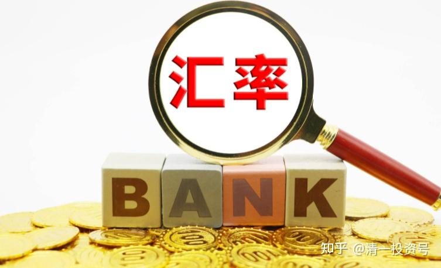
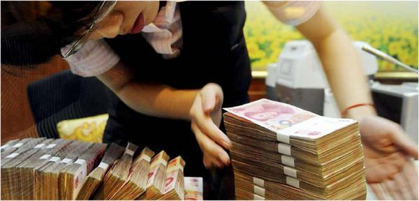
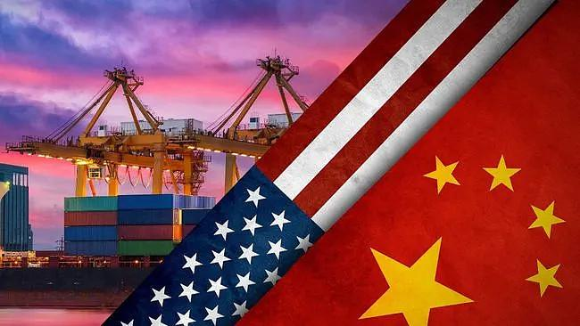
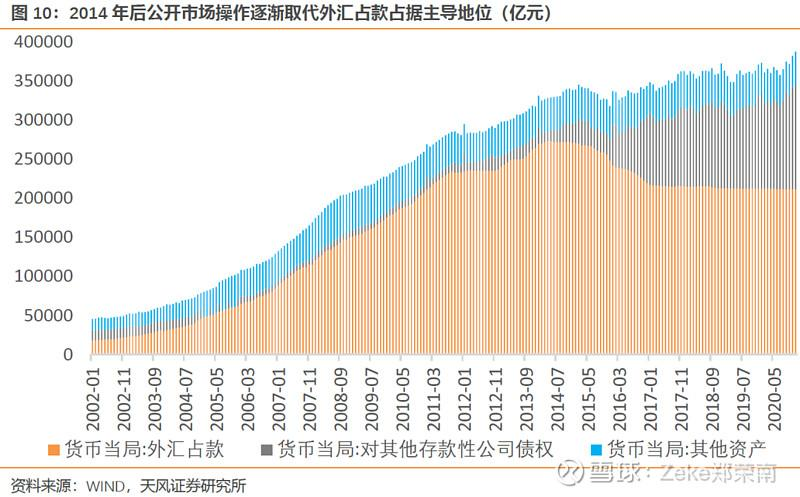
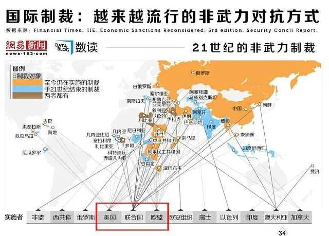
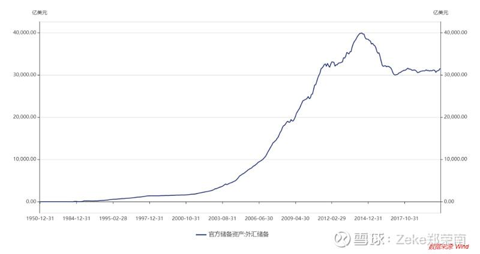
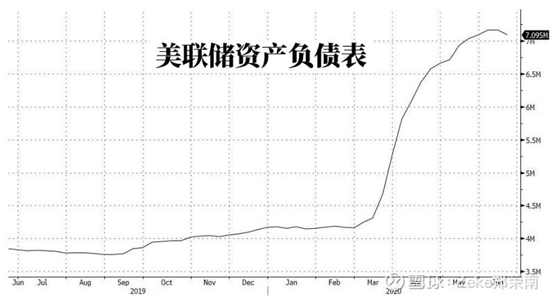

原专栏**169篇.[中国放弃汇率目标：资产价格上升时代的投资策略](http://link.zhihu.com/?target=https%3A//xueqiu.com/2684655177/181252586)**

清一山长2021年5月30日

中国宣布放弃汇率目标，金融之争迎来大变局”

我不知道是否未来真的这样走。但中国人显然不想继续为美国人打低端工了。未来全世界物价上涨，几乎是必然的，便宜的资产会到处争抢的。钱会多得你想象不到，流动性泛滥。

楼市现在不让资金进去，资金会买很多东西，估计珠宝啥的也会大涨吧？当然，教育资源、[医疗](http://link.zhihu.com/?target=https%3A//xueqiu.com/S/SZ159891%3Ffrom%3Dstatus_stock_match)资源也会涨的。我认为：现在大家如果手上有钱，可以去买点矿存起来。（[中国中铁](http://link.zhihu.com/?target=https%3A//xueqiu.com/S/SH601390%3Ffrom%3Dstatus_stock_match)）家里就有矿，建议买便宜的H股[大笑]。

这种资源股，也许是下一波资源和资本价格狂涨的标的。可惜去年的[中国宏桥](http://link.zhihu.com/?target=https%3A//xueqiu.com/S/01378%3Ffrom%3Dstatus_stock_match)持有少了一点，这就是家里有矿的好处，宏桥涨幅明显大于[中国铝业](http://link.zhihu.com/?target=https%3A//xueqiu.com/S/SH601600%3Ffrom%3Dstatus_stock_match)。现在国外矿价狂涨，中国输入性通胀是必然的。为了压制，中国减产，会让世界的通胀更加严重。有钱买不到货的时候，中国的产品未来价格大涨是必然的。

一句话：别持有现金了，请持有资产！

转载雪球球友文章《[中国宣布放弃汇率目标，金融之争迎来大变局](http://link.zhihu.com/?target=https%3A//xueqiu.com/2684655177/181252586)》

雪球网页链接：[https://xueqiu.com/2684655177/181252586](http://link.zhihu.com/?target=https%3A//xueqiu.com/2684655177/181252586)

这几天央行放出一个重磅炸弹。一位央行官员宣布，将要放弃汇率目标！这个消息实在是太重要了，有可能冲击到未来几年世界的格局，中美关系也将发生深刻改变，我们的工作生活也会受到直接的影响。

意味着什么？中国央行金融研究所所长周诚君上月在莫干山会议上表示：人民币国际化条件下，我们管不了人民币汇率，**中国中央银行最终要放弃汇率目标**，人民币汇率是由全球所有市场主体对人民币的偏好、预期和交易决定的。人民币在中长期内将持续对美元升值，既是中国经济持续增长、人民币相对购买力不断提高的结果，也是美联储搞量化宽松和不断扩表的后果之一。

如果人民币成为了周边国家以及与中国有密切投资贸易往来国家的货币锚，这些货币都将对美元升值。

这件事背后的意义相当大，很多人一眼看过去以为没什么，实质上背后不仅是汇率的问题，对中国的出口，中国的经济结构，世界产业链以及美元都具备十分强大的冲击力。

央行放弃人民币汇率目标，换句话说就是不再以美元为锚，而是以全球市场对人民币的需求情况进行汇率浮动。这可不是个小事，意味着人民币与美元的脱钩，并将在中长期内持续对美元升值。

**改革开放以后，中国的货币发行方式主要是靠外汇占款。**

意思是，中国企业赚取外汇后，央行通过结汇手段，用人民币从企业手上购买外汇，以这种形式把人民币发行出去。外汇占款曾一度占到我国货币发行的80%～90%左右。

哪怕是在2018、2019年，外汇占款也有65%左右的占比。

这是因为，中国是世界上最大的制造国，我们将大量的产品卖给外国人，由于美元是国际货币，外国人支付我们的基本上都是美元，我们的企业收到美元后，由于在国内没有办法使用，而去国外投资又受到种种限制。所以只能卖掉美元，持有人民币。

于是，央行就要发行人民币，满足中国对人民币的需求，形成外汇占款。**长期以来中国都以美元为人民币的货币发行锚定之一，中国兑美元的汇率就掌握在美国手上。想让你低就能低，想让你高就能高。**所以，中国的汇率一直都被人为的压低。**因为人民币越便宜，同样的美元就能换来更多产品**，但由于人民币币值不高，购买生产所需的原材料也会更贵一点。

现在，人民币逐渐和以美元建立起来的国际贸易体系结算相脱钩。这是人民币地位提高最有效的证明，人民币准备要独立于美元体系之外了。所以，之后最直观的体现便会是人民币升值。

在国际贸易方面，也可以拿着更少的钱去兑换更多的商品，这也说明中国要把经济转型提速了。**从廉价劳动力输出模式换档到争取高利润、高技术含量的产业模式。**不过**根本上，**还是**在以金融和外汇手段对抗美国**正在举起的收割镰刀。

美国的打击方式——美国对中国围追堵截的方式，总结起来也就“三板斧”。

**第一招：封锁禁运。**

这一招，常常用于经济体量不大，贸易规模不足，且产业结构单一，不能自给自足的国家。例如，俄罗斯和伊朗。两个都是以卖资源为生，如果它们的天然气和石油找不到卖家，国家收入就会大幅缩水，民众生活质量也会持续下降。

历史上，我国建国之初，美国曾进行过封锁禁运，确实加剧了中国的物资短缺和经济困难，削弱了中国的经济实力和战争潜力，最直接的影响是进口货物价格上涨。但现在这招对我们作用不大。

中国已经是全球最大供应国，与超过130个国家建立贸易伙伴关系，早已与全球产业链深度融合，美国的贸易禁运难以落实。

**第二招：军事威胁。**

对小国杀伤力大，几个航母编队开到你门口，摧枯拉朽般地碾压，直接暴力摧毁政权。

但对于中国这样军事规模足够大，且拥有核武器的国家，哪怕是美国也只能在周边制造热点事件，不敢直接军事硬碰硬。毕竟美国连阿富汗和越南都没有真正征服过。对于中国，那帮鬼精的政客心里多少还是有数的。

**第三招：美元收割。**

这是美国，对付中国最主要的手段，因为前两招用处不大。之前，**人民币一直是与美元挂钩，以外汇占款作为货币发行的主要方式。**我们和国外做生意赚了美元，央行必须按照汇率，发行与美元价值相对应的人民币。

假设汇率为1:6，美国一家公司要买中国一家公司价值1000万美元的鞋子，然后央行根据汇率印6000万人民币给中国公司，央行手上就有了1000万美元。反之，你如果要去国外买东西，就得拿着6000万人民币去央行兑换1000万美元，然后再去国际市场使用。

如果我国进出口保持均衡，那问题并不大，但地球人都知道，中国是世界上最大的商品出口国，全世界拿美元来我国买东西的人实在太多了，所以就导致央行手上累计了海量的美元，这就是大家都知道的“外汇储备”。

那中国人民币的购买力的决定权就掌握在美国人的手里，随时能用低廉的价格购买你的商品，而你储备的外汇，也能在随时波动的外汇市场上一点点消耗掉。

现在中国宣布放弃汇率目标，为的就是瓦解美国金融收割的手段。

对美自卫反击战，那中国为什么偏偏选在这个时候宣布放弃汇率目标？其实是有充分考虑的。

之前，我们需要人民币保持对美元的低汇率，是要扩大出口，让中国的商品能够占领更多的市场份额。当然，这也有弊端，**我们只能赚一点辛苦钱，商品价值不高，必然无法获得足够的利润。**

美国自2008年次贷危机以来，出台四轮量化宽松，美联储的资产负债率从8000亿美元，攀升到疫情前的40000多亿美元，足足涨了五倍。几年的时间便超发五倍货币，其中的疯狂行为着实让人震惊。

不单单是美国，**全世界主要经济体的央行，在次贷危机后无一例外的选择放水救经济**。搞科研磨磨唧唧，研发“核动力”印钞机是一个比一个快。

十几年来，马不停蹄，彻夜不眠，开闸放水。但他们始终都有一个顾忌，因为放水后，我们都知道，货币超发将带来通货膨胀。**印钞印得越多，通胀就来得越猛。**

尽管他们一直在放，但是节奏有点像前列腺出毛病带来的尿不尽，放一点，忍一点，就是怕恶性通胀突然到来。不过，让人意外的是，全球范围的通胀并未在各国开动“核动力印钞机”后，如期而至。所顾虑的事完全没发生，失去了惩罚机制，就更加肆无忌惮，开始无节制量化宽松，一轮又一轮。这是典型的“吸毒上瘾”。

其实，背后的真正原因是中国扛住了所有压力。没错，就是中国。

**中国长期以来的“廉价”人民币，向全世界提供了“廉价”商品。事实上，中国在向全世界释放“通缩”，几乎把各国央行释放出来的“通胀”给对冲掉了。**

很多人都会认为，美国在量化宽松后没有发生通胀的原因是全世界分担了流动性。实则不然！是中国大量的廉价商品，把通胀的影响冲掉了。

通胀的本质是商品没有增多，但是货币增加，引发物价最终上涨。如果市场上生产的商品足够多，那便没有货币贬值和物价上涨这回事了。

疫情发生后，特别是拜登政府上台以来，放水是一轮猛过一轮，天量流动性即将传导到消费端。

现在，**人民币升值意味着结束出口补贴美国消费者的历史。**正式和美国打对攻，开始向美国输出通胀。

**中国再也不愿意承担美国大放水后的输入性通胀了**，这次如果像2008年4万亿那样国内放水硬抗美国输入的通胀，可能是自己先扛不住，通胀爆表，然后加息，刺破楼市泡沫，致使国内发生系统性金融危机。升值人民币是在推升美国的通胀，逼迫美元加息，刺破美股泡沫，完完全全将了美国一军！

中美之间的明争暗斗，已经彻底步入金融战的时代，双方都想尽办法，让对方的泡沫先破裂，让对方承担一切后果，自己全身而退。毕竟全世界就两个泡沫最大，一个是美国股市，另一个就是中国楼市。日本的债市，在如此天量的两个巨佬面前纯属小儿科。

我们正站在历史的十字路口上，一同见证历史，见证这个大时代。
