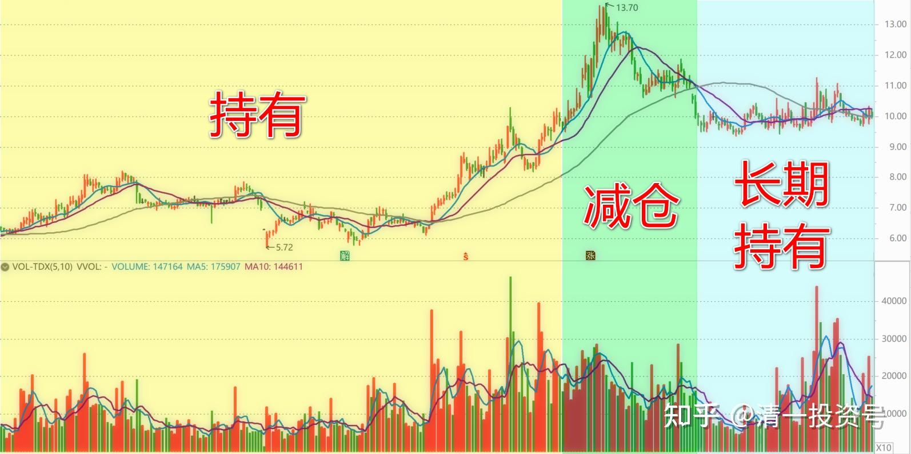
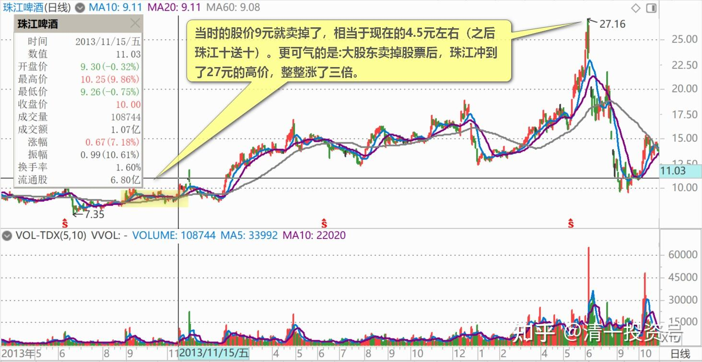
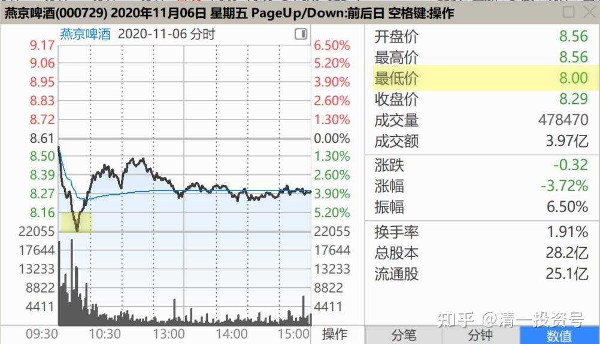
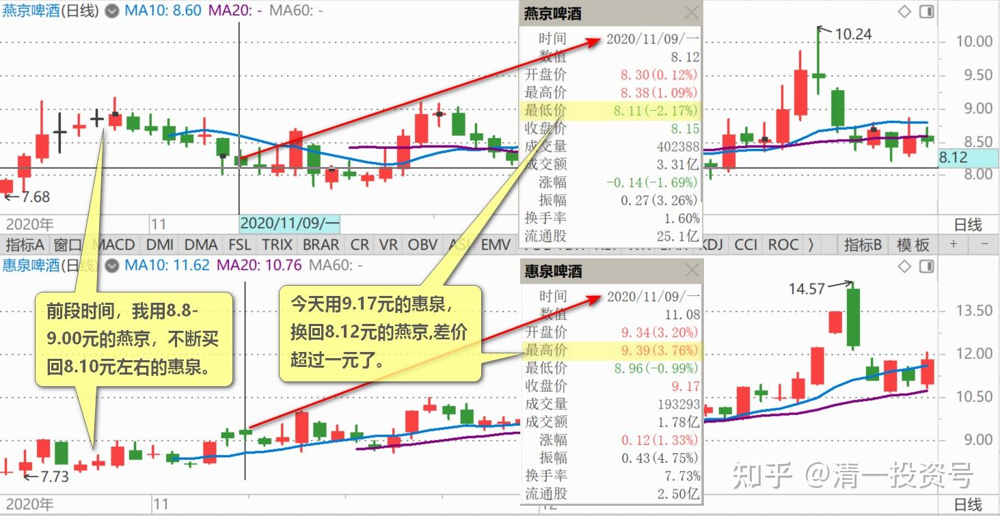
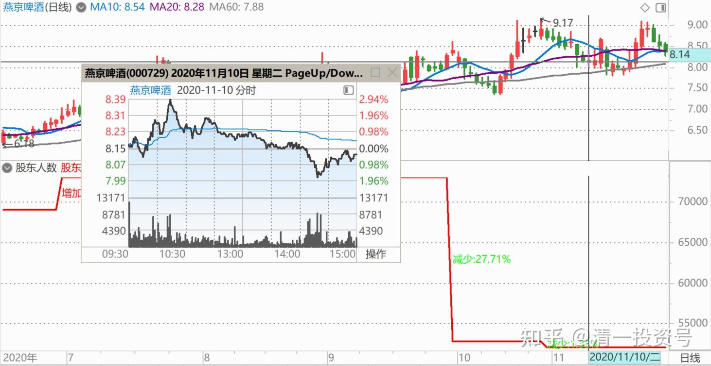
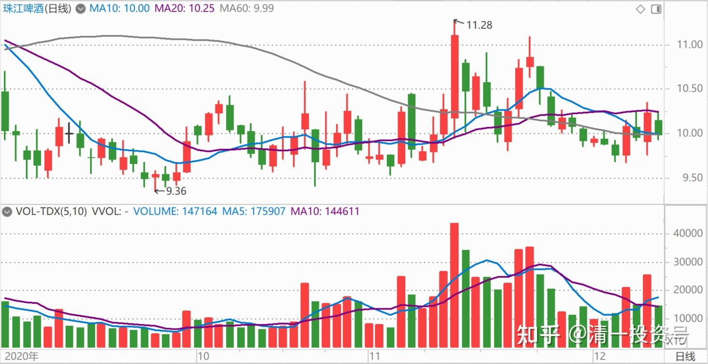

57篇.持仓，减仓，长期持有

清一山长2020年11月7日～10日

[转：珠江啤酒一发起人两度减持 合共减1000万股](http://link.zhihu.com/?target=https%3A//baijiahao.baidu.com/s%3Fid%3D1676713811632747042%26wfr%3Dspider%26for%3Dpc)

清一山长2020-11-07 09:09:14（评论上文）

$燕京啤酒(SZ000729)$ 减持在地板价上的珠江啤酒大股东。今年永信减持珠江1200万股，卖了个好价格（11.22元均价出售）。但几年前，2013年，另外两个大股东，却把珠江卖在地板价上。当时的股价9元就卖掉了，相当于现在的4.5元左右（之后珠江十送十）。更可气的是：大股东卖掉股票后，珠江冲到了27元的高价，整整涨了三倍。大股东把成为亿万富豪的机会拱手相让。

重阳现在减持了三千多万股燕京，走势会怎样呢？会不会也减持在相对低位？股价从此开始正式的上涨？反正我不相信会从此阴跌。燕京已经“阴跌”多年了。昨天盘面上是跌了一点，但比想象的跌幅低得多，早盘急跌很快就拉起来了。**其实8.21元我看到有三十多万股卖单出现，我就想直接秒掉。可是我刚开始打单，就被人吃掉了。**很快就直接上去了，再没有低过8.10元。

为什么？其实我一直读盘燕京，觉得它似乎一直有一只看不见的手在压盘，该涨的就是不涨。**看起来有人就是不希望它涨似的。**原以为是别人不想替重阳抬轿，其实这次发现：是重阳自己不愿意它涨。它真心要减持的话，不会像这次这样做的（珠江、惠泉，都示范了主力不想要货的样子，制造波动赚钱。但它们俩都还没有到真心减持的样子。真心减持，看上次示范点评的某庄股的走势就知道了。燕京现在的走势，似乎有人还想继续拿货，故意压盘的）。我认为跟监管无关，跟它想吓你一跳有关。上次进入视野，是2018年重阳晋升为燕京的5%大股东，累计持有1.4亿股。这次减持公告，才发现已经有9.99%的持仓了。按规定不是过了5%以后，每增减持1%，都要公告的吗？这是咋回事？只看到减持超过1%了，他跑出来公告吓你。但之前增持快9.99%了，怎么一次公告都没有看到？（**理由只能是重阳增持到9.99%就是不想让你看见，减持到8.7%才想让你看见。**）我对自己看盘的能力，还是比较自信的。惠泉上，主力的东西被我看得很清楚。可惜燕京上却就是看不准。让我的账面利润比惠泉还低。可持仓是惠泉的N倍。不涨也好，没赚钱就赚股，不涨就让我的股数越来越多。一涨就赚翻天[赚大了]。

清一山长2020-11-09 15:23:26

$燕京啤酒(SZ000729)$ 今天上午看了回盘，卖了一点惠泉。中午睡了一觉，尾盘起来看燕京又跌了，重新买回了80万股，分单挂进去的，8.12元居然给了我40万股，而最低价才8.11元，创了今天的纪录。**前段时间，我用8.8～9.00元的燕京，不断买回8.10元左右的惠泉。**重新买满了出掉的仓位。现在已经证明是一个不错的生意。**今天用9.17元的惠泉，换回8.12元的燕京,差价超过一元了。**难道这一次会成为一个坏生意吗？我就等等看吧！就算吃亏了，我至少多赚了股数[俏皮]。

风言语回复清一山长：

我在山东铁道游击队的故乡，说几个燕京啤酒的见闻。在老家农村，我奶奶九十二岁了，几乎每天都喝一杯啤酒，现在把山水啤酒（青啤旗下的）改成燕京啤酒了，她说燕京比山水口感好，我到超市买酒老板推荐我买燕京而不是山水，说是燕京开瓶有奖；我一朋友70后的，平时都是喝青岛八度，上次小聚居然向我夸赞燕京U8如何好喝，包装如何方便；我们本市公交车后屏广告正在诚招五区一市的燕京U8代理商。注：本地有两家青岛啤酒下属的啤酒厂，现在正在建新厂，把两家合成一个厂。今天陪奶奶吃午饭，白菜粉条炖肉+燕京啤酒。

清一山长2020-11-09 16:03:53回复风言语：

敢到青啤的老家去捞场子，燕京胆子真的太大了[俏皮]！

清一山长2020-11-10 11:14:09

$燕京啤酒(SZ000729)$ 昨天8.12元抄底燕京，现在看来是成功的操作。昨天尾盘，就明显感觉主力有意打压，收了个低价的。所以不断埋单低位买买买。今天上午，果然就冲到8.42元了。不过我这次买入，计划是做长线的，至少过了9元再卖。没有打算做短T（除非惠泉大跌，迫使我提前换股）。

燕京，没有伪装，主力没有真的真出货。要是真出货，会像珠江啤酒一样的走势——急急忙忙的上攻。珠江的出货，不仅仅是永信减持了1200万股。其他一些主力，也在13元多开始减持了，急涨，慢跌。一直慢慢地减持到9元多。从近期的盘面语言看，珠江再次进入了“战略相持阶段”，就是珠江“不愿意涨”，涨一点就回调。其实量根本不大，压盘并不多。要涨起来，并不费事。不涨，就意味着有人不想它涨。**因此9元多，反而是买入仓位同时做T降低成本的最佳机会。10元多卖出，9元多买进，不断做T，成本大大降低。**12元以上，是净卖出的机会（就现在的指标来看的话）。

燕京，如果真要出货的话，走势就要模仿珠江的样子——**激动中，出各种利好，上涨，至少要破十元，拉出一副“做重庆啤酒第二”的架势来，吸引大量跟风盘进入，这才是要出货的样子呢！**但燕京，一直到现在，都是不死不活的磨叽，说明主力根本就没有出货的意图。**磨叽的唯一理由，就是筹码还不够。从燕京股东数量大量下降来看，明显就是收集筹码的行情，有啥可怕的。**

珠江现在在9元多不断磨叽，就是不肯涨，也是主力的筹码不够。磨叽就是做T的最好时段，也是主力利用磨叽降低成本的最佳方式。**防止T失败最好的方式，就是跨品种做T。比如从燕京T到惠泉，从惠泉T到珠江、燕京等等，轮流来T。**做好了，比单一做T收益好得多。难度就是：你必须对三只啤酒的内在价值有非常清晰的判断，知道何时该切换了。否则就会T飞。不过，从目前来看，三只啤酒，都给了我大量的机会来做T。他们都喜欢不断地磨叽。跟白酒股的爽快涨升完全不一样。白酒股，高位磨叽，就是出货的手法，一旦完成出货，价格需要很多年去消化，很多年回不来的。由于我觉得白酒股有这个嫌疑，所以我不去碰，手上有货，就慢慢出。新货是不买的。避免当接盘侠。宁肯错过，也绝不投机取巧。目前依然持有8位数资产的白酒仓位，边涨边卖，减仓动作。

而**啤酒是“持仓”——在不减少仓位的情况下做做投机切换，降低持仓成本。**过了10元，我不会立即清仓的，我会开始考虑逐步减仓啤酒，同时做T降低成本。涨得越高，减仓越多。**持仓成本最终降到低于零成本的位置后。就会再次进入“长期持有“阶段，比如持有十年**。做做T跟随涨跌。T飞了就算了。

也就是说，这几只啤酒。**一旦过10元之后，我会继续持有啤酒。也会不断做T降低成本**。但不再公开发言和示范我的操作了！避免误导众生！

祝福各位多多赚钱。10元以后，我会尽量少说啤酒了。我闷声发财就行了，也免得有人看不惯。[俏皮]

(标题、图片为编者所加)

**文章音频**：

[434篇.持仓，减仓，长期持有_清一投资号文章同步音频](http://link.zhihu.com/?target=https%3A//www.ximalaya.com/sound/721738464)

**参考链接：**

[49篇.报表已经证明燕京正在重新崛起](https://zhuanlan.zhihu.com/p/681475572)

[50篇.惠泉股性活跃，喜欢刺激的人有福了](https://zhuanlan.zhihu.com/p/682717047)

[51篇.是风险赌博还是稳定投资？](https://zhuanlan.zhihu.com/p/684479170)

[52篇.惠泉、珠江、燕京的换手率](https://zhuanlan.zhihu.com/p/685682634)

[53篇.三只股轮动，谁涨停卖谁，谁跌停买谁](https://zhuanlan.zhihu.com/p/686904967)

[54篇.黑文滚滚或是粉红一片](https://zhuanlan.zhihu.com/p/687874750)

[55篇.啤酒行业，已经有大鳄进来了](https://zhuanlan.zhihu.com/p/689415289)

[56篇.高明的人，会用真实的事实来误导你的决策](https://zhuanlan.zhihu.com/p/690672420)
