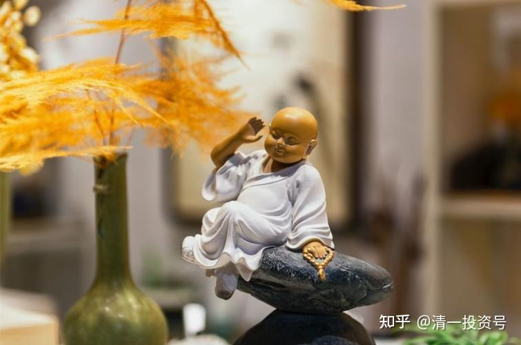
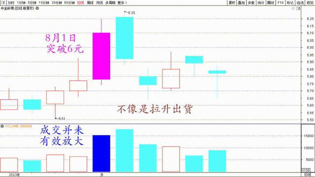
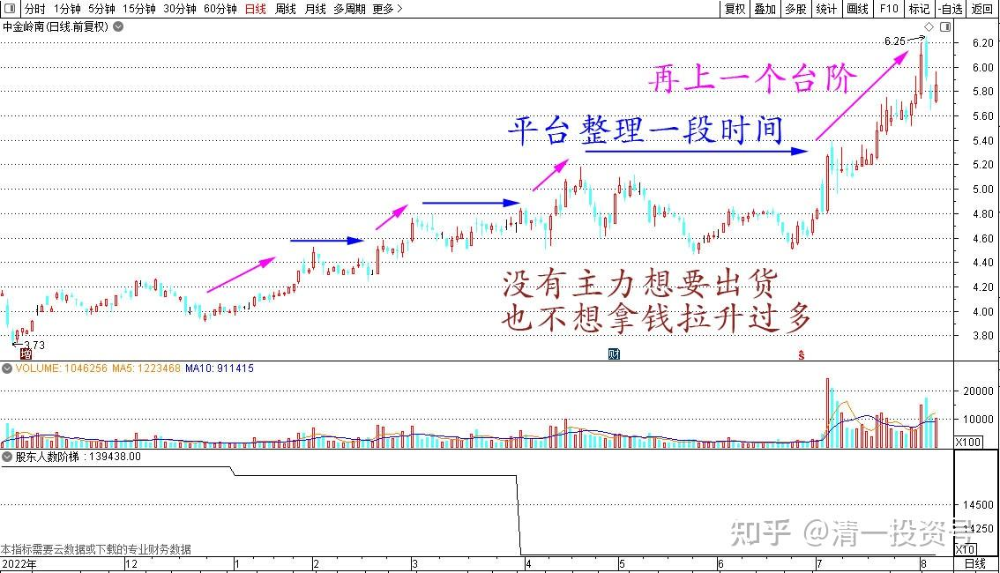
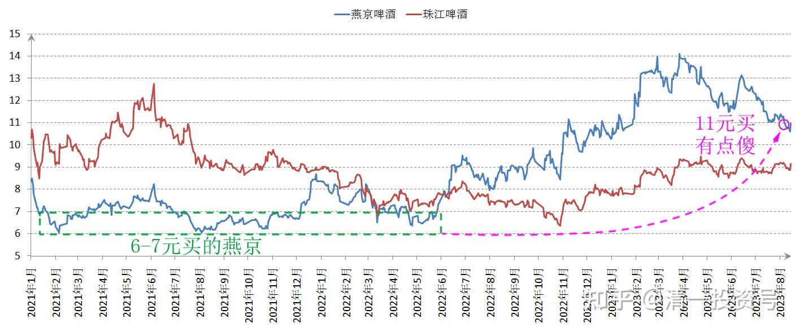
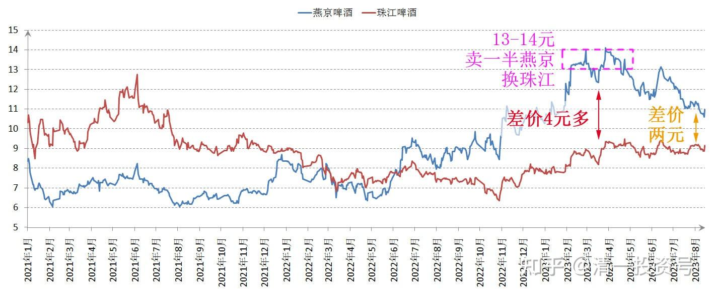

57篇. 省心省事，不多做

清一山长 2023年8月4日

我做不大不小股东的中金岭南，最近意外上涨了。两天前，有朋友私信找我，说已经赚了不少了（4元入手的，这一天破了6元了——问我是否要卖出了）。我看了一下图，表示成交并未有效放大。因此不像是拉升出货的样子。可以不用管它，继续睡觉！第二天小幅冲高后，就开始回落。第三天还跳空下跌，图形上看上去特别像出货。其实，量能也没有放大。特别是昨天的下跌缩量。因此——绝对不是拉高出货。我一点也不担心。今天居然就反弹，证明了主力不愿意继续打压，怕失去手上的筹码。这几天，无非是用8月1日拉升的筹码，打压一段时间玩而已。

我认为后期会继续高位震荡一段时间。图形显示似乎是有新主力进场，但手上筹码不够，所以拉升后被打下来，然后再继续墨迹。注意特点：从4元左右的底部平台上升以来，中金岭南是没有大幅回调的。都是平台横幅整理一段时间，再上一个台阶，然后平台整理，然后再上。这种情况说明——没有主力想要出货。但他们似乎也不想拿钱拉升过多。所以——守着就行了。这就是我三天前告诉人没必要走的原因。

当然，8月2日走了是高手，昨天补回就更高了。只是——你是4元买入的股票，跌到5.7元你就愿意买进吗？**等你观望一下，以为会跌到五元的平台**（如果出货肯定会——）。**结果看到别人不跌了！因此你踏空了！犯得着这样玩吗？**

燕京我其实13～14元跑了很多，但现在我都不太愿意全部捡回来（捡回来一部分了）。为啥：总觉得原来6～7元买的燕京，现在11元买有点傻。不如买别的。因此——导致错过一些好股。

当然，我只是卖了一半燕京，换了珠江。但跌了这么多，我都不是很想换回来。两股差价原来有四元多，现在只有两元了，我居然还不想换。就是这种心理的表现。不过——燕京还有一半，就等它表现吧！所以：**为了省心省事，不多做**。

中金岭南我就决定不管了。随它怎么画图。这点小T，我就不做了！**除非看它放量上涨，我才会跑！不放量，我就慢慢跟着走！**

**参考链接：**

[12篇.啤酒系列5：早期珠江啤酒、燕京啤酒的换仓记录](https://zhuanlan.zhihu.com/p/602033762)

[13篇.啤酒系列6：买卖操作后的富足之心](https://zhuanlan.zhihu.com/p/604162057)

[14篇.啤酒系列7：珠江的破位急跌，名曰跌停进货法](https://zhuanlan.zhihu.com/p/606062514)

[22篇.它很可能是下一个重庆啤酒](https://zhuanlan.zhihu.com/p/645392522)

[23篇.危机时刻好公司不用担心](https://zhuanlan.zhihu.com/p/646998882)

[24篇.守住筹码很不易](https://zhuanlan.zhihu.com/p/648860208)

[56篇.啤酒下跌，应机而动](https://zhuanlan.zhihu.com/p/649780980)

