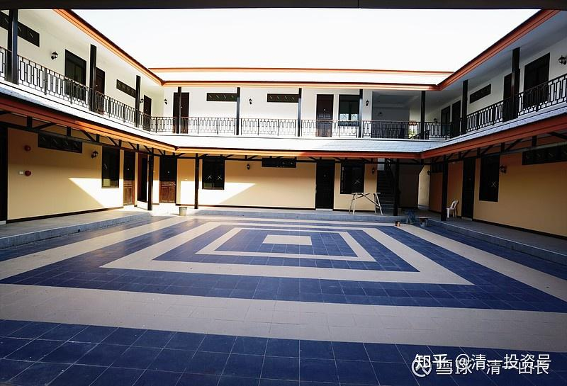

原雪球专栏[173篇.财富自由的起点：大约30～40万元！](http://link.zhihu.com/?target=https%3A//xueqiu.com/9310099567/182257598)

清一山长2021年6月9日

我悬赏发帖：多少钱可以得到财务自由？答案五花八门。有各种答案，很多人就是拍脑袋来决定的答案，凭感觉、想象，乱猜一气，没有啥基本的逻辑体系可言。自然，很多人也只是说说而已，根本就不会当真的。**不思考，已经成了很多人的惯性。做计划，也不会真来实行的，只是拿嘴巴来说的。**这实在令人遗憾！

似乎**我们的教育，从来没有教会学生“做方案”。**结果都成了羊群，人云亦云。乱编一个看上去像是答案的东西出来，有效无效不管的[滴汗]。

我今天在这里，认真给各位一个“标准方案和思考的系统示范”吧！

**财务自由的起点，仅仅是30～40万元而已！**您就可以不用工作，而过上普通人的生活了。当然，这是最低的标准。下面是我本次财富自由的题目和论证过程！

**原题：您最低用多少钱的资本金，用来进行稳健的投资，就能得到财务自由了？请写出您的财富自由方案！**

**财富自由的概念**：就是

1.不需要工作，只需要投资的被动收入，就能过上其他人通过工作、劳动，才能过上的生活。当然，要求是普通工薪人员的生活，别跟富豪们比！

2.您的生活质量，不比您所居住地区的工作人员的生活质量更低。

3.您有行动自由，可以满足必要的工薪人员层次的旅游需要，甚至您还可以出国旅游。所以您不能买一块地，天天守住，种地刨食吃。这种自由其实不算自由。

4.您还能结婚生子，养儿育女，帮孩子们一路考上不错的一流大学，甚至还能出国留学，去国外的第一流的大学留学。所需的留学费用您都可以支付，您完全能尽到做父母的责任，帮助愿意学习的孩子考上理想的大学，支持他们顺利读到大学毕业。虽然这样做，有可能要紧紧张张地使用您到手的固定收入（不能提取和减少本金）。

5.住房、卫生、健康条件，都是有保证的，您不比一般人差，您不能住在一个牛棚里面。

6.您的投资，必须保障您每一年都能得到稳定的收入，避免您生活质量下降。而且，还必须能够很长期的维持下去，就算几十年之后，通货膨胀惊人，但您的收入，依然会随着市场的增加而增加，不会让您过不下去日子。就算遇到金融危机，您也不至于没收入。您的这笔资产，永远在帮助您获得自由的生活。

请拿出您的有效财富自由方案。我根据您方案的有效性，分配奖金。等大家答完了，我也公布一份我研究的结果。也许答案比你们想象的更容易。你们会发现：**很多人，其实自己早就有财富自由了，只是他们以为没有！傻乎乎的每天过着自己不喜欢的职场生活。**

作者：清一山长

雪球[网页链接](http://link.zhihu.com/?target=https%3A//xueqiu.com/9310099567/182059735)：[https：//xueqiu.com/9310099567/182059735](http://link.zhihu.com/?target=https%3A//xueqiu.com/9310099567/182059735)

您最低用多少钱的资本金，用来进行稳健的投资，就能得到财务自由了？请写出您的财富自由方案！

**思维方式：要满足第一条的条件，不需要去工作，仅仅靠投资回报，就能得到普通工薪人员的收入水平。所以，不要去想象自己需要多少钱才够，每个人的欲望都是没有边际的，亿万富豪依然觉得自己的钱不够用。所以，我们必须找到一个很客观的参照系出来。**

**得出结论：我至少需要每年多少钱的被动收益，才能算达到了这个参考目标。**

**最客观的参照系，自然是所居住地区的工薪水平了。有两个指标：一个是最低工资标准，一个是平均工资标准，我们就用这两个标准来看，最低的被动收入需要是多少？**

**案例示范一：**

坐标云南：云南2020年度的最低标准工资，居然一个月只是1350～1670元。一年1.5至2.0万元。（资料：云南省一类地区月最低工资标准调整为1670元，小时最低工资标准调整为15元；二类地区月最低工资标准调整为1500元，小时最低工资标准调整为14元；三类地区月最低工资标准调整为1350元，小时最低工资标准调整为13元。）

当然，这个标准是很低的，勉强只够生存的水平吧？所以，还有另外一个标准：该地区的平均工资水平！

2021年昆明市薪资水平报告：平均工资每月**¥**4118元。

那么，结论就很简单了：如果您买了分红率达到5%的股票，每年实现最低标准工资的投资额需要是30万元，达到平均收入的投资额，大致上接近100万元的样子。

**思维要点二：一年5%容易保障。但如何能够保障我的这种投资组合是稳定的，可以在未来的10年、20年不需要操心，可以自然延续？甚至还可以每年稳定增加分红的收入，抵御物价上涨？**

有些网友就出来胡乱划拉一句：我用多少钱，只要弄一个年复合收益率达到30%的收益，我就财务自由了。这样算，您有5万元的本钱就够了，一年收益1.5万元，达到最低工资标准了。我做惠泉啤酒，一年的收益率，超过了100%。我能说：各位，按照我做惠泉啤酒的经验，一年只要1.5万元，就财务自由了？我根本不能保障我每年都能抓到赚取100%的股票的机会。如果真能保证，我就是股神了！这种速度，再过几十年，全世界的钱都被我赚走了[滴汗]。

**资深投资人，一年100%可以拿到，但连续每年平均都稳赚30%，全世界没有人能保证的。**不过，目前，想要稳赚20%倒是还真的有。找个0.75PB以下，15ROE的股就够了。

**巴菲特最近十几年的复合收益率，才10%左右呢！这已经很不错了。**

所以，不客气地说：上面这样大口大气说啥找个30%复利的网友，就是妄想型的人，根本不懂投资，来股市，就是赔钱的。他们**没有自己的逻辑。没有逻辑，没有理性，也不学习，没有为自己的语言负责的习惯。只知道张嘴就乱说，看起来似乎蛮精明的，其实傻得可以。生活中，你遇到这种信口开河的人，千万别跟他合作，别相信他的本事，因为他就没本事。**

**要实现第二条的要求——持续稳定的获利，是很难的。**因为中国市场上，要找到分红率高于5%的股票，虽然也有一些，但已经不是太多了（港股要多得多）。要找到其中每年都能稳定分红5%的股票，就太难了。要保障十年、二十年依然能够保证分红5%的股票，更难。现在的银行股，勉强符合这个要求，如北京银行分红超过6%，而且历史记录上还算稳定；农业银行也是相对稳健的长期投资品，红利5～6%。可惜银行股有可能不稳定，容易受金融危机的影响。水电股倒是好一些，十年、二十年之后都很稳定，可惜分红率不达要求。银行股经过多年的洗礼，被鄙视多年，我认为大概率未来会走上正途，持有一些应该是好机会。

最难的还不是有稳定的分红比率（比如中国神华基本可以做到），而是每年稳定的分红增长，这就难极了，相当于蓝筹股加上成长股，而且价格还要便宜。

我们知道：市场上，工资会经常调整的。所以，想要找到一个每年保证增加工资（分红）的股票，每年稳定提高分红率，不受经济周期影响的股票，难度就更高了。不知道你们能找到符合以上所有条件的股票吗？

我倒是勉强找到一个：就是每年分红稳定增加10%的中国建筑。ROE多年都维持在15%以上。现价的分红率，如果算2021年的话，大约是5%，比[长江电力](http://link.zhihu.com/?target=https%3A//xueqiu.com/9310099567/183209750)这样的股票更靠谱。所以，中国建筑作为“财务自由股、养老股”，倒是很靠谱的。它的毛病，就是不涨。但正因为不涨，才给了我们很好的机会去不断买入。

如果买了中国建筑这样的股票，分红率接近5%，大约30～40万元本金就能满足这一要求。而且中国建筑基本上每年都会增加10%的股息分配，等于你每年都可以涨一次工资，每次涨10%。今年分红其实比去年多了16.6%，算是意外惊喜——每年增长10%而且保底的股票。

分红涨，本金也跟着涨。我认为中国建筑十年后，涨三倍应该概率很大，甚至五倍都有可能。所以，您的养老资产，时间越长越多，您这一生都不愁钱花的。

**思维要点**三：每年这点收入，就算财务自由了吗？当然算。别人要每天辛苦工作，看客人的白眼，被领导训斥，才能得到这笔微薄的工资。您啥都不干，就得到一样的年薪，您还有啥不满意的？剩下来的时间，完全可以去追寻自己的梦想，完善自己的能力圈，说不定，您用无忧无虑的心情，去做自己喜欢的事情，还能达到比较高的地步，甚至赚到更多的钱呢！比如去学习研究医学、健康、武术，以及教育等等。说不定成为行业的专家，成不了您也不用着急，不会因为急功近利，为了工资而牺牲自己的原则。

这不是很美好的事情吗？

您非要说：“就这点钱还不够！”我只能说：“您真贪心！欲望真大。您就为了您的欲望去打工吧！”

你说，你要在北上广买房、买车、买飞机，还要出国旅游，孩子要出国留学，还要准备好医院的治疗费等等。这点钱怎么够？

**有人就是明明可以活得轻松和自由，却为了想当“更有面子”的“高级人”，而去当了奴才——一辈子被奴役。**

我说了：**如果很多人，天天打工，拿这笔收入都能过下去，您咋就不能过了？工薪阶层，可以花一千大洋租个普通的套房，您咋就不行？非要自己买房？出外滴滴打车、公交、地铁，您咋就非要私车侍候？出国东南亚旅游，只花几千元就行，您咋不能出国旅游？孩子上大学，去欧洲留学是免费的，您咋就只能上“贵族”学校？非要盯着土豪的做派去模仿，天天嫌自己的钱不够多，要去拼命打工，牺牲身体，牺牲孩子，到头来啥都没有，您不是脑子找抽吗？给您自由的生活，您非不要，就喜欢当利益集团的奴仆。**

**人，其实都是自己找死的，死在自己的欲望中。不是老天不给你活路，而是你非要朝死路上走。**

假如我是普通的人家，我发现了这个秘诀（每个月稳赚几千元的收入）。我会干吗？我当然不会傻乎乎的继续打工，做自己不喜欢的事情。很简单，**我可以利用财务自由，去做一些有价值的事情，得到别人花上千万，都未必能够得到的良好机会，还可以让自己成为更牛的人，更有修养的人。**为啥不干？

比如：假如我就是没钱，但我喜欢新教育。虽然我买不起今日学堂的学区房，无法支付今日国际学校的学费。但我由于有了自由的职业时间，不需要为了一家人的生计而奔忙，我如果真认同和喜欢新教育的话，我就会亲自天天带孩子学习新教育，一路跟随示范班的课程学习、上课、运动。我根本不需要当孩子的老师，去教她啥的，只用当她的大伙伴、学习委员，跟她一起学习示范班的课程，讨论示范班老师的讲课，把我理解的、不理解的内容，与孩子一起讨论思考，**努力跟上示范班的学生进度，模仿示范班学生的样子和状态**。只要这样照方抓药，从小抓起，孩子11岁考上免费班，是大概率的事情。如果孩子表现更优秀的话，还能得到奖学金，进入今日学堂跟随学习呢！至少15岁考取免费的三语高中，是很容易的。

再不济，18岁也能得到欧洲名牌大学的录取，免费上大学（欧洲大学的难度在于三语能力的获得，其他学术难度，远远低于三语高中的要求）。只要孩子智力正常，专心走新教育之路，这条道路的难度系数，几乎等于零，要比去拼高考容易多了。

当然，如果您的孩子，对这条路都没信心，其实高考之路也肯定不会成功的。因为竞争太激烈了，红海竞争，哪有啥好日子过的！

**示范班的第一年：是“外语突破任务”。**

您自己看，才学了一年的孩子们，已经达到啥水平了？现在只需两周最多三周的时间，学生们就可以完全背下一部新电影的全部台词，加上表演，面面俱到。连大学生都不是对手，不信比比？

哔哩哔哩[网页链接](http://link.zhihu.com/?target=https%3A//space.bilibili.com/487498588)

[https：//space.bilibili.com/487498588](http://link.zhihu.com/?target=https%3A//space.bilibili.com/487498588)

**示范班第二年：是“演讲与辩论，高级学术英语的学习”**，今年9月份正式开启。

**示范班第三年：是“用一年时间，学完美国学校十二年的教材和教学内容”，**践行三年学完十二年的承诺，明年9月份开启示范。

**示范班第四年：示范从零开始学小语种,法语、德语或者西班牙语”**，帮助各位跟随者，达到欧洲大学的入学水平，取得免费的世界大学入学资格证。

所以，这些别人要花很多钱，甚至上千万元才能得到的东西（买学区房啥的），我可以不花钱就能得到。这就是财务自由给我带来的好处——**我可以用我的个人时间，来换取我认为是最有价值的生活报酬，去争取得到别人必须花费百万、千万才能得到的教育机会**。就是因为我有最宝贵的，别人没有的机会——我有全天候的时间来陪伴孩子一起成长。亲子关系特别融洽。而别人没时间来陪伴孩子，就只能花更多的钱，送去上今日学堂委托别人教，才能得到一样的教育机会。

**（我公开这一条秘诀，实在是自己打自己的脸，连今日学堂的核心利益都出卖了**[捂脸]**。如果你们都学了这招，我的学堂就没人来了，只有招免费生了**[吐血]**。）**

不过我相信中国人钱多人傻，还是有傻人，就是要送钱来的。不让他们送钱，他们良心都不安，非要花高价去买点什么东西，才觉得对得起自己！所以——你们愿花钱，我当然不拒绝[大笑]。

更多的好处是：如果我花三五年的时间，去认真地研究和践行了新教育，说不定别人看我的孩子带得好，成绩很突出，还会找我带他们的孩子。我等于顺便帮帮别人，还可以赚一笔外快。从事自己喜欢的事情，自己每天学习和提高，还能得到额外的收入？岂不是太美妙了？

当然，如果我就是蠢到连示范班都跟不上，看不懂，做不了，我的智力连十几岁的小孩子都不如，连跟随今日学堂的老师给少年儿童的讲课我都听不懂，做不出来，我就彻底认输吧！这种人，到职场上混也没前途的，也只是个超级无脑的打工仔。还不如每个月拿着几千元天天跳广场舞去，起码快活一点，免得天天被老板骂。因为您注定干别的事情也不会成功的。孩子上世界名校的梦，就只能靠他自己去拼了。拼娃成功，其实也不需要花啥钱。即便家里有钱拼爹，娃也未必能够成功呢！

有了这个财务自由的保障，国人能做的大多数事情，生儿育女，过日子，显然就足够了。甚至孩子出国留学，也够用了。上新教育的一切开销，也完全够了。为啥？既然您已经自由了，如果您认为孩子的教育是最重要的事情，真认为健康是最重要的事情，您就每天陪孩子跟上示范班学习，这孩子绝对差不了。**就算读书不成器，起码身体棒棒的**。因为新教育天天都在练体能，将来考任何大学都毫无问题，包括体育大学在内[笑]，上社会大学送外卖都是杠杠的[加油]。

如果您的孩子能认真学好第三语言，就算是我们的孩子一年就学好了，您的孩子笨一些，花三年才考过B2，您也可以去德国、法国、日本等国留学，还不用出学费，让洋人供养您的教育经费。您只需要自己负担一些生活费，省一点，也够体体面面地当留洋一族了。

如果您的孩子成绩特别好，从小还可以拿奖学金呢！连生活费您都全省下了。在这个过程中，您自己学习新教育，得到了提高。说不定您将来就成为了“金牌家教”，别的有钱的家长不想自己费心学习，就来请您专职带孩子，您不仅仅成就了自己，还成就了别人，自利利他！

如果您想像俗人一样吃喝玩乐，也行呀！跟周围的普通人、退休老人们一样，每天逛逛公园，打打牌，吃吃喝喝玩玩，晚上跳跳广场舞，这样无忧无虑地过一生。也算是一个活法——中国人用资本市场，养了您这个现代懒人——“聪明”的懒人！

如果您有除了教育以外的任何理想和追求，比如，文学、艺术、哲学、中医、健康、运动等等，您有大量的时间，来学习您想了解的一切。甚至您喜欢全国旅游，当个背包客，这些基本的收入，都完全够您游遍世界，当然是穷游的方式。富人的方法，多少钱都不够用。

我的一个朋友，多年来喜欢摄影，全国到处跑，他的每月收入，就是区区的三千多元退休金，但是不妨碍他天天过着自己喜欢的自由生活。

这里面，最关键的是：您有时间来做您最喜欢事情，而且毫无赚钱的压力，您根本就不需要为了一份职业而不得不工作。您的生命是完全自主、自由的。而且这份自由，基本上能持续到一生。

**如果您做的事情，是对大众有益的，甚至是大众需要的，比如医学和健康。您甚至还可以额外的赚钱，甚至赚很多钱。**这难道不是一件很快乐、很幸福的事情吗？因为有资本市场的存在，我们得到了一笔小小的财富，就可以获得终身的财富自由。甚至于，**我们做父母的，可以用自己一辈子被迫工作换来的钱，买一个儿女自由自在生活的机会，不用逼孩子去当现代“工奴”**。

当你明白这件事情，原来财务自由的底线居然这么低！你就会跟我一样，不明白另外一件事情，居然会存在：北上广深，随便一小套房子的价钱，都是上千万。这些住在高价房子里面的主人，却每天只能起早贪黑，早出晚归，通勤上班，辛辛苦苦的打工，赚的钱其实也不多。

比如：深圳一个月两万元的工资，算是中等偏上的收入了吧？我查了深圳的2021年平均月工资收入，也就9195元而已。比平均工资高一倍的收入，够高了吧？但是，每年您为了这20多万工资，在深圳必须支付很高的生活成本，吃穿用、交通、社交费用等开列之后，月工资大半都开支出去了，其实也真的剩不下多少钱。这种工作有啥放不掉的？不如归去——去追求自己热爱的生活吧！如果您还会热爱生活。

如果按照我的方案，把您住的一千万的房子卖掉，拿一千万来买200万股分红5%的中国建筑，每年分红就有50万元。一家人每年住在昆明，或者清迈这样的气候良好，空气清新的地方，而且物资丰富，水果、蔬菜都很多，很便宜，每年您有50万元，可以活得很“富贵”了。相当于10～20个当地工薪阶层的收入水平，您咋不富贵？聘请佣人都够了。您还用工作吗？您早就财富自由了。

如果我还贪心一点，我用一千万元买中国建筑，目前价格（4元多），我是敢上杠杆的。我就买上300多万股。我的融资利息，是5%多一点，所得的分红，基本上覆盖了融资的利息，用这点点小成本锁定了超过20%的资产收益率（PE小于5）。这种仓位低于30%的融资额度，怎么都不可能爆仓的。我就坚持投资中国建筑10年不放手，将来真涨了三、四倍，我的总资产，就变成了6000多万元了。难道您会相信：我守着原来一千万深圳的房子，十年后就会变成6000万元的价格吗？

我还是认为：持有中国建筑这样的公司，比持有房产更靠谱一些。您每年白赚利息，解脱了必须天天工作，看老板脸色的烦恼。十年后还可以获得巨大的资产增值回报。每年躺赚300万元的分红收入，您还能找到比这种收入更高的工作职位吗？（本人在中国建筑上的每年分红收入，超过500万元，我相信比中国建筑的公司总经理都高，谁让我是他老板呢[大笑]）！这简直是老天送的大礼！

【**特别提醒：融资上杠杆，本金全部损失的风险特别大。一千只股中，也未必找得到一只能上杠杆的。非高手不能使用这种金融工具。以上这个案例，不可简单复制**】

您的最大疑问应该是：中国建筑十年，真的就可以上到20元吗？

我不是上帝，我只是一个普通人，我不知道十年后中国建筑，市场到底给它什么价格。但我根据中国建筑的发展速度，以及很多年来的稳定性来判断，中国建筑十年后的营业利润应该是1000亿到1500亿之间。给个正常一点，6倍的市盈率，市值就在6000亿到9000亿之间。股票价格，就在15元～24元之间。所以我说的20元，是中间价，我会死守等这个价格到来。也许五年内就到了，我就可以提前走了，另外选“佳人”（如果有的话）。其实风来了的话，中国建筑超过10PE也不奇怪的。十年只疯一次，只疯到10PE，这要求不算离谱吧？10PE，中建股票卖多少钱？你们就自己算好了。

为啥我的财务自由计划不谈燕京啤酒？燕京啤酒也是我的重仓。其实我认为：十年内，燕京上20元，甚至更高也很正常。但是燕京的分红太低了，不确定性太多，不如中国建筑稳健。但燕京的猴性，应该远远超过中国建筑。所以，长期持有，回报应该不亚于中建，甚至会更高。但不是持股吃息的模式，不够稳健。

**我的要求，是连**“**炒股**”**这个工作都不要，不要为了赚钱操心。其实大多数人，根本就没有炒股的能力，硬找这个“工作”来做，不但没有薪水，反而要赔钱。**持有燕京啤酒、惠泉啤酒等，虽然长期看回报不错，但花的心思要大一些。而且不是专业人员就别乱玩啤酒，心态不好，分分钟会咬人的。中国建筑，是傻瓜都可以拿的股票（也只有“傻瓜”会拿吧）？

您觉得我给的这个养老股不够好，只要您发现其他符合这个财富自由条件的股（现在不错，十年后更好的股），如果有，您也给大家推荐一下，看是否比中国建筑更有优势。华侨城也许也算一个，ROE15，完全符合要求，中海系地产股也行，但总觉得没有中国建筑靠谱。我觉得，这简直是资本市场大赠送的节奏。

事实上，我给老人的养老账户，今天看了看，市值就是11196022.40元。里面的持仓就两只：中国建筑，176万股，剩下的，全是燕京啤酒。燕京啤酒的持仓价是6.71元，买的时机并不是太好，没买到最低价。明天我计划加500万的融资，再买一百万股中国建筑（老人的养老账户我特别的保守，基本不愿意加融资，偶尔用融资买点靠谱的股）。这个账户，是十几年前用几十万做起来的。十年后，2031年，争取实现6000万的市值[加油]。

如果您对于财富自由的模式，有更好的补充，也请留帖指点[大赞]。

所以，我就一直都想不通：有这么好的白送的财务自由，以及发财自由的好机会，北上广深的居民，居然没发现这个奥秘，守着千万资产不会动用，还苦巴巴的每天跑通勤，上下班，忍受非常不良的生活环境，每天忙忙碌碌的，就为了守着一份根本就不值得您付出生命和时间来换取的、根本就不稀奇的工资收入？多对不起生命呀？对于有多套房子的人，就更不可理解了——拿在手上，就为了挣1%～2%的房租钱？劳心费力的，不累吗？找个泰国这样的地方，过着神仙一样的日子，不比在大城市里面吃灰尘强多了？

个别人这么蠢，是完全可以理解的。可这些城市，都有数千万人，咋都这么想不通呢？咋都这么不会算账呢？各位朋友，您能告诉我吗？[大笑]

孔子说：“其智可及也，其愚不可及也。”有些人的智力上限，是可以很容易看出来的。但愚蠢的下限，却怎么也看不清。这就是人性的必然吧？

这是我的客房的内天井，可以用来做舞厅的。这是我自己设计的，中式四合院结构，我自建的清迈家园客房。这套房产，有2000平方，共56个房间，我花费的总成本，也只是深圳一套四室两厅的房价而已。但周边的环境、空气质量、房屋面积，就是深圳的房子没法比的了。

所以，同样是房子，我可以拥有更大、更好的房子，还自己设计和规划功能。每当我想到上次去深圳看到的300多平方的南山区的“水边别墅”，居然每套价格上亿的时候，我都会想：有多蠢的亿万富豪，会选择住在这种高楼林立的“别墅”里面？多搞笑的风景！他们留在这里是为了生活？还是生计？实在说不清！如果是花钱买面子？花的钱可真多！丢的里子也真大！

**评论回复：**

傻猫投资法回复清一山长：

山长说的是最低配的财务自由，要是夫妻双方理念一致，佛系躺平这样活，那确实也是可以的，不过这种“低欲望”生活对年轻力壮的人来说实在没吸引力，过了三十岁，拖家带口的，有房有车，生活以及生活环境相对自由体面，追求过，生活过，才是大多数人的基本目标。毕竟山长自己也是榜样哈，赚钱也没停过。人的能力和成就都是干出来的，七分干，三分学吧！专门学习也没意思。[https：//xueqiu.com/9310099567/182257598](http://link.zhihu.com/?target=https%3A//xueqiu.com/9310099567/182257598)

**[清一山长](http://link.zhihu.com/?target=https%3A//xueqiu.com/9310099567)[11：26](http://link.zhihu.com/?target=https%3A//xueqiu.com/9310099567/182361762)回复[傻猫投资法](http://link.zhihu.com/?target=http%3A//xueqiu.com/n/%25E5%2582%25BB%25E7%258C%25AB%25E6%258A%2595%25E8%25B5%2584%25E6%25B3%2595)：**

“山长说的是最低配的财务自由……佛系躺平”

你们原来真的看不懂我的文章[捂脸]。您以为是让你拿一笔最低生活保证，像动物一样过日子吗？

如果你真的热爱生活，你就回去过你喜欢的生活。一旦你热爱，你就会做出别人做不出的成绩，一旦你有了成绩，别人会抢着送你钱！这就是良性循环。

简单地说：如果我当年被武汉大学的教授职位和头衔捆住，每个月拿几千元苦巴巴地过日子，就没有我的今天。

我可以辞去一份社会上看来很有面子的工作，拼命去抢的位置（985大学的教授职位）。我却赢得了我自己的大学。金钱上，我每一天的被动收入（股票红利），都高过武汉大学教授的工资。就因为**我热爱生命，热爱生活，喜欢在自己追求的领域做到极致。结果，市场给了我难以想象的回报。**现在我一个小时的咨询服务价格，武汉大学的教师打工一个月都赚不来。因为我把他们每天用来弱智重复的生命，变成了天天成长的生命，我能做的是他们不能做的，因此，我一个小时等于他们一个月，有啥奇怪的吗？

你们很多人，连武汉大学这样的鸡肋位置都得不到，拿着一个鸡爪子啃一辈子，对得起自己的人生吗？

我告诉你们这个秘诀，你们确认为我是“佛系躺平”，不再奋斗？笑话！

**我是教你们：不再做金钱的奴隶，而要做金钱的主人。**

**你们也不要再去继续做别人的奴隶，不要让自己的生命，去服务与他人的目标。**

**你至少要让你自己的生命，服务于你的理想！**

如果您爱钱，您也不是**直接去追求钱，用当奴仆的方式来赚钱是最笨的。**如果您用自己的自由时间来学习，让自己成为稀缺资源，你就不缺钱。一个典型的案例：

我太太十几年前，跟别的女子没啥两样的。跟我结婚后，她不再需要打拼事业赚钱（我帮她打理股票），她静悄悄地学习了十几年，比别人考大学还用功，一直在努力。今年才开始出山，接受私人咨询服务，提供网上服务。现在她每天的私人咨询服务，每小时跟我一样是一万元。但她比我还忙，排单已经排到8月份了。她从一个普通的女子，变成了健康医学的神级人物。为啥？因为她学了十几年的真本事。国人看重身体更甚于精神，所以找她的人，比找我的人更多。

她是不要钱，不爱钱的人。她的咨询费，全都捐给教育基金会了。如果她要钱，你们谁能比得上她？十几年前，她跟大家一样打拼，用命去换钱。现在？她用自己的卓越，用提供别人不能提供的服务去赚钱。不比你跟别人拼命赚钱容易多了吗？

她已经实现了古人的“千里诊病”，并多次奇迹般地治疗好了医院治不好的疾病。病人得以康复，当然找她的人越来越多，排到了两三个月之后（因为她每天只接受和处理一个病案，不超过两个）。

[明慧医案08|11岁少年全身肌无力的疗愈奇迹](http://link.zhihu.com/?target=https%3A//mp.weixin.qq.com/s/zHvyQspICG10V3kNusIpeA)

[网页链接](http://link.zhihu.com/?target=https%3A//mp.weixin.qq.com/s%3F__biz%3DMzA5Mjg3MzM0Mg%3D%3D%26mid%3D2247490090%26idx%3D1%26sn%3D4168cbe384899e0ef5765b1fa5152c42%26chksm%3D90672d3ba710a42d7b768bf991e20eae66c892b393772d60fdf703fb41e684cdf0ddf4ff8403%26mpshare%3D1%26scene%3D23%26srcid%3D0610aPfkjkGqtUACFZXQDb3d%26sharer_sharetime%3D1623295170876%26sharer_shareid%3D3242e159c5edc476e76cb917c91777ec%2523rd)

**人活着，就活出一份精彩来，不要活得像个奴隶**。这就是我的财富自由方案，给你们的礼物，甚至牺牲了我办学的“利益”来分享给你们。我不在乎这些损失，不去维护我的私利。但**我的付出，不是让你们“躺平”的，而是让你们站起来！做个堂堂正正的人。**

**陌汝回复清一山长：**

盲目的自信，如果您不是专业医生就不要发表这样的言论，害人害己。

**[清一山长](http://link.zhihu.com/?target=https%3A//xueqiu.com/9310099567)[2021-06-10 17：12](http://link.zhihu.com/?target=https%3A//xueqiu.com/9310099567/182410346)回复陌汝：**

您的意思，就是顶着一个“专业医生”头衔的人，都可以出来合法的、公开的害人害己？[大笑]，虽然这是身边的事实，但为啥没有头衔的人，连说几句公道话都不行？您不觉得：这太霸道了吗？我说错了，您可以直接批评指正，用事实来说明我的错误。但您连话都不让我说，是不是太过分了？您以为您是谁？您是法官吗？神吗？

顺便告诉你：我的确不是医生，我也根本不愿意去治病人。当年考大学，我就是不肯去医学院，去读了工学院。因为我不喜欢天天跟病人在一起，现在也一样。**我更喜欢和有活力的孩子在一起。**

因为你们的医疗体系的无用，我们自己学医，是为了救自己一条命。不是为了抢你们的饭碗。

另外：虽然我不治病，但因为我，挽救了家人生命的人，要比您口中的“专业医生”救的人多得多。甚至不少医院都无法治疗的绝症、怪病，是因为我的因缘，而最终获得解救的。因为不是医院无法解救了，这些人也不会来找我们求助。我们救人，难道有错吗？
我不请你走，因为您说话还算文明，只是脑子不好使。您看我不顺眼，就自己走掉好了。很简单：你拉黑我就好了。免得看到我的不专业，戳您的眼睛。

BTW：清一医学院，将在今年9月首次招生，目标是十年后与耶鲁大学的专业西医交手，比赛谁会治病。你们想看病的人，等我的学生出来再病——再来看病。现在，别来找我。我又不是医生，不管你们的病。我是教师，只管教学生。[加油]
