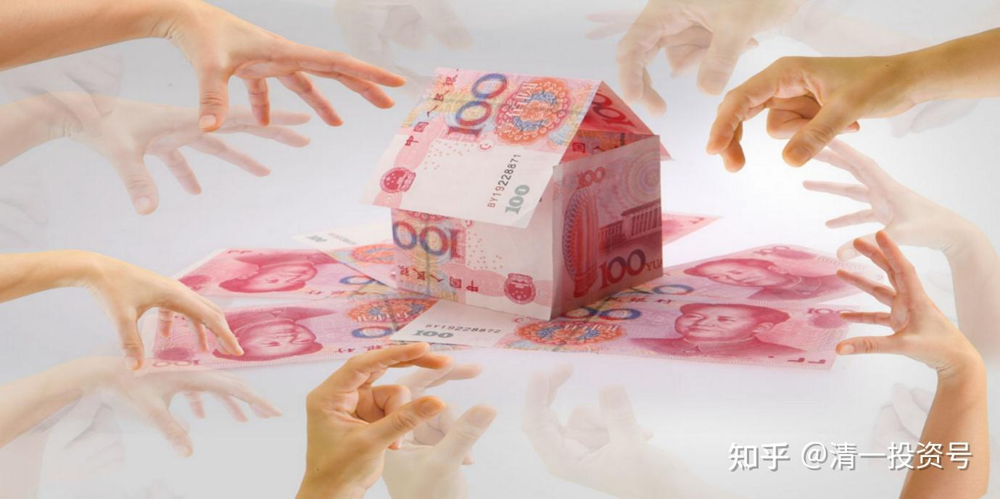
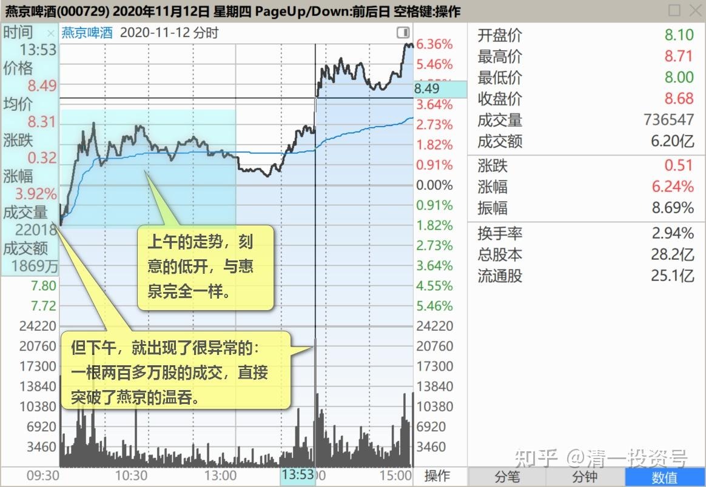
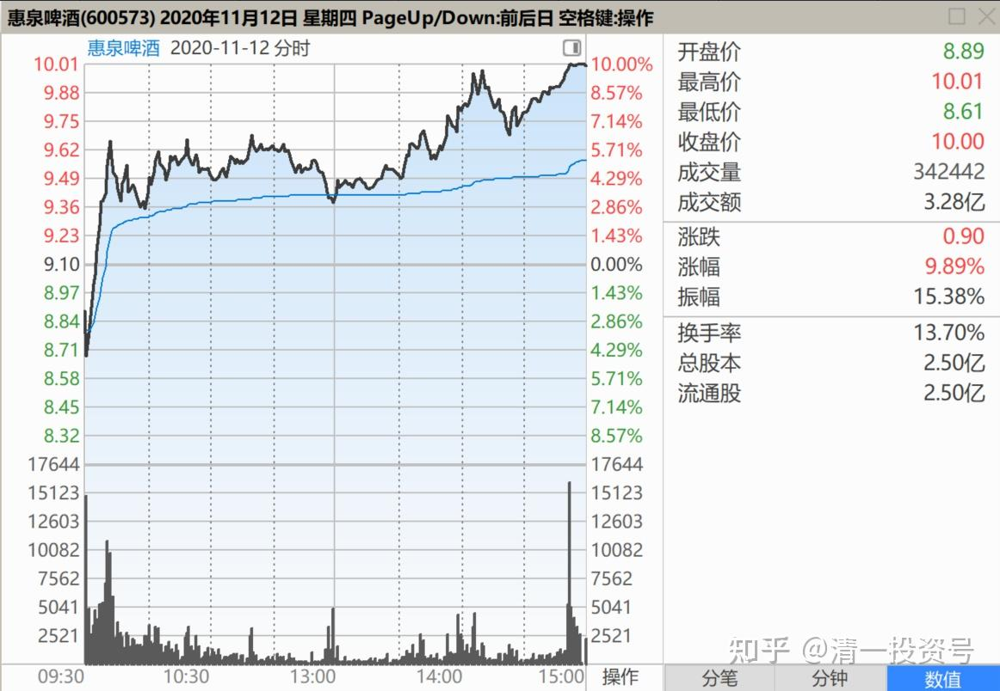
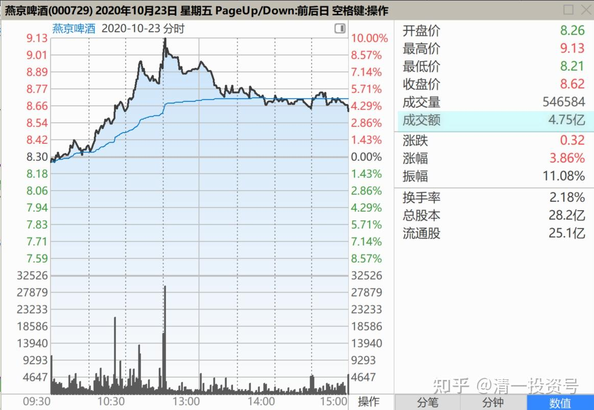
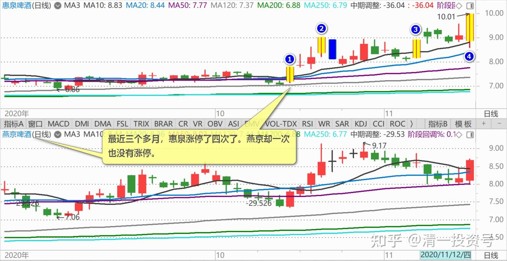
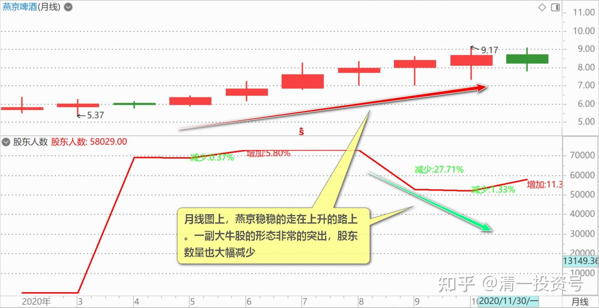
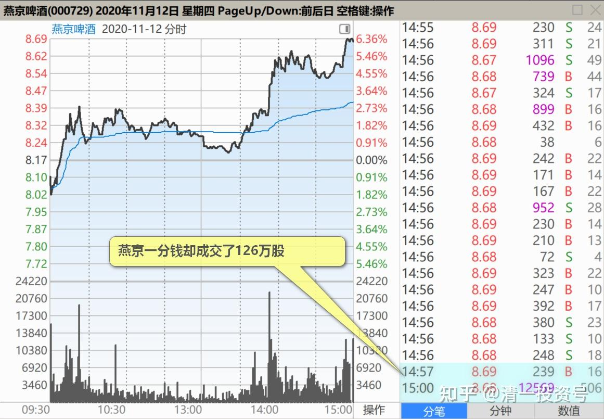

59篇.是主力换庄，还是野蛮人抢筹

清一山长2020年11月12日

$燕京啤酒(SZ000729)$ 现在看来，只有燕京可以继续符合解析K线图的价格了[俏皮]。**今天的盘面，有两个异常点。**

上午的走势，刻意的低开，与惠泉完全一样。似乎两者有某种内在的默契为什么。接下来的走势，珠江啤酒、惠泉啤酒都很快走高。但燕京温吞吞的被动跟随，更勉强的样子。也不奇怪，燕京大出利空，就是不想涨的意思。但下午，就出现了很异常的，不符合燕京走势的图形。就是：一根两百多万股的成交，直接突破了燕京的温吞。**走势开始活跃起来，成交量开始大增。多空双方交战激烈。**如果主力的目的，是想要做空燕京的话，现在这样子大幅拉涨，难道符合主力的原始意图吗？

**最不可思议的，就是燕京今天的成交量极高**！一个很不正常的成交量。居然有6.20亿之多，换手了7000多万股。这绝对不是一个正常的成交量。

10月23日，涨到9.13元，多空双方拉锯战，也才成交4个多亿。

今天再怎么算，也不可能出现这么大的成交。因为市场上的筹码其实很有限了。这个成交，比原来燕京涨停的成交都大。为什么？（最近三个多月，惠泉涨停了四次了。**燕京却一次也没有涨停。真悲催。但月线图上，燕京稳稳的走在上升的路上。一副大牛股的形态非常的突出，股东数量也大幅减少，显然很成功的洗走了很多散户）。**

尾盘也极其奇怪。珠江今天涨这么高，两家的总盘子是差不多的。但珠江尾盘收市的成交，才40多万股。但燕京一分钱却成交了126万股，整整三倍。所以，我们可以判断：燕京今天的成交情况，绝对不是一个正常的市场行为。

我怀疑有两种可能性。**一种是主力换庄：**现在更有实力的新主力，正在接手燕京。原来实力不够强的老手，低位吃到了不少筹码，但现在资金有点紧张了，拉不上去了，就愿意配合新主力，拿了钱走人。新主力，估计就是白酒，医疗股上赚够了的大鳄，退出来的资金很多，实力雄厚，接庄以后，要在燕京上大展雄风了。**另一种可能，就是有野蛮人出来抢庄，抢筹！**

最近燕京的怪事很多。董事长被抓，老主力重阳不合常理的大幅减持，而且减持的动作极其的怪异，绝非正常的行为。几乎就是说：一个人老远去赴盛大的宴会，花了两年时间。都走到门口了，却转让门票给别人，把就在眼前的赚钱机会都送人了。我想：除非是他爹，否则谁有这么大的面子[大笑]。

当然，金融市场上，有钱就是爹。被有钱人看上了，给了一笔退出费，也没啥不可以的。就像有人私信找我，想要我“高价转让，买我手上的资源”。如果价格足够满意，我也愿意把门票给人的。正因为重阳，以及董事长，这些动作，都透着极度的怪异，吸引了一些强有力的新主力关注燕京，看出了其中的猫腻。就果断来强行抢庄了。今天大量买进。**今天成交量很大的原因，就是双方在互相大战，**从结果来看，燕京结尾是走出了今日的新高，多方获胜。

看样子，原来的主力，想借利空，继续慢慢的多吃点筹码的意图，今天就失败了，想要打压，还白白地送出了很多的筹码。我前几天买入燕京，就发现我的每个十万股的低位买入单子，进去没多久，就会被快速打掉，很快就让我的资金枯竭了，证明有人刻意打压的（8.1～8.15之间的价格）。现在的股价，已经重新回到原来减持利空发出之前的位置了。

也就是说：**重阳的减持闹剧，对市场的冲击，现在已经过去了。**当然，重阳手中还有很多货，再来一次减持？如果是做错了方向，减持后燕京大涨，重阳作为一家私募基金，这种长期买套，低位减持的行为，恐怕会让他在私募业界的名声扫地的。操盘水平这么低，不是笑话吗？还要继续减持吗？

(标题、图片为编者所加)

**文章音频**：

[438篇.是主力换庄，还是野蛮人抢筹_清一投资号文章同步音频](http://link.zhihu.com/?target=https%3A//www.ximalaya.com/sound/724722467)

**参考链接：**

[50篇.惠泉股性活跃，喜欢刺激的人有福了](https://zhuanlan.zhihu.com/p/682717047)

[51篇.是风险赌博还是稳定投资？](https://zhuanlan.zhihu.com/p/684479170)

[52篇.惠泉、珠江、燕京的换手率](https://zhuanlan.zhihu.com/p/685682634)

[53篇.三只股轮动，谁涨停卖谁，谁跌停买谁](https://zhuanlan.zhihu.com/p/686904967)

[54篇.黑文滚滚或是粉红一片](https://zhuanlan.zhihu.com/p/687874750)

[55篇.啤酒行业，已经有大鳄进来了](https://zhuanlan.zhihu.com/p/689415289)

[56篇.高明的人，会用真实的事实来误导你的决策](https://zhuanlan.zhihu.com/p/690672420)

[57篇.持仓，减仓，长期持有](https://zhuanlan.zhihu.com/p/691822907)

[58篇.看股票就是跟人性作对](https://zhuanlan.zhihu.com/p/693094564)
