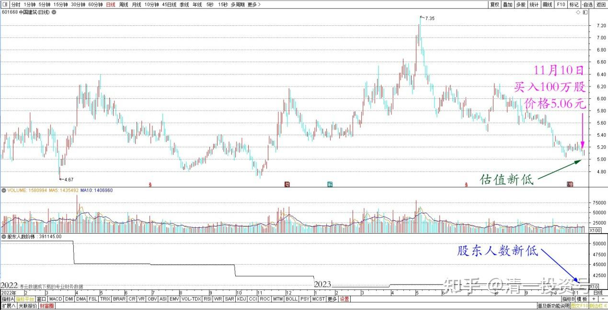
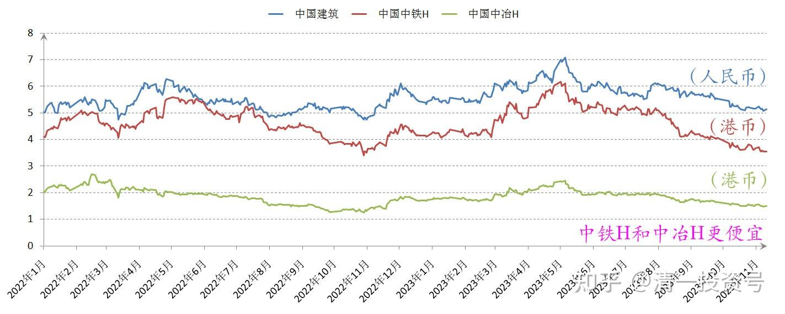
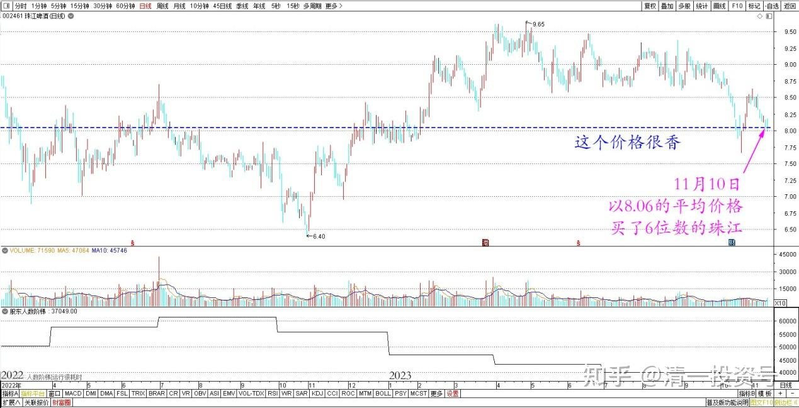

60篇.中国建筑安心买入，珠江啤酒价格很香

清一山长 2023年11月10日

[清一投资号：38篇.低位吹票和高位吹票](https://zhuanlan.zhihu.com/p/666484929)

今天买入了中国建筑100万股，价格是5.06元。我很奇怪雪球上居然有一堆人在中建这里叫苦。说跌了现在受不了，买大蓝筹非常后悔之类的言论。我认为——**买中建这种股票，就当存款一样。现在每年分红5%，而且每年都在增加分红。比存银行要划算多了**。中建目前的在手订单几年内都做不完。换言之——就算现在没有新订单了。目前手上的订单，加起来算利润，这几年都可以维持利润。这些订单的利润差不多就可以赚一个新的中建了。所以，在我看来，现在价格买入，就是输时间不输钱的买卖。何况你当一家世界第一的建筑公司老板，没啥丢人的吧？将来也不可能没有新订单——现在看新订单都还在增加中。因此，目前这个价格，我当然安心买入，长期持有。

另外一个重点——理论上，现在的中铁H和中冶H更便宜。为啥我没有买呢？而是买了不是最便宜的中建？因为——中建的股东人数是历史新低。估值新低的情况下，居然股东人数新低，非常的不正常。比中国中铁的股东人数还少10万。这说明核心筹码都在主力手上了。这种股，就是想涨就涨，想跌就跌的。散户根本不能决定它的起落。可以判断是国家队，主力控股了，目前似乎是国家对盘面控制涨跌的工具。**它不涨，就是说我们的A股大盘还不到涨的时候，我们这些小散户，天天操个啥心呢？只需要跟这些主力一样，安心守住手中的优质股票就行了。**我就没见过存银行的人，天天查存折。看资金不涨就骂人吧？反正你买入股票，天天查，肯定一股也不少（不要查涨跌，这都是假的，天天都在变化。你的股票，当然应该查持股数量变化了没有）。如果少了，你真的可以去报警了[微笑]。

*中国建筑 2022～2023 年日线图*

*中建、中铁H、中冶H 2022~2023 年收盘价*

另外——今天还以最低价8.05元，平均价8.06元的价格，买了6位数的珠江啤酒。这个价格我认为很香。年底十大股东表里面，你们会看到我的增仓记录的[微笑]。

*珠江啤酒 2022～2023 年日线图*

个人认为——未来的白酒不看好，因为我们要开启低欲望社会了。所以，特别是高端白酒的金融性，以及奢侈品性质，以及社会性质，恐怕难以实现。但是啤酒这种相当于饮料的酒，未来应该会提价，获取正常的利润。与白酒股的获利水平靠近，都是酒，凭啥就是白酒赚钱？啤酒不赚钱呀？所以我的白酒股，都见好就收了，都换成了啤酒。2015之后的这几年，我的主要收益，来自于各种酒。感谢中国市场的赠予，感谢广大吃货消费者的努力奉献！[微笑]

(标题、图片为编者所加)

**文章音频：**

[393篇.中国建筑安心买入，珠江啤酒价格很香_清一投资号文章同步音频](http://link.zhihu.com/?target=https%3A//www.ximalaya.com/sound/684704161)

**参考链接：**

[12篇.啤酒系列5：早期珠江啤酒、燕京啤酒的换仓记录](https://zhuanlan.zhihu.com/p/602033762)

[13篇.啤酒系列6：买卖操作后的富足之心](https://zhuanlan.zhihu.com/p/604162057)

[14篇.啤酒系列7：珠江的破位急跌，名曰跌停进货法](https://zhuanlan.zhihu.com/p/606062514)

[22篇.它很可能是下一个重庆啤酒](https://zhuanlan.zhihu.com/p/645392522)

[23篇.危机时刻好公司不用担心](https://zhuanlan.zhihu.com/p/646998882)

[24篇.守住筹码很不易](https://zhuanlan.zhihu.com/p/648860208)

[56篇.啤酒下跌，应机而动](https://zhuanlan.zhihu.com/p/649780980)

[57篇.省心省事，不多做](https://zhuanlan.zhihu.com/p/651191813)

[58篇.买回落难王子](https://zhuanlan.zhihu.com/p/653368631)

[59篇.三季报隐藏的重大信息](https://zhuanlan.zhihu.com/p/664009422)

