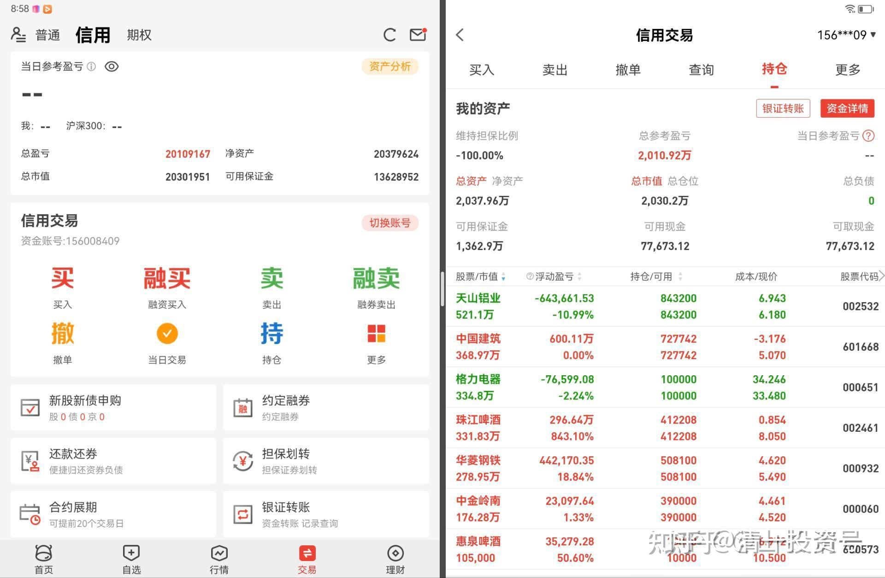
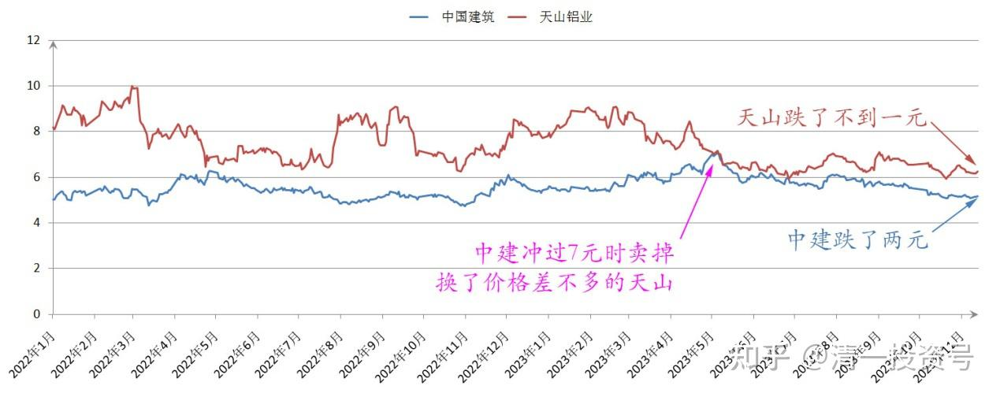
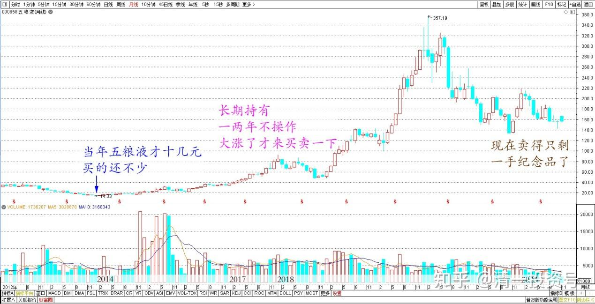
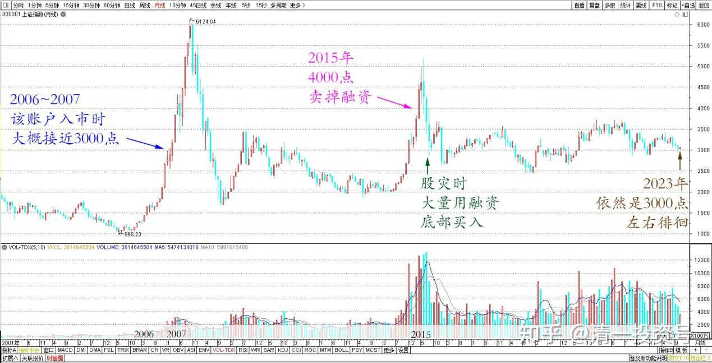

61篇.投资养老新模式？比退休金更可靠的金融账户养老收益

清一山长 2023年11月13日

我今天第一次秀我的账户——我管理的我家老人的投资账户。

我在雪球时代，很多人对我的投资业绩非常怀疑，总让我秀账户。但我从来没有秀过自己的账户。因为没啥好证明的。你信就信，不信就拉倒。我又不开私募，不拉客户。你信不信关我啥事？真想学我投资的，就细心看我的投资记录和投资思维好了，别跟我叽叽歪歪的说废话。

下面图片，是我负责管理的老人家的账户，大概是2006～2007年之间开的，具体的时间我说不准了。当年也就很少的6位数资产，现在十几年过去了，已经增值百倍了。一年多前，我偶尔看了账户，还跟家人说：不可思议，马上要突破1000万了。现在不知不觉的，看账户居然已经超过2000万了。如果前段时间来记录的话，会比现在还多几百万资产呢！

我家太太的股票账户也是我负责打理的，当年起步就是20万元。现在——结果就不说了。现在的结果看起来，就不像真的！这个平庸一点的养老账户，走势相对正常一点！因为很少操作！很多时候的资金，比如分红的资产，也会闲置不用。因为我忘了。融资更是常常闲置，没有把可用资金都利用好。懒人账户！太太账户我操心更多一些，所以效益就完全不同了。

各位留心看这个养老账户总资产和总盈利的时候，会意外的发现：总盈利，非常接近总资产。说明这个账户的增值还是很可观的（还有一些资产，留在普通账户里面，只是不多了）。这个证明了——中国A股还是会给老实人良好回报的。这个账户的记录相对较完善，因为我卖掉股票总习惯留一百股。这十几年操作的股票数量也不多，所以现在很容易看到过去的操作痕迹！

目前这个养老账户的“第一重仓股”还是亏损的，不过我心中这笔交易是盈利的。因为这个天山铝业，是我在中国建筑冲过7元的时候卖掉的。换了当时价格差不多的天山。**我认为一对一换的话，天山比中国建筑价值高。习惯长期满仓的我，就认了这个高价换股。就算可能跌我也认了。虽然现在来看，卖掉空仓等待，现在再重新进入，不管买谁都更划算。也许可以多赚上上百万。但我承认：我没有这个预测涨跌的脑子，我只是换股！多换了我就高兴。**我换了更多的股票在手里，现在天山跌了不到一元，中国建筑跌了2元，算起来我还是赚了。只是利润，账面上记在中国建筑的账户上，亏损却记在天山等股票上了。所以看起来，中国建筑的利润很高，现在持仓的几十万股，还都是负成本。因为我高位卖掉了大部分股票！

*中国建筑、天山铝业 2022~2023年 收盘价*

这个是信用账户。我违背了巴菲特的教诲，我会用融资来买股。不过我使用融资的条件比较苛刻——我用本金来投资，长期持股不放。但我用融资来投机，高抛低吸。所以——比简单的持有股票不放，获取了更多的利润。这也是十几年前，该账户入市的时候，上海股市的点数大概就是接近3000点的。现在虽然大盘，依然是3000点左右徘徊，但我的账户，已经增加了差不多百倍资产。我认为是虽然选股很好，但高抛低吸也有作用。加上该账户比较有福气，记得当年的这个账户，是买了很多白酒股长期持有的。比如五粮液也才十几元。而且买的还不少，现在卖得只剩一手纪念品了。**当年买对了股票，优质不会垮的企业，加上长期持有，一两年不操作，大涨了才来买卖一下，就造成这个账户的良好盈利**（这个账户我很少管的，经常忘掉自己买了什么了）。

*五粮液 2012~2023 年月线*

但我再度申明一下：**我不支持普通人使用融资，不要借钱买股。融资是很香，但杠杆投资，不是普通人能够驾驭的。甚至金融高手使用融资都是非常危险的，可能会出人命的。**逍遥刘强如果2015年不用融资，现在依然是千万甚至亿万的富翁。利弗莫尔如果当年不用融资，只用本金长期持股，巴菲特跟他相比，根本就啥都不是。他的家族，现在依然是世界首富家族。但用了融资，选错了风口，他们都已经自杀死了！

我用融资的条件极其苛刻，你们一般人是不太可能理解的，我也不会分享我用融资的经验。因为太危险了。所以——千万不要玩火。2015年，所谓的股灾连连，但我的账户市值都创造了新高。为啥？4000点我卖掉了融资，只持有本金。股灾的时候，我大量用融资额度底部买入，跟国家队一起救市，买银行等大蓝筹。但涨了30%，我就全部卖掉融资。当年如此连续大跌几次，我反而赚到更多。**这就是运气好——爱国，为国接盘，但又不贪心带来的好处！**

*上证指数 2001~2023年 月线*

**未来使用融资的风险还是很大的！特别是我一直认为：美股崩盘，会导致世界级别的金融海啸，A股短期大幅跟跌也不奇怪。**我现在想用，只是觉得一些品种特别便宜。而且我做好了各种持仓配置，防止被打爆。大多数人是没有判断能力和抗风险的能力的！因此——**老老实实地用本金买入，慢慢变富裕好了。别为了短期发财，结果把自己玩完了！**我用融资长期投资，短期投机。拉长了看，基本上不可能亏损。但你们不懂技巧，就别用了！

我这一次打开这个很少使用的账户，不仅是很久没有看账户了。而是现在，我认为到了可以使用一部分融资入场的时候了。各位看融资可用额度是13628952元，但我的实际使用额度是零！现在如果用来买中国建筑的话，可以融资买入两百多万股了。由于分红良好，仅仅靠分红，就足够覆盖券商给我的利息（低于5%），因此——我融资长期持有股票的成本，基本上是零。这样算利润就很可观了！只要不涨，我就死死地拿住不放。因此我不怕跌的，而且我不会单仓一两只股票，而是分散投资的！

如果各位拥有这样一个养老账户，假如都持有各种高息股，平均只算5%好了。每年的分红就有100万元。你认为哪一个老人花得完这么多钱？持有这个账户，不比啥国家发的退休金都香吗？**如果各位用这个思路操作股票，你永远不会操心就业，退休养老等等问题的。甚至比你养儿防老还要可靠得多。你因此，一辈子只会专注于创造你自己的理想生活。根本不用担心金钱的问题。**

实际上，**我的儿女都在模仿这种投资方式——他们只要手上有钱，就买入股票放起来，根本不看涨跌。每天专心去做自己喜欢做的事情。**也许——多年之后，回头一看:原来自己是大富翁！甚至小女才12岁的时候，还无法拥有自己的账户，每次她拿到老人给的压岁钱，几千元也要拿给我帮她买股票放起来。这种习惯，我相信她们将来不需要任何人给他们养老金，靠股息就足够生活了！这种安心，是最踏实的！

**未来找工作很难。但未来中国，我认为将复制美国和西方的道路——将成为未来的世界金融中心！中国股市未来过万点是必然的。**我们家的老人和孩子，也必然随着中国股市迈向万点，而成为未来的亿万富翁。因为他们相信中国一定强。尽管现在的A股让很多人伤心。但我**相信A股将来一定会取代美股的地位，只有相信这一点的人，才会取得巨大的收益。**如果你相信只有看得见的房子才值钱，也许马云说的未来房价不如葱真的出现之时，你才知道选错了投资对象。

**未来中国的房子肯定不值钱，只能当工具用。但未来中国世界级的优秀公司，可能会贵到你买不起。**当年茅台一百多元一股，你嘲笑茅台要垮台。现在如何？

我认为中国有很多优秀的公司，都比茅台更加有价值。中国的大蓝筹，大建龙头，还有中国的银行，金融龙头，未来肯定会比茅台更值钱。华为可惜没有股票，否则我认为华为比茅台值钱十倍，百倍！有钱赶快买。**长期投资中国，才是未来最有价值的选择。跑去欧美混日子、留学、工作等等，或者看美股现在很牛，去买美股等，也许未来会证明你做了最笨的选择！**

我认为：**中国人如果想要孩子将来有可靠的未来，不如把你给孩子去美国留学的费用拿来买这些中国低估值的龙头企业的股票，才会让你的孩子拥有更可靠的未来！而不是花大钱，拼命去弄个打工证归家！**

这个帖子，我用来作为我对中国10～20年后国运的预测。坐等打脸！只是——也许打的就是你——不相信中国才是A级投资对象的你！

(标题、图片为编者所加)

**文章音频：**

[395篇.投资养老新模式？比退休金更可靠的金融账户养老收益_清一投资号文章同步音频](http://link.zhihu.com/?target=https%3A//www.ximalaya.com/sound/686648680)

**参考链接：**

[12篇.啤酒系列5：早期珠江啤酒、燕京啤酒的换仓记录](https://zhuanlan.zhihu.com/p/602033762)

[13篇.啤酒系列6：买卖操作后的富足之心](https://zhuanlan.zhihu.com/p/604162057)

[14篇.啤酒系列7：珠江的破位急跌，名曰跌停进货法](https://zhuanlan.zhihu.com/p/606062514)

[22篇.它很可能是下一个重庆啤酒](https://zhuanlan.zhihu.com/p/645392522)

[23篇.危机时刻好公司不用担心](https://zhuanlan.zhihu.com/p/646998882)

[24篇.守住筹码很不易](https://zhuanlan.zhihu.com/p/648860208)

[56篇.啤酒下跌，应机而动](https://zhuanlan.zhihu.com/p/649780980)

[57篇.省心省事，不多做](https://zhuanlan.zhihu.com/p/651191813)

[58篇.买回落难王子](https://zhuanlan.zhihu.com/p/653368631)

[59篇.三季报隐藏的重大信息](https://zhuanlan.zhihu.com/p/664009422)

[60篇.中国建筑安心买入，珠江啤酒价格很香](https://zhuanlan.zhihu.com/p/667041164)

