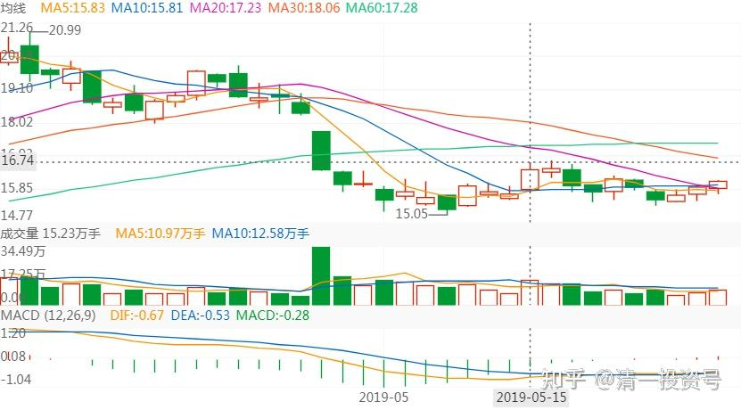
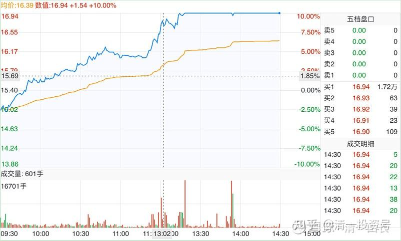
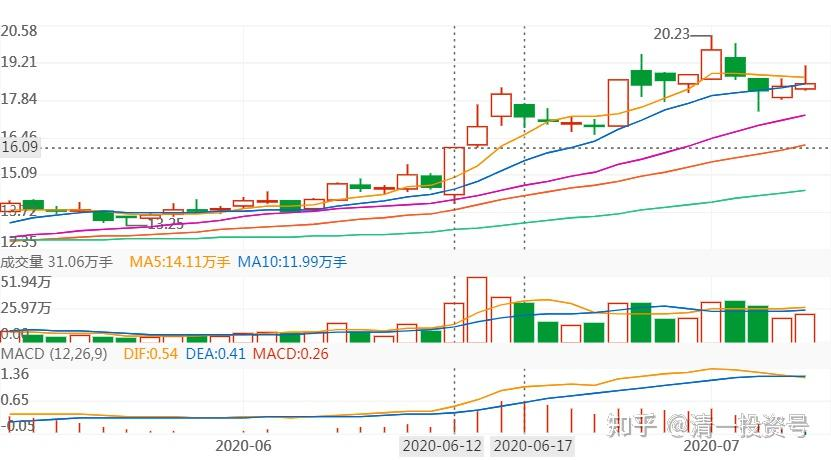
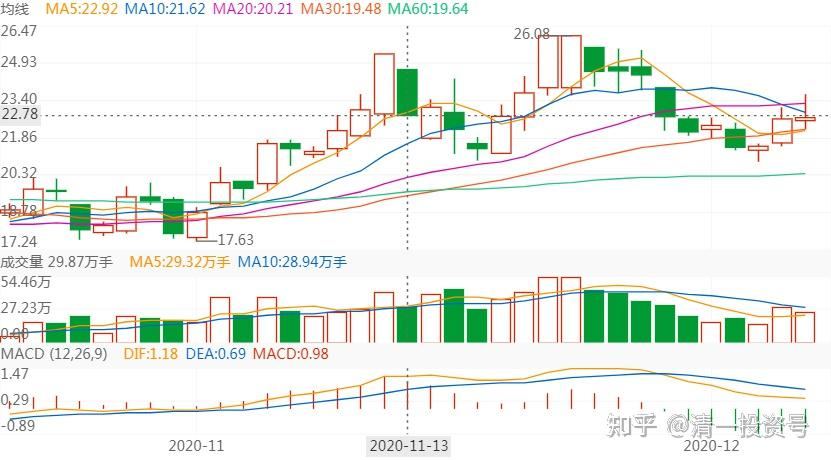
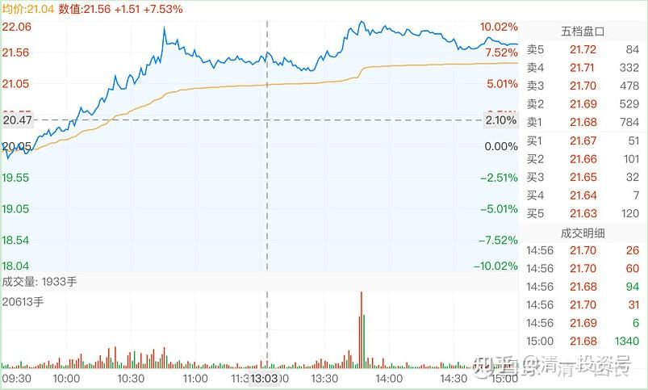
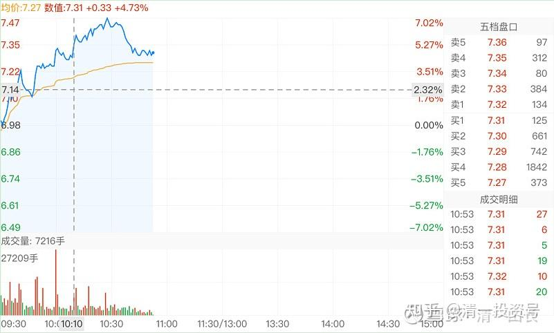
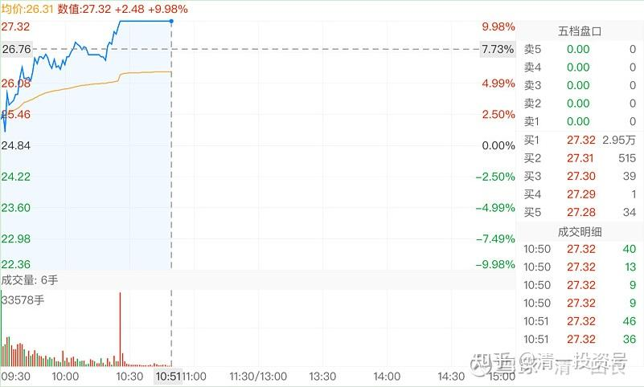
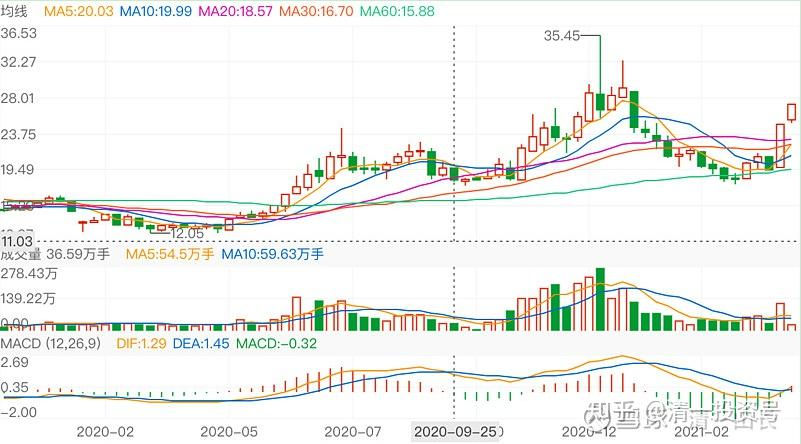
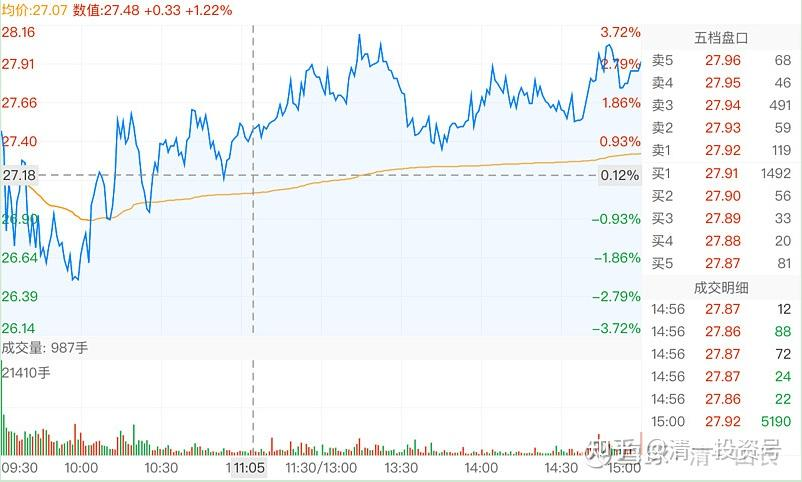
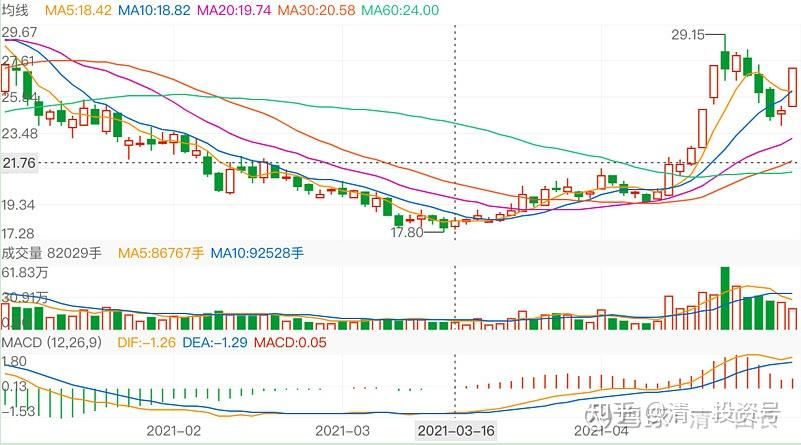

62篇.白酒系列（二）伊力特——“新疆茅台”（上）

清一山长2019年4月～2021年4月

**1.关注原因：区域龙头**

**[清一山长](http://link.zhihu.com/?target=https%3A//xueqiu.com/9310099567)**2019-04-29 14:13

$伊力特(SH600197)$自从卖出顺鑫农业后，就一直想找机会买进白酒。**伊力特是我一直在观察的酒股，原因只有一条：区域龙头**。新疆市场占有率极高。只是没有机会买进，只有一点点底仓。没想到昨天，有人告诉我伊力特跌停了。我想今天应该有买入机会。低于17元完全可以放心买入。结果，居然16.91元成交了，数量还不少。恢复了一些白酒的持仓，但还只有原来顺鑫一半的持仓量，继续等机会下手。观察伊力特，这个股似乎特别喜欢急跌。上一个交易日的急跌还带量，6.5个亿的成交，看起来很吓人。似乎场内筹码在不要命的逃跑，末日来临的感觉。总市值才70多亿的一只股票，如果是真的在跌停价格跑掉了6.5个亿的持仓，这种逃命式换手是很难看的，未来持续下跌几乎是必然的——如果是真换手的话。最终演变成多杀多的局面。“恐怖”的同时，同时也要想想，谁在大把的吃进呢？会不会有人故意演出的一场好戏呢？由于我相信只有13倍PE的伊力特，经营上很稳健，没有什么本质上的利空，未来的持续发展没有啥问题。2019年两位数增长我也相信没问题。所以，今天破17元就果断买进了，**计划长期持有**，至少持有到20PE吧！目前已有还不错的浮盈。也许明天就会变脸了。我就继续睡去。

**[清一山长](http://link.zhihu.com/?target=https%3A//xueqiu.com/9310099567)**2019-05-15 15:57

$伊力特(SH600197)$ Bingo

**雪域清泉回复[静心观水流](http://link.zhihu.com/?target=http%3A//xueqiu.com/n/%25E9%259D%2599%25E5%25BF%2583%25E8%25A7%2582%25E6%25B0%25B4%25E6%25B5%2581)**:

等着吧，会涨起来的，不要那么快下结论。山长看中的票不会错的。

**[清一山长](http://link.zhihu.com/?target=https%3A//xueqiu.com/9310099567)**2019-11-18 12:36**回复**雪域清泉：

此言谬也。**我看中的股也有错的，甚至错得离谱的。所以我任何股都不会满仓干，都是会分仓容错的。任何一只股做错了，都不会把我打光掉的。**对于喜欢用一时间的涨跌来质疑我的人，我根本就不愿意搭理。这种人投机的心理严重，看不懂，看得懂股票，关我啥事？伊力特，只是我小部分配置，顺鑫之后，我的主要配置是在啤酒上。**对于伊力特，我只会想：十年后这只股应该还在。**（**这只股的酒质，跟五粮液差不多的，只要有人喜欢五粮液，也会有人喜欢伊力特的**[大笑]。现在他涨不涨，其实我根本不关心）。

**[清一山长](http://link.zhihu.com/?target=https%3A//xueqiu.com/9310099567)**2020-02-07 13:33

当初建设兵团进疆，就是用五粮液的人才和技术去建厂的。味道差不多很正常。说不定水质还更好些，天山雪水[笑]

**2.涨停到跌停——守住原则，买卖自如**

**[虚合道](http://link.zhihu.com/?target=http%3A//xueqiu.com/n/%25E8%2599%259A%25E5%2590%2588%25E9%2581%2593)回复[清一山长](http://link.zhihu.com/?target=http%3A//xueqiu.com/n/%25E6%25B8%2585%25E4%25B8%2580%25E5%25B1%25B1%25E9%2595%25BF)**：

山长，[伊力特](http://link.zhihu.com/?target=https%3A//xueqiu.com/S/SH600197%3Ffrom%3Dstatus_stock_match)涨停[赚大了]

**[清一山长](http://link.zhihu.com/?target=https%3A//xueqiu.com/9310099567)**2020-06-12 14:04

我刚打赏了这条评论¥10.00，也推荐给你。谢谢提醒[献花花]。奉行涨停就走的原则，果断出掉了。虽然货不多，但换中建也可以近3M了。

说实话：伊力特真看好它的未来。新疆未来十年，发展速度要快过内地，买它比买内地酒靠谱。跌了还会买回的。我就是不喜欢涨停，见涨停就逃。伊力特只要不涨停的话，我愿意拿十年！[俏皮]

**[跟国王散步](http://link.zhihu.com/?target=http%3A//xueqiu.com/n/%25E8%25B7%259F%25E5%259B%25BD%25E7%258E%258B%25E6%2595%25A3%25E6%25AD%25A5)回复[清一山长](http://link.zhihu.com/?target=http%3A//xueqiu.com/n/%25E6%25B8%2585%25E4%25B8%2580%25E5%25B1%25B1%25E9%2595%25BF)**：

山长，您好！希望请教一下您，伊力特您是清仓了，还是减持了一部分，感恩您。目前我持有10万元盈利的伊力特，跟您买的。不知道是卖一部分，还是全部卖出。感恩您的解答。

**清一山长**2020-06-12 14:22**回复[跟国王散步](http://link.zhihu.com/?target=http%3A//xueqiu.com/n/%25E8%25B7%259F%25E5%259B%25BD%25E7%258E%258B%25E6%2595%25A3%25E6%25AD%25A5)**:

你卖你的，我卖我的，别跟我。我走了，您随意，因为我的货也不多，好卖，难得有人这样大方收货。

我不做带头大哥（珠江我没走就是傻冒，伊力特走了很可能也是傻帽，大家别学我[俏皮]）

**[清一山长](http://link.zhihu.com/?target=https%3A//xueqiu.com/9310099567)**2020-06-12 14:33

$伊力特(SH600197)$我卖股的时候，它的涨停买盘，是一个多亿资金，700多万股，卖完它还有600多万股的封单。珠江封涨停的时候，才1000多万。它居然比珠江多几倍，市值只是珠江的三分之一。难得有人急着要，我当然卖掉了。刚看一遍，居然涨停价格被破了，很快的又封起来了。拉涨停的货是160万股，破掉涨停的价格，也是160多万股。我看到的700万股涨停封单，是怎么被干掉的？还是主力撤掉封盘，自己卖掉一部分货？现在的封单，只剩一百多万股了，会被收掉吗？不管怎么回事，先跟上主力吧，起码有几百万股跑掉的主力，就不跟拉涨停的主力了。咱没这个实力！标志一下：我丢的两笔货，因为是两个账户。在图形上都显示出来了成交的红柱子（我还以为抛盘是绿色呢）。截图做个纪念！

**[借股修行](http://link.zhihu.com/?target=http%3A//xueqiu.com/n/%25C3%25A5%25C2%2580%25C2%259F%25C3%25A8%25C2%2582%25C2%25A1%25C3%25A4%25C2%25BF%25C2%25AE%25C3%25A8%25C2%25A1%25C2%258C)回复[清一山长](http://link.zhihu.com/?target=http%3A//xueqiu.com/n/%25C3%25A6%25C2%25B8%25C2%2585%25C3%25A4%25C2%25B8%25C2%2580%25C3%25A5%25C2%25B1%25C2%25B1%25C3%25A9%25C2%2595%25C2%25BF)**:

老师，老白干涨停了。

**[清一山长](http://link.zhihu.com/?target=https%3A//xueqiu.com/9310099567)**[2020-06-17 12:31](http://link.zhihu.com/?target=https%3A//xueqiu.com/9310099567/151778558)**回复[借股修行](http://link.zhihu.com/?target=http%3A//xueqiu.com/n/%25C3%25A5%25C2%2580%25C2%259F%25C3%25A8%25C2%2582%25C2%25A1%25C3%25A4%25C2%25BF%25C2%25AE%25C3%25A8%25C2%25A1%25C2%258C)**：

谢谢各位提醒[献花花]。这几天，我们一家人出去自驾游了，去了湄公河流域的好几个城市。昨晚很晚才回来，都没看盘。随着中建渐渐的成为主仓，就没看盘的必要了，反正就是纺机的节奏[笑]。老白干还有，反正跌了我就是不卖的。

今天看了一下盘，**伊力特涨停卖错了**。说明我是反向指标。其他还好，没啥惊喜的。上周出清的泰股KBANK每股已经跌掉了17元。长得快，跌得也快。抢了一把泰国的韭菜。继续等待方向中，不买也不卖。

**[清一山长](http://link.zhihu.com/?target=https%3A//xueqiu.com/9310099567)**2020-11-13 11:23

$伊力特(SH600197)$才一天，就从涨停到跌停？你玩的真够精彩的。拍案惊奇！我想，是不是正在锻炼小股民的心理承受能力[俏皮]

**3.底部突破，涨停，完成洗盘——一股未动**

**[清一山长](http://link.zhihu.com/?target=https%3A//xueqiu.com/9310099567)**2021-[04-13 15:10](http://link.zhihu.com/?target=https%3A//xueqiu.com/9310099567/177015447)

[$伊力特(SH600197)$](http://link.zhihu.com/?target=http%3A//xueqiu.com/S/SH600197)很早以前买了伊力特的，关注我久一点的人都知道。前期冲高卖了。以为就飞了。这回跌破20，就开始一路的买买买。补回原来的仓位。因为我的白酒仓位实在太少了。没想到今天冲高！涨得过于急切了。

今天虽然冲高放量，但不能走。今天走掉的是傻瓜。当然，昨天走掉的更傻[捂脸]。**伊力特前期配股，配转债，拿到的资金用于扩产。将来业绩会走高的。据我所知，伊力特是不够卖的，供不应求。现在跌破20的价格，真心不贵。**涨破20元也没啥高估的，超过30应该算有点高了。再过5年，30元也不高。所以，30元以下，我不考虑操作伊力特，不做T。

伊力特其实也是茅台——新疆茅台。中国开发西部大战略，西部消费上升，“新茅”怎么能不拿一点[大笑]

**[得乎其中](http://link.zhihu.com/?target=http%3A//xueqiu.com/n/%25C3%25A5%25C2%25BE%25C2%2597%25C3%25A4%25C2%25B9%25C2%258E%25C3%25A5%25C2%2585%25C2%25B6%25C3%25A4%25C2%25B8%25C2%25AD)** **回复** **[清一山长](http://link.zhihu.com/?target=http%3A//xueqiu.com/n/%25C3%25A6%25C2%25B8%25C2%2585%25C3%25A4%25C2%25B8%25C2%2580%25C3%25A5%25C2%25B1%25C2%25B1%25C3%25A9%25C2%2595%25C2%25BF)**:

今天涨停了，山长。

**[清一山长](http://link.zhihu.com/?target=https%3A//xueqiu.com/9310099567) 2021-[04-16 10:45](http://link.zhihu.com/?target=https%3A//xueqiu.com/9310099567/177319300)** **回复** **[得乎其中](http://link.zhihu.com/?target=http%3A//xueqiu.com/n/%25C3%25A5%25C2%25BE%25C2%2597%25C3%25A4%25C2%25B9%25C2%258E%25C3%25A5%25C2%2585%25C2%25B6%25C3%25A4%25C2%25B8%25C2%25AD)**:

恭喜各位买了伊力特的朋友：我早说了，它是“新茅”。现在还躺在几年前价位的酒股，地区性龙头的。除了它，还有谁？跌破20元果断买它，不涨就放着，越陈越香！

**[清一山长](http://link.zhihu.com/?target=https%3A//xueqiu.com/9310099567)2021-[04-16 11:06](http://link.zhihu.com/?target=https%3A//xueqiu.com/9310099567/177322736)**

[$燕京啤酒(SZ000729)$](http://link.zhihu.com/?target=http%3A//xueqiu.com/S/SZ000729)说一句让人恨我的话：昨天卖出燕京是大傻瓜，今天卖出燕京的是小傻瓜！昨天买今天卖的，做T成功，依然是傻瓜，只是一个胆子大的傻瓜！

理由：主力跟管理层。互相配合，出消息打压，好容易弄这么一次大跌，你以为目标就是为了赚这几毛小钱的？就算你昨天买，今天卖，算上年化收益率显得超级的高，你超级的精明过人。但你依然是傻瓜一个。大跌敢进的人，一定是看透了企业的未来，知道没有危险。这才是智勇双全。看到跌就进，只是胆子大，不怕死罢了。我看华夏幸福大跌，也没进。荣盛发展跌，我也没进。为啥？没看懂。就不冒这个险。昨天冒险进来买燕京仅仅因为跌了的人，算是大勇！但拿了主力给的3毛钱就走了？这绝非大智！只是小运气，甚至都谈不上小智。

也许燕京还要跌，但我不会抛出筹码的。也许还会像今天一样大涨超过7%，甚至涨停的，我也不会卖出。**就像伊力特，前几天大涨，我就出来说：底部突破而已，刚转势。还没有到卖的时候，今天她冲涨停。**燕京，今天大涨，也依然没有“转势”呢！只是修复了昨天的破位罢了。更没有到卖的时候。

就说这些。认为我是反向指标的，就随意操作，跟我反向操作。用实际行动证明我错了！[大笑]

**[清一山长](http://link.zhihu.com/?target=https%3A//xueqiu.com/9310099567)**[2021-04-19 10:51](http://link.zhihu.com/?target=https%3A//xueqiu.com/9310099567/177498086)

[$伊力特(SH600197)$](http://link.zhihu.com/?target=http%3A//xueqiu.com/S/SH600197)今天继续涨停？这样子再冲下去，我就真的HOLD不住了[捂脸]

**[清一山长](http://link.zhihu.com/?target=https%3A//xueqiu.com/9310099567)**2021-04-19 11:38

[$伊力特(SH600197)$](http://link.zhihu.com/?target=http%3A//xueqiu.com/S/SH600197)从周线图上看，这一波比上一轮更牛。量价配合更优。下跌中根本就没放量，主力没有出局。只是倒手做了T，增加了利润。推论下去，就是：未来超越上一轮的高点，大约是必然的。**我是看到跌到上一轮的起涨点，超级安全才买入的**，没想到涨起来这么快。

（我是反指，市场经常和我说的相反。我在18～19元区间买入的伊力特。你们现在抢进来。当心是我甩给你的货。最好小心，别上我的当，可能我是庄家[大笑]）

上周伊力特开涨，我出来提醒大家，示范不要卖出。有混蛋说我是涨了就出来显摆，现在知道我做干啥了？提醒大家坐稳车，别跟钱过不去。涨了一点就走，你太不划算了。好心分享，居然出来骂我，良心真是坏了。这种人咋可能赚钱？

**[清一山长](http://link.zhihu.com/?target=https%3A//xueqiu.com/9310099567)**2021-04-22 08:31

[$伊力特(SH600197)$](http://link.zhihu.com/?target=http%3A//xueqiu.com/S/SH600197)今天是稳步推升，一路边吃，边拉的图形。吃的比拉的更多。上一日主要就是出。今天一天，就已经修复了昨天换筹下跌的图形。走势依然良好。白酒的第二春似乎来了。如果这样，啤酒们恢复去年的高位，也很正常。

**[清一山长](http://link.zhihu.com/?target=https%3A//xueqiu.com/9310099567)**2021-04-28 09:55

[$伊力特(SH600197)$](http://link.zhihu.com/?target=http%3A//xueqiu.com/S/SH600197)这么快就完成了洗盘？今天就涨停？一直在坐过山车，一股未动。我都觉得我傻！看来市场不缺钱，缺心眼！[大笑]

参考链接：

[59篇.白酒系列（一）老白干——人弃我取，人取我予](https://zhuanlan.zhihu.com/p/554525861)（整理文）

[64篇.白酒系列（二）伊力特——“新疆茅台”（下）](https://zhuanlan.zhihu.com/p/558774189)（整理文）

[66篇.白酒系列（三）五粮液（上）——好企业还要好价格](https://zhuanlan.zhihu.com/p/561226672)（整理文）

[67篇.白酒系列（三）五粮液（下）——回顾投资过程](https://zhuanlan.zhihu.com/p/563522180)（整理文）

[69篇.白酒系列（四）泸州老窖——切换与比价](https://zhuanlan.zhihu.com/p/565816330)（整理文）

[71篇.白酒系列（五）迎驾贡酒——优秀的分红率](https://zhuanlan.zhihu.com/p/568112813)（整理文）

