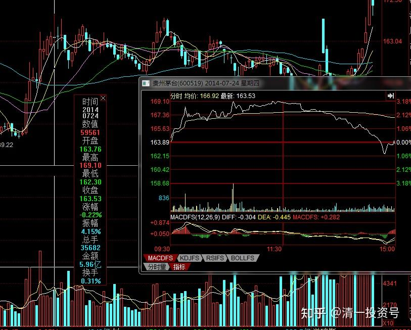

66篇.白酒系列（三）五粮液（上）——好企业还要好价格

清一山长 2014年～2018年

**1.不买茅台，买五粮液**

**清一山长**2014-07-24 15:18:51

看了贵州茅台，图形走得就是一个陷阱样子，感觉有派发的迹象。**五粮液干脆一整天都死气沉沉的，有趁涨势出货的嫌疑。**马上要出中报了，业绩应该很难看。否则主力完全可以顺利拉涨，但是却这样的走势。令人深思（我的这种判断方式，就是道家的“微排其意，以度其虚实表里”。是【投资博弈学】的内容）

白酒股，除非原来低位进货的，否则不适合追高。我的部分白酒仓位，都是前期低点进了一些（少量），现在涨了不少，也不想出货。虽然我判断下面的白酒行情应该不好，但到底跌多少实在是无数。只是知道现在卖不是好事。我正在等系统下跌的机会。

[高处看海](http://link.zhihu.com/?target=https%3A//xueqiu.com/4532094386)[2017-05-21 07:27](http://link.zhihu.com/?target=https%3A//xueqiu.com/4532094386/85848993)

《由但总的“只要赤水河的水还在流淌，茅台没有崩盘的时刻！”谈起》

[https://xueqiu.com/4532094386/85848993](http://link.zhihu.com/?target=https%3A//xueqiu.com/4532094386/85848993)

**清一山长**2017-05-21 09:12评论上文：

同意高君的观点：**好的投资，不仅仅是要拥有好的企业，还需要好的价格。**只看好一点，甚至只宣传一个方面，不是真投资，搞不好是假投资，真忽悠。**巴菲特，格雷欧姆的投资体系，最重视“安全边际”，以及“以0.4元买入价值一元的资产”**，但我却在但斌的投资文章中，看不到他的投资逻辑是如何体现出他竭力标榜的“巴菲特式的价值投资”思维。

但斌这些“价投大V”们，似乎总在用“好企业”一个概念，在高点的时候鼓吹拥有好企业的重要性，要大家都坚持持有。上一轮就让他们把266元的茅台，“坚持持有”到120元。有人用融资的，几乎玩价投玩到爆仓。

我也买了一些酒，**目前持有五粮液和泸州老窖，开始买入的时点，就是上一轮茅台120元的时候，彼时的五粮液14元多，老窖16元多。我算的就是未来的涨幅未必会比茅台小，但投资的安全性要大得多。实践也证实了这一点。目前两者的价格，都接近五十元了。干嘛非要抓住茅台不放呢？**

最近，我心中琢磨的是：要选个合适的时间，该退出我的白酒投资了。找个更安全的垫子降落，我心中才踏实。**因为白酒股，已经获得了超出我预想的收入，就不要太贪婪了。留点利润给别人吧！**

**清一山长**2017-02-24 09:26

我也喜欢和专业人士的建议反着做。2014年年初，很资深的专业人士，说我不该重仓银行股，可是这一年我赚了很多。2015年，他们还是坚持告诉我：就算我赚了钱，也不能说我的投资策略是对的，我只是运气好罢了。我真的是运气好，2015年主仓位靠坚持银行股，不仅躲过股灾，账户资产还创了新高。20**16年，**我总算放弃一部分银行（只占三分之一仓位）。其他资产用于买了其他非银行，如**重新买进**A股的中国建筑、**五粮液**。H股的中国宏桥等，结果赚到更多。不过这些钱赚完了，回头还是买了没涨的银行。如A股的中国建筑，涨到几乎最高价格后，卖掉拿来换了中国银行H。现在中建跌了，中国银行A涨了，正在想：是不是该反过来操作了。这样使用资金，效率好高。感谢中国市场给以的良好机会：低估，在低估的前提下轮动，是赚钱的王道。没有专家，没有专家的集体意识，就没有中国这么好赚钱的市场。

**清一山长**2019-04-04 21:14

涨停之际，谈我的啤酒股投资逻辑（节选）

[https://xueqiu.com/2017773236/213315425](http://link.zhihu.com/?target=https%3A//xueqiu.com/2017773236/213315425)

我买入的价位，基本上都是十年的底部位置。这个位置，对我这个胆小的人来说，是“安全系数”极高的位置。不太容易让我亏钱。**我一直有恐高症，看着上涨的股票，虽然自己也喜欢，但下不了手。比如茅台----我就一直挂眼科。光看不下手。当年觉得完全可以买茅台的价格到来的时候，我也被我认为更低估的14元的五粮液和16元的泸州老窖吸引，放弃了买入茅台的机会。**有点傻气。但我感觉安全得多。其实现在看，涨幅也差不多。

**2.40～70多元换股**

**清一山长**2017-03-13 17:22

$泸州老窖(SZ000568)$今天开始换股了。

**涨了一倍多的泸州老窖、五粮液，我换了还没涨的啤酒股**。**41.6卖掉一半的五粮液**。40.27元卖掉一半的泸州老窖。换了才7元出头的燕京啤酒喝。不知道这样胡乱换酒喝，会不会醉掉。[大笑]

反正，我看到涨100%股票，都有想卖的冲动。这种个性不好，不配拥有高大上，不搞庆功宴。总在捡垃圾中度过我的投资生涯。

这两个好酒，我都是在它们最垃圾的时候买的。**五粮液2013年15元就买到了手**，比老窖（16元多买入）还便宜，实在让人不好意思。20**16年年初，20元左右又用其他赚钱的资金加仓买进两种酒**（当时26元港币还买了青啤H）。这么快就给回报了，中国人还是应该买白酒。我的啤酒，等上三年，总能涨一倍吧？

我脑子简单，心想：都是我的消费类酒水投资配置，一个涨了一倍多，一个还站在原地不动。市场给的价格，肯定有一个是给错了。谁是错呢？我不知道。涨的酒类，如果是错的，以后就会跌，所以涨了要卖掉。如果酒类就是该一直涨下去，其他酒，如啤酒业，也应该跟涨的，所以现在该买进。所以，我就卖掉涨了一倍多的酒水，买了不涨的酒类。这种换股，从概率上来说，是不太会赔本的。不过现在看起来是笑话。

有人说我买股票不看财务报告，笑话我。也许吧！不过我今天是不看报告的。我只看“博弈学”。

**清一山长**2017-06-30 15:13

$五粮液(SZ000858)$**今天55.69元卖出五粮液，还剩下不到两万股。**心里有点失落。卖出资金换股平安银行，但入手的价格不太好，9.40元。就是“九死一生”的意思。但我怎么算，都觉得**未来等五粮液涨到100元的时候，平安银行也应该涨到20元了。应该不会是一笔亏损的生意。**

**清一山长**2017-11-17 14:30

$五粮液(SZ000858)$记录一下：**把最后的一点仓位五粮液。以不可思议的高价——73.89元卖出了。**收回的资金数十万元，买进一个市场不看好的酒类股票。我当初15元～20元犹豫不决地买下来的白酒股，不知道现在什么样的大神，会以70多元的价格坚决地买进。还有一些泸州老酒的存货，就放着等看会疯到什么地步吧！

**3.对仓位和卖点的反思**

**清一山长**2018-06-07 16:23

$顺鑫农业(SZ000860)$今天开始卖出操作，卖出了大约20万股。顺鑫目前已创我的酒股赚钱最多的记录（可惜**当年最低价买入了五粮液和泸州，却因为看不懂酒，没有重仓介入，还过早跑掉。这么好的酒股，这么好的进入时机，但这两只股我只赚了几百万**[哭泣]。否则哪有顺鑫创纪录的机会）。不过，如果顺鑫顺利实现“民酒”和品牌上行计划，或者压制对手进行市场扩张计划成功，这就是一个前途无限的企业。我手上持有的白酒股大多数都获利后退出了，让我有点怀念“国粹”。所以，我没有打算卖光现在手上的顺鑫，想要多持有几年。计划成本降到零就停手了。今天买了一个十年没有涨的大股，现价几乎就是十年来的最低价，只有其最高价的8分之一。我很奇怪为何这只股没有人要，目前的PE应该不超过4倍，甚至乐观一点，可能只有两倍多的市盈率。因为他现在正是赚钱的高峰期。证金公司最多时还持有数亿股，应该也不是老千股，起码国家队是支持的。就是股价超低，几乎没有人能够从中赚钱。我就买入一点实验仓，边研究边投资。如果赔了，我就跟十年没赚钱，光赔钱的老股东们站一起坚守一下，他们守了十年，我守上三五年，说不定就来解放军了[大笑]今天还买了一点$中国宏桥(01378)$。买入价是8.25元。她依然是我的港股第一持仓。目前看看我账户上记录的持仓价才2.31元，有点不好意思，就买一点回来，每次买个十万股的样子，直到恢复原有的持仓。今天买入后，持仓成本增加了两分多钱，看来会持续上升的。因为高位我没能彻底的坚守，跑掉了25%左右。现在买点回来以免良心不安。因为这只股我实在是太看好了，总想学巴菲特持有他十年。不然早跑光了。从技术上看，当时冲12元的时候，绝对是应该跑路的，但我是被“基本面良好”绊住了想要卖出的手，只卖了一小部分。不然当时全部出清，都卖给大量要货的张世平大老板，显得很不仗义。但我现在，看到如此惨跌，而张老板都不出来护盘的时候，我再重新捡回来，也是一个好的示范。拥有超级重仓的宏桥，还玩成负成本持有的模式，也算是一个好玩的投资故事。当年卖掉一小部分宏桥后，为了不踏空中国的铝行业，想到宏桥买了铝制品的上市公司，就去跟风，也买了一家做铝压延的中国忠旺，买入后慢慢的熬，担惊受怕的，天天被球友称为老千股，好不容易熬到今天。慢慢买入后，总股数与宏桥差不多了，但资金量远远赶不上。这两只股，可能都可以代表"中国制造”吧？就看什么时候被市场承认了。

参考链接：

[59篇.白酒系列（一）老白干——人弃我取，人取我予](https://zhuanlan.zhihu.com/p/554525861)（整理文）

[62篇.白酒系列（二）伊力特——“新疆茅台”（上）](https://zhuanlan.zhihu.com/p/557187863)（整理文）

[64篇.白酒系列（二）伊力特——“新疆茅台”（下）](https://zhuanlan.zhihu.com/p/558774189)（整理文）

[67篇.白酒系列（三）五粮液（下）——回顾投资过程](https://zhuanlan.zhihu.com/p/563522180)（整理文）

[69篇.白酒系列（四）泸州老窖——切换与比价](https://zhuanlan.zhihu.com/p/565816330)（整理文）

[71篇.白酒系列（五）迎驾贡酒——优秀的分红率](https://zhuanlan.zhihu.com/p/568112813)（整理文）

