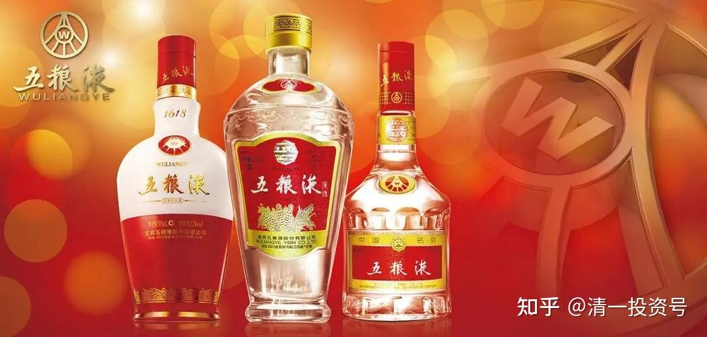
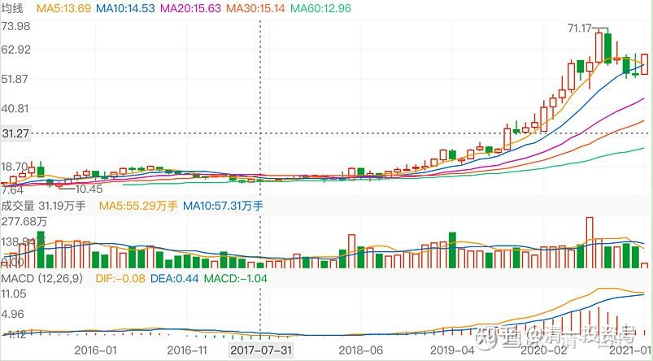
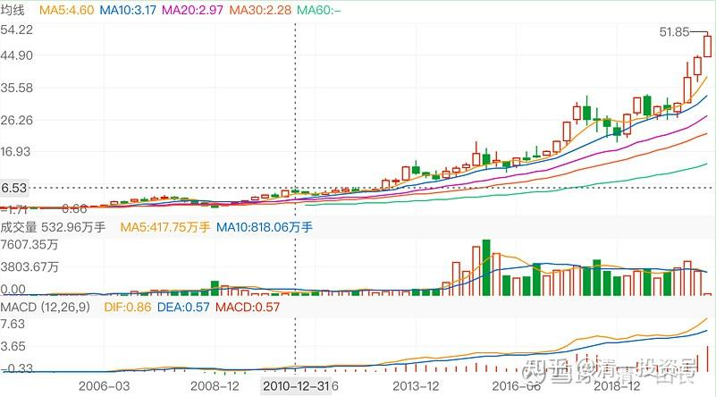
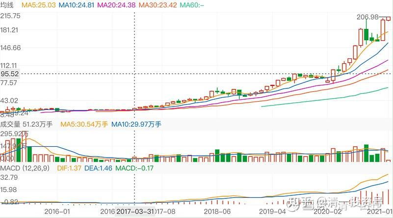
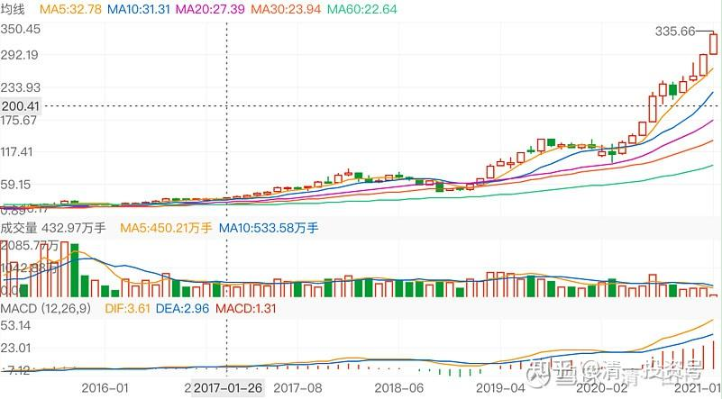
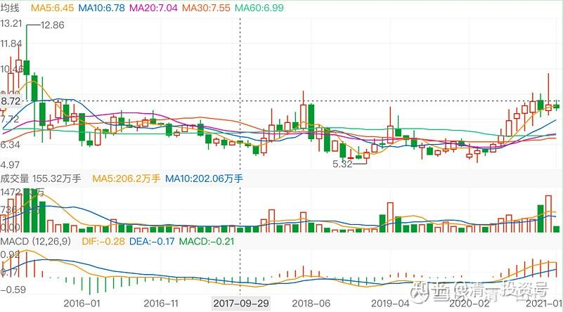

67篇.白酒系列（三）五粮液（下）——回顾投资过程

清一山长2020年7月～2021年8月

**1.不受舆论误导**

**清一山长**2020-08-30 16:06

来来来，大家瞧，大家看：这就是“吹股手”，到处找人垫背的，到处到热帖、跟帖，把八杆子打不着的“绝密消息”，拿来到处忽悠人。要真有这事，也轮不到你们这些素不相识的小股民去得到内幕消息。什么大股东不断卖出，二股东早就悄悄吸筹，也不会跌成这样子。假装装进教育培训，让你想象可以飞天。说穿了，无非是：快来抢呀！有钱赚！翻倍的！

越是吆喝得厉害的，就越是要你钱，要你命的。专门让一些贪婪而缺乏思考能力的傻瓜上当的。好股票，就没有见过这样吆喝的，出来使劲吆喝的，全都是骗子。我怎么没见茅台170元的时候有人出来吆喝说快买？倒是看见一大堆人说茅台现在不行了，快垮掉了。**我买五粮液的时候，才14块钱买的，还战战兢兢的，研究半天——这公司不会倒闭吧？**珠江啤酒五元的时候，有人跑出来让你快买吗？

说不定，以后还有消息传出来：惠泉的三当家，要接手做大股东了。以后就把惠泉换成教育股。他要把三语大学的优质资产都装进去。然后——股票要至少连涨20个板。现在惠泉不涨，就是三当家要压着股票不让涨，迫使燕京低价让股份出来，要低价吸筹的。你居然相信了，脑子就是有病！别以为是我背后操盘的，这事肯定跟我没半点关系！

**[清一山长](http://link.zhihu.com/?target=https%3A//xueqiu.com/9310099567)**2021-[05-11 14:52](http://link.zhihu.com/?target=https%3A//xueqiu.com/9310099567/179505361)

转载：广告费飙升且产品存安全问题燕京啤酒一季度亏损后再换代言人

[https://xueqiu.com/6667121621/179484207](http://link.zhihu.com/?target=https%3A//xueqiu.com/6667121621/179484207)

**当初五粮液跌到14元，泸州老窖跌到16元，茅台跌到170元的时候，媒体，专家们都在叫：白酒不行了。新一代年轻人，都不喝白酒了。吓得我战战兢兢的买入了五粮液、泸州老窖。说实话，我真被吓着了，没敢多买，每样都只买了几十万股。**董宝珍发文称，泸州老窖的厨房里有蟑螂，让我觉得泸州老窖会不会垮掉。我估计他认为泸州老窖抢了茅台的生意导致茅台下跌，急疯了。我为了找蟑螂造成的不良影响，还专门去见我做泸州老窖地区代理的表妹，看她的库房有没有蟑螂，结果没发现。她告诉我：泸州的酒，特别高端酒很好卖。没受啥影响，股票跌得厉害也不影响销售。我这才放心买入泸州。

现在回头看：我干嘛不买几百万股[捂脸]。**我真傻，居然相信了专家，不相信自己。**只相信了一点点自己的判断。

后来想通了：媒体都是骗人的。现在我不就买了十几个M的啤酒吗？你们又来黑啤酒，还让不让人活了？你们当初是怎样黑白酒的？今天一样来黑啤酒？[哭泣]

昧良心说话，被天谴的。做人，讲点良心，起码不骗人！

我就不骗人，我实话实说：各位，喝啤酒伤身，伤钱，划不来。你喝燕京啤酒，王一博也不会陪你睡觉的，都是商家忽悠你的，最多给你一张照片陪你睡。我劝你还是别买了。实在想买，自己买去，我不劝你喝酒。只要你心里高兴，想喝就喝。我卖啤酒不喝酒，我起码不卖良心。想喝啤酒，就买U8，起码味道好一点，不容易醉，醉酒太丢人。

看：老实人，做不了生意，卖货都不会卖。算了，我只当啤酒老板算了，不做推销员。[俏皮]

**2.顶住嘲笑的压力，买入**

**[清一山长](http://link.zhihu.com/?target=https%3A//xueqiu.com/9310099567)**[2021-8-10 17:01](http://link.zhihu.com/?target=https%3A//xueqiu.com/9310099567/193758557)

转载：私募大佬邱国鹭被投资者写信“教”投资，乡亲们怎么看？

[https://xueqiu.com/8152922548/193699652](http://link.zhihu.com/?target=https%3A//xueqiu.com/8152922548/193699652)

对于很多就没赚过大钱的小人物来说，能够出来批评一下成功人物，可以充分满足自己的成就感。也是一个廉价的精神鸦片，何乐不为[俏皮]。巴菲特买了可口可乐，2015年没涨。买了IBM，就是不买微软，十年后亏本退出，同期微软涨到天上，也没人说他不会价值投资。但邱总的基金三年没涨，就被无名小卒嘲弄成这样。我们这个社会是不是太浮躁了一点？徐志的基金清盘，一堆人看他的笑话。找理由说他买错了。干嘛不反向思考一下：徐志敢拿一生信用单吊一只中国中铁直到清盘，你干嘛不敢现在抄底？当年董宝珍单吊贵州茅台差点破产，打赌贵州茅台市值不会跌破1500亿而裸奔，被人嘲笑的时候，你不笑，而去买入，今天不赚大发了吗[为什么]。干嘛要嘲笑别人呢？当年记得茅台170还做空茅台的人，媒体上接受采访时得意洋洋，今天又如何了？影子都不见了。**当年我没买茅台，我顶住嘲笑的压力，买了14元的五粮液，16元的泸州老窖。**现在吹白酒赛道好的大V，当时何在？股市不要用一两年看得失。**三年，五年的寂寞耐不住，别来股市玩。**徐志的中国中铁，我现在买入了，就因为看到他清盘，我开始研究，认为他没错，只是运气不好。我买入再等四年，看你会让我破产不。我用港股通买入，无杠杆。3元多价位，分红7%，不比茅台更香吗？M级仓位求爆仓，就要跟市场反作，死也死在不随大众的路上[加油][加油][加油]

**3.抱着冷门股睡觉**

清一山长2021-[01-06 21:30](http://link.zhihu.com/?target=https%3A//xueqiu.com/9310099567/167840367)

[$燕京啤酒(SZ000729)$](http://link.zhihu.com/?target=http%3A//xueqiu.com/S/SZ000729)据说，世界上最好的生意，就是吃的生意。

可口可乐的历史，大家都知道了。现在看看中国的一些吃货们，走势如何？

这是洽洽食品的走势图，70元的价格。

下图是伊利股份的走势图

下面是海天味业的走势图：

下图是五粮液的走势图：

接下来是燕京啤酒的走势图。这样趴下已经有20年了。您认为，燕京还要趴多久？继续趴在地上20年呢？还是像某些东西一样，突然就“热”起来了？

答案我不知道。也许您会选择去追上面的股。我选择抱着冷门股睡觉！

**4.赚非理性的利润**

**清一山长**2020-09-29 15:26

广州浪奇上市28年来累计净利润也仅为4.18亿元，此次“存货消失”5.72亿。一家三十多亿市值的公司，在中国这个财富之地，日化消费品行业，居然上市28年，只赚了小几个亿。这种公司居然都有人信，有人买。它2015年的市值，还达到120多亿。中国股民真是疯了！

我很难想象：**五粮液有人居然用14元价格卖给我，**泸州老窖居然也有人以16元卖给我。今年我大量喝啤酒，也是因为我不相信中国人的啤酒就是假酒，就应该比日韩啤酒，泰国啤酒都低一倍的价格。

当然，我也很难想象：广州浪奇这种显然毫无前途的股，会有人出21元来买它。

超出想象，就是超出理性。**好处是可以赚到非理性的利润，坏处是可以损失非理性的财产。**

在疯子国炒股的好处就是：**了解疯子去何处，跟他们反向而行就行了。**你抓住疯涨，就疯赚。没抓住，就正常赚。抓反了，就疯跌[大笑]

**5.涨幅不低于茅台**

**清一山长**2020-07-11 23:20

只要中国人喜欢喝酒，茅台就不会起不来，这个牌子就值这么多。因为它的毛利润有90%，经得起折腾。所以，我一直有酒股票，太暴利了。

**2014年我没买茅台，但买了14元的五粮液，16元买了泸州老窖。**当时我去酒商调查了，市场销量不错。没啥实际影响。照样好卖。**可惜当时有点想不通白酒的逻辑，没有重仓。后来两股涨了不少，我遇到不涨的顺鑫，就重仓了一把。两者接力，涨幅也不低于茅台**[笑]。

**6.财富之心**

**[清一山长](http://link.zhihu.com/?target=https%3A//xueqiu.com/9310099567)**[2020-9-18 20:40](http://link.zhihu.com/?target=https%3A//xueqiu.com/9310099567/159555667)回复[晕娜](http://link.zhihu.com/?target=http%3A//xueqiu.com/n/%25C3%25A6%25C2%2599%25C2%2595%25C3%25A5%25C2%25A8%25C2%259C)：

您应该是唯物主义者吧？[笑]我本科工程，哲学硕士。我的导师骂我是唯心论者，不可知主义者。我自认自己无知！我真的相信心能转物。而且我见识过很多这种神奇的力量。特别在医学上的病例治疗。用唯物，是绝对理解不了的！用唯心，很容易就解决一些非常奇怪的，西医无法处理、治疗的疑难杂症！

中建可没亏待您！您中建上，赚的已经够多了。**如果还有更多的机会没有把握住，也许是老天提醒您需要进一步修心！您需要更富足的财富心！**

我也一样。**14元的五粮液我居然没有重仓**；**120元的茅台我居然没有买进；**3元的恒大我只买了300万股；5元的融创居然只买了几十万股。这都是说明：我的财富之心还不够富足，说明我还配不上这些钱[大笑]。不然，我的资产比现在，会多十倍以上。但，**我得到的，就是我应该得到的。如果赔钱，就是我欺心，良心坏了。我只是没大赚、特赚罢了，说明德行还不够高。但比赔钱的人已经幸福多了。一切都是宇宙给我的礼物！**

**我已经很满足了，没有去想我要这些更多的礼物。我只是想：这也是教训，我为什么没看懂？甚至看懂了，就是没抓住？去捡了芝麻？原因一定在我！**

参考链接：

[59篇.白酒系列（一）老白干——人弃我取，人取我予](https://zhuanlan.zhihu.com/p/554525861)（整理文）

[62篇.白酒系列（二）伊力特——“新疆茅台”（上）](https://zhuanlan.zhihu.com/p/557187863)（整理文）

[64篇.白酒系列（二）伊力特——“新疆茅台”（下）](https://zhuanlan.zhihu.com/p/558774189)（整理文）

[66篇.白酒系列（三）五粮液（上）——好企业还要好价格](https://zhuanlan.zhihu.com/p/561226672)（整理文）

[69篇.白酒系列（四）泸州老窖——切换与比价](https://zhuanlan.zhihu.com/p/565816330)（整理文）

[71篇.白酒系列（五）迎驾贡酒——优秀的分红率](https://zhuanlan.zhihu.com/p/568112813)（整理文）

