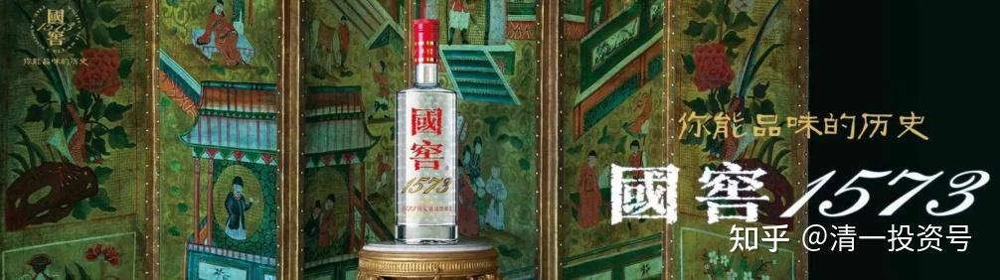

69篇.白酒系列（四）泸州老窖——切换与比价

**[清一山长](http://link.zhihu.com/?target=https%3A//xueqiu.com/9310099567)**2017年～2020年

**1.以酒换酒（2017年）**

**[清一山长](http://link.zhihu.com/?target=https%3A//xueqiu.com/9310099567)**2017-07-21 15:36

$泸州老窖(SZ000568)$今天51.90卖掉了老窖，只剩下三万股了。**买了某个一直没涨，还停留在2014年价位上，但白酒的营收，在最近这三年来，每年均获得大幅增长的消费类股**（为免黑嘴的嫌疑，更怕误导赚钱心切的投资人，我以后都不公布标的的名字了，有心人自己找吧）。会不会涨我不知道，我只知道跌得空间不大了，主要是仓位配置的需要，我不想放弃消费类股的头寸。

**[清一山长](http://link.zhihu.com/?target=https%3A//xueqiu.com/9310099567)**2018-02-12 16:53

四川人都不喝泸州老窖喝二锅头了？看来卖掉泸州老窖是对的[大笑]

**2.估值与比价（2018年）**

**51nxp**2018-08-15 15:37

$泸州老窖(SZ000568)$毫不犹豫，在老窖跌破46.5时加仓1万股，未料立马跌到46.2元，立即46.25元，再买5000股。消费股的仓位太少了，我用顺鑫换的医药仓位太多。

泸州老窖和五粮液的差别是2015年以来最高价差，2015～2016年两者相差10%之内，偶而泸州老窖还超过五粮液。不管怎么讲，老窖的业务是我能理解的好生意，喜诗糖果类，茅台价格稳就是1573最大的利好，泸州老窖每年利润50%分给股东是货真价实的回报。

每跌一元加1万股，泸州老窖能跌到我买25万股么？

**[清一山长](http://link.zhihu.com/?target=https%3A//xueqiu.com/9310099567)**2018-08-18 20:47回复**51nxp**：

今天才知道你买了泸州老窖，去看看图，才知道老窖现在跌惨了。我太不关心市场了。最近半个月都在忙教学。

虽然从K线图看，现在买入，似乎并不明智。不过持有泸州老窖，也没啥可担心的，**输时间不输钱的股**，不用太担心。也许我也可以考虑重新买回来。我原来是先卖掉很久以前买的老窖，换了不涨的顺鑫傻傻地持有。后来又卖掉了顺鑫，现在手上没啥白酒了，还真的有点怀念原来持有的白酒呢！看顺鑫也跌得惨兮兮的，原想补回来的。但看到泸州老窖也跌了，就有点迷糊了：该补谁呢？[大笑]

**[清一山长](http://link.zhihu.com/?target=https%3A//xueqiu.com/9310099567)**2018-10-30 11:09

我卖出了顺鑫农业，想做一点T降低成本。31元以下买的货，一看超过32元了，就想做做短线。很漂亮的T。可是——我只能卖出100股[哭泣哭泣]。赶快试用融券卖出吧！可是融券的额度是零。可惜了，刚买十几万股，觉得有点买多了，**想换点泸州老窖的，可惜不给换的机会**[大笑]。就坚持持仓吧[加油]！

51nxp回复@清一山长:

顺鑫和老窖这样的比价，我会选老窖。

**[清一山长](http://link.zhihu.com/?target=https%3A//xueqiu.com/9310099567)**2018-10-30 11:24回复51nxp:

基本同意这个估值[赞成]。**我今天也买了36元的老窖，估值更低**。也是以为被我卖飞了的好股（似乎我已经习惯了通过做差价来超越中国股市长持不动的收益率，“价值投机”更适合中国国情。）

买入顺鑫，是看中顺鑫的增长率，实在眼馋。有很明显的“成长”的空间，所以估值比泸州老窖高一点，是可以接受的。主要还有恋旧情结，原来高价卖出赚了钱，大跌了不买回来一点，于心不忍[俏皮]。

**3.以酒换酒（2019年）**

**[清一山长](http://link.zhihu.com/?target=https%3A//xueqiu.com/9310099567)**2019-04-08 10:52

$泸州老窖(SZ000568)$**刚才挂单以69.79元的价格，卖出了一万股泸州老窖。**剩下的再选择时机慢慢卖掉。**卖出来的资金，依然还是换了酒喝。买了某地区的龙头酒股。**因为中国人这么喜欢喝酒的话，我还是拿着酒的头寸不放好了。我只是奇怪，几个月前，我36元买泸州老窖的时候，是什么人急乎乎的要卖出？现在涨了一倍多了，又是什么人急乎乎的要买进？我猜这些人都是大佬，都比我有钱。价格低的就嫌弃不要，专门抢高价的好货[大笑]

**[清一山长](http://link.zhihu.com/?target=https%3A//xueqiu.com/9310099567)**2019-04-08 11:23

**五粮液低于泸州老窖的时候，我是用泸州老窖换五粮液。有很长一段时间五粮比泸州低。高于的话，我就换泸州了。现在两个酒股都是上市以来新高，我就换成某些只有上市以来价格一半左右的白酒了。**起码心理感觉踏实些。茅台、五粮液、泸州老窖，对我来说，就是高处不胜寒的。我这人就是怕冷、怕高。不敢指望登顶珠峰，不敢想8848。所以躲到泰国过过小日子[大笑]

**家养大v**回复**清一山长**:

太服你卖泸州老窖了，这是二十几年的盘感吗？

**[清一山长](http://link.zhihu.com/?target=https%3A//xueqiu.com/9310099567)**2019-05-06 14:50回复家养大v:

泸州老窖死拿在手上，啥都不用操心，过百元不是梦。我穷折腾罢了，别学这些。

**4.对“高价”的态度**

**[清一山长](http://link.zhihu.com/?target=https%3A//xueqiu.com/9310099567)**2018-11-25 18:04

$中国人保(SH601319)$看盘心得：人保周五继续涨停，挺了不起的。但是成交量很吓人，换手率64%，成交量48.7亿。我相信人保创造了一个新记录，一个疯狂的记录。目前的价格区间，恐怕就是人保近几年的顶部空间了。换手接盘的人是谁？难道是某位“大公无私”，专门来解救苦难散户的吗？我看到的盘面记录，是大量的散户在进入接盘的，而之前的很多大仓持有的机构在退出人保。这些人都是最热情的冲版敢死队。据说其他中小创炒作者，由于现在大股东会减持，如光洋股份等，让他们白忙一场。狂炒人保这样的股更安全。估计就是这些资金今天让开板后的人保继续封板了。以后会不会继续涨上去呢？再来七八个涨停，创造新的中国傻瓜记录？真的傻瓜才会这样想。再涨上去，不是让今天64%换手买入的聪明人都大赚一笔吗？投资界，有谁会拿出大笔资金来“坐庄人保”，目的是帮助“大多数人”致富？**一些股票长成妖股，都是前期通过各种手段控盘后，才不要命地拉升的**。如全通教育今天6元多，它2015年冲上467元的时候，有几个人手上有这个股？只能看得眼馋，想要就要被套。从年线上，当年的成交量并不大。之后成交量一年比一年大。今年的价格最低，但是成交量最大。充分说明了筹码换手后的结局是怎样的了。我个人判断：人保发行前，由于并不被市场看好。因此一些有资金实力的游资反向操作，判断中签率会比较高,因此投资大笔的资金来申购人保，自然很多的筹码就被这些游资锁定了。上市之后果断封板拉升，就是要吸引跟风盘进入。看样子他们真的很成功。11月23日先是封板，接下来开板，下行。成交放大。游资大量回收了资金和利润（其实我判断现在游资的人保成本已经成为了负数）。但他们还剩余了很多股票没有卖出，所以为了维持股价，昨天继续封板。封板的目标，不是为了下周继续涨停，而是让跟风盘不要被吓走，继续制造幻想。在震荡中才有机会把剩下的股票卖光。等他们彻底卖光之后，你看到的人保，就进入了长期阴跌模式了。而这批活跃的韭菜被收割以后，应该很长时间投机热点会暗淡无光，市场会很难看。等这些赌徒重新筹集了信心和股本之后，继续会开展新的“市场热点”。这就是中国股市的故事，我25年来已经看过了太多，可惜我看人们似乎并没有从中吸取什么教训。依然是一样的故事。不同的地方，只是涉及到的资金量越来越大了——说明中国散户脑子虽然没有成长，但是腰包还是明显涨了几个级别的[大笑]。下周判断：大盘恐怕不会有什么惊喜的地方，继续阴跌模式吧！我准备在泰国带孩子们多玩玩，看看风景，如果跌多了，我会用现在腾出来的闲散资金继续买入。如果顺鑫调整到30元区间，我继续无脑买进。**一些酒股如泸州老窖等，如果进入14倍以内的价格区间，我愿意“高价”买入一些存起来当老酒放几年**。目前市道，在市场上我可以买到还算可靠的企业，价格只卖2PE～4PE股票的时候,我愿意高价来买14PE的白酒股票，真的是要一点不怕死的勇敢投资精神。估计看起来有点像买20倍PE买入人保的狂热吧[大笑]！

**[清一山长](http://link.zhihu.com/?target=https%3A//xueqiu.com/9310099567)**2019-05-07 14:06

**泸州老窖目前在山顶上，不太符合我的投资风格，虽然我认为它过百没问题，就是时间问题**。我今年还是坚持啤酒主题投资，区域龙头白酒是陪客。这样感觉更安心一些。持有的燕京和珠江，都比顺鑫更熬人，幸亏习惯了被市场冷落。希望也可以拥有顺鑫的收益[笑]

**[清一山长](http://link.zhihu.com/?target=https%3A//xueqiu.com/9310099567)**2020-10-29 13:20

啤酒的投资逻辑，别说股市小白了。多少资深投资人，老股民，都看不懂的。就算是我讲出来了，听懂的人，也是极少数。有人跟风赚了钱，不是因为懂，是因为他们的运气好。我赚的钱，是因为市场不懂啤酒，我才赚到的。我在啤酒上，今年一个人赚到了相当于惠泉一家大公司总利润的钱，就是因为我看懂了啤酒行业的逻辑。以后，别人慢慢就会懂了。等懂的人多了，市场风险就高了。比如白酒。我赚了底部的白酒，五粮液我买入的价格才14元；**泸州老窖，我买入的价格16元，**20元也买了不少。您看现在的价格？

当然，**我早就出了，赚了三四倍就走了。风险增加了，我就去买了没涨的啤酒。其实算起来换不换都一样赚，甚至坚持拿住白酒，可能更赚钱。但是，我不喜欢赚这种高估，博傻的钱。我喜欢确定性。**啤酒我买入的价格，就是确定性的低估。现在，啤酒也快被人看懂了，我也快进入收获期了。10元以上，我会慢慢卖出啤酒的。逢高就减仓。不是我卖出就不会涨了，燕京将来，涨过20也不奇怪（跌到五元也正常）。我10元以上，逐步退出的啤酒资金，会去继续找低风险的，别人看不懂的底部股票去买。我不喜欢追热闹！所以我总在弄别人不懂的东西。

参考链接：

[59篇.白酒系列（一）老白干——人弃我取，人取我予](https://zhuanlan.zhihu.com/p/554525861)（整理文）

[62篇.白酒系列（二）伊力特——“新疆茅台”（上）](https://zhuanlan.zhihu.com/p/557187863)（整理文）

[64篇.白酒系列（二）伊力特——“新疆茅台”（下）](https://zhuanlan.zhihu.com/p/558774189)（整理文）

[66篇.白酒系列（三）五粮液（上）——好企业还要好价格](https://zhuanlan.zhihu.com/p/561226672)（整理文）

[67篇.白酒系列（三）五粮液（下）——回顾投资过程](https://zhuanlan.zhihu.com/p/563522180)（整理文）

[71篇.白酒系列（五）迎驾贡酒——优秀的分红率](https://zhuanlan.zhihu.com/p/568112813)（整理文）

