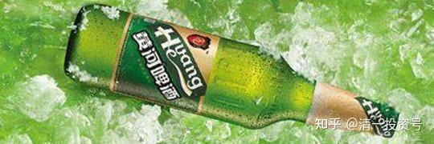
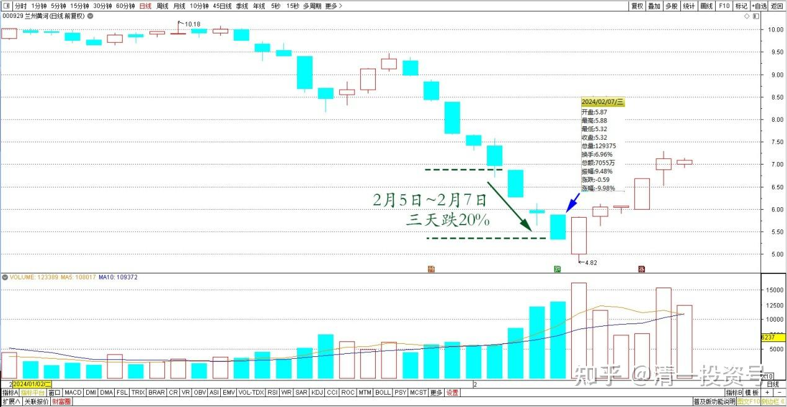
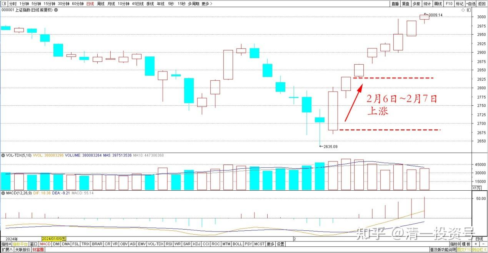
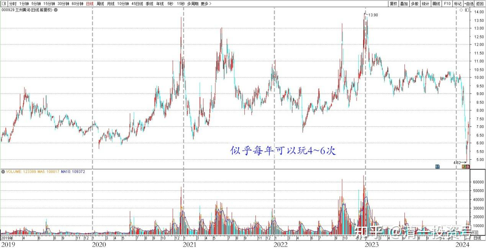
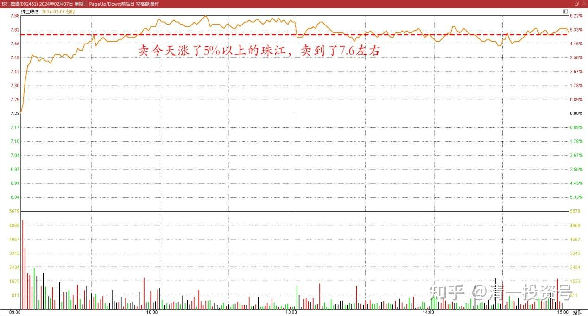
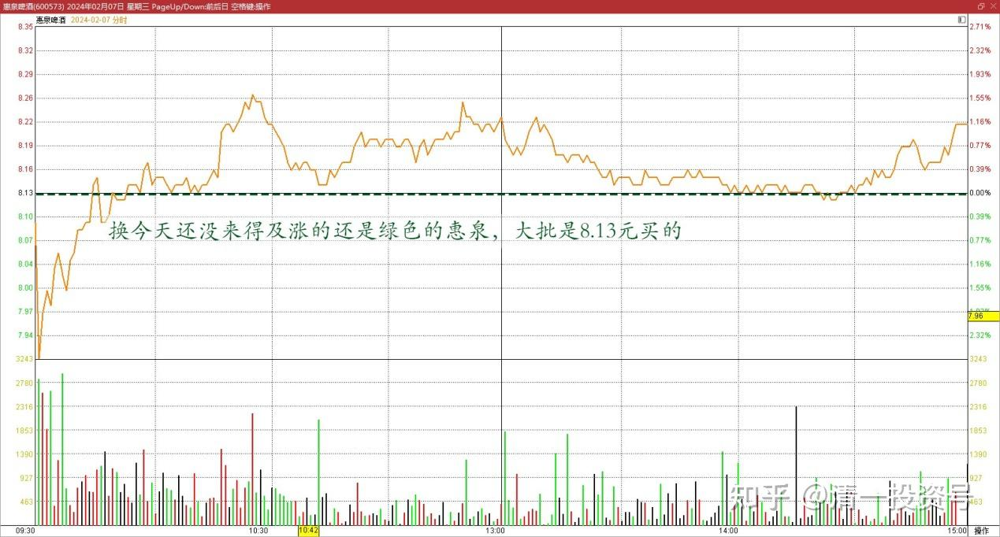

75篇.同为啤酒，敢否持有？（配图版）

清一山长2024年2月7日

**一、不敢玩兰州黄河**

今天啤酒板块跌幅第一的是兰州黄河。这两天啤酒和大盘上涨，这伙计居然没有跟涨，相反三天跌了20%。

兰州黄河2024年日线图

上证指数2024年日线图

怎么回事呢？前几年，我还在做惠泉和珠江的时候，这伙计跌宕起伏，比惠泉、珠江更凶。几次从6元多冲到13元，还经常冲涨停。好几次我预判的买点都正确，卖点也很好。如果实操，随后都有50%以上的涨幅。但我一次也不敢买，只敢买珠江和惠泉做这种大T。但会**通过观察兰州黄河走势来看庄家做盘的手段技巧**，这是一个非常明显的庄股。珠江、惠泉，当年我记得一年就T两三次进出，收益颇丰，现在持有惠泉居然是负成本当十大。当年玩得很精彩（燕京拿得就很苦了）。但兰州黄河持股体验会很好的，常常大涨大跌的，似乎每年可以玩4～6次。

兰州黄河2019～2024年日线图

我虽然看懂了操盘的趋势和K线图，跟惠泉当年的走势很像，而且更加的活跃。但**由于基本面，这个股根本就是一个烂摊子，市值居然和惠泉差不多，我根本就不敢玩这种股**。现在回过头来看，我的选择是正确的。虽然现在才跌到5元多，但看起来下跌漫漫无期——将来不知道会跌到哪里去。这是一个基本面上就没有底的股票，根本就不能碰。这几天下跌底部放量，跌到了18年来的最低位置。如果企业的基本面没问题，现在就是最佳的买入时机。但**基本面完全不行，就是一个天坑，填不满的**。我猜——下跌放量，应该是里面原来的主力爆仓了。趁现在周围的股和大盘上涨，吸引一些傻子来抄底的！你们有谁在玩兰州黄河的？请收下我的崇拜吧！

**二、上涨珠江换未涨惠泉**

今天珠江上涨较多。我正好手上持仓多，就没有继续卖燕京来换惠泉了。而是卖今天涨了5%以上的珠江，来换今天还没有来得及涨的还是绿色的惠泉，大批是8.13元买的。珠江卖到了7.6元左右，每股差价是0.5～0.6元左右。大概是卖掉一万股珠江，可以换9400股惠泉。

珠江啤酒2024年2月7日分时图

惠泉啤酒2024年2月7日分时图

我认为这样换股，应该是划算的。现在拿燕京换，我觉得有点划不来！燕京明显是刚起步呢！不过用珠江也划不来，珠江的筹码锁定良好。但不贪心了，反正无脑换股，涨跌随天意。燕京不会垮的话，惠泉也不会垮的。**珠江主要是性价比——该公司虽然利润比燕京高，但销量连燕京的一半都到不了。因此——理论上，燕京至少应该比珠江市值高一倍。现在两个股市值居然差别不太多，这种情况下，当然就是持有燕京更划算**。只是筹码锁定，显然是珠江更好，成交非常低迷！因此——理论上，一旦珠江上涨，会比燕京轻松得多！

(标题、图片为编者所加)

**文章音频：**

[427篇.同为啤酒，敢否持有_清一投资号文章同步音频_免费在线阅读收听下载 - 喜马拉雅](http://link.zhihu.com/?target=https%3A//www.ximalaya.com/sound/715033927)

**参考链接：**

[67篇.A股破位下跌的奥秘](https://zhuanlan.zhihu.com/p/673876597)

[68篇.2023年最后一份持仓总结](https://zhuanlan.zhihu.com/p/675454059)

[69篇.股市大跌，中建换啤酒](https://zhuanlan.zhihu.com/p/680236538)

[70篇.金融战·中建换燕京啤酒](https://zhuanlan.zhihu.com/p/681428626)

[71篇.顺鑫农业现在还能买吗？（上）（配图版）](https://zhuanlan.zhihu.com/p/682697509)

[72篇.顺鑫农业现在还能买吗？（下）（配图版）](https://zhuanlan.zhihu.com/p/683344685)

[73篇.意外降价，买回惠泉（配图版）](https://zhuanlan.zhihu.com/p/682700319)

[74篇.A股要崩了？我还在买股票！](https://zhuanlan.zhihu.com/p/686286680)

