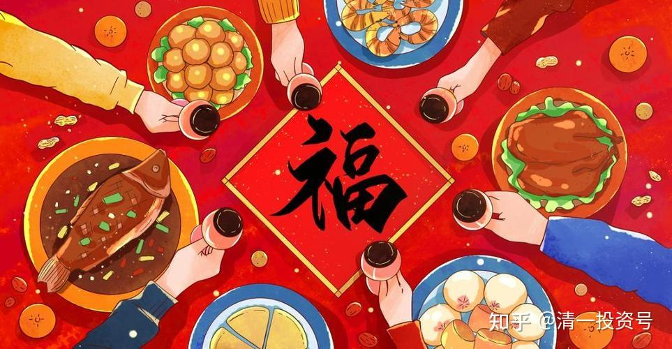
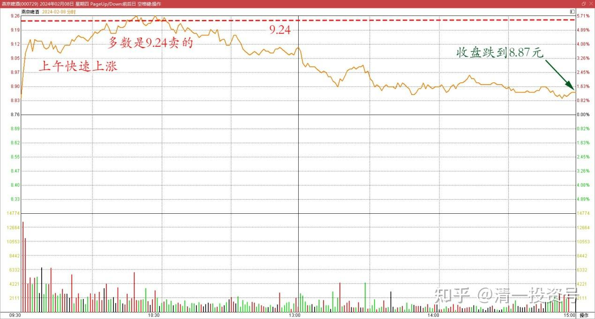
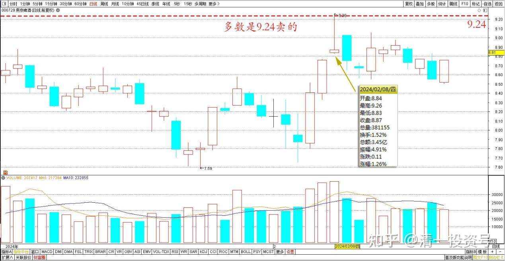
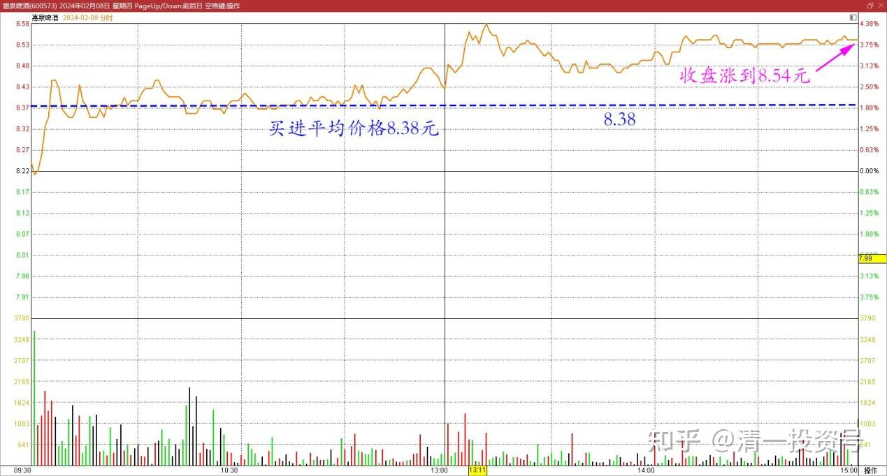
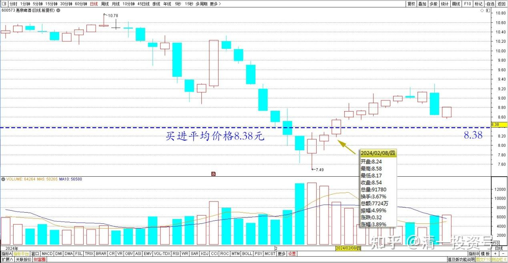

76篇.年前最后一天，燕京换惠泉

清一山长 2024年2月8日

今天节前最后的交易日，留一个操作纪念：今天上午燕京快速上涨（难得的机会），就卖了一些出去换惠泉。查看最高居然卖了9.25元的价格，多数是9.24元卖的。而今天最高价也才9.26元。今天买进的惠泉，平均价格8.38元，换股的差价已经每股有0.87元了。后来燕京就一直跌，收盘跌到8.87元。惠泉突然又涨到了8.54元。每股今天就收获了价差0.54元，算是赚到的吧？

燕京啤酒 2月8日 分时图

燕京啤酒 2024年 日线图

惠泉啤酒 2月8日 分时图

惠泉啤酒 2024年 日线图

这几天我的账上总资产起伏很大，我都算市场先生的疯狂，不予置理。但我操作换股赚到的钱，应该算是赚钱了！今天总共交易了十几万股。算是今天大A送了我大几万元的过年费吗？春节带弟子去旅游考察的费用全给报销了。感谢A股市场的大方赠送！

(标题、图片为编者所加)

**文章音频：**

[429篇.年前最后一天，燕京换惠泉_清一投资号文章同步音频](http://link.zhihu.com/?target=https%3A//www.ximalaya.com/sound/717085480)

**参考链接：**

[68篇.2023年最后一份持仓总结](https://zhuanlan.zhihu.com/p/675454059)

[69篇.股市大跌，中建换啤酒](https://zhuanlan.zhihu.com/p/680236538)

[70篇.金融战·中建换燕京啤酒](https://zhuanlan.zhihu.com/p/681428626)

[71篇.顺鑫农业现在还能买吗？（上）（配图版）](https://zhuanlan.zhihu.com/p/682697509)

[72篇.顺鑫农业现在还能买吗？（下）（配图版）](https://zhuanlan.zhihu.com/p/683344685)

[73篇.意外降价，买回惠泉（配图版）](https://zhuanlan.zhihu.com/p/682700319)

[74篇.A股要崩了？我还在买股票！](https://zhuanlan.zhihu.com/p/686286680)

[75篇.同为啤酒，敢否持有？（配图版）](https://zhuanlan.zhihu.com/p/684419681)

