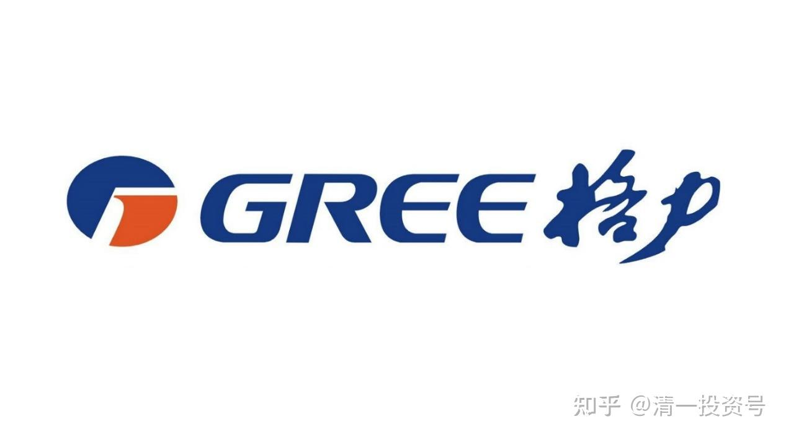
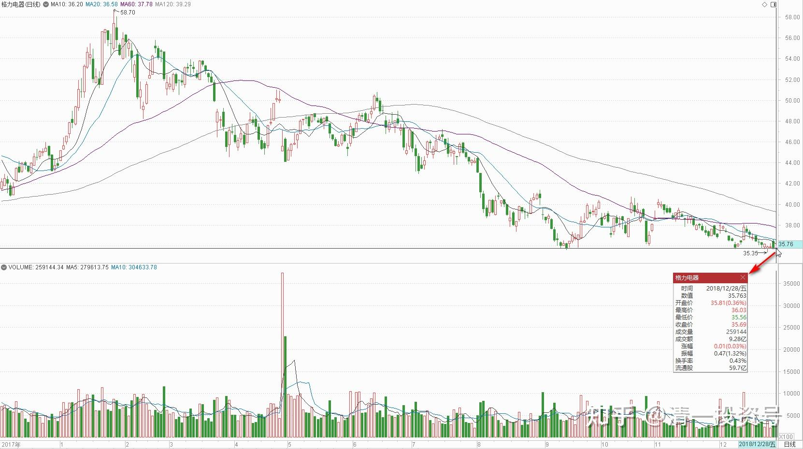
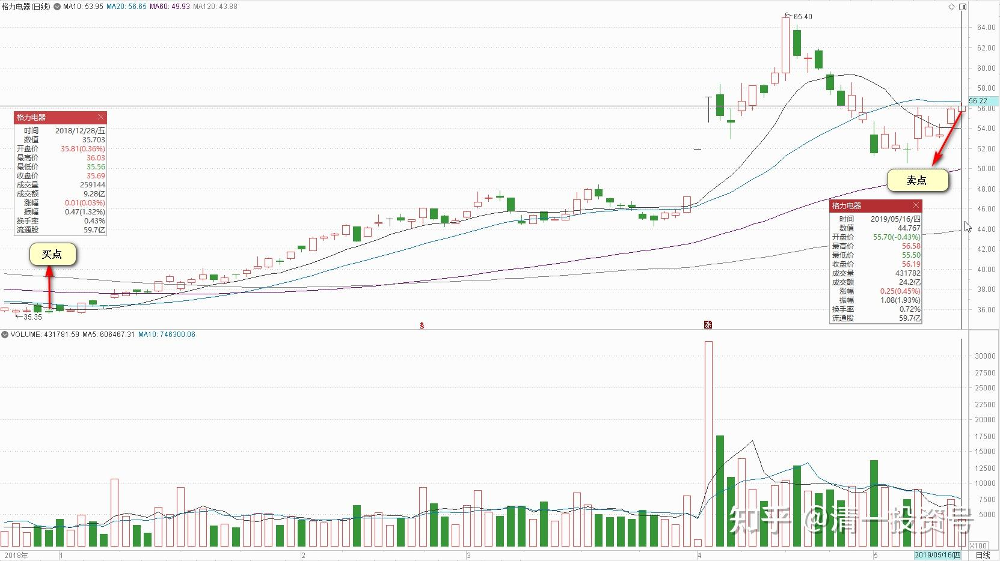
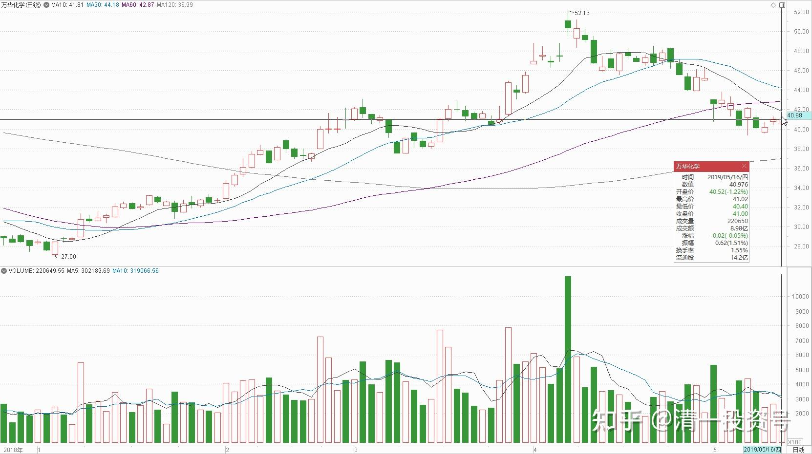
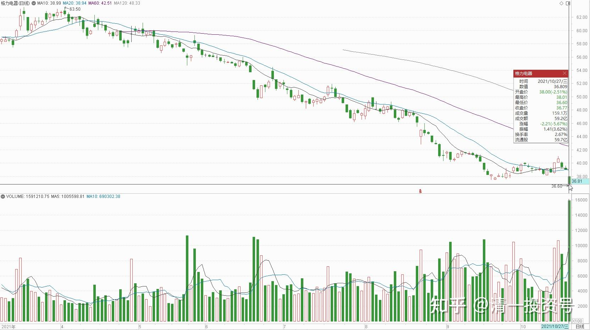

77篇.格力的买卖记录

清一山长2018-2021年

**一、买入：黄金有价玉无价**

清一山长2018-12-20 14:26:29

什么是“黄金有价玉无价”？喜欢到处买“宝贵玉石”的中国消费者要注意了。你的豪气，可能只是证明你有多傻的“傻瓜指数”。我建议各位如果有钱，还是买点好股票存起来更靠谱。比如，我觉得36元的格力电器，就比这些玉石更有价值，起码以后有机会40-50元卖给别人。但是，你今天花58800买的冰种玉石，以后卖500元恐怕都没有人要。只能留给你的孩子，假装“祖传玉石很值钱”的宝贵样子，赚点后代的感情投资费了[大笑]。所以我今天买了一点格力，表示对中国股市的支持[俏皮]。

转发：[央视记者暗访调查了四川、云南的多条旅游线路，内幕太惊人！](http://link.zhihu.com/?target=https%3A//baijiahao.baidu.com/s%3Fid%3D1601166533639574306%26wfr%3Dspider%26for%3Dpc)

原文链接：[https://www.sohu.com/a/232513638_100163025](http://link.zhihu.com/?target=https%3A//www.sohu.com/a/232513638_100163025)

墨油手镯，进价60元，标价为6800元！

蛋形手镯，进价40元，标价10800元！

冰种手镯，进价400元，标价58800元！

这两件金镶玉类进价都是85元，标价为28800元！

和田墨玉龙牌、凤牌的进价40元，标价则是36800元！近1000倍！

简单一点：你去买玉石，老板人“很喜欢”你，讲感情，讲义气，愿意“亏血本买给你玉石”，标价打一折就出手。就这样，都赚了你一百倍的利润。真是暴利！估计比白粉都赚钱吧？肯定比你们炒股赚得多得多！所以，喜欢听人说好话的，要当心。好听的话，比白粉还贵！

清一山长2018-12-28 15:29:39

$中国人保(SH601319)$今天是A股本年度最后一天。为了表达对A股市场20多年来对我的关照的谢意，我准备今天主动买套，主动买入年末不断下跌的股票。原计划买上几十万股中国人保H，至少把从人保上赚的利润部分用掉，用实际行动来支持人保。主要是因为我在人保冲7元时候提醒大家小心人保高位风险的发言，惹来了某大神一群粉丝的不高兴，一群人集体跑过来谩骂一气。我今天看这些人，虽然嘴巴上赢了（我承认吵不赢这群人），但显然他们的账户输掉了。我担心他们过于生气影响健康，怪我看空人保不好。所以今天打算用实际行动来看多人保，是否能够挽回跌势，就不知道了[大笑]。所以挂单买进几十万股人保H，可是居然港股通今天不通，只好算了。人保A嘛，虽然跌的也很惨，但我还没有胆子去下手买。结果只好用这笔资金买了几万股格力电器，35元多的价格（这是我首次买入格力）。另外再买了几万股顺鑫农业，31元多的价格买入（不久前刚刚第二次卖出顺鑫，现在是第三次买入）。

2019，我将悔过自新，把2018年卖卖卖的净卖出坏习惯改过来，改为买买买的净买入。买完后就装死，死也不割肉！就等解放军来解救的一天[大笑]！

**二、卖出：龙头之间的差价切换**

清一山长2019-05-16 10:57:01

$格力电器(SZ000651)$今天56.48元，首次开始卖出几万股格力。这是去年底以35元多买入的格力。但为了保证自己长期持有白马股的头寸，就咬咬牙，以40元多几毛的“高价”，换入了老白马万华化学（跌破30元的时候，我居然没有买。一直感到对不起万华）。我一直担心今年一季度的业绩万华会比较难看，想等一个跌下来的低价的。现在就不等了。

提示：我这种换股操作示范，是蠢蛋才干的。因为这有双重的错误可能。做得越多，错的越多。请同学们不要模仿[滴汗]。还持有部分格力，准备等时机继续换股，没机会就持有到永远。

@一叶-孤舟回复@清一山长：

我觉得卖的时候要谈自己多少成本来的就贴图拿证据，要么就只谈卖出的基本面逻辑，否则会觉得你在吹牛逼。

清一山长2019-05-16 11:47:17回复@一叶-孤舟：

说这种话，就是你信念系统太特别了——见别人赚钱心情就不好。我在去年年底首次买入格力，是公开公布过操作的，我也不知道几乎是操了这一轮的底。你不知道这事，也不为奇。但你要出来说话，就要负点责任。由于我赚钱的时候比赔钱多，为了保护您的小小心理，我就主动拉黑您了。建议您以后最好去买买阿胶，做做原味男的粉丝。这样您心情就会好些！来我这里太不合时宜[大笑] ！

@陌汝回复@清一山长：

哈哈，格力、万华都是好票，不过感觉楼主一卖，格力就要涨了[大笑][大笑][大笑]

清一山长2019-05-16 14:57:45回复@陌汝：

一般来说就是这样的。我一卖就涨，一买就跌。所以最好等更好的逃顶抄底机会。

格力是个好股票。我买万华，就是觉得万华的行业竞争力更强，更霸气！所以才换股。而且我判断万华未来可能会有跌破40元的时候。这时候再用自有资金买入更多。很遗憾没有在万华跌破30的时候用桶去接[大笑]。

@诗和远方ML回复@清一山长：

大佬，你为何不买你的中国建筑呢？现在1倍市净率左右。

清一山长2019-05-16 15:01:54回复@诗和远方ML：

中国建筑是我的第一爱股，有机会就会买[笑]。只是我弄不清它的护城河到底有多宽，似乎做建筑的都很多。只好实在是很便宜的时候才买入一些。

**三、卖出后对格力的观察思考**

系小资 2020-04-10

@今日话题@雪球达人秀#热门股2020Q1季报解读#

刚刚睡前刷雪球，刷到了奥克斯能耗造假出结果了！注意看关键词！

[https://xueqiu.com/1566609429/146575573](http://link.zhihu.com/?target=https%3A//xueqiu.com/1566609429/146575573)

董明珠大撕奥克斯，半年多的结局是罚酒三杯

清一山长2020-04-16 09:59:13 （评论上文）

看评论和文中内容，觉得很惊讶。中国人的确眼中只有利益，没有名誉意识。居然都是认为罚款十万元不算什么，处罚太轻了等等[俏皮]。我只能说这些人的脑子被车撞了，完全缺乏思维力。这根本就不是区区十万元的问题，而是“市场荣誉和信任”的问题。

**中国古人讲“名利”二字，有名才有跟随而来的利。如果只讲利，最终不但没有名，连利都会丢掉了。**奥克斯就是不明白这个最基本的道理，丢了名，不要荣誉和信任，只想投机取巧直接要利，就算蒙骗一时，也可以得到当地政府维护地方利益的保护，但面对完全竞争的空调市场，这种手段也无济于事。因为，十万元的罚款，再少，也坐实了奥克斯“名誉、信用”的丧失。以后谁还相信奥克斯的空调？谁还相信它的宣传？原来它跟风打打价格战还有点用，现在恐怕连赔本卖都没人要了。消费者就算是贪图低价，买了奥克斯的空调，也不希望朋友看到它买的牌子就想起奥克斯的骗子和谎言，也难免怕被笑话自己是一个脑子不好被人骗的傻瓜。光这点，就让爱面子的中国人也不愿意今后再买它了。所以，最终这家企业，肯定是玩不下去的。特别是遇到这一次的世界性的疫情，经济危机，连头部企业都倍感压力，它这种平时投机取巧的企业，就扛不过去了。

贴主在最后在说的话倒是真的，10万元的结果，就是奥克斯正走在在破产的路上。说明贴主明白结果——不是政府把它罚死的，而是市场抛弃，奥克斯自己找死的。如果消费者就是热爱它，说谎了也要他，我们也必须接受。就像克林顿性丑闻，公布出来，让老百姓决定要不要他继续当总统。而不是某个委员会决定他的命运。这才是真正的市场经济---交给消费者来决定。都靠政府部门来维持，这种经济格局是不正常的。

一句话：**在市场上混，信用很重要。**可以骂格力，但格力骂不垮，是格力没有做丧失信用的事情，黑格力就没用。我看到文中说格力为夏普做的空调被召回，就觉得搞笑。因为说明董小姐真的懂得名誉的价值，格力可以帮助其他贴牌的企业去做有问题的空调，但格力自己一定不造假数据。这就是懂得名誉的价值。就算罚款，也是夏普的品牌受损，不是它格力。我相信标假数据，也不是格力自己标的。她一个OEM的厂商，没必要哄弄消费者。要哄弄你们自己去哄弄。真是聪明人！

**[祝融氏](http://link.zhihu.com/?target=https%3A//xueqiu.com/zhuxianseng)**[2020-06-23 09:07](http://link.zhihu.com/?target=https%3A//xueqiu.com/3571250408/152185719)

知乎高赞的回答

今天刷知乎时，看到一个5.7万赞的回答，问题是“如何系统地学习股票投资”。

这个回答是关于如何使用技术指标的。在这个问题的下面，我还看到有几个价值投资的回答，我觉得说的挺好，不过一个赞也没有。

给大家摘录一段这个5.7万段的高赞回答：

[https://xueqiu.com/3571250408/152185719](http://link.zhihu.com/?target=https%3A//xueqiu.com/3571250408/152185719)

[基本面和择时：白马股的买入逻辑](http://link.zhihu.com/?target=https%3A//xueqiu.com/3571250408/152185719)

清一山长2020-06-23 09:33:28 （评论上贴）

作者写的很实在：不确定的就不会去做。但你觉得自己确定的就一定赚钱吗？未必[很赞]

即使如此，还是要追求确定性。而**估值低才介入，是最重要的安全性的确定因素。叠加成长性，输掉的可能性就大减。即使如此，可能还有想不到的黑天鹅因素。**既然想不到，只有接受结果。

@晕娜回复@柯南只爱毛利兰：

茅台：

2013年净利润同比增长13.5%

2014年净利润同比增长1.9%

2015年净利润同比增长1.2%

2016年净利润同比增长9.1%

2017年净利润同比增长62%

2018年净利润同比增长30%

2019年净利润同比增长17%

五年前，我为什么不买茅台，看看茅台历史数据吧！就茅台当时那个成长性，真够烂的！中建上市11年，没有那么烂的成长性！

清一山长2020-07-11 23:06:54回复@晕娜：

我可不可以逆向思维一下：如果晕娜可以不这么执着于茅台的增长不稳定，愿意在报表增长最难看的2014～2015年买入茅台（逆向投资法），收益就会比只守中建大很多倍？如果当年买进100多元的茅台，今年来卖掉一千多元的茅台。再买入5元的中建，岂不快哉！

所以，坚持要求企业每年都必须不低于10%增长，是不是苛刻了一点？让自己失去了更多的机会？

当然，我这是后视镜，不算数的。**不过去年我用涨到56元的格力电器，换40元（38元）的万华化学，依据就是两只股一年前价格都差不多（20～30元），地位都是行业龙头，弄出这种价差，持有万华更划算**。现在万华跟格力同价了，因此我等于多赚了钱。我喜欢进行估值切换，不过指标就不能太苛刻。万华的周期性，不可能要求它每年都稳定，大约只有中建这种可以控制成长率了。这也是我在反周期的时候，特别喜欢它的原因。

[@股灾亲历者](http://link.zhihu.com/?target=http%3A//xueqiu.com/n/%25E8%2582%25A1%25E7%2581%25BE%25E4%25BA%25B2%25E5%258E%2586%25E8%2580%2585)回复[@清一山长](http://link.zhihu.com/?target=http%3A//xueqiu.com/n/%25E6%25B8%2585%25E4%25B8%2580%25E5%25B1%25B1%25E9%2595%25BF)：

我现在满仓满融单一个格力电器，也有点像赌。不会像他没成富翁，变负翁吧？

[清一山长](http://link.zhihu.com/?target=https%3A//xueqiu.com/9310099567)20221-[01-27 11:15](http://link.zhihu.com/?target=https%3A//xueqiu.com/9310099567/170056610)回复[@股灾亲历者](http://link.zhihu.com/?target=http%3A//xueqiu.com/n/%25E8%2582%25A1%25E7%2581%25BE%25E4%25BA%25B2%25E5%258E%2586%25E8%2580%2585)：

爆不爆仓不知道。但20倍的PE，覆盖不掉融资的利息。赚不赚就很难说了。一两年前，格力冲56元我就跑了，换了40元的万华化学，因为我认为万华的赛道更好！你融资持有，理由是啥呢？

跟你赌一把！满仓满融格力，我认为跑不过满仓满融5PE的中国建筑。三年为期！输了打赏1元[大笑]

[清一山长](http://link.zhihu.com/?target=https%3A//xueqiu.com/9310099567)[2021-10-27 14:39](http://link.zhihu.com/?target=https%3A//xueqiu.com/9310099567/201272442)

[$格力电器(SZ000651)$](http://link.zhihu.com/?target=http%3A//xueqiu.com/S/SZ000651)跌得这么惨?抛盘源源不绝的样子。真可怕！几年前差不多就是30多元买入的，56元换了万华，还被格里芬骂了一顿。现在跌回原始价格，可以买一点了吧？今天先看看，成交几十个亿，这个架势真恐怖。似乎是有人不计代价再跑路。有啥特别的利空吗？格力要垮了？[为什么]，不至于的吧？

参考链接：

[清一投资号：11篇.金融战开打了](https://zhuanlan.zhihu.com/p/485173866)

