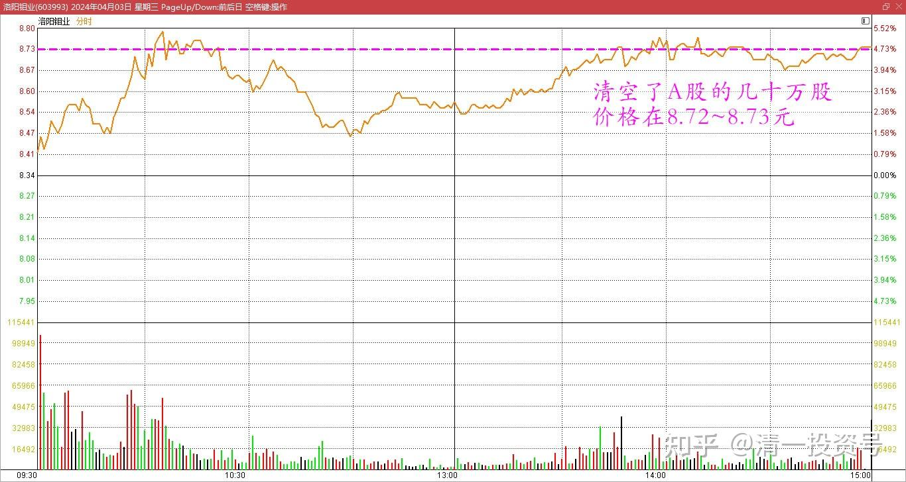
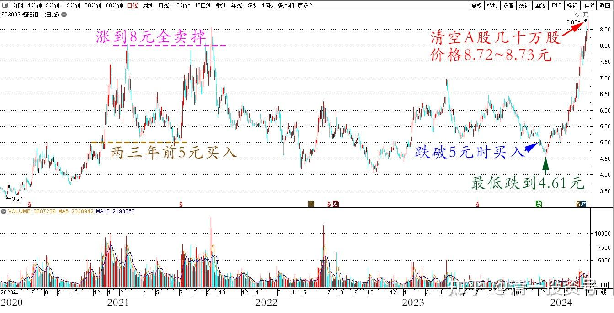
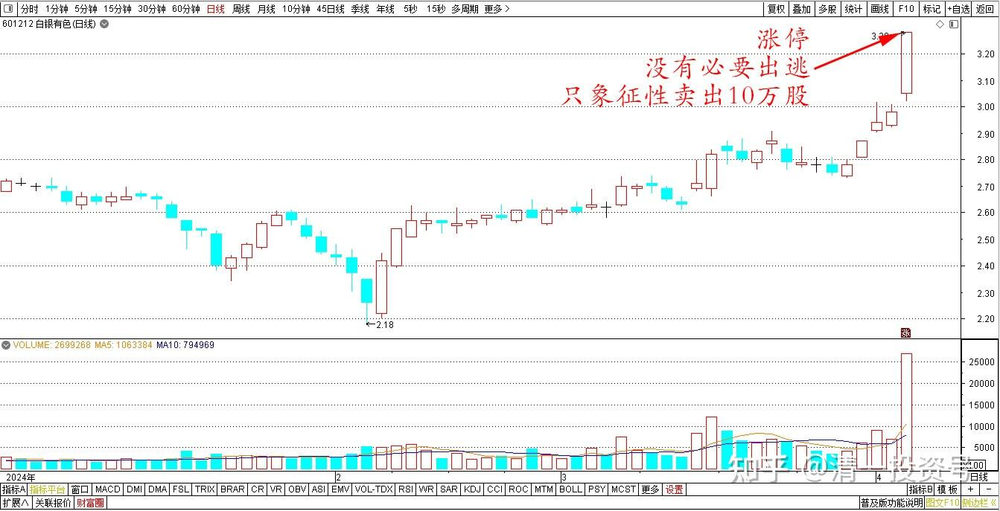
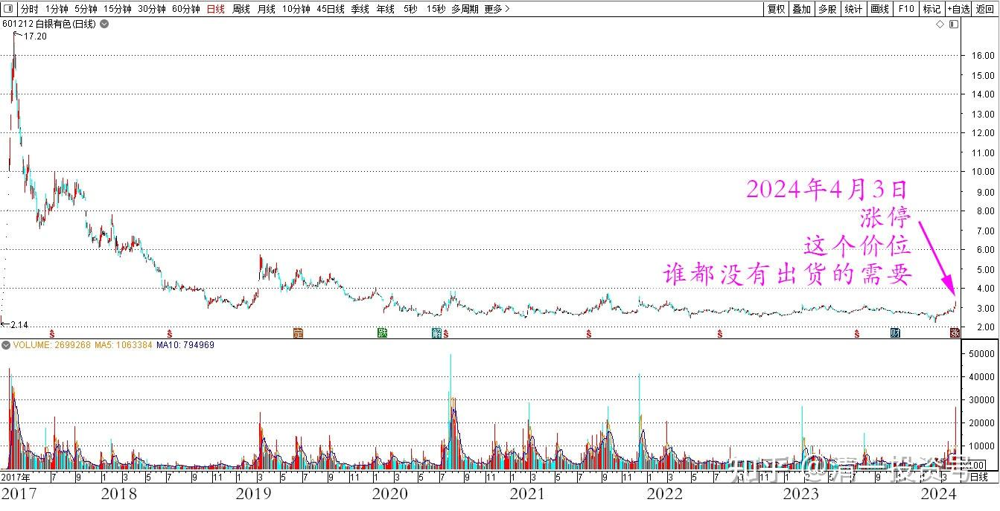
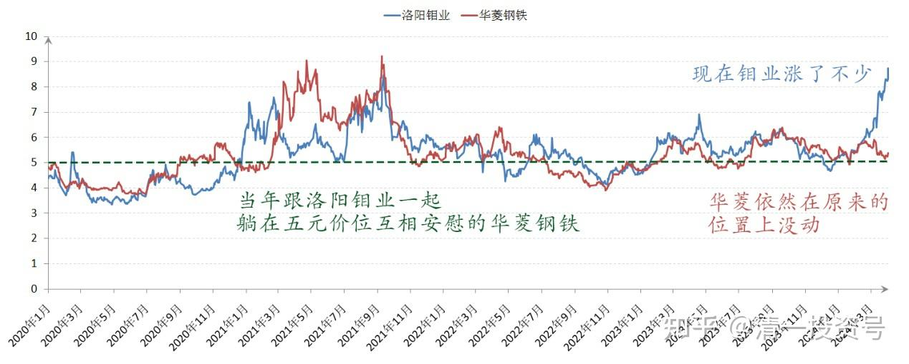
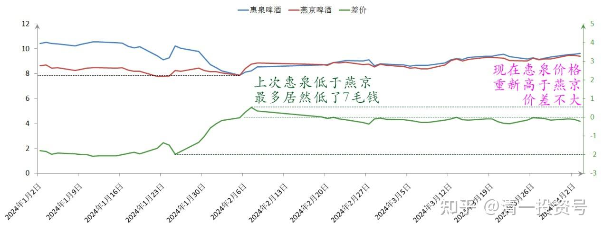
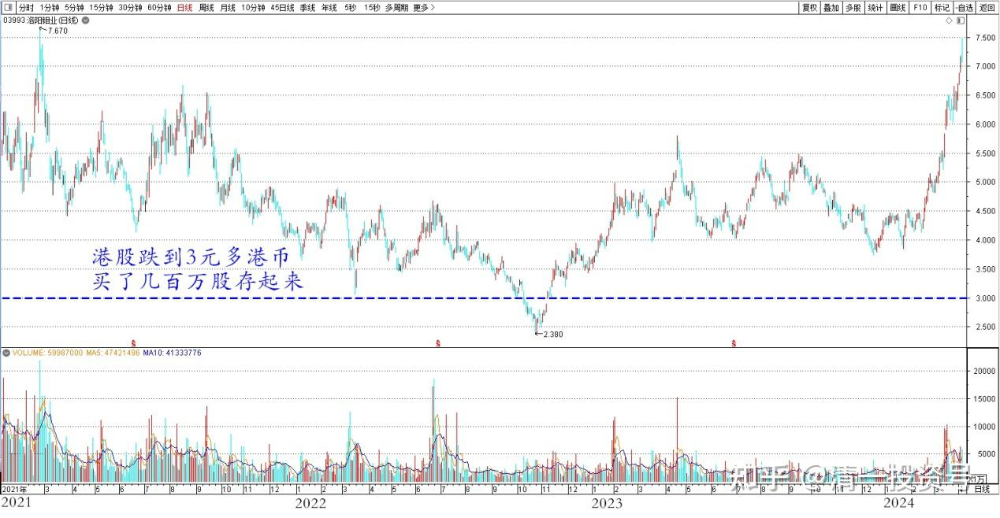

[78篇.洛阳钼业换华菱钢铁](https://zhuanlan.zhihu.com/p/692417410)

清一山长2024年4月3日

今天清空了A股持有的几十万股洛阳钼业，价格在8.72～8.73元。

洛阳钼业2024年4月3日分时图

这些股票，是半年多前，跌破五元的时候买的，当时觉得太便宜，跌回了很久以前的原价（两三年前第一次买洛阳钼业，就是5元买入，然后涨到8元多就全卖掉。结果这次5元补入，依然被套了，最低居然跌到了4.61元。现在就再创新高了。所以市场先生——真的只有利用的价值，没有相信他判断的价值！

洛阳钼业2020～2024日线图

今天持仓数百万股的白银有色，居然涨停了。一般来说，我习惯涨停就卖出至少一半持仓。但认真看过K线之后，认为现在还没有必要出逃，这个价位，谁都没有出货的需要。只有投机客抢利润的需要，我就只是象征性的卖了10万股出去，给市场冲冲喜。让今天拉涨停的资金有点小收获。剩下的仓位，就没动了！

白银有色2024年日线图

白银有色2017～2024年日线图

一般来说，我习惯常年满仓。这段时间，就是我一年多前预言的“有色金属的春天”了。股指低迷，但有色等大涨。一两年前让清粉们布置大消费（啤酒）和有色资源股，现在看来我都猜对了节奏。**在全球货币大放水的局面下，为了保护自己的金融资产不被抢劫，就只能去买【大宗资产】来保值了。这就是我重仓有色的逻辑。**有本事追科技股当然最好，追对了赚十倍。**可惜我不懂科技，不知道该追谁。万一追错了，损失就大了，本金都没了。所以——就采取了最笨，最保守的金融策略——买这些跌不下去的股！而且坚持一直持有！涨了最多卖掉融资仓位，自有资金死守资源不放！**

为了避免踏空，今天也补充了一些金属行业的股票进来，就买了当年跟洛阳钼业一起，躺在五元价位互相安慰的华菱钢铁。现在钼业涨了不少，华菱依然在原来的位置上没动静，现在换入应该没啥风险。**洛阳钼业以后继续涨了，我还有大量3元多港币买入的洛钼头寸，就是不卖，心理感觉良好。万一钼业跌了，我还有抗跌的华菱来锁定利润。所以目前我认为这种投机，是怎么都不吃亏的选择！**

洛阳钼业、华菱钢铁2020～2024年收盘价

至于啤酒——行情不温不火，继续磨叽。我也继续观望，没啥动静，继续做大股东。如果出现理想的价位，就换换股。上次惠泉低于燕京的时候，换了惠泉回来，最多差距居然低了7毛钱左右，不可思议。现在惠泉价格重新高于燕京了，但也没到我想要卖掉惠泉、换回燕京的地步，两者的价差不大，如果差价超过两元了，我就该动手了！如果没有的话，就不搬砖了。目前搬砖利润最多就是惠泉了。珠江的搬砖利润，目前还是三股中最低的，但持仓是历史最高，未来超越惠泉的利润，应该是必然的！

惠泉啤酒、燕京啤酒2024年收盘价

一次买入洛阳钼业后，就开始认真研究，觉得是一个可以长持的股票。后来港股跌到3元多港币，就买了几百万股存起来了。这笔投资加上汇率的因素，已经赚了一倍了。但目前还没有计划卖出H股，继续坐电梯吧！主要是没有找到什么可以换股买入的东西，等找到了还是会卖掉的。

洛阳钼业H2021～2024年日线图

我在A股中，找了一个没有涨的同类型的金属股票来替换洛阳的持仓空缺——华菱钢铁。5.34元买入基本相当的股份。**其他卖出之后的利润部分，就还了整个账户的利息。相当于用洛阳钼业的投资利润，结清了整个账户里面上百万的融资利息，我觉得这样就很划算。可以假想自己的融资资金是零利息借入的，可以长期持股。**实际上我的主账户上，利润都已经高于持仓市值了。因为一部分资产已经被提走去做建设了，现在账户资产都是股市上白赚的利润。

(标题、图片为编者所加)

**文章音频:**

[435篇.洛阳钼业换华菱钢铁_清一投资号文章同步音频](http://link.zhihu.com/?target=https%3A//www.ximalaya.com/sound/722671805)

**参考链接：**

[70篇.金融战·中建换燕京啤酒](https://zhuanlan.zhihu.com/p/681428626)

[71篇.顺鑫农业现在还能买吗？（上）（配图版）](https://zhuanlan.zhihu.com/p/682697509)

[72篇.顺鑫农业现在还能买吗？（下）（配图版）](https://zhuanlan.zhihu.com/p/683344685)

[73篇.意外降价，买回惠泉（配图版）](https://zhuanlan.zhihu.com/p/682700319)

[74篇.A股要崩了？我还在买股票！](https://zhuanlan.zhihu.com/p/686286680)

[75篇.同为啤酒，敢否持有？（配图版）](https://zhuanlan.zhihu.com/p/684419681)

[76篇.年前最后一天，燕京换惠泉](https://zhuanlan.zhihu.com/p/688783385)

[77篇.年后第一天，看啤酒起落](https://zhuanlan.zhihu.com/p/688784278)

