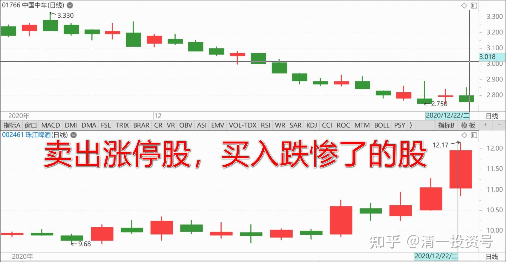
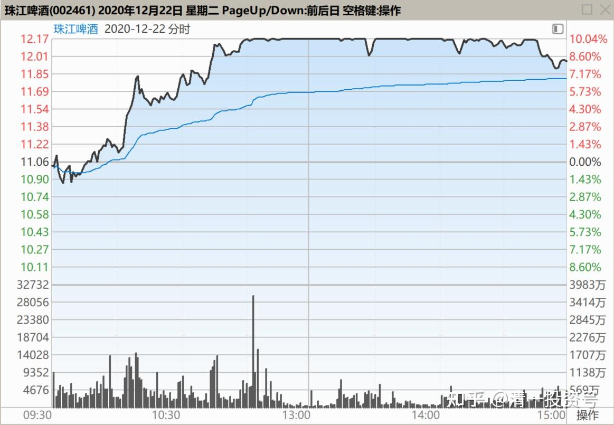
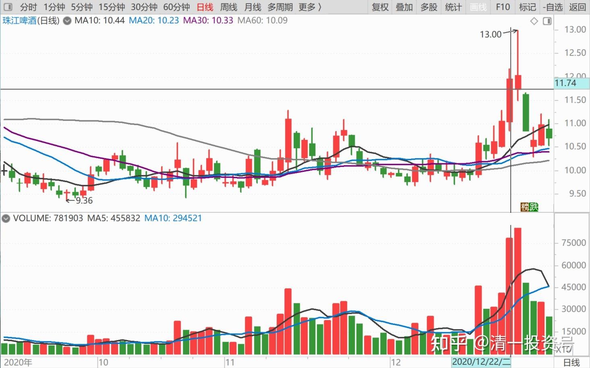
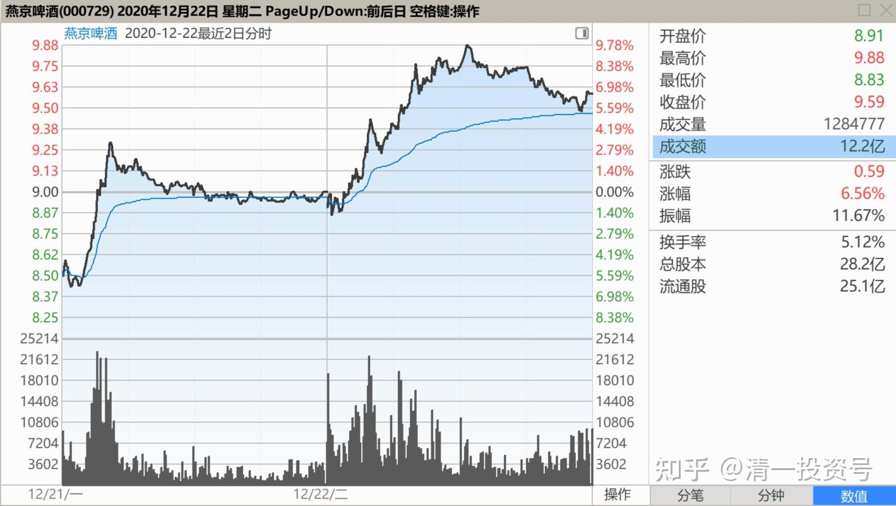
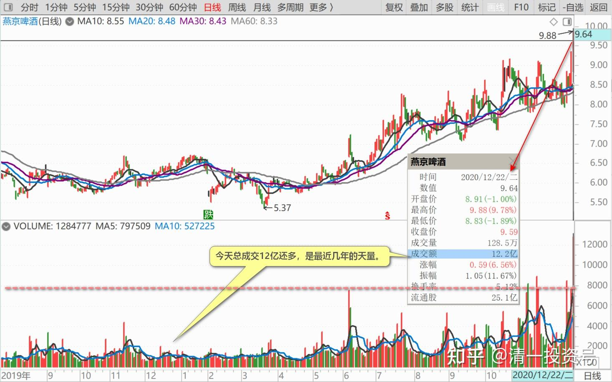
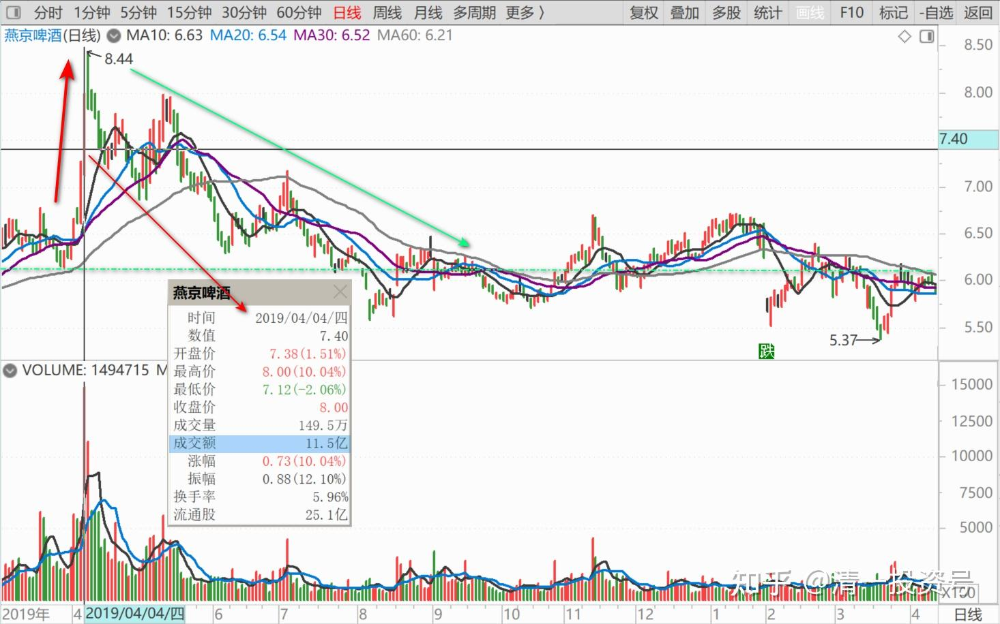
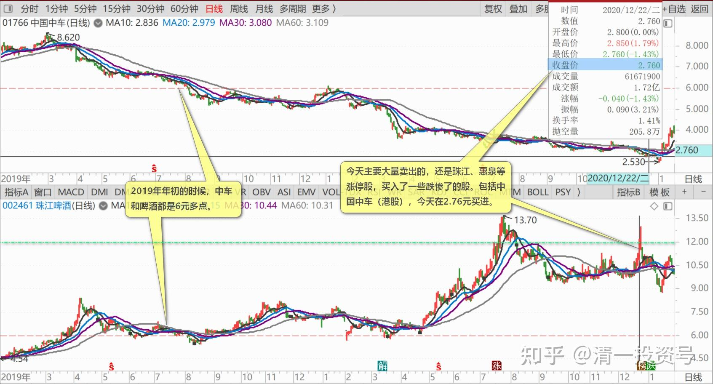

79篇.卖出涨停股，买入跌惨了的股

清一山长2020年12月22日

[$珠江啤酒(SZ002461)$](http://link.zhihu.com/?target=http%3A//xueqiu.com/S/SZ002461) **抱歉，下午的涨停板，承认是我打下来的。**不是我故意的，就是本来盘面上好好的，但我的卖盘一放上去成交，就发现买盘开始哗啦哗啦地往下掉，但成交也没多少，我猜是主力撤单？不想要？很快就破了涨停价。我其实没卖多少，也就卖了百多万股[吐血]。今天总成交七千多万股，我就是个小零头，账上还有超过百万股的珠江没动呢！打下来，不符合我的利益[吐血]。早知道会跌，趁涨停板有买盘的时候，我全走了好不？不过，真跌了也不怕。不是腾出资金来了吗？改天，我会重新买回来的。多少价位是买点？具体就不多说了。珠江过10元就不示范操作了。

燕京啤酒，我还可以多说两句，没过10元[大笑]。燕京今天的成交非常的不寻常，这两天的涨幅其实很高了。**今天总成交12亿还多，是最近几年的天量。**是不是后期要调整？从盘面上看，今天倒是没有出货的迹象，主力、散户，都一起在吃货。昨天盘中出了一点货，但不多。正常的倒手行为。

**上一次成交量放出天量，是2019年连续两天涨停追货**，第二天成交11亿，比今天少一点，但数量上应该更多。**一般来说，天量天价。上一次创天量后，燕京走上了漫长的调整之路，吞吃了全部的涨幅。**

这一次会这样吗？我认为不会简单的重复历史，但是有可能会调整一下，调整的幅度和时间，都不可能跟2019年的那次相比。因为燕京目前是价值价格比最好的股票。实质上，**市值（市值=股价乘以总股本）跟珠江差不多（燕京啤酒市值264亿，珠江啤酒市值270亿）。但燕京的销量是珠江的三倍，按照销量来测算，燕京的空间比珠江大**（不过如果按照重庆啤酒的逻辑来算，珠江比燕京更像重庆，所以我拿不准，两个都买成重仓）。市场的基本面上，燕京与去年已经很不一样了。**所以，我除了逢高减掉一点仓位还融资外，现在还不想大量卖出燕京。**不过，我特别感谢燕京的主力照顾。本来昨天我涨停板（9.41元），挂了100万股燕京卖出的，结果没卖掉。今天为了表示感谢主力不吃之恩，就在9.77元附近，出了相当一部分仓位出来，换点别的跌到地板上的绩优股去了。**今天主要大量卖出的，还是珠江、惠泉等涨停股，买入了一些跌惨了的股。**包括中国中车（港股），今天在2.76元买进。我用没啥技术含量的啤酒，换世界第一牛的“中华神车”，我觉得就算这种交换在钱上吃了亏，我也蛮自豪的[俏皮]。再看看2019年年初的时候，中车和啤酒都是6元多点。现在啤酒涨了一倍多，中车跌了一倍多，我就瞎猜：我这样换，是不是就相当于我赚了四倍？[大笑]

**不过换了中车、中建等，就不好玩了，只管傻傻地等。**现在装索罗斯的玩法，可以玩得挺HI的。好在现在仅仅是开始，账户上依然有超过千万股的啤酒，等着慢慢派发。我不急，慢慢走，也许几年后还在，只要账户是负成本持有啤酒就安心了。涨到天上都不怕！（我有恐高症）

[胡叔刚](http://link.zhihu.com/?target=http%3A//xueqiu.com/n/%25E8%2583%25A1%25E5%258F%2594%25E5%2588%259A)回复[清一山长](http://link.zhihu.com/?target=http%3A//xueqiu.com/n/%25E6%25B8%2585%25E4%25B8%2580%25E5%25B1%25B1%25E9%2595%25BF)：

大家应该清楚的知道，酒板块面临大调整，风险越来越近，就像今年五月份时的省广集团，本人曾多次提示风险一样，供大家参考！
清一山长回复[胡叔刚](http://link.zhihu.com/?target=http%3A//xueqiu.com/n/%25E8%2583%25A1%25E5%258F%2594%25E5%2588%259A)：

我刚打赏了这条评论￥10.00，也推荐给你。好心有好报，祝福你！**热闹繁荣之地，都在极盛之时，极美之处，倏然散场。留下的人，负责买单！**

[陈振杰1](http://link.zhihu.com/?target=http%3A//xueqiu.com/n/%25E9%2599%2588%25E6%258C%25AF%25E6%259D%25B01)回复[清一山长](http://link.zhihu.com/?target=http%3A//xueqiu.com/n/%25E6%25B8%2585%25E4%25B8%2580%25E5%25B1%25B1%25E9%2595%25BF)：

对拿着零成本的山兄提示风险还领走奖金，啤酒喝多了吧！哈哈？？个别酒类与省广有可比性？能见到青岛啤酒的走势是如何穿越牛熊[俏皮]
清一山长回复[陈振杰1](http://link.zhihu.com/?target=http%3A//xueqiu.com/n/%25E9%2599%2588%25E6%258C%25AF%25E6%259D%25B01)：

别人才不是来提示我的，他才懒得管我怎么玩。他是来提示跟风者，小心风险的。现在跟风酒股，风险已经大于收益。所以我才说他好心！不是因为他提醒我。

对我来说，就是如何兑现收益的问题，兑现多、兑现少的问题。超过10元我不说话，也是怕误导人看我赚钱了来跟我风买。**假如我以后11元也敢买珠江，是因为我12元多卖掉了珠江。**新赌徒拿钱跟风，赚了算运气，赔了算必然。更别提看到涨停价来跟风的。

**我今天卖出的成交单看，很多是散户的单，不是大户的整单**。连我都担心：这些人冲进来，是赚是赔难说。我看了我的珠江卖出单子，有一笔是十万股涨停价卖出的单子，有43个成交是百股的单子，对应应该是资金很少的43个散户。其他千股的单子也有不少，万股以上买入的，才4个单，最高的单17300股。我认为全是小散户，**这些人愿意12元多追高，4元的珠江不要。难以理解！**这种人，应该去买2.76元的中国中车睡觉去，干活去，读书去。不应该在股市上杀来杀去的。

雪球上某贴：

[$珠江啤酒(SZ002461)$](http://link.zhihu.com/?target=http%3A//xueqiu.com/S/SZ002461) 很棒，套牢了几个月总算回本了，撤了，朋友们明年夏天见

清一山长评论上贴2020-12-22 16:11:41

[献花花]，主力最喜欢你们这样的群众演员了。积极参与，主动配合，从来不抢主角的镜头，只做热场的配角。你们总在热闹的高位入场，也在高潮之前及时退场！只要回本，就轻轻地走了，也不带走一分盈利。干杯[干杯]。

(标题、图片为编者所加)

**文章音频**：

[478篇.卖出涨停股，买入跌惨了的股](http://link.zhihu.com/?target=https%3A//www.ximalaya.com/sound/755888063)

**参考链接：**
[70篇.隔山观火，不投入情感](https://zhuanlan.zhihu.com/p/707564067)

[71篇.从不缺乏热闹，只缺乏理性](https://zhuanlan.zhihu.com/p/709411110)

[72篇.为什么不要冲过9.60元收午盘](https://zhuanlan.zhihu.com/p/710752420)

[73篇.蓄势上攻，引而不发](https://zhuanlan.zhihu.com/p/712057223)

[74篇.惠泉跨栏历史记录回顾](https://zhuanlan.zhihu.com/p/713488711)

[75篇.惠泉最成功的地方](https://zhuanlan.zhihu.com/p/714477508)

[76篇.聪明人赚钱，傻人赔钱](https://zhuanlan.zhihu.com/p/715051514)

[77篇.在确定企业价值的基础上进行金融投机](https://zhuanlan.zhihu.com/p/717031167)

[78篇.你这样做，庄家会吐血](https://zhuanlan.zhihu.com/p/718319738)
