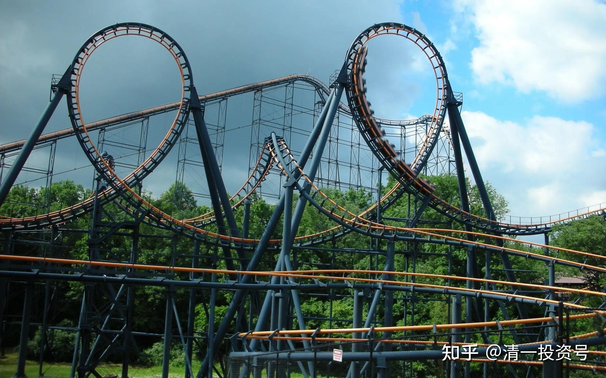
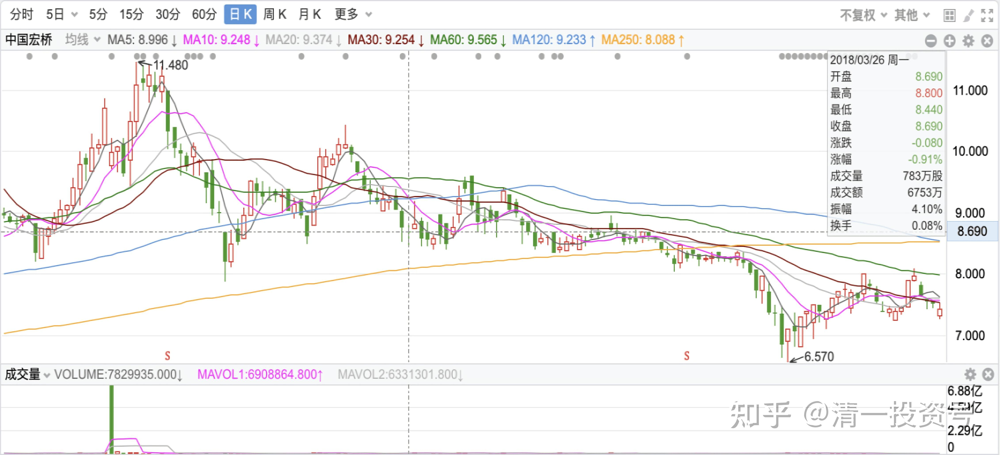
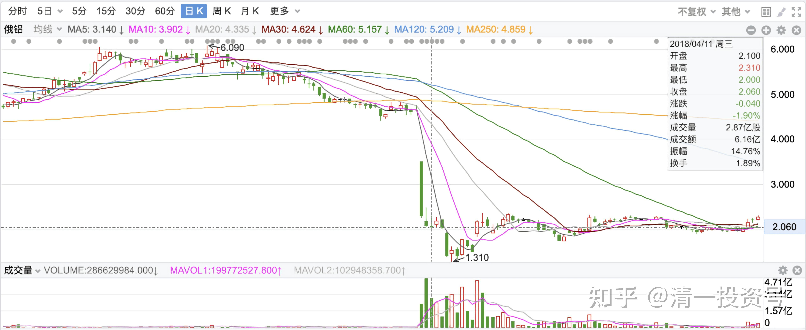
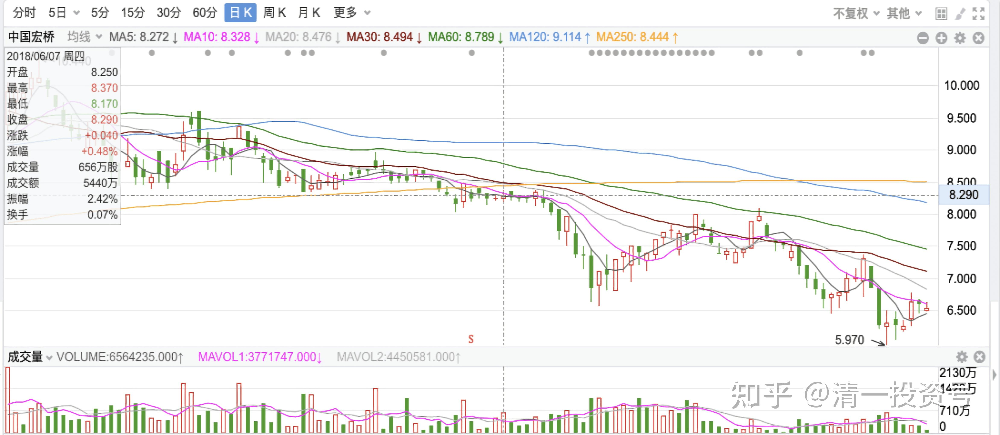
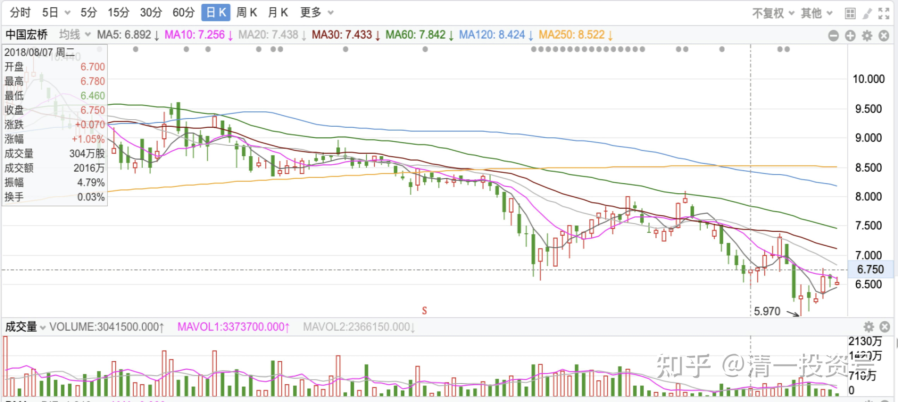
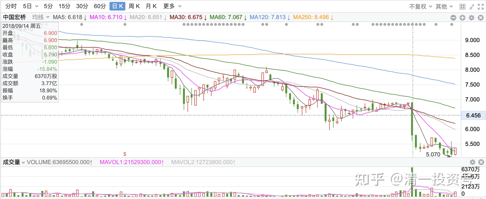
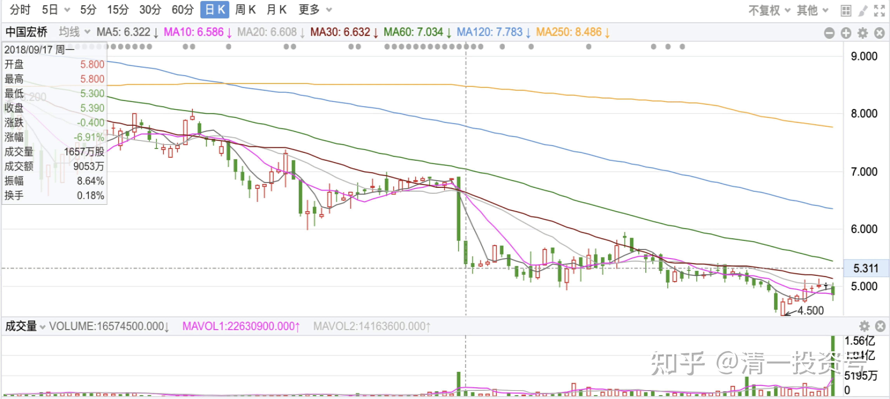
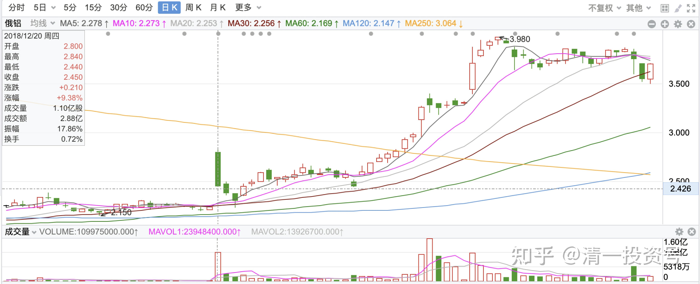
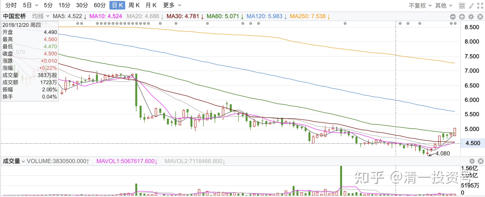

7篇.中国宏桥系列之七：坐“过山车”的正确姿势

清一山长 2018年1月13日～2018年12月20日

**导读**

**一、中国宏桥就是高手选出来的美女**

**二、中建、宏桥、俄铝仓位管理示范**

**三、宏桥继续下跌，就继续加仓**

**四、两个多月下跌20%多怎么办？买！**

**五、用实业的思路投资宏桥**

**六、明达野老的宏桥投资思路**

**七、山长预判美股 宏桥越跌越买**

**正文**

**一、中国宏桥就是高手选出来的美女**

清一山长2018-01-13 23:18

$魏桥纺织(02698)$ 还记得我前期12元多的高点，卖出一些宏桥，买入3元多的魏桥吗？当时生怕号召大家“坚决不卖，打爆空头”的宏桥多头骂我是“叛徒”。我还特别申明是去支持友军去了。现在一个跌了20%多，一个涨了20%多。要是全换掉，就赚了40%多。可惜我就是不会算账。

高处看海 [2018-01-29 11:22](http://link.zhihu.com/?target=https%3A//xueqiu.com/4532094386/100472518) 清一山长

《投资的本质，就是一场选美》

链接：[https://xueqiu.com/4532094386/100472518](http://link.zhihu.com/?target=https%3A//xueqiu.com/4532094386/100472518)

[清一山长](http://link.zhihu.com/?target=https%3A//xueqiu.com/9310099567) 2018-01-29 11:45 评论上贴：

高君的选美标准很高呀[赞]。赞同这种选美逻辑！我们的钱有限，不能见一个爱一个，买一个。需要认真思考后再投入出去。

[清一山长](http://link.zhihu.com/?target=https%3A//xueqiu.com/9310099567) 2018-01-29 12:01 评论上贴：

呵呵，我们俩不能这样比的。勉强说，我选股没有你挑剔。你更专情一些，我要“多情”一些。我可能口味杂，欣赏的美女类型会比你多一些，标准模糊一些，打扮差，不漂亮的有时也会娶进来。所以常常看走眼，比如江南。如果严格按照你的标准，落坑的可能性会大大减少。

高处看海 回复 清一山长:

好吧，就按仁兄说的，您是多情王子，我是痴情王子！

清一山长 2018-01-29 12:23 回复高处看海：

痴情好！！选好美女就生死相依。多情不好，多情总比无情误。大家别学我。

清一山长 2018-03-06 16:31

好消息是：大领导表示中央军和地方军一视同仁，大家凭本事吃饭。解除了我们担忧宏桥因为不是中央军嫡系部队会被排挤的担心。（宏桥联手中信，也部分地达到了目的）

坏消息是：铝业还要经历残酷的市场绞杀。一时间价格上不来的，短期利润前景不看好。

背景：我认为钢铁业，政府一直控制很严，门槛也很高，一直在压制民企钢铁的投资冲动。因此钢铁业上，民企是没有实力跟嫡系竞争的。煤炭业经历低谷期对于煤老板的续买，以及对于开采规模的控制，加上20年来两轮的杀跌之后，中央军通过买买买，已经基本控盘，所以钢铁、煤炭已经完全可以自由控制定价了。铝业，中央军表现太差，砸了很多钱，如中铝，也没有真正的竞争力，行情好的时候赚的钱，还不够行情差的时候亏的，净资产一直在减值。所以大领导不想保了。

高处看海 [2018-03-25 08:37](http://link.zhihu.com/?target=https%3A//xueqiu.com/4532094386/103851364) 清一山长

《中国宏桥2017年报简析》

链接：[https://xueqiu.com/4532094386/103851364](http://link.zhihu.com/?target=https%3A//xueqiu.com/4532094386/103851364)

清一山长 2018-03-25 11:48 评论上贴：

我刚打赏了这篇帖子 ¥66.00，也推荐给你。谢谢高君认真细致的研报分析，让我可以偷懒了。虽然重仓宏桥，但我研究功夫花得太少。看了研报，也许我应该补回原来高位卖掉的一点仓位了。

有一个问题：2018年的电解铝产量，应该不如2017年。因为宏桥去产能是下半年才启动的。如果市场不涨价，也许宏桥利润不如2017年？

**二、中建、宏桥、俄铝仓位管理示范**

清一山长 2018-03-26 14:59

$中国建筑(SH601668)$ 今天以8.74元的价格，买入了一点中国建筑，让我的中建持仓量恢复到了M级水平（不好意思，居然帮我赚钱最多的股，我之前只持有了一点点。主要我不太看好A股的估值，大多数资金都转战港股了）。今天买入不是为了低估啥的，接飞刀的原因主要是“念旧情”，对中国建筑如此低迷感到难过，用一点个人资金支持一下，反正没打算低价卖。买入后，中建的总持仓成本还是负数。再跌可能会再买，但如果持仓成本上升到0元之后，就不会再买入中建了。也就是说，我只计划把中建的利润部分用来投资，不打算花本钱。因为我觉得中国交建H比它更便宜。多的钱，不如用来买交通建筑算了。很搞笑的是：今天同样以8.74元的港币，买入了几十万股$中国宏桥(01378)$ 。让我的整体持仓成本从2.06元增加到了2.26元。本来我完全有机会让宏桥的持仓成本也变成负数的。只要按照我对中国建筑的操作手法来使用就够了。因为宏桥提供的机会其实比中国建筑更好，应该夺走我的中国建筑创造的个股利润最高记录。可惜的是我错过了机会。由于我个人太看好中国宏桥了，高位我只卖掉了少部分的持仓，大多数持仓都在坐电梯。所以，只好维持现在的持仓价格了。所以证明不要太爱一只股票，投入感情后，结局不太好的。如果宏桥继续下跌，不排除我会继续买入。直到持仓成本超过3元，就不再继续买入了。

申明：我今天买入不代表我认为股票不会跌了。按道理还会跌的，美股很可能来一个黑色星期一，很可能本周就是大跌周。反正我还有不少资金正在等待买入便宜货。今天只是旧情复发，买了一点老情人的股，表示支持罢了。不是理性投资的行为。因为我一向买股后都被套牢的。主要靠躺倒装死来赚钱。

清一山长 2018-03-26 23:17

实话说是运气好罢了，宏桥从2015年的高点8元掉下来以后，我才注意到它的。正好配股事件导致股价低迷，时间也较长，给了我较为充足的购买时间。加上国家队救市以后，我从A股逢高撤退，去买更低价的港股，否则也买不了这么多。

清一山长 2018-04-10 20:32

有点想拣货，不过准备当风险投资来投。因为真的不了解俄国人，也不了解俄铝。所以，就丢一两百万元进去，等它破产了，跌光了，就做资产计提损失算了。赚了算是白拣的 (本段俄铝有没有必要留着) 。

清一山长2018-04-11 20:06 回复月亮得未来：

今天我清掉了两只股，一股都没留。赢利了，就走了。买入了三只从来没有买过的股。俄铝，你们已经知道了，其他两个就不说了。因为已经十年没有涨了，怕你们跟进，再等十年你们就骂我十年，你们等不起。

我也不知道以后会不会涨，就是想投机一回，就当穿梭回十年前买。起码我赚了这十年的时间。所以，有资本慢慢熬。比守了十年的老股东幸福多了。

清一山长 2018-04-13 15:23

可不可以认为：正是因为现在的很多重量级买家都不被允许购买俄铝，消除了大牌的竞争对手。不仅如此，还让这些人亏血本，不计代价的卖出。是不是给了我们这些不急于用钱的小散们，一个长期投资的好机会呢？

**三、宏桥继续下跌，就继续加仓**

清一山长 2018-06-07 16:23

今天还买了一点$中国宏桥(01378)$，买入价是8.25元。它依然是我的港股第一持仓。目前看看我账户上记录的持仓价才2.31元，有点不好意思，就买一点回来，每次买个十万股的样子，直到恢复原有的持仓。今天买入后，持仓成本增加了两分多钱，看来会持续上升的。因为高位我没能彻底的坚守，跑掉了25%左右，现在买点回来以免良心不安。因为这只股我实在是太看好了，总想学巴菲特持有它十年。不然早跑光了。从技术上看，当时冲12元的时候，绝对是应该跑路的，但我是被“基本面良好”绊住了想要卖出的手，只卖了一小部分。不然当时全部出清，都卖给大量要货的张世平大老板，虽然显得很不仗义。但我现在，看到如此惨跌，但张老板都不出来护盘的时候，我再重新捡回来，也是一个好的示范。拥有超级重仓的宏桥，还玩成负成本持有的模式，也算是一个好玩的投资故事。当年卖掉一小部分宏桥后，为了不踏空中国的铝行业，想到宏桥买了铝制品的上市公司，就去跟风，也买了一家做铝压延的中国忠旺，买入后慢慢地熬，担惊受怕的，天天被球友称为老千股，好不容易熬到今天。慢慢买入后，总股数与宏桥差不多了，但资金量远远赶不上。这两只股，可能都可以代表"中国制造”吧？就看什么时候被市场承认了。

清一山长 2018-06-07 17:27回复一片红和一片红：

你们问这么多，真是太费心了。干嘛不去买宏桥呢？明牌，大牌。而且我告诉你是我的港股最重仓。不看好，怎么可能重仓？今天我还买了的8.25港元。以为不告诉你们的才会赚大钱呀？不一定的，可能会赔钱的。至少这股十年来，到今天我看盘面，就没人能够赚到它的钱，都是赔钱的。我玩是准备赔钱，赔点小钱。我的大钱才不敢玩呢！等研究好了，确定会赚钱了，再告诉你们。

清一山长 2018-06-07 18:36

支持。不过有人会认为我们把4元买的东西，现在8元做广告，是忽悠人抬轿的。

不过，我对宏桥买入行为，应该是一种“怀旧情结”，似乎不完全是理性的投资行为。如果真要进行价值比较的话，长期投资铝行业，8元的宏桥和2元的俄罗斯铝业，到底谁更有优势？我似乎更倾向于俄罗斯铝业。它的水电资源，会对宏桥的上下游一体化优势相比，有很大的对冲。当然，今年下半年俄铝的业绩应该很难看，美国制裁完全打乱了它的生产节奏，会造成很大利润损失的。但是长期来看，水电这个优势实在太强大了。电解铝的主要成本，其实就是电！特别是在煤炭涨价的未来前提下，水电铝的优势更大。

清一山长 2018-07-25 19:19回复美丽邂逅：

谢谢。俄罗斯铝业不是很“成功”的，我2元买了后就跌到1.6元了。我只是坚持不动，才获得正收益的。上周2元出头，又加仓了一些。我的逻辑是：大多数人都不能买它的情况下，我拥有能够买它的账户去买一些，应该大概率是不贵的。

**四、两个多月下跌20%多怎么办？买！**

清一山长 2018-08-07 15:47

$中国宏桥(01378)$刚才买进了16万股，价格是6.70元。因为盘面上挂着这么多，干脆就都买了。这笔高价买入行为，让我的买入均价上升到了3.7元，持仓成本价到了2.43元。明显增加了持仓负担。账上还有些余钱，慢慢等机会再买一些便宜货。今天A股普涨，所以今天不应该买涨的。A股涨，今天宏桥没涨，但是A股跌，宏桥一般会跟跌的，我就认了算了。如果不是宏桥有大单挂出，我今天也懒得动。起码我的价格比张老板增持的价格低，应该知足了。

清一山长 2018-08-07 22:59

不敢多评论，真的不太懂。我猜你买这种公用股，是熊市防御的架势。还有题材进取的优势。兼顾了攻防。我看K线也是相对稳健的，不会大跌的样子。防御甚好。我相信你买入有足够的安全判断。

只是根据我自己的逻辑，不会买这种股。我总觉得：它的市盈率，市净率都较高，总觉得划不来。分红也并不多，所以对我来说安全垫还不够厚实，我怕万一摔了会很痛。我遇到熊市，喜欢买交投量很少的高息股。这种股，几乎像是要死掉一样，再跌深的可能性不大了。就像是今天买的宏桥，除了一个卖单挂了16万股以外，其他买卖双方的单子都是千股，最多一万多股的。价位之间还有空缺，成交显然很低迷。这时候我认为买进的风险就很小了。跌了就“死守”好了，反正这种股，这时候想卖也卖不掉的。（不过这种股，一旦涨起来，流动性就马上好了）。

清一山长 2018-09-14 13:40

$中国宏桥(01378)$主动套牢买入宏桥。今天试探性买入30万股，成交价5.97、5.96，持仓成本今天已经上升为2.61元了。不就是电网要交费吗？羊毛出在羊身上，又不是宏桥一家的问题，无非是电解铝的市场平均成本上升罢了。目前7～8%的股息率，拿着分红就有饭吃了。**今天买得比张老板增持的价格都低，我认了**。下周计划：如果市场继续下跌，就慢慢买入一些低价股。

清一山长 2018-09-14 15:03

这个价格拿宏桥，心不慌。就是可惜高点只出了一小部分，假如出清了现在再进，就可以创造超过中建的收益了。坐了一路高高的电梯，利润回吐不少。原因还是**太看好宏桥了。我愿意拿宏桥十年（如果不太涨的话）**。

清一山长 2018-09-14 15:17

这一单干得漂亮，这个价满上宏桥，长期看肯定不吃亏。短期来看，很有可能有意外的惊喜。说不定下周就见到好消息了。

清一山长 2018-09-14 16:40

短期如何不知道，还是看长远吧！宏桥以后国家限产，资产和利润无新的投资方向，只能降杠杆，赚的钱将来也只能发股息了。

**五、用实业的思路投资宏桥**

高处看海 [2017-10-18 10:16](http://link.zhihu.com/?target=https%3A//xueqiu.com/4532094386/93880109)清一山长

《中国宏桥：困兽犹斗还是潜龙在渊（之一）》

链接：[https://xueqiu.com/4532094386/93880109](http://link.zhihu.com/?target=https%3A//xueqiu.com/4532094386/93880109)

清一山长 2018-09-17 15:53评论上贴：

[$中国宏桥(01378)$](http://link.zhihu.com/?target=http%3A//xueqiu.com/S/01378)空头极尽猖狂之日，就是股价见底之时!!!

张士平可以接受股价下跌，我们也可以。用实业的思路来投资。而不是看着股价上下而判断自己投资的成败。股价只是我们买进和卖出的一个参考指标而已。

从宏桥的市值来看，仅仅471亿港币，远低于国内拍卖合规产能的“指标价”：每吨一万元左右的“市场估值”。宏桥646万吨，“指标”就要值646亿。还不算高兄长文算出来的各种优势。我们以目前远低于指标价格买入，该知足了。

清一山长 2018-09-17 16:06

今天再度买入10万股宏桥，买入价5.40元。买入理由：就当实业投资了。目前企业市值低于铝指标市场拍卖价，估值处于超级安全的区域。

另外是仓位管理的需要：补回一些去年冲高卖掉的仓位，也让自己心安，就当做T成功了。一旦达到仓位限制就停手。

清一山长 2018-09-17 16:09

今天加了十万股，5.40元买进。挂价5.38元的没有成交。

清一山长 2018-09-17 19:54

我等小民，哪里懂政治？更别谈世界政治了。要惹烦了特不靠谱，俄铝都过不去日子了。你担心政治的话，就买中铝好了。

高处看海 [2018-10-08 15:00](http://link.zhihu.com/?target=https%3A//xueqiu.com/4532094386/114652693)清一山长

《著名大V管我财看空中国宏桥，做多俄罗斯铝业，他却这样说……》

链接：[https://xueqiu.com/4532094386/114652693](http://link.zhihu.com/?target=https%3A//xueqiu.com/4532094386/114652693)

[清一山长](http://link.zhihu.com/?target=https%3A//xueqiu.com/9310099567) 2018-10-11 17:19评论上贴：

我刚打赏了这篇帖子¥66.00，也推荐给你。码了这么多字，居然没人打赏。我开个头吧。支持有分析能力的球友对企业的分析。希望大家不要求全责备。

高处看海 [2018-10-04 15:55](http://link.zhihu.com/?target=https%3A//xueqiu.com/4532094386/114546091)清一山长

《海德鲁关闭巴西工厂，世界上最受益的股票是它……》

链接：[https://xueqiu.com/4532094386/114546091](http://link.zhihu.com/?target=https%3A//xueqiu.com/4532094386/114546091)

**六、明达野老的宏桥投资思路**

[明达野老](http://link.zhihu.com/?target=https%3A//xueqiu.com/2029742712) 2018-10-08 10:41评论上贴：

今天我继续买了些中国宏桥。2016年初4HKD左右买它，经过三年的发展，现价5.2HKD不到，如果宏桥跌到3.5HKD左右（再跌30%+），我更加会加大力度买入，因为这相当于我新增仓位的资金省去了3年的0收益率（含分红）等待期、增加了公司3年的发展垫底，且还是在一个未来极有可能加大派息却被大幅看空的时机去免费帮人承接割肉盘。怎么算都是笔对我有利的买卖，大不了躺倒装死再等它个3年。

[清一山长](http://link.zhihu.com/?target=https%3A//xueqiu.com/9310099567) 2018-10-11 23:00[明达野老：](http://link.zhihu.com/?target=https%3A//xueqiu.com/2029742712)

这个投资逻辑很清晰。现在的价格，其实比两年半以前的4元更便宜。因为这两年多，宏桥赚到的钱都不止1.5元了。何况发展情况良好。企业受到一些压力很正常，但也不是针对宏桥一家的。宏桥的铝土矿和氧化铝优势，应该足以抵消自备电厂被摊派税款的优势。如果跌到4元。等于宏桥这三年的工作都白干了[滴汗]。显然的低估宏桥不再扩张之后，分红是可以持续的。目前的分红率比理财和银行股都强多了。

[清一山长](http://link.zhihu.com/?target=https%3A//xueqiu.com/9310099567) 2018-10-11 23:00评论上贴：

高兄对于宏桥的分析，实在是细致之极。从这个角度来宏桥的优势，比电力的优势还要大得多。可惜市场不认账。目前价格，低于战略伙伴的入股价格。显然是不能持久的。

明达野老 2018-10-12 10:05[清一山长](http://link.zhihu.com/?target=https%3A//xueqiu.com/9310099567)

一个电力问题并不足以撼动宏桥的全产业链和上下游集群优势，销售和其他成本优势都可以完全覆盖掉这一点点问题，而且就像山长说的，这个政策不是针对宏桥，而是整个行业，而算上山东省本身的自备电占比高的优势，宏桥未来的相对优势依然是稳稳的NO.1。我敢无脑买入，更看中的是张老板此人。张此时卸任让位于其子，从另一侧面也印证了公司基本面的情况，也就是，快速扩张打江山的阶段已经收尾，未来几年，宏桥将步入稳定收获期，这也是我在目前已超8%的股息情况下，继续看好其未来几年派息力度的重要原因之一。而且这个价格居然比中信批发价还低得多（中信的价格，比张老板买入价格还低，我估计张董很是不情愿的），比2016年的底部也才高一点（相当于说，除去分红，这三年发展市场根本没给估值）。不过，实在不涨就不涨吧！投银行理财、存款或者是高风险高收益率的P2P，远不如买这个安全性极高、股息率远超市面上理财产品的公司，继续不涨或者继续跌，我就分红再投入扩大股份。股价涨不涨，就随它了。
另外，想请教山长一个问题，昨天您提到你的预判是2019年底是美股崩盘时间窗口，您的判断依据是什么呢？

**七、山长预判美股 宏桥越跌越买**

[清一山长](http://link.zhihu.com/?target=https%3A//xueqiu.com/9310099567) 2018-10-12 10:23回复明达野老：

你的投资逻辑很好。我昨天没有买入宏桥，是想再等等看，再跌也会出手的。我觉得没这么简单就V型反转的，有的是时间。昨天我买了股息率13%的股票。

关于美股2019才会出问题的预判，是因为看美国经济状态，现在还挺强的，甚至用加息也没有造成不良影响。它强势的打击中国，让周围国家都害怕跟它作对，都会跟美搞好关系，也会强化美国的企业运行状态（短期内）。但是这一切到了2020年就不行了，美股对基本面的反应会提前一点，所以我认为2019年美股就会出问题。只要这几年中国忍住不死，不出现系统性的危机，稳定度过这两三年之后，中国就进入了下一轮的经济强势周期。美国如果这一次打不下中国，三年后就不再有机会了。就收获不到”羊毛红利“了。也因为美国现在已经用尽了原来的优势和资源，2020就不得不再次的“货币放水”，救济美国的经济下滑局面。全世界都会跟随放水。中国就熬过了现在的紧缩难关，会获得最佳的全球成长机会。而美国只会在美股崩溃情况下才会放水救市。（现在是加息，收缩资本和投资）。不过，也许由于美股过于高企，提前引爆也是有可能的。今天刚看到的消息，转发出来供参考。我是同意这种逻辑的。大摩这一次没有故意来忽悠人。摩根士丹利指出，对美国资产持有的悲观看法，意味着资本不太可能会从世界其他国家抽离，转投这一世界第一大经济体，因而美元获得的支持减弱。价格走势很可能会令投资者感到鼓舞，认为新兴市场可以承受股市的波动。James Lord等分析师在一份报告中写道：“美国资产的疲软料可让我们进入新兴市场熊市的最后阶段”。

高处看海 [2018-10-16 03:57](http://link.zhihu.com/?target=https%3A//xueqiu.com/4532094386/115015985)清一山长

《俄罗斯铝业和中国宏桥中报对比，有许多数据你可能意想不到》

链接：[https://xueqiu.com/4532094386/115015985](http://link.zhihu.com/?target=https%3A//xueqiu.com/4532094386/115015985)

清一山长 2018-10-16 16:52评论上贴：

我刚打赏了这篇帖子¥66.00，也推荐给你。支持认真研究企业的投资者和分享者。我的主要观点是：宏桥和俄铝，都是世界龙头企业，各有优势。长期持有，都没有太大的问题，无非是输时间不输钱的买卖。估值低，就多买一点。觉得市场疯狂了，估值高了，就卖掉一点。理性投资，是投资人的修为。当然，也许爱上企业会赚更多。

清一山长 2018-12-20 15:10

$俄罗斯铝业(00486)$今天突然看到俄铝涨了不少，才发现原来是解禁了。我2元买它的主要理由，就是美国过于霸道，不让别人自由买卖俄铝股份。因此会造成该股的价值被低估。现在涨了这么多，是不是该卖掉了？先别急，等它回复原价再说。这家公司，其实值得长期持有的。既然俄铝以后看来是没法买了（因为涨了），怎么办呢？我就默默地再买十万股中国宏桥吧！4.50元的价格，也足够有吸引力了。其实这个价格，显然比三年前我入手成本在3.79元左右的宏桥更便宜。这两三年宏桥赚到手的钱，都远远超过目前差价了。

参考链接：

[清一投资号：1篇.中国宏桥系列之一：建仓原则](https://zhuanlan.zhihu.com/p/493191191)（整理文）

[清一投资号：2篇.中国宏桥系列之二：安全边际及基本面分析](https://zhuanlan.zhihu.com/p/500915231)（整理文）

[清一投资号：3篇.中国宏桥系列之三：上涨过程中的技术分析与心态把握](https://zhuanlan.zhihu.com/p/505157634)（整理文）

[清一投资号：4篇.中国宏桥系列之四：股价走好，不放松对基本面的分析判断](https://zhuanlan.zhihu.com/p/508644489)（整理文）

[清一投资号：5篇.中国宏桥系列之五：遭遇机构做空消息后的理性分析](https://zhuanlan.zhihu.com/p/511924857)（整理文）

[清一投资号：6篇.中国宏桥系列之六：宏桥复牌后的基本面分析及盘面动态](https://zhuanlan.zhihu.com/p/518969047)（整理文）
