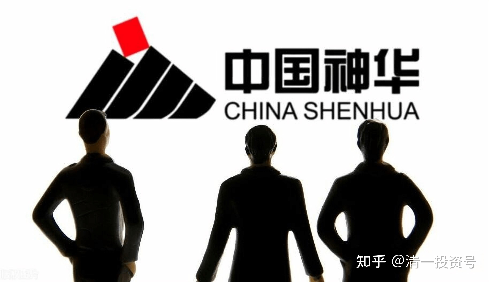
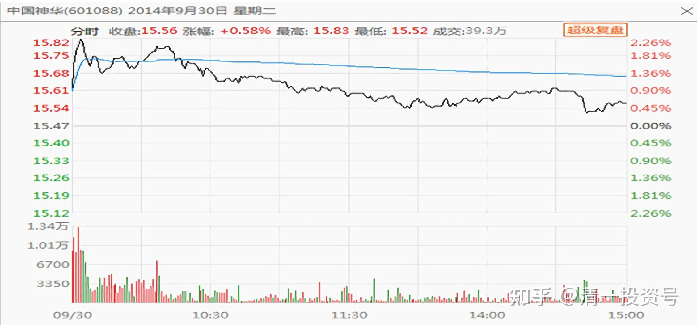
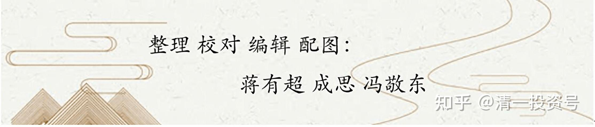

7篇.中国神华的投资逻辑

[清一山长](http://link.zhihu.com/?target=https%3A//xueqiu.com/9310099567) 2014年3月28日～10月1日

[清一山长](http://link.zhihu.com/?target=https%3A//xueqiu.com/9310099567) 2014-03-28 10:22:05

前段时间我的操作：

把中石化5.30元以上卖掉，买了中国神华。结果现在神华涨了5%以上，石化跌了5%以上。综合获利12%左右。套利成功。

不过，我的目的不是套利，我的思考方式很简单：**同样是能源股，卖出市盈率在9以上，且创造了近期新高的石化，买入市盈率不到6，且股价创造了新低的中国神华，更符合我的价值观——买入被低估的企业**。当然，要学会聪明地买，就可以获得最大的利益（**在巴菲特的基础上做索罗斯，这是我的投资逻辑**）。

[清一山长](http://link.zhihu.com/?target=https%3A//xueqiu.com/9310099567) 2014-03-28 10:26:41

买入石化的理由是“**新低+价值**”，买入中国神华也一样，因此**在买入上，符合巴菲特模式；卖出上，采用了索罗斯思维。**

[清一山长](http://link.zhihu.com/?target=https%3A//xueqiu.com/9310099567) 2014-06-21 08:39:03

中国神华也是一个具有深度价值投资的股票，也是目前我买入的重点标的。这两个股，最大的好处就是：不管互联网如何发展壮大，都冲击不到了（银行业可能还会受到这种高新技术的影响）。因此电力能源具有巴菲特“消费股”的特征，稳定而持久，可以长期持有。盘面上，神华似乎已经有介入的迹象。

[清一山长](http://link.zhihu.com/?target=https%3A//xueqiu.com/9310099567) 2014-06-27

神华研发新型机组，全球首次做到燃煤比天然气更环保。

这个东西就很厉害，什么新能源概念股，这就是新能源，就是国家支持，政策保护的行业标准。如果有这个标准在手上，神华就要创造财富神话了。目前的盘面上，收集筹码的感觉很明显，财友们建议多多关注。我最近几个月的新资金，主要进入能源行业（神华和优质电力股，其中国投电力已经赚了25%了）

[清一山长](http://link.zhihu.com/?target=https%3A//xueqiu.com/9310099567) 2014-07-19 08:07:12

本报记者 赵普、陈小瑛 呼和浩特报道

呼和浩特宣布公开取消限购，引发了多地效仿跟风，限购多米诺骨牌已被轰然倒塌。

新闻链接：[http://86hh.com/finance/zixun/2014-07-19/34863.html](http://link.zhihu.com/?target=http%3A//86hh.com/finance/zixun/2014-07-19/34863.html)

[清一山长](http://link.zhihu.com/?target=https%3A//xueqiu.com/9310099567) 2014-07-19 08:09:56

这个新闻里面，就揭示了目前的投资机会呢！

这种新闻的出现，再次证实了我目前投资方向的正确性。正在逐步加码中（不用急的，慢慢加码）。

各位财友自己分析去吧！别等我的答案。因为**财富是一种思维，不是一种答案**。我只是告诉大家：懂得一元思维的人，就可以很敏锐地发现这种新闻里面包含的财富价值——很大的财富价值。

吉林省*冰 2014-07-19 17:27:40回复[清一山长](http://link.zhihu.com/?target=https%3A//xueqiu.com/9310099567)：

我对呼和浩特取消楼市限购新闻包含的投资机会分析：

楼市降价的压力全国各省市都有，为什么呼和浩特尤为明显，甚至威胁高层“是崩盘的问题”？原因在于呼和浩特不仅承担了楼市的压力，其另一经济支柱，煤炭火电等相关产业之前已遭重创，这是本条新闻的重点。

如果是简单的煤炭降价，那火电企业本可以获益，因为成本降低了，而全行业不景气就说明原有的“蛋糕”不见了。解决的办法有两条：

1、解决之前不用煤炭的原因，**即使用煤炭也能维持环保**。

2、用其他无污染少污染的能源方式代替煤炭撤出的市场份额。这包括**水电、风电、核电、太阳能光伏发电**等行业。

同时在能源转型时期，当煤炭的份额少了，**天然气、石油的比重要相应扩大**。而国内石油、天然气原本就是进口大国，这次需求更加扩大，所以需要不断去寻找能源的来源（如前一段的中俄天然气大单），而运送能源无非陆路和海路，配合之前的高铁战略的陆路，未来海路能源的需求也会加大，如中海LNG船的投运可能就适应这种趋势。同时中国重要的石油来源地中东地区的不稳定更使得国内拥有相应能源的企业价值提升。

从投资机会上看，中国神华的煤炭无污染利用太符合国家意志了，因为煤炭现在是最廉价的资源。

核电、光伏、水电也都有很好的机会，可以从相应的产业上去发掘投资机会，那就非本文所涉及了。

[清一山长](http://link.zhihu.com/?target=https%3A//xueqiu.com/9310099567) 2014-07-19 17:35:15回复吉林省*冰：

摸到一些分析的门路了——背后有什么东西，有什么机会。这些需要长期的积累，才会有对国家经济运作的深度认识。

发一句格言大家参考：“**如果爱国主义被歪曲为维护统治阶级的利益 ，那这个名词就是流氓的最后庇护所。**”今天看到的，觉得很有道理。

[清一山长](http://link.zhihu.com/?target=https%3A//xueqiu.com/9310099567) 2014-07-29 08:09:23

**2014年煤炭行业亏损幅度已达70%**——这就是我建议大家投资神华的理由——**如此惨像，神华依然活得不错，它的对手们都几乎活不下去了。如果将来景气度提升后会如何？**神华股价破百元都有可能的（原来的最高价就是94.66元，现在的公司整体素质和竞争力，可比94元的时候强多了）。这是一个可以长期持有的好股。对我来说，比银行股还可靠些（银行还可能有巴林银行一样的由于失误造成的意外损失。神华连“失误”都没有可能）

2012年下半年开始煤炭行业景气度已经向下，随着前期产能大规模投产，下游需求的下降，价格亦是呈现连续下跌态势，煤炭的“黄金十年”已经荡然无存。

再从企业的层面看，有煤炭行业人士告诉记者，2013年全行业大部分企业已经是微利或者亏损，而进入2014年后，行业的亏损幅度也已经达到了70%～80%。

[清一山长](http://link.zhihu.com/?target=https%3A//xueqiu.com/9310099567) 2014-10-01 21:42:23

中国神华昨天盘面有试盘的情况出现。一般来说，这是主力筹码收集完成，未来即将拉升的信号。

*(中国神华 2014-09-30)*

只是一个小小的判断，不是买入建议。本人持有该股，昨天并未有加仓操作。如果下跌会继续加仓。

[清一山长](http://link.zhihu.com/?target=https%3A//xueqiu.com/9310099567) 2014-10-01 11:50:33

中国神华好像没有跑赢股指——正因为这样，它的后续潜力会很大，不要轻易下车了。国家队如果要制造牛市，神华是他们手中的奇兵，具有很多独一无二的题材，不是银行股所能够比的。将来可能涨到天上去的。出现高点的时间，可能是2016年了。

[清一山长](http://link.zhihu.com/?target=https%3A//xueqiu.com/9310099567) 2014-10-01 12:13:50

神华现在到处买资源，有一天一旦行情反转，资源的价格上涨，它的业绩翻一番不是问题。到时候追不上的，股价是多少很难讲的，上百元都不稀奇。因此，它可以作为一个“长线股”来看，反正分红都超过银行利息多多，没什么不满意的了。

不过，近期它的确没有上涨的理由。我做庄，也不会用它，这是超级预备队，最关键的时刻才上场的。急的人，可以去赚急钱。神华的钱不太急。

我估计银行先涨的可能性较大。

杭州 *蓉 2014-10-01 12:16:00回复[清一山长](http://link.zhihu.com/?target=https%3A//xueqiu.com/9310099567)：

神华最近的贪腐问题，校长怎么看？

[清一山长](http://link.zhihu.com/?target=https%3A//xueqiu.com/9310099567) 2014-10-01 12:17:30回复杭州 *蓉：

你是当老板的，有人出面，帮你打掉公司内部的贪官好不好？这种问题也不知道答案，够傻的。

[清一山长](http://link.zhihu.com/?target=https%3A//xueqiu.com/9310099567) 2014-10-01 12:18:22

贪官关起来了，剩下的员工只会更敬业，效益会更好！

