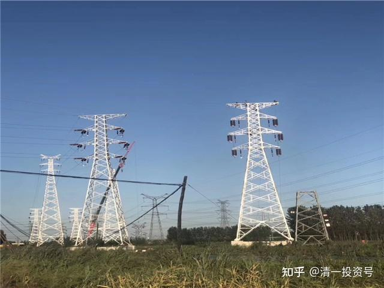
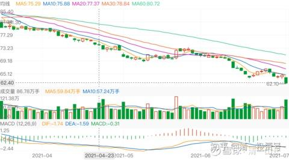

80篇.买入电力股，作为现金股

2021年6月18日～2021年11月3日

**[清一山长](http://link.zhihu.com/?target=https%3A//xueqiu.com/9310099567)**[2021-06-18 16:56](http://link.zhihu.com/?target=https%3A//xueqiu.com/9310099567/183936687)

[$华电国际电力股份(01071)$](http://link.zhihu.com/?target=http%3A//xueqiu.com/S/01071)这是我曾经买过、赚过的股，这几年一直不敢投资。目前的价格，股息率超高，12%，非常具有吸引力。但是，我依然不敢投。因为下面的消息，说明未来的火电死期将至了：光伏电价的成本，目前已经大幅降低，已经低于火电了：将来华电的大量煤电机组咋办？机组人员咋办?

报道【光伏行业近日最大的新闻是，国家电投在四川甘孜州正斗一期200MW光伏项目上报出0.1476元/千瓦时最低价，创下中国光伏电站项目最低价纪录，引发行业内广泛讨论和争议】

当然，替代火电时间大约十年左右才会真正的发生。怪不得国家现在碳中和推广强度很大。如果真有这么低的成本价格，我猜想中国宏桥，现在是不是应该自己开建光伏电站，绕开电网的利润榨取，也很有利于电解铝的成本下降？水电和光伏电站的结合，是否更有利于稳定提供电力供应？用水电作为补充光伏蓄能的调节？怪不得黔源电力要上光伏项目。我现在这些内容很有兴趣，含义深远。看科技股，我实在看不懂。不知道该投给谁。看这种源头公司，模式好懂一点点。也许，买中国宏桥，不如买潜力更大的上游资源企业——提供高效低成本电力产品的电力公司。起码这是一个可靠的投资方案，比上海机场这种平台流量公司应该更可靠（就算来最严重的疫情，电力消耗也不会停滞［大笑］）。

[清一山长](http://link.zhihu.com/?target=https%3A//xueqiu.com/9310099567)[2021-07-01 15](http://link.zhihu.com/?target=https%3A//xueqiu.com/9310099567/188181886):00

[$中国平安(SH601318)$](http://link.zhihu.com/?target=http%3A//xueqiu.com/S/SH601318)今天平安跌了2.46元，持有平安的朋友，估计都是心凉凉的吧？

我没有买平安。因我看不懂平安，我只会在极度安全的价格买一点，很早的时候买过，赚过一点跑了。现在从价格上说，已经进入我认为的低估价格期间，按道理是可以无脑买了。但由于我是技术派出身的假价投，所以忍不住看看技术走势，看了，就真不敢买了。

看看平安从94元下跌以来，特别是最近几个月，几乎没啥像样的反弹。

而且,底部成交量特别大。五月份，走势很像是主力挖坑后的向上走势，很多长期看好平安，有点技术眼光的人，估计都被忽悠进去了。放巨量成交，一天就87亿的成交量，多方力量大释放。

但很快就慢慢跌了下来，显然是有主力在乘机逃走。

最近更是放量大跌。

所以,我倒吸一口凉气，不敢进场了。

手边偏偏惠泉涨停后的冲高日，我卖出的资金较多，用不用都有点不好想。就买了一点一大堆人都不看好的**黔源电力,**是14.15元买入的。为啥？**就是因为太低迷，没人卖,成交清淡,今天一天才2千万。下跌的股，没人买，我才敢买。**有人大卖，我哪敢买？缺点是：买不到啥货。今天只买了几万股。我当现金股存起来，如果别的股大跌了，也许可以用来换钱。我估计这种股，继续跌下去蛮难的。

**中国建筑今天倒是买了M级仓位。4.64元。**主要的资金，都是中建自己的分红，基本没占用我的自由资金。自由资金，我想想等惠泉会不会破10呢［大笑］？

我的分享，是记录自己的投资足迹，盈亏自负，不建议任何人跟随买卖。请不要跟随，投资是一个自己负责的事情。我买入后随时下跌，卖出后常常上涨，所以，我不是一个好的跟风指标。

[清一山长](http://link.zhihu.com/?target=https%3A//xueqiu.com/9310099567)[2021-09-08 14:49](http://link.zhihu.com/?target=https%3A//xueqiu.com/9310099567/197089308)

[$黔源电力(SZ002039)$](http://link.zhihu.com/?target=http%3A//xueqiu.com/S/SZ002039)居然涨停了？好吧，我就都走了，留不到万股，看看后面的热闹。我真的不喜欢涨停，都是逼我走路的。第一个涨停，我忍了。才两天，你居然就来接着来第二个涨停，对不起，我不忍了。不就一电力股吗？又不是买不到。我去换在底部趴着的股票去。甘肃电投也一起走了，涨了超过50%了，还不走，就太贪了。水能电力股，本想拿做长期持股息的，10、20年我等。居然用连续涨停来逼我走路，真不够意思！[哭泣]

[清一山长](http://link.zhihu.com/?target=https%3A//xueqiu.com/9310099567)[2021-09-10 17:36](http://link.zhihu.com/?target=https%3A//xueqiu.com/9310099567/197380301)

[$中国建筑(SH601668)$](http://link.zhihu.com/?target=http%3A//xueqiu.com/S/SH601668)[$中国建材(03323)$](http://link.zhihu.com/?target=http%3A//xueqiu.com/S/03323)，一周末小总结：我一向不管自己的账户与大盘的比较情况，今天偶然看到手机账户上有这个功能，觉得很有意思：最近六个月，我三个月跑赢了大盘，三个月跑输了大盘。证明我根本就不是啥牛人，这个成绩要被基民骂三个月。在勉强接受三个月。我看到：4、5、6三个月，我只有一个月，勉强赢过大盘一点点，其他两个月，全是跑输的。7月，我的总资产减值了12%，明显跑输大盘。8月资金就回来了11%，9月至今天10天，又回来了9%。最近两个月，大幅跑赢沪深300。

不过，我从另外一个指标来看，我的账户其实动力十足。年初我的账户创了新高，后来几个月跌幅巨大。现在账户，已经恢复原来的资产数值了。但是——我持仓的股票价格，都没有创新高，甚至离新高还远。重仓的燕京啤酒还在6元多晃悠，当时我账户新高，燕京是8元多。现在就已经恢复市值，如果燕京再回到8元多的高点，我的这个账户的市值，是新高又新高的。现在就恢复账户新高，似乎有点不对劲。

中间发生了什么？其实就是我这半年在不断换股，所以市值虽然看起来没有涨，但股票其实多了很多。比如卖掉13元的惠泉，换7元的燕京。燕京跌到6元，我的市值不涨反跌。但实际上股票已经多了不少。类似这样的操作这半年做了一些，所以，现在的市值，已经达到上半年最高点时候的资金总额了。

说明：**赚股，换股策略，比死拿的策略更好。**涨了就要卖一点（我卖掉后会买准现金股拿着，比如卖掉惠泉的钱，我买了**甘肃电投**，以及**黔源电力**，我是当现金股买的，因为这种股，几乎不涨，也不跌，其实也没跌的空间），如果别的股跌了，我就卖掉这些现金股去买入低价的股票。所以，我基本上总有钱来买进大跌的股票。只是没想到这些水电股最近也大涨一把，当然就卖掉，去买别的现金股了（持股涨了，我**拿钱回来只买准现金股——利息高，不会跌，走势难看，躺在底部不动，涨不涨我也不在乎的股就是现金股）。反正我就是不追高。这样一直保持有钱买，会获得很多想不到的机会。**上半年的大跌，其实给了我不少机会去买入原来卖掉的股，比如伊力特、老白干，差价10元多重新买进来，又多赚10元卖出去，都做了两轮了。再涨就要做第三轮了。

总结：**随时保持账户有足够的【准现金】备用，才有更好的机会**，去买一些看好的，波动大，盈利大的股。涨了赶快跟随追高，是最笨的。耐心地等待时机，才是最好的策略。

反省和不足：中国建筑不太够意思，最近一年多，都不给我做T的机会。反而不断跌破心理线，害得我不断加仓，严重超过了我想长期持有的数量。为了报复中国建筑，计划是：一旦出现中国建筑敢冲涨停之类的，我就出掉几百万，当现金收回来备用。中国建材也是涨一点涨不多，让我也不敢卖。还不断的跌回10元以内，害我不断在低于10元的时候买进，把我的现金积蓄都消耗光了。如果敢大涨，我也要也卖掉20%作为现金股收回备用。

现在我选的现金股是啥？水电股是没得选了，很遗憾。我就只好选北京银行、农业银行这样股，当现金股来用了。反正这些股，跌也跌不了，涨也不会涨的。存起来比银行理财要高！用涨了不少的钱，来买它们，心里踏实。有色的钱，水电股赚了的钱。都存在这里呢！等惠泉啤酒、中国中铁又再度大跌了，估计这些钱，就又出来救市了[大笑]。

[清一山长](http://link.zhihu.com/?target=https%3A//xueqiu.com/9310099567)：[2021-09-29 13:01](http://link.zhihu.com/?target=https%3A//xueqiu.com/9310099567/199117882)

[$黔源电力(SZ002039)$](http://link.zhihu.com/?target=http%3A//xueqiu.com/S/SZ002039)昨天涨停，今天跌停，玩什么把戏？主力把自己套住了吗？反正你们成功把我弄下车了，I服了YOU。我认赌服输。你跌停我也不想再进来，你们自己玩。

[清一山长](http://link.zhihu.com/?target=https%3A//xueqiu.com/9310099567)：[2021-11-03 20:24](http://link.zhihu.com/?target=https%3A//xueqiu.com/9310099567/202057626)

[$黔源电力(SZ002039)$](http://link.zhihu.com/?target=http%3A//xueqiu.com/S/SZ002039)这个股，我14元买的。计划是拿了长期吃股息，躲避货币贬值风险的。当时应该是惠泉啤酒冲13元卖掉后，账上大量的现金，想用在最保险的地方，就买了几个“底部稳定现金股”。它是其中一只，另一只是甘肃电投。没想到没多久就玩连续涨停的游戏。居然连续玩了六个涨停。我很傻，在第二个涨停就跑掉了，完美错过后面的四个涨停。今天才终于跌破我的出货线了，也不遗憾，只是看它的走势完美地说明了道理：**中国的股票，都是一群疯股，都正常的，涨了会过头，跌了也会跌过头。涨停是涨给你看的，一旦涨停，就涨不停。一路出手，没毛病。不跌回来，就是死也不买。**

观察它在涨停之前，多年就是一个“死股”，死气沉沉的，脱离大盘，该涨就是不涨，跌也不咋跌，磨得人没脾气。很多小散就慢慢走掉了，结果它就大涨了。我是当“现金股”买的，就是看它处于长期底部，不会跌的样子，当现金股买进来，居然涨了，赚了超过十年的股息，我当然就走了。如果晚点走，收获更大几倍。所以，**一旦涨了就要稳住手。**

不过，这一招对燕京啤酒就无效了，涨了不走，重新跌回来坐电梯。惠泉如果连续涨两个涨停不走，也要做电梯的。我一般会等两个涨停后，都会走一些的。这个电力股太妖了，不算规律的，要有大运，才能拿到后面的利润。中国宏桥我如果13元的高位不走，等到现在，要有上千万的浮盈会重新跌回去。现在跌惨了，等它分红后，我再继续买入吧！主要是不想付20%的股息税，太高了。

一句话：**涨了应该走，赚了是别人的福气。**高位拿货，赚这种钱不容易，要祝福拿了我两个涨停货的人，后面赚四个涨停去。**等跌惨了的时候，别人都不要了，再拿回来。股市上，到处都是机会，没必要跟别人抢。是你的就是你的，不是就祝福别人。**

