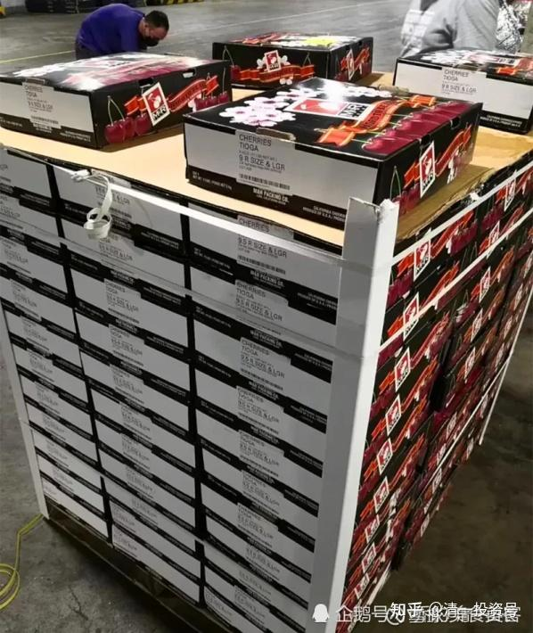
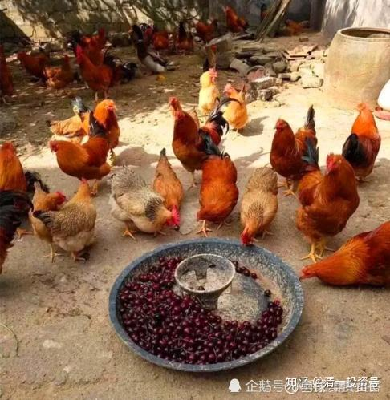

[原雪球专栏](https://zhuanlan.zhihu.com/p/562299554/edit)[120篇.低级人类，与高级人类！低级投资者，与高级投资者](http://link.zhihu.com/?target=https%3A//xueqiu.com/9310099567/173702496)

清一山长 2021年3月7日

股市上有三种人，地球上也有三种人。您是哪一种？[俏皮]

《与神对话》上，说地球人，大致上相当于幼儿园级别，属于宇宙中的低级人类，发展程度相当原始。

**原始社会的特征，就是把退步当成进步。把损害当成受益**。原始人的活动，都喜欢做给别的生命体造成损害，同时也给自己带来损害的事情。差不多就是：花钱买抽的意思吧？

当然，这个说的是地球上，整体的人类是低级的人类，但是其中也有中级的，正常的人。也有高级的人。只是，由于地球上整体是低级人类，所以，中级人、高级人比例，就特别的少。

我觉得：这种区分，挺有道理的。真真假假不知道，我也没见过外星人是啥样。但据说地球人就是外星人[大笑]。

其实，来雪球的，也是一样的。整体上来说，股市上有三种人。

**最多的人，是亏本的人。俗称韭菜**。这些人，不做投资还好。进来辛苦投资，又花钱，又劳神。最终取得低于正常市场收益的回报，比指数基金还不如。这种人，显然就属于花钱买抽的人。这种人，比例蛮大的，至少7成吧？（我觉得应该是9成）

**第二种人，算是正常人。**进来投资，可以取得正常的市场回报，取得相当于指数基金的收益。取得这个收益，并不需要有啥聪明才智，只需要有常识，不贪婪，老老实实的投资，就可以取得这个收益。据说，这种人有20%（两成人），但我不相信，我觉得只有一成能够取得这个收益。按短期来说，一年，三、五年，股市可能是7赔，两平，一个赚。但长期来看，比如20年、30年以上，股市上我认为是90%赔钱，一成人平本，勉强跑赢通胀。只有1%才是真正赚钱的。

**第三种人，自然是我说的高级人，超级股市赢家了。**大约只占总玩家人数的1%吧？目前，似乎我还算就是这1%的人。因为我玩了快30年股市了，还在赚钱中。而且，看样子，要让我赔，基本没门。因为**我天天想：我买的股票，公司跌了咋办？垮了咋办？所以，我总在防范风险，就使得我可以避免大多数的风险，只有我看不到的风险，黑天鹅才会击倒我。我可没想：怎样买股才能赚钱？我想的是：怎样买股才能不赔钱？所以，这就是“生于忧患”。**我发现了：我的这种思维方式，非常的符合**“秘密法则”**——只有“有钱”的人，才会想“怎样不赔钱”呀？只有“没钱”的人，“缺钱”的人，才会想怎样才能赚钱呀？所以宇宙把钱给了我这个正常的人。其他拼命想赚钱的人，结果是钱没了。这样，才能符合他心中的秘密预设——我没钱！我缺钱[捂脸]。

所以，**投资想要赚钱，**不是学啥东西，学啥技术。而是**要改自己的档次。**不**提高你的心灵级别**，你学习多少技术都是照样要赔钱的。**我的商学院，就只教这个，不教别的。更不教如何赚钱。只教你如何不赔钱！**

所以，多年前，我才说：“你的投资账户，就是你的人品评级！”敢拿出来秀秀吗？[大笑]

**我把地球上的人，也分了三类：高、中、低，大家看有没有道理？**

**第一类别：低级人类，就是损人不利己的笨蛋人。**他们无论是花钱、做事，都是好心办坏事，永远无法实现自己的目标。独立做事，就成事不足败事有余；听命做事，给人打工，勉强还过得去。他们属于负能量级别，喜欢抽人，同时也抽自己。这种人，大约占70%吧！甚至更高！也许也是90%？

**第二类别：中等的正常人。**属于我不占别人的便宜，但我也不让别人占我的便宜。正常人，不干损人之事。但也只考虑利己之事。杨朱哲学中，**拔一毛以利天下而不为的**，精致利己主义者。一切的花钱、做事，都只关心如何给自己带来好处的人。这种人，占20%吧？

**第三种，是高级人类。**这种人懂得宇宙法则，懂得“因其无私，故能成其私”的道理。所以，他们**特别爱帮助人。凡是做事、做人，都是先考虑能不能帮助他人，能不能成就他人。而不是考虑只成就自己，更不考虑怎样坑人，来成就自己。不愿意做损人利己的事情。**所以，这种思维风格和行为，也最终地帮助了自己，成就了自己。这种人，往往就是我们这个世界的成功者、领袖人物。这种人的比率很少，只占3%，甚至更少吧？

**请大家找找身边：“低档人类”的故事，发在下面跟帖。点赞多的，我负责打赏**[笑]**？**

我示范一段：

我花了一千大元，买了一箱美国车厘子。据说这种档次最高。车厘子的档次，依据出产地，是这样排列的：智利﹥美国﹥四川﹥山东﹥辽宁。智利的国内买不到，就买美国的好了。本国的车厘子，没意思，不如给鸡吃。见最下面的国内“鸡吃车厘子”照片，好像鸡也不太爱吃的样子。

但我最后发现：我做的这种事情，就是低级人类才做的事情。因为，低级人类，就是花钱买抽。就是把自己很重要的东西，不能舍弃的东西，拿去换自己可有可无的东西。

为了把车厘子从美国运到中国，不说运费，光航空煤油，就几乎要一比一地换取。一吨的货物，要花费一吨的油料才能送过来。一餐可吃可不吃的水果，地球上还可以不断再生的水果，我们却要用一吨宝贵的，不可再生的石油资源去换取。证明我的行为，已经伤害了全体人类的利益。我的行为，伤害了全体人类的利益，最最起码，伤害了中国人民的利益。用宝贵的外汇，去换可有可无的美国水果。但对我还没啥好处：**水果是当时当季，对人体才有好处。**把相隔万里的水果拿来吃，对我的身体不见得有啥好处。就算没坏处，也只不过是可有可无的东西。比如，我吃了这些昂贵的美国车厘子，与吃了图中国内的相同水果。拿去医院化验我的胃容积物。医院应该根本就查看不出有啥差别。拉出来，更是完全一样的大便，一样的没有价值[捂脸]。

但是，我居然用1000元去买它。我的1000元，就永远消失了。因为这1000元，也是不可再生资源（对我来说）。如果用这1000元，我去买200股中国建筑，每年拿分红，可以无穷无尽地拿下去，不断“生蛋”。所以——我干了一件低级人类才干的事情。就是损人不利己！今后一定要改。凡是对于人类没好处的事情。我认为对我有好处，肯定错了！[大笑]

（申明，以上只是举例，我没有买1000元的美国车厘子。我只是买了100泰铢一桶，约五斤重的新鲜草莓给小女吃，她吃得很开心。昨天还买了100泰铢一大袋子的冻干榴莲。原来要卖900泰铢。由于游客不来泰国，现在大减价！我认为：跟没有减价的榴莲相比，品质并未变化。我买了这些水果，没有损害任何人的利益。相关方都很高兴。

（以下内容为编者收录）

**评论回复：**

慧盈1689**回复清一山长**：

更可悲的是，低级的不肯承认自己低级。

**清一山长2021-03-07 15:20回复慧盈1689：**

[大笑]。是的。这种人蛮多的。这种人，叫做找抽人！

他给宇宙发出的信号，是：“抽得还不够狠，再来狠点！我现在还不够倒霉，神有本事，就让我更倒霉！”——直到话都说不出来了，认栽了，这游戏就停止了。

好像清黑就是这种人。自己的孩子教育不好，焦头烂额的；或者投资做亏了，高位买入了，就跑来骂人。骂其他赚了的人。他以为：只要骂别人错了，自己就“对”了。没想到，是越骂，自己越不好！别人越好！

**哞然回首回复清一山长：**

百分之70的人都是损人不利己的，那百分之3的人也是被损的对象。

**清一山长2021-03-07 17:03回复哞然回首：**

对呀？当一个老板想赚钱，一家工厂排放有毒气体的时候，100%的人都要受损害。所以，我才跑到泰国避难[俏皮]。

**world100回复@清一山长：**

可悲的是，低级的看不到自己的低级。

**清一山长2021-03-07 15:09回复world100：**

**我这篇文章，就是让大家想办法照镜子看的呀！然后改改！**

我就不相信国内买1000元一箱水果的人都比我有钱。我每天都买一箱1000元的水果，我的财富不但不会减少，还依然每天都继续增加（光股息红利，我每天都有几万元）。但我不买的原因，就是这样做，实在对不起自己的智商。

**周霖灵Bounty2021-03-08 13:51回复清一山长：**

去年家里的人发生了一些事情，我一直都想不明白，结合山长针对不同人类思维行为方式的文章，算是有了一些思路，也说来给大家听一听。

爱人的姨夫一直都有腰椎间盘突出问题，直到去年严重到无法行走，疼痛难忍的地步。当时我们想对接一位传统正骨老师，我也是亲眼见过这位老师治好了很多在西医看起来必须要开刀的腰病患者。被婆婆拦住，说她这边的亲戚早就看不惯我们的生活方式，不会相信我们推荐的中医保守治疗的。想想也是，我们以为好的，别人不一定接纳，不能给别人找堵啊！后有家人介绍到上海有名医院的全国知名医生那里，开了刀一个多月后，看起来恢复得很好（至于后遗症，当下没出现就假装不会有。）

这些在世俗中看起来还算正常，让我有些想不明白的是：爱人舅舅看到姨夫开完刀下床后能吃能喝，变得又白又胖后，觉得自己腰也时常不好，就跟大家说，早晚都要开刀治疗，晚开不如早开，越晚开刀年龄越大，越不容易恢复。另外，现在认识的这个专家技术这么好，不能浪费机会。于是，真的就通知了儿女，结伴跑到了上海做了这个本可以不用做的手术和受的罪。可是，舅舅没有姨夫幸运，开完刀后两三个月都无法起身下床，面对这样的场景，舅舅的反应是，一、年龄比姨夫大，就是不好恢复了；二、姨夫身边有小姨和儿女轮流伺候，自己只有护工，家人也只是有空才过去照应（潜台词是没有被照顾好）；三、以前说自己劳累，大家不相信（因为舅舅是法官，姨夫是打工的），现在事实情况呈现出来了吧！腰病是累出来的，术后恢复不好更是前期透支导致的身体亏空。于是，在这看起来有理有据的说辞下，成功地获得了很多亲友的注意，所以我婆婆在过年算经济账时，感叹地说了一句，这一年光给她哥哥（我们舅舅）的人情钱就够她和公公的一年生活费了。听起来好像也很不舍得给哥哥花钱，但又不得不去做的意思。

接下来还有，舅舅可以下床走路后，没太长时间，姨夫腰病复发，再次送到上海又开了一次刀，回来后，舅舅和姨夫同病相怜不断感叹说，人老了，就是各种毛病，别想太多了，有吃有喝再多请两个保姆，少做事多活几年。其他亲友也纷纷赞成，两位“老人”在亲友“鼓励”下，默默地达成接下来生活的协议。

从这以后，姨夫更是大吃特吃，其余就是找人陪着玩牌；舅舅就活在了腰病啥时复发，啥时要去开刀的恐惧中……

我以为这是特例。婆婆说，舅舅在决定开刀的时候，也让她去，只是婆婆还没下决定罢了，幸好复发的结果来得很快，让婆婆自动断了没病找抽的念头。婆婆接着说，从小到大，舅舅说好就会跟着去做。以前舅舅在城里工作，就让全家亲戚花了很多钱把农村户口转城市户口，结果现在农村户口更值钱；还有舅舅让买保险，也是全家都上阵，本来说60岁后每个月就有一笔钱，结果现在要等到80岁；还有买学区房，每家都在买，所以当知道我们家放弃学区房的优势，而走新教育后，舅舅和其他亲戚结盟先把我说一顿，看说不通，再骂我爱人不长脑子。看我们还是“不知悔改”，每次和公婆见面时都会说公婆居然都不当孩子的家，孙子就要毁在这个媳妇手里之类的话。幸好，我和公婆十几年来相处得一直很好，也看到我们和孙子的变化，两位老人还能保持清醒。

我和爱人以前对于舅舅等亲友的反应模式，会认为是因为每个人认知水平不同和所处年代不同而造成的隔阂，虽说我做什么不关他的事情，他的控制和干涉已经给我们带来困扰，但总归还是希望我们好。但是看完此篇文章，更加看清了这种借亲友关爱名义背后实际上是“我不好，你们也别想好”、“我有关系给你们办事，你们要记着一辈子”、“我是家里的老大，你们都要听我的和围着我转”等心理，这不就是损人不利己嘛！

幸好，舅舅不理我了，我有充分的理由（不希望自己的出现让舅舅生气）**可以远离这类人，当然，更加理智地做法是找出身边有此底层信念的人，主动隔离。**感恩山长的文字警醒，**在人生有限的时间里多和高能量人在一起，才能创造生命的价值。**[https:xueqiu.com/9310099567/173702496](http://link.zhihu.com/?target=https%3A//xueqiu.com/9310099567/173702496)

**清一山长2021-03-08 14:40回复周霖灵Bounty：**

这故事真够狗血的[捂脸]。佛家说，这叫“我大”。**每个人都想扮演神，想指挥控制一切**。**中国人的控制欲特别强，如果控制不了别人，就回家控制家人，控制亲人朋友啥的。所以，远离这些负能量，的确就轻松很多了。**

要改变他们，也不是不可能，就要等时间，要等很长。估计10年以上，20年左右。

我的孩子，当年种种的质疑，甚至是很过分的指责（“你要害死你儿子吗？”）。但现在，儿子20多岁了，亲戚们，开始反过来说：“这孩子比别的孩子好得多。变成女孩子心中的男神了。”

我的身体也一样：同龄的亲人们，开始羡慕我身体好，体力好，精神好。开始想要学一些我的东西了，偷偷摸摸地学。

这就是亲人——**越亲，越是不能接受你。直到有一天，他只能仰望你的时候，就变过来了！**

你们继续加油！**别人想看你的笑话，想看你倒霉，你就把这种嘲笑，变成你一定要成功的动力！更加认真踏实地学习、进步**。我就是这样的[笑]。

**清一山长2021-03-08 17:00回复周霖灵Bounty：**

“每次和公婆见面时都会说公婆居然都不当孩子的家，孙子就要毁在这个媳妇手里之类的话。”

你们这个处理不太对，教各位一招：**对婆婆，要让老公出面抗着。啥都是老公的主意，自己是完全支持公公婆婆的，就是老公不听话。**

**对岳父、岳母，家里啥事，就是媳妇要出来抗着。老公没出息，全都听媳妇的。这样才能避免家庭矛盾。**

我妈知道我媳妇吃全素，就说这习惯不好，身体弱。我出来说：“是我教她的。这样身体才好。”媳妇赶快说：“是的，是跟我学的。”我妈马上说：“女人吃素也可以，弱一点没事。但男人一定要吃肉。”还要我媳妇做肉给我吃。我媳妇马上答应：“好好好，他想吃啥肉，我都做给他吃。外面有啥好吃的，就买给他吃。就是怕他不吃，拿他也没办法。”让老妈多教训自己的儿子。我妈自然没意见了。

前些年，我老妈要让小女去体制上学，我说就是不去。老妈找媳妇要支持。媳妇表示：坚决支持老妈。然后说：“主要是你儿子不干，非要自己教，她也没办法。”要老妈教训她儿子去[大笑]。

我妈来说我，还说让她来亲自管孩子上学的事情。我说自己的孩子自己管，她教儿子教得不错，但别剥夺了我的机会，我也想把女儿教好，给我个机会练练手，试试看。我老妈自然也没脾气[大笑]。

反过来，教育我家的小孩子，如果要出重手，打屁股之类的。岳父、岳母看不得，护孩子。媳妇就站出来挺我，说：这是她的意思。小孩子，就是要多打打屁股，长大了才会乖。

自然，岳父、岳母也就不多说了。只能怪自己的女儿脾气倔！女婿的形象不至于太坏。

**跟老人相处，还是要中国式智慧。大家庭和睦一些。齐家，不容易！**

**走上归家路回复@清一山长：**

夫妻意见大相径庭怎么办？全家就我一人想送孩子上新教育，结果老妈把孩子藏起来了。

**清一山长2021-03-08 18:03回复@走上归家路：**

轻车让重车。谁脾气更大，谁更没理性，就听谁的。**上士不争，新教育教不争。**反正，就算以后教坏了，也是她的孩子坏了；教好了，就算她赢了。[俏皮]

**心领意随2021-03-08 19:18回复清一山长：**

谢谢山长的示范，刚老丈人说二孩马上要上学年龄了，送去体制吧！大的已经在走新教育，两个对比一下吧！我就没山长的智慧[吐血]，直接说肯定还是走新教育，不用他们姐弟对比，今后与亲戚的差不多大的孩子就可以对比啊！目前他们还是体制的优秀学生呢[大笑]！丈人没说话[亏大了]，看了山长的示范可以推给妻子来说啊[吐血]！

**清一山长2021-03-08 19:39回复心领意随：**

您错了，不能照搬的。而是您要顺着老丈人说：“这主意真不错[很赞]。好的，就这样办。我们来看哪一种教育效果更好。”

马上您又开始犯愁了，向老丈人讨教：“不过，万一以后孩子长大了，去体制上学的孩子，比不赢去新教育的孩子。大了改也改不过来。他要知道我们当初，是拿她来做对比试验的。会不会觉得我们偏心？不肯花钱送他读新教育？会不会恨死我们当爹妈的？而且以后两个孩子关系肯定也不好，教育背景都不一样，会有很多矛盾。他也会恨比他更成功的，新教育培养的哥哥姐姐。这咋办？”

你看老丈人咋说。让他拿主意。

估计，他想半天，说出来，就是：“还是算了，咱们拿亲戚家的孩子来对比吧！这两个孩子，都是自己的，一定要公平！”

您赶快拍马屁：“高，还是您老人家考虑问题全面。什么难题都难不住您！这么好的主意，要庆祝一下。我给您买酒，爷俩喝一杯！”

我看，这女婿在老丈人心中，就怎么看都顺眼，怎么看都很喜欢了[俏皮]。

这，就是老子教的智慧——**“吾不敢为主而为客，吾不敢进寸而退尺！”**[献花花]

你的方式，就是为主，就是进。让老丈人觉得，你这个女婿，太不听话了。居然敢驳他的话。进，不如退！

**心学家塾-马心学回复清一山长：**

“低级人类，就是损人不利己的笨蛋人”

原来有家长发现了今日学堂是精英教育，就给孩子报考了。被录取后，寒暑假孩子回家后都会让周围的朋友很羡慕，于是别人问这孩子在哪里读书，能不能介绍一下？

家长支支吾吾的不愿意说，在朋友的各种追问下说了今日学堂的各种不好，旁边的家长听不下去了，进行反驳：“如果不好你为啥还把孩子送过去？”这个家长悄悄的说：“今日学堂有淘汰机制，如果让更多的人知道了，别人都会争着申请，自己家孩子被淘汰的机率会增大[吐血]。”

这个家长从来没有想过让更多的优秀孩子入读今日学堂，自己家孩子即使不是那么优秀，也会被周围的伙伴带得很优秀，即使没有带优秀，这些孩子未来成为大师级别的人物，您的孩子是他们的好伙伴，有什么不好呢？

当然这个家长的孩子被淘汰了，家长是原件孩子是复印件，老师教的再好，家长心黑，孩子是家长的，这个能量也会随着家长。淘汰过后，该家长就成了清黑，因为这么好的精英教育机会我的孩子得不到，我就毁了今日学堂，其它人也别想得到。这种行为可能已经伤害了全体人类的利益。最最起码，伤害了中国人民的利益。

因为现在今日学堂被清黑给逼到了国外，您要接受这样的教育总没有在国内方便吧！

如果今日学堂真的被清黑毁掉了，中华优秀的传统文化就不能够让世界人受益。最起码走进新教育的人过的少私寡欲的生活方式，也会让每一个人更富足，给地球节约了无数资源，人类学会了这种生活方式，环保组织也就消失了。

回头看这样的清黑家长得到了什么？

据说孩子到了青春期开始问题不断，成了网瘾少年，赶都赶不出家门，保佑这个家长身体永远健康，好养活孩子一辈子。可据说该家长身体也出现毛病了，是不是什么癌不清楚，反正后半生会一直缠着。

是不是应了古人那句话：“不敬师长，天诛地灭。”

这种行为让我觉得很难理解。即使离开了今日学堂，并不是说你家孩子不好，因为没有最好的教育，只有最适合自己的教育，你还有其它选择，为啥黑今日学堂呢？

如果今日学堂真的不好，一些资质平庸的孩子可以教出来；一些优秀的孩子可以教出来；一些问题孩子也可以教出来，就你家孩子教不出来，到底是谁的问题？

这样的人我生活中遇到的太多了，今天就先举这样一个案例，明天给孩子们上课，再让孩子们总结去，有精彩案例再来跟帖。

祝福大家都能够识别出低级人类，然后进行远离，选择和高级人类做朋友，过一个自在的人生。

**清一山长2021-03-07 20:07回复@心学家塾-马心学：**

原来这种家长还真的不少[捂脸]。教好了还黑你，淘汰了要黑。留下来的学生，家长也不说好。原来的家长，也不肯去宣传介绍今日学堂的。不是不好，而是自己上车了，不想给别人上车的机会。

现在就好多了，家长们都愿意分享了。看到清黑来黑，也要骂了。可能我们现在的家长，能量值高一些了吧？[献花花]

**天涯哈哈回复清一山长：**

有淘汰机制很好，谁也不能把差生变好。

**清一山长2021-03-07 21:07回复天涯哈哈：**

理解有误。**淘汰机制的目标，不是教不了差生。而是把学习态度不好，混日子的学生淘汰出去，免得造成学风不良。**成绩问题，是次要的。[加油]

**一滴水water回复@清一山长：**

我身边一个同事，一家人和新教育没任何关系，却整天黑新教育，见不得我学习新教育，没事就根据网上道听途说，百度今日的各种不是，并断章取义。刚开始我还开导他：今日总有值得自己学习的地方，学它的优点，认为不对的我可以不学，何必劳神费力地找今日的“各种问题”呢？我说我的三个孩子从2014年初到现在没吃过西药、打过针，这是从今日学习到的，仅凭这一点就值得学习。这同事听不进，我当时也没明白他黑今日的动力源头是什么。这位同事对于今日的成果，假装看不见。后来了解了一些他家的情况，我知道他为什么这么热心黑今日了：他太爱自己的孩子了，偏偏自己孩子教育得一塌糊涂（就不列举具体事例了）。他心底里的想法就是：黑垮了今日自己孩子才不会显得那么差劲。

**清一山长2021-03-08 08:59回复@一滴水water：**

把太阳射落了，天气就不会这么热了[捂脸]。当代的神话人物，英雄一个！佩服！
