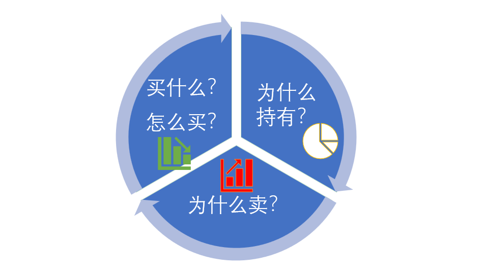
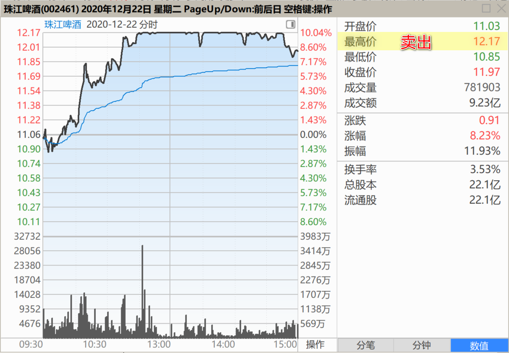
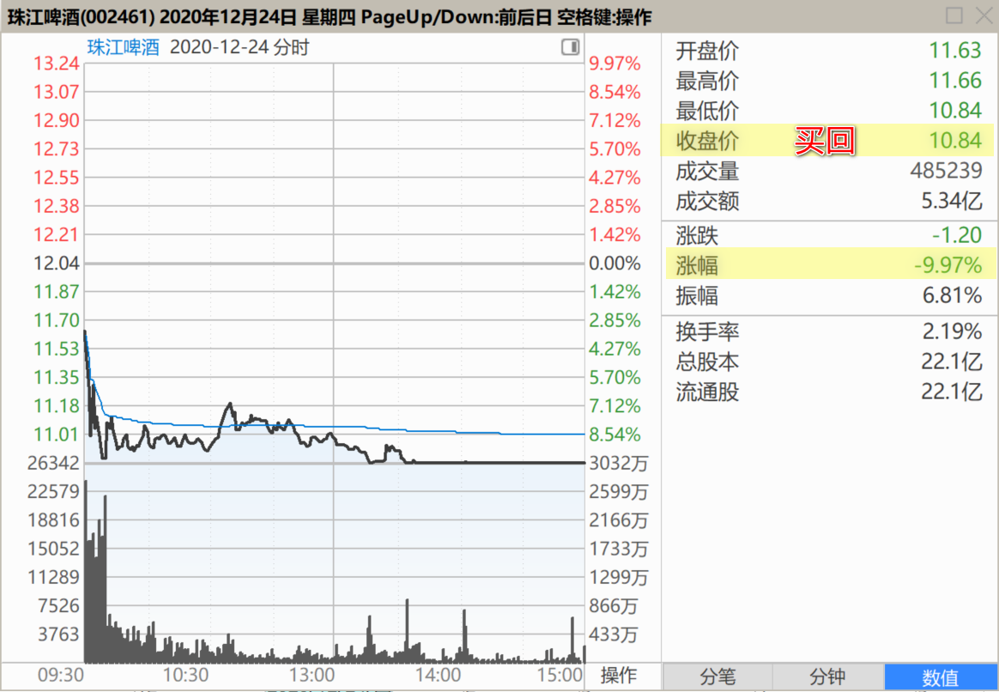
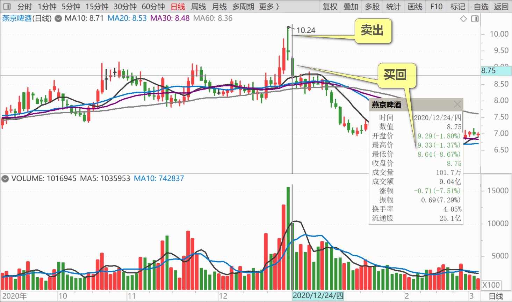
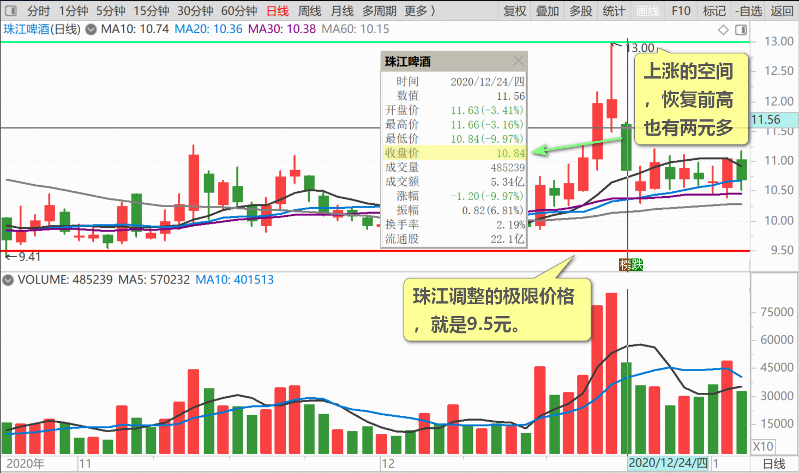
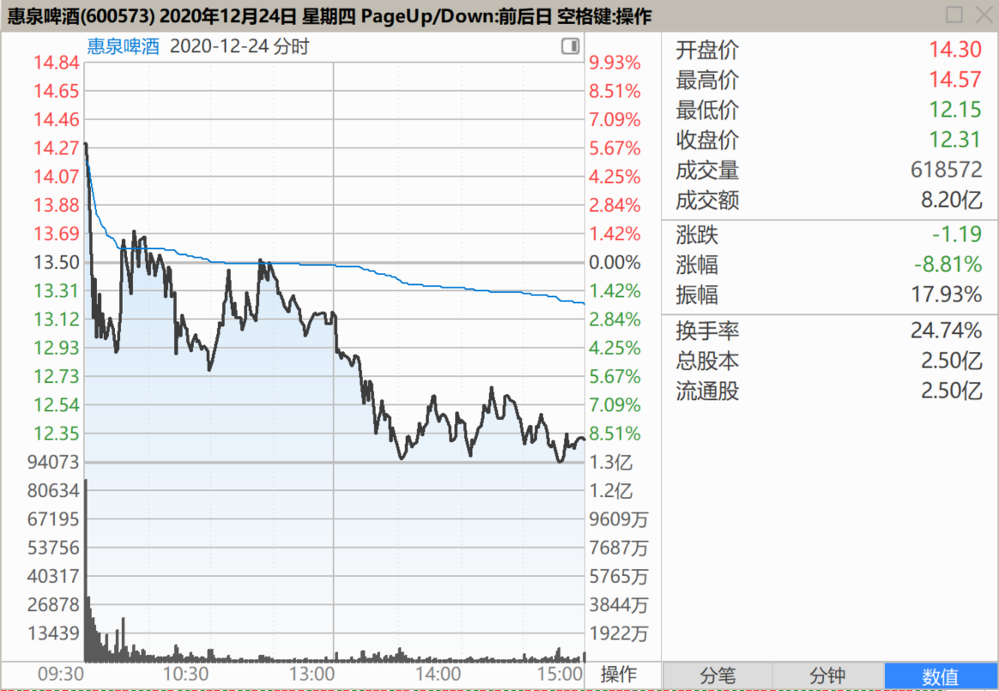
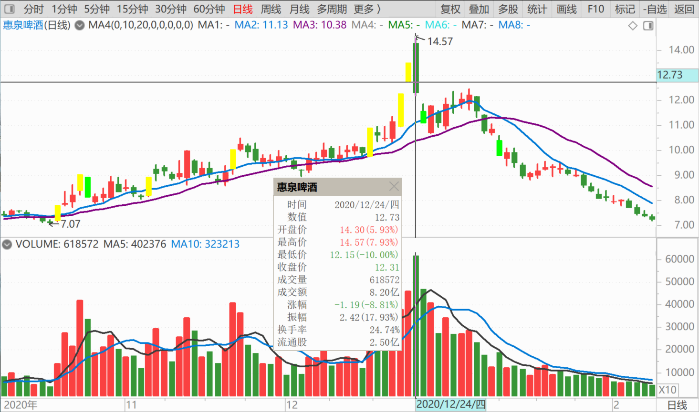

82篇.投资必须依赖自己的投资系统、有效的原则、纪律

清一山长2020年12月24日

**一、为自己的投资选择负责**

[$珠江啤酒(SZ002461)$](http://link.zhihu.com/?target=http%3A//xueqiu.com/S/SZ002461) 跌停价10.84元挂单买入珠江，居然还被我买到了！真的不可思议，资本市场实在是太疯狂了。今天开启把前天涨停卖的仓位买回来的操作，是对自己的投资负责。反正这些都是自己卖出去的股，重新买回来。涨停别人抢着要，就像是我忍痛嫁出去的女儿，别人今天就不想要了。我就自己默默的重新买回，自己收留，慢慢养在家里好了。

珠江超过10元，本来不想多说的，但玩跌停也太精彩了。燕京啤酒高位卖出去的部分，也重新买回了。才8元多，为啥不要？**在大家的欢笑中，忍痛出让手中的股份，是一种分享的美德。在凄风冷雨当中，毫不犹豫地接手别人不要的股份，是一种担当！为自己的投资选择负责。**今天已经买回上次卖出的上百万股啤酒股。尚有部分余地，正在等待成交中。

**二、两条重要的股市投资原则**

[$珠江啤酒(SZ002461)$](http://link.zhihu.com/?target=http%3A//xueqiu.com/S/SZ002461) 大家都恐慌的时候，你应该勇敢一点面对！

今天的经历，实在太过预料之外。前天冲涨停，万众欢喜。很多人纷纷抢涨停板。我也看好啤酒赛道终于开启了。珠江，理论上，该跨越13元，要冲15元了。但是，**基于我“看多不做多，反而做空”的原则，**我还是在涨停价，放出了100多万股珠江。我是做好了充分的准备，看它一路绝尘而去的，内心有很多的不舍。燕京由于仓位重，我也在冲10元的高位附近，放掉了近100万股。这都是准备放手的，让利的。因为我的账户需要随时留下充分的额度应对危机。

没想到，今天珠江居然跌停[吐血]。我挂在跌停价的单子，居然还成交了。**这说明两条重要的股市投资原则：第一，虽然我投资业绩很好，甚至超过巴菲特的年化业绩，但各位千万别以为我能够预知未来，我经常判断错误。我只是尽量设法，让我的判断错误，不要让我亏本。保住自己的本金，以及锁定到手的利润，是第一要务。**

**第二，投资，是不能依赖自己的主观判断来进行买卖，取舍的**（这是大多数人都在做的事情，只有神才能做到判断准确，所以大多数人都在亏本）**，而必须依赖自己的投资系统，依赖有效的投资原则、纪律等等来进行操作。相信这些投资原则、投资系统，比相信自己的判断更可靠。我的格言是“看多不做多，可能反而做空”**。就是前天我虽然看多，现在却被打脸。但由于我依然卖出大量啤酒股（看多做空），由于我内心并没有看空，所以我账上依然留下了百万股以上的珠江持仓待涨，燕京、惠泉也没有大举清仓。如果我真的知道会有今天，我会一股不剩的全都卖掉，正好涨停板让我可以轻松卖股。所以说明我真的无法判断未来。

**我的另一句话，就是“看空不做空，反而做多”**。比如我今天，重新大举买入前天卖出的啤酒仓位。难道我看多，认为下午会涨吗？明天会涨吗？趋势看上去是跌的。一旦形成趋势，短期谁也翻不过来。但我看到了空，看到了市场的恐慌下跌，但我并未做空，逃跑。甚至我还反向做多，开始买进**。但为了避免风险，我也不多买。**我原来卖出了多少，我今天就买进多少。重新把我空出来的融资额度买满就完了。比我买惠泉简单多了（惠泉无法动用融资购买）。

大致上，这一次一进一出，我额外获得了近200万元的差价，珠江啤酒，现在是负成本持有超过百万股的仓位。这两天买卖的差价，我用来做融资的利息，可以覆盖掉接近一个亿融资差不多半年的利息。可以理解为：我前天加上今天的进出操作，就拿到了融资持仓的半年无息贷款机会。我可以容忍我的持仓半年不涨而不增加资金成本。这样来玩的话，长期来看，我一定是最后的赢家。**所以我需要做做T来减低持仓成本，但不能减股数，如有机会，还要增加持股。**

**同时，这一次也警告了某些只想做“第三阶段”吃大餐的人，想要直接数钱的人：追涨的代价，可以分分钟被埋。**我猜想今天的跌势，大多数投机客吓坏了，一看趋势走坏，就纷纷逃跑，绝对不会反手买进的。只有我们这种从底部做起来的人，才敢接手买下，才有机会享受未来的上升红利。

说实话：如果不是我12元多卖掉这些股份，让我现在来10元、11元接飞刀，我也不敢进场的。**你能承受多大的压力，才有机会承担多大的利润！不想承担压力，不愿意拒绝诱惑，来股市，就是送钱的韭菜。**

（写完后刚看到，今天的买入已经获利了[笑]。珠江开始掉头上涨。我真是幸运。不过，别高兴太早，也许它还会继续杀回跌停的，我已经做好了套牢的准备，而不是买入就涨）

珠江调整的极限价格，就是9.5元。这是调整了很久的底部位置。我此次买入后，最多套牢1元左右。上涨的空间，恢复前高也有两元多了。所以买入后不用太害怕。

[价值投机牌](http://link.zhihu.com/?target=http%3A//xueqiu.com/n/%25E4%25BB%25B7%25E5%2580%25BC%25E6%258A%2595%25E6%259C%25BA%25E7%2589%258C)回复[清一山长](http://link.zhihu.com/?target=http%3A//xueqiu.com/n/%25E6%25B8%2585%25E4%25B8%2580%25E5%25B1%25B1%25E9%2595%25BF)：（跟评上贴）

惠泉今天抢筹进去，今天亏了13%，再也不抢筹了。[哭泣]

清一山长回复[价值投机牌](http://link.zhihu.com/?target=http%3A//xueqiu.com/n/%25E4%25BB%25B7%25E5%2580%25BC%25E6%258A%2595%25E6%259C%25BA%25E7%2589%258C)：

勇敢者游戏。您真的太能了[很赞]真佩服你们这些人，一大早开盘，燕京、珠江，开盘就狂跌。就惠泉涨了，您就追涨了。您真能！佩服万分。您肯定是股神[大笑]！

(标题、图片为编者所加)

**文章音频**：

[484篇.投资必须依赖自己的投资系统、有效的原则、纪律](http://link.zhihu.com/?target=https%3A//www.ximalaya.com/sound/761245978)

**参考链接：**
[74篇.惠泉跨栏历史记录回顾](https://zhuanlan.zhihu.com/p/713488711)

[75篇.惠泉最成功的地方](https://zhuanlan.zhihu.com/p/714477508)

[76篇.聪明人赚钱，傻人赔钱](https://zhuanlan.zhihu.com/p/715051514)

[77篇.在确定企业价值的基础上进行金融投机](https://zhuanlan.zhihu.com/p/717031167)

[78篇.你这样做，庄家会吐血](https://zhuanlan.zhihu.com/p/718319738)

[79篇.卖出涨停股，买入跌惨了的股](https://zhuanlan.zhihu.com/p/719002613)

[80篇.燕京是一座金矿](https://zhuanlan.zhihu.com/p/720733084)

[81篇.做人，做事，都必须有“道”](https://zhuanlan.zhihu.com/p/722042320)
