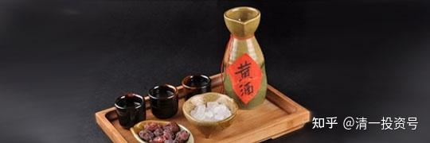
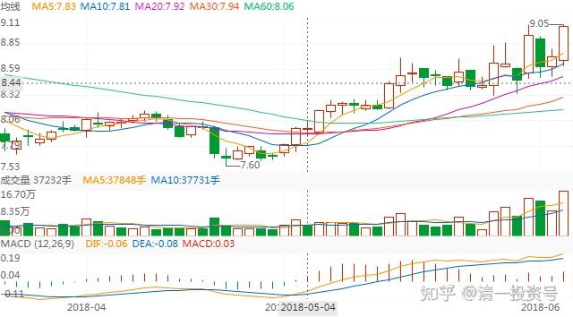
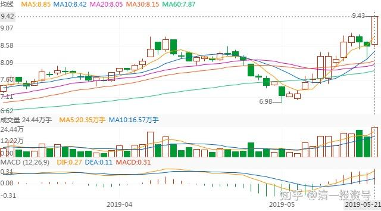
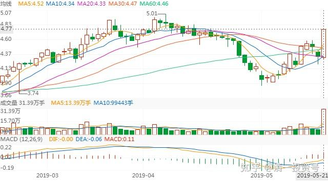
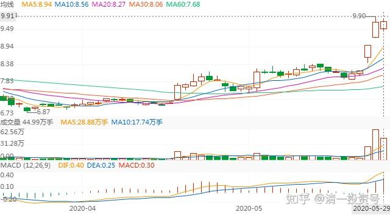

[82篇.黄酒——价值买入，投机卖出](https://zhuanlan.zhihu.com/p/581033021)

82篇.黄酒——价值买入，投机卖出

清一山长2018年5月～2020年5月

1.买入逻辑：十年没涨，消费升级

清一山长2018-05-31 11:44

$会稽山(SH601579)$涨了，我就停手算了。10元震荡期间，一直在买买买。昨天也乘机买了不少。今天看这样子，就不买了。挂眼科看它如何走势？转发我给内部学员的发言：春节期间二年级上课的时候，我给大家介绍过啤酒的购买逻辑，也给眼热啤酒但怕涨高了的——就给大家介绍关于**十年没涨的黄酒**。现在黄酒也已经开始启动了。不知道你们买了没有？给你们上完课后，我一直在买黄酒。花掉了我8位数的资金，仅次于啤酒的存量。就两只股，古越龙山和会稽山。金枫酒业长期竞争力不行，所以没有买。这两只谁是龙头我也不知道，所以都买了，反正都是低价区间。其实昨天我也在大买这两只股。但因为卖单少。我买得很辛苦，只能一万两万股的挂单，所以也没告诉大家。太冷门了，我一嚷嚷，大家都去买的话，我还要犯“操纵股票，影响市场罪”的。所以小股票我都不愿意多说的。现在居然涨了，也更容易买到了。**相信这段时间，你们已经看到了中国未来的趋势——消费升级。简单地说，以后的通胀会很厉害。我买这些股，就是认为未来通胀太厉害了，钱不值钱，所以买一些东西存起来。**我认为黄酒是可以存起来的，女儿红、状元红，都要存二十年左右吧？所以买一些可以存的货物，心里才安心。比存房子要可靠一些，因为**房子骨子里面是不值钱的。现在房价无非是炒作出来的**。但我也没指望这些股票大涨的，我不知道它们现在会不会涨。但是，说涨也就涨了，本来等我的啤酒卖掉后再回头多好。股票涨了，买了股的人很高兴，持有现金的就倒霉了。**未来的中国十年趋势，就是什么都涨，什么都贵的日子。好听一点，叫做“消费升级”，更好听一点，叫做“正在进入发达国家行业”。**

清一山长2019-05-23 21:27

$ST康美(SH600518)$这个公司的300亿到何处去了----居然是去用来坐庄，偷偷炒自己的股炒亏掉了。这故事真好玩。——说实话：一年多前有朋友告诉我该股多么有潜力，未来前景如何好之类的，还告诉我身边的一些老板，都集体“悄悄潜伏”进去了，特别看好它的未来。我打开K线，看了一眼之后就直接放弃掉了，我连多研究一下的兴趣都没有——一只已经从2014年涨了三倍的股票，你还告诉我多么有潜力？我把基本面抛开不谈，我想的担忧就是：万一这个股是有托儿的，是忽悠人的（因为一看就知道，这个股肯定有庄的，我相信我还是看得出这点来的）。它当然有可能继续涨。但是，万一庄家想用这个价卖给市场（当时它已经账面上赚死了），可我这种新买入者咋办？结论是没办法。现在事实说明。当时来忽悠好朋友买股的人，就是已经被庄家**“绝密内幕消息”忽悠的人**。相信内幕消息，不如相信盘面语言。所以，我的**投资原则，是绝对不追高，绝对不要成为庄家的牺牲品，我只买价格在庄家成本线附近，甚至以下的股票**，（比如顺鑫农业，这个庄其实是很恶心的庄，德行很不好。它是很有耐心的，花了两年多时间来做盘，整人手法一流。我19元买入都吃套，拿了一年多也只能坐电梯，摆出一副完全与白酒股涨跌无关的样子，甚至还打到16元去，吓走了很多散户。但我相信我拿货的价格，跟庄家的成本是差不多的，所以我就不怕，稳稳地坐在车上不动，最后的一点顺鑫，是60元卖掉的。这时候，**已经涨了三倍的顺鑫，无论是谁来吹它未来多么有潜力，我都是死也不再进场的——我宁肯错过，也不愿做错**。它涨到100元，也跟我无关了。账上留上几手，做做纪念就可以了。**我宁肯去买十年也不涨的黄酒，愿意再等十年，也不要去买这些高大上的名酒了**。起码我知道现在的价格，庄家也是不赚钱的。我就敢买了。其实坐庄真的很可怜，很不容易的，并不是大家想象的，坐庄就一定赚-----很多庄，操盘手法不好，常常不小心就被老鼠仓吃了（我相信康美的老鼠，一定超级多，300亿的集体大餐喔，很多老鼠一起吃才吃得完的），被散户吃了。**跟庄有技巧的，只能跟悄悄低位入场的庄，别去跟高位起舞作秀的庄**。20多元的康美，几乎是路人皆知的“好股”，很多大V在推的好股，你居然还用真金白银去跟庄，你就太傻了。**看不懂K线，看不懂庄怎么办？一句话，价值投资去。买个靠谱的股票，睡觉去，就行了。其实最简单。巴菲特、段永平的炒股方法，是最靠谱的投资方法，就是不炒股**！

2.走势分析及多种操作方式

清一山长2018-06-05 11:29

$古越龙山(SH600059)$最近这半个月的走势。典型的洗盘后拉升，实在是干净利落。特别是最近四天，看日K线，一根大阳线之后马上接一根大阴线。投机客最喜欢了，这种线，很刺激，每次都有三五个点可以赚的机会。我就算了，继续挂眼科。观察它怎么玩。目前看样子，古越的庄家已经基本上完成进货了，账面现在肯定是绿色的。但已经持有大量的股票。现在不需要大量进货了。现在的操盘手任务，是逐级的拉升。但是目前的拉升，是不许增加太多持仓的。主要是增加持股的价格（我感觉还是会增加一点仓位的）。所以，它必须边拉边打。造出引人注意的势头来吸引投机客加入，一起推高股价。主力可以在推高，打压过程中反复摊低成本，至少做到不花成本。只花功夫。高明的投机客，跟随进退，可以取得比持股不动更好的收益。跟不上的就被别人收割（可能是主力，也可能是优秀的跟风投机高人收割）。死脑子的价投们，看样子会慢慢地退出。边涨边退。

空投轰-20回复清一山长:

作为死脑子的夹头，我确实准备慢慢退出，边涨边退，不退出难道还来真的要搞长期价投么[害羞]？

清一山长2018-06-05 12:00回复空投轰-20:

死脑子很好呀！死脑子赚死钱。价投的话，叫做赚取“确定性收益”。比乱买乱卖的投机客（我称呼他们为“无脑子”），价投的收益要稳定多了。我让我的学生们都学习做傻猫，就是要他们死脑子，别乱想乱动。所以我很支持的。**死脑子价投的优点是：基本不会亏钱。长期来看，肯定都是赚钱的。缺点就是：很寂寞，永远在最悲惨的时候入市，刚好一点就走了。把掌声和繁华留在身后，继续去守住寂寞。非心理强大者不能为的“价投”**[大笑]。

不过如果价投的脑子进化了，变活了，成为“价值投机”派了，收益就会更高的。比如我持仓的中国建筑，目前已经恢复到M级持仓了，但持仓成本居然是负数。如果是价投，就算在最低点入市，也不可能是负数的。所以收益相对有限。个人认为：价值加投机，才是最好的投资理想。相当于基础扎实，加上灵活变通，绝对是武林高手。不过，**如果没基础的人，乱玩灵活，就是找死了**[大笑]。相当于没有功夫，只有花拳绣腿的人，出去秀功夫，只会找打。基本功真的好，去练什么拳种都可以，都可以杀人[加油]。

投资三阶段论：

第一阶段：无脑子（不知为何买，不知为何卖，跟着感觉走，乱买乱卖）。市场上90%是这种级别的人。短期可能他们也会赚钱，但长期来看（十年），这种人都是亏损的。

第二阶段：死脑子（**已经有了自己的投资逻辑和特定的投资方法和价值观，会认定一个有效的投资原则不放松，锁定自己的投资能力圈不乱走**），金融市场上，大约只有不到10%的人属于这个级别的。主要是价投居多，也包括很多优秀的趋势交易者。比如我认识的某些当日交易者，无论如何就是不肯持仓过夜的。每天都赚钱就是他们的理想。实际上他们也做到了。这种人，已经练成金刚不坏的功夫，长期来看，是不会亏的。虽然短期内看，他们也经常被套牢。

第三阶段；活脑子（具有多种投资模型和投资思维模式，可以自由地在多种看似互相矛盾的投资方式和投资领域里面活动，比如把价值投资和趋势投资结合使用，看起来很不正常），已经无法用固定的投资定义去定义他们了。他们是能够从金融市场获得最多收益的人群，最热爱金融市场。索罗斯是其中一个最成功的典型代表。这种人有多少？我没去计算。我相信不会超过1%的，应该更少。

[山那边更美](http://link.zhihu.com/?target=http%3A//xueqiu.com/n/%25E5%25B1%25B1%25E9%2582%25A3%25E8%25BE%25B9%25E6%259B%25B4%25E7%25BE%258E)回复[清一山长](http://link.zhihu.com/?target=http%3A//xueqiu.com/n/%25E6%25B8%2585%25E4%25B8%2580%25E5%25B1%25B1%25E9%2595%25BF):

贸易战对古越会否有影响？谢谢!

清一山长2018-06-17 22:33回复山那边更美

有影响！！！！古越的产品，以后就不能出口美国了。只能出口转内销！[俏皮]

清一山长2018-06-18 22:19

$古越龙山(SH600059)$“1997年，古越龙山5年陈是174元一箱，茅台是200元左右，价格相差不大，现在茅台6000元，为什么我们还是200多元？”柏宏认为，同质化竞争的问题导致产品没有相对垄断，造成价格体系上不去，下一步还是要推动产业和资源的进一步整合。据柏宏透露，作为黄酒的主产区之一，绍兴政府正在筹划推动整合当地的黄酒产业，留下来的品牌或少于15家。风水轮流转。未来20年，茅台比价超越古越这么多的概率不高，大致上比价会被拉近的。

3.卖出原因：涨停，成交量大

[清一山长](http://link.zhihu.com/?target=https%3A//xueqiu.com/9310099567)2019-05-21 11:42

$古越龙山(SH600059)$我的库存酒们，居然在不断上演戏剧。这算演个啥呀！这么早就出来拉涨停玩儿。庄家真的已经吃饱了？慢慢看戏吧！

[清一山长](http://link.zhihu.com/?target=https%3A//xueqiu.com/9310099567)2019-05-21 11:56

$金枫酒业(SH600616)$市值30亿的金枫，与市值78亿的古越，都来玩了个涨停。半日1.72亿，与古越2.15亿居然差不多。说明逃掉的比例多得多。当然，即使是现价，也是2006年以来的最低价，持有这个股十年的股东，基本上都是亏的。不容易。申明：本人没有持有金枫酒业。因为没看懂。

[Maxwell_Max](http://link.zhihu.com/?target=http%3A//xueqiu.com/n/Maxwell_Max)回复[清一山长](http://link.zhihu.com/?target=http%3A//xueqiu.com/n/%25E6%25B8%2585%25E4%25B8%2580%25E5%25B1%25B1%25E9%2595%25BF):

山长兄，[古越龙山](http://link.zhihu.com/?target=https%3A//xueqiu.com/S/SH600059%3Ffrom%3Dstatus_stock_match)请问有目标价吗？

[清一山长](http://link.zhihu.com/?target=https%3A//xueqiu.com/9310099567)2019-10-25 10:28回复Maxwell_Max:

珠江我也没有目标价。只是涨了之后，我一般会习惯性慢慢卖出一部分，愿意少赚一点，我认为我永远也不会卖光珠江啤酒的，只是会跌出十大股东的名单罢了。卖掉一部分，有了酒钱，我会再去买一些依然留在底部的股票。我是捡破烂的。见不得涨得好的股票，**越涨我越卖，越跌我越买，**直到买成大股东为止。**如果古越就是不涨，就等我用高价啤酒换低价黄酒喝**[笑]

[清一山长](http://link.zhihu.com/?target=https%3A//xueqiu.com/9310099567)[2020-05-27 21:40](http://link.zhihu.com/?target=https%3A//xueqiu.com/9310099567/150253526)

[$珠江啤酒(SZ002461)$](http://link.zhihu.com/?target=http%3A//xueqiu.com/S/SZ002461)今天没看盘，外出做事去了，刚回来看到珠江突破，古越涨停。（节选）

[清一山长](http://link.zhihu.com/?target=https%3A//xueqiu.com/9310099567)2020-[05-29 15:44](http://link.zhihu.com/?target=https%3A//xueqiu.com/9310099567/150412710)

[$古越龙山(SH600059)$](http://link.zhihu.com/?target=http%3A//xueqiu.com/S/SH600059)古越走了，出来秀身段的，我都走。**赚不赚钱是次要的。这几天的成交量也太大了**。

