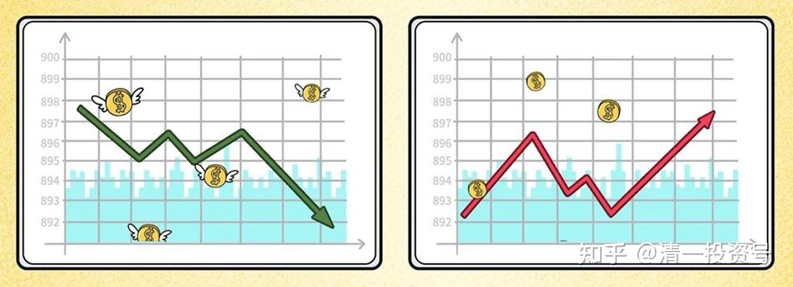
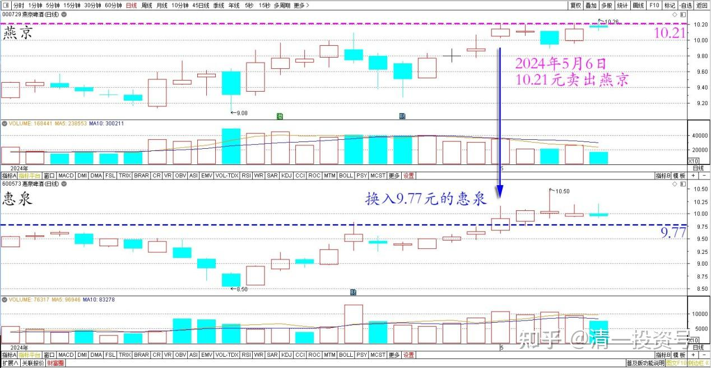
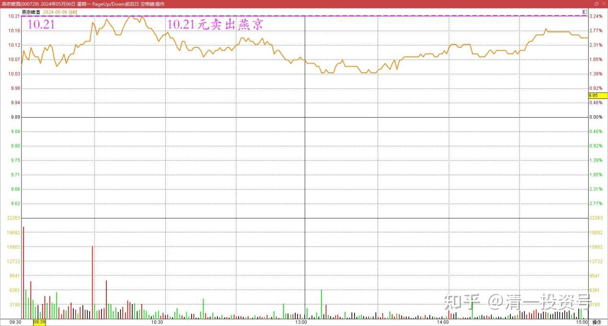
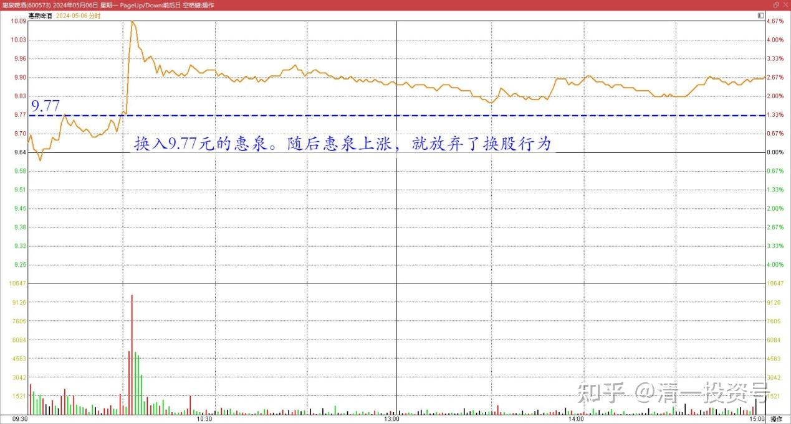
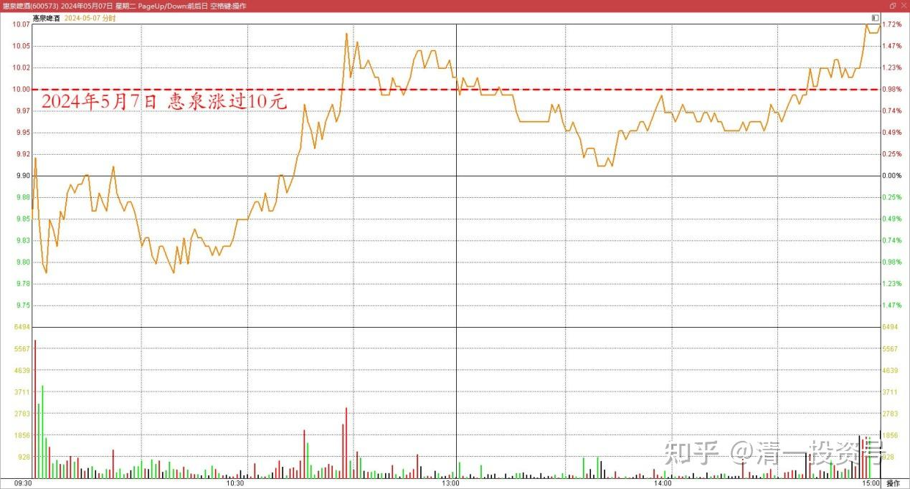
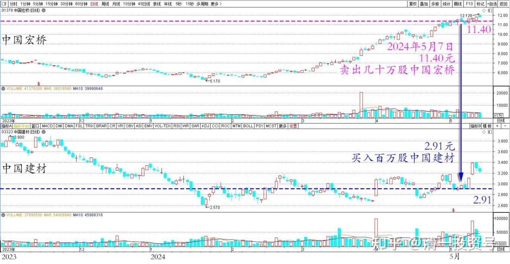
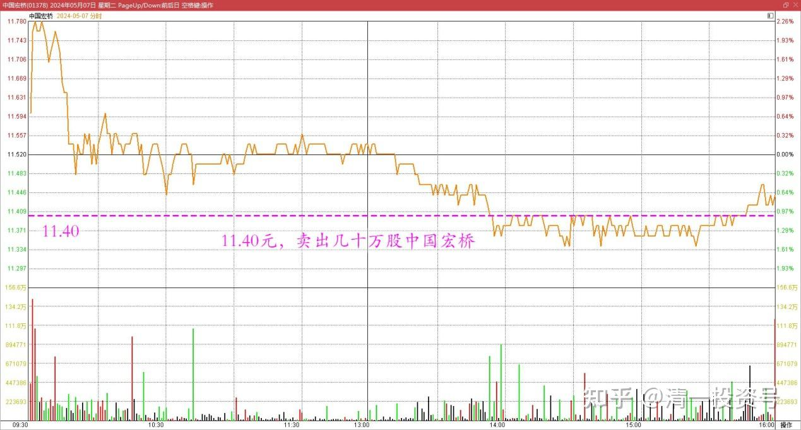
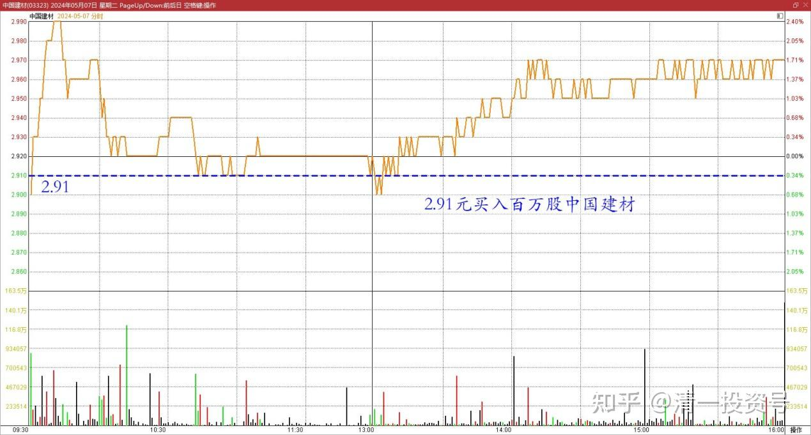

83篇.换股策略——高卖低买

清一山长2024年5月7日

**一、三大啤酒公司的小操作**

这段时间，三大啤酒公司之间，利用价差做了一点小小的操作。由于燕京的上涨，燕京的账面利润，已经完全恢复到了去年3月份，燕京冲到14元区域的水准。珠江、惠泉利润和持股数均创新高（初始投资总额应该没有变化），说明我的轮动是很成功的。因此目前的总账户，已经创新高了，尽管股指依然在3000点前后晃悠。**通过正确的高卖低买行为，已经脱离了股指涨跌对账户的影响，换股策略，使得账户不断增长**！

昨天上午，卖了一点燕京，10.21元卖出，换入了9.77元的惠泉。随后惠泉上涨，就放弃了换股行为。

燕京、惠泉啤酒2024年4月～5月日线图

燕京啤酒2024年5月6日分时图

惠泉啤酒2024年5月6日分时图

今天惠泉居然涨过10元了。对我来说，惠泉持仓市值和利润再创新高，查了一下本次持仓换入的均价是8.92元，但惠泉的总持仓成本是零元（其实是负数），因为这个老二的仓位，都是用原来的惠泉卖出的利润重新买入的，使用的自有资金是零。

惠泉啤酒2024年5月7日分时图

**二、宏桥换建材**

另外一个换股行为是港股，在11.40元，卖出了几十万股中国宏桥，在2.91元买入了百万股级别的中国建材。

中国宏桥、中国建材2023年11月～2024年5月日线图

中国宏桥2024年5月7日分时图

中国建材2024年5月7日分时图

中国宏桥是原来我港股的第一重仓股，持股多年，反复加仓减仓，一直都持有，也是我的港股第一利润王。靠它的收益，弥补了我投资港股的一些亏损，比如华融民生之类的。**现在宏桥再次涨到历史新高（复权价）了，所以我这种喜欢见高就走的人，看见这么多人想要，我就拿出来一些卖掉，去换跌到历史最低价，没人要的中国建材了。**手上还有上百万股宏桥，慢慢卖吧！反正现价肯定不是我买的时候。至于中国建材，原来我的投入不是太多，期间股价还翻番了，但我居然没有走（也是因为仓位不多的原因）。结果现在，跌到一个让我让我想象不到的，大大亏本的价格，账面惨绿。但我相信这只股票最终是亏不了的。反正这只股股息超高，去年经营这么惨淡都大方分红，应该可以买入长期持股，涨不涨就不管了。持有十年应该成本就归零了。

(标题、图片为编者所加)

**文章音频**

[445篇.换股策略--高卖低买_清一投资号文章同步音频](http://link.zhihu.com/?target=https%3A//www.ximalaya.com/sound/729710682)

**参考链接：**

[74篇.A股要崩了？我还在买股票！](https://zhuanlan.zhihu.com/p/686286680)

[75篇.同为啤酒，敢否持有？（配图版）](https://zhuanlan.zhihu.com/p/684419681)

[76篇.年前最后一天，燕京换惠泉](https://zhuanlan.zhihu.com/p/688783385)

[77篇.年后第一天，看啤酒起落](https://zhuanlan.zhihu.com/p/688784278) [78篇.洛阳钼业换华菱钢铁](https://zhuanlan.zhihu.com/p/692417410)

[78篇.洛阳钼业换华菱钢铁](https://zhuanlan.zhihu.com/p/692417410)

[79篇.养老账户操作：燕京换珠江](https://zhuanlan.zhihu.com/p/693773038)

[80篇.不要钱，只要股——啤酒股切换](https://zhuanlan.zhihu.com/p/695027042)

[81篇.惠泉跌破十元，再次进入十大](https://zhuanlan.zhihu.com/p/696066886)

[82篇.远离投机，踏实投资，才是正道](https://zhuanlan.zhihu.com/p/697366505)

