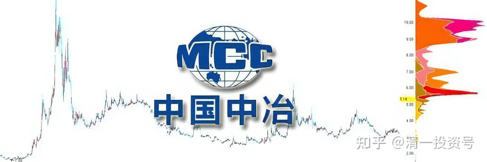
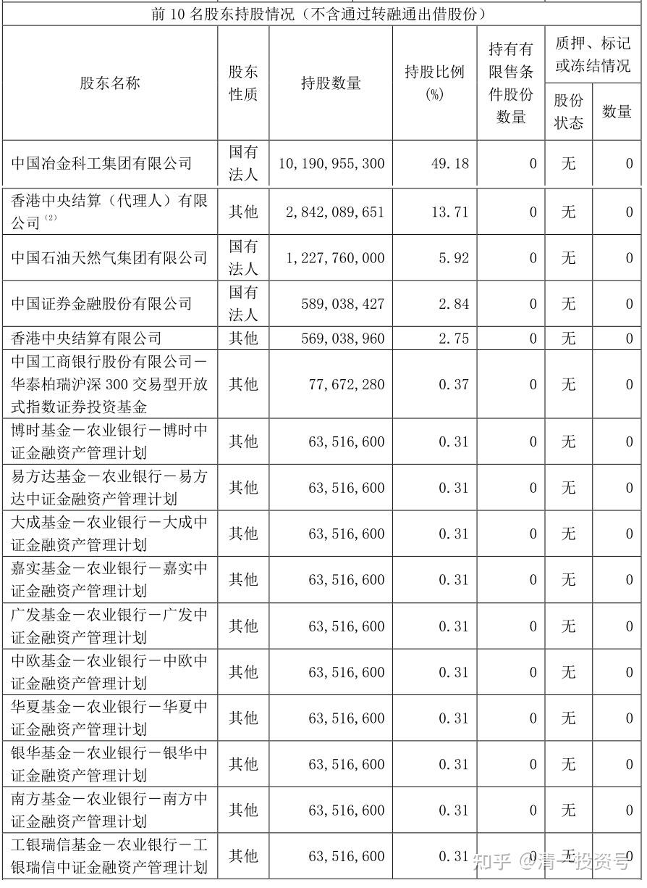
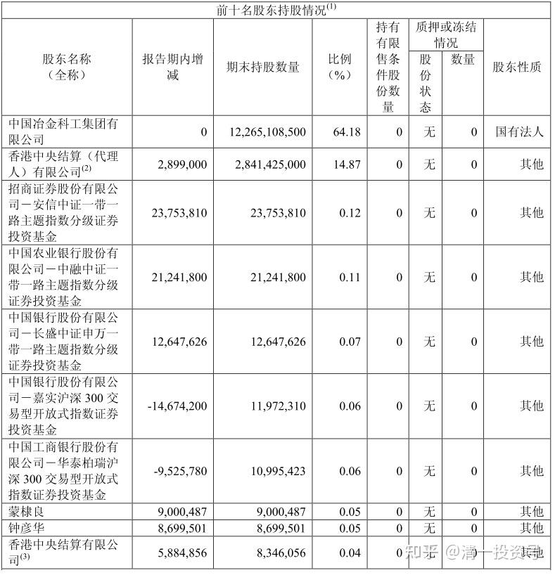
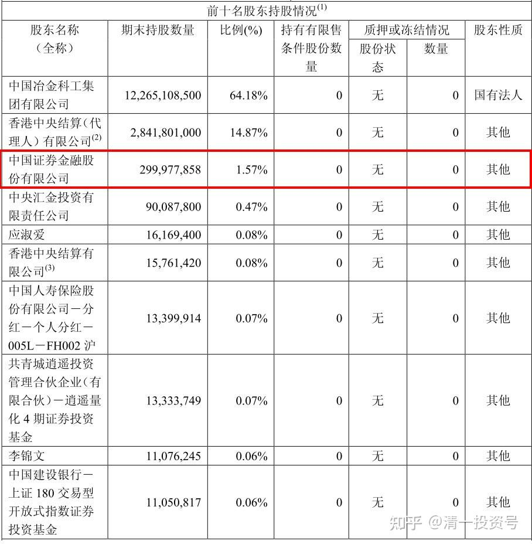
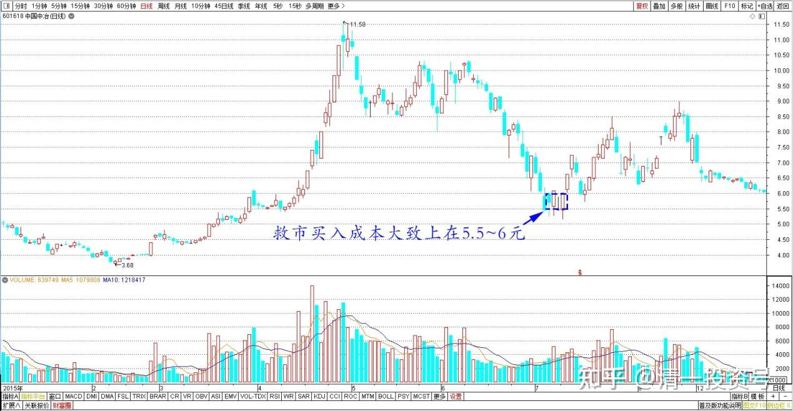
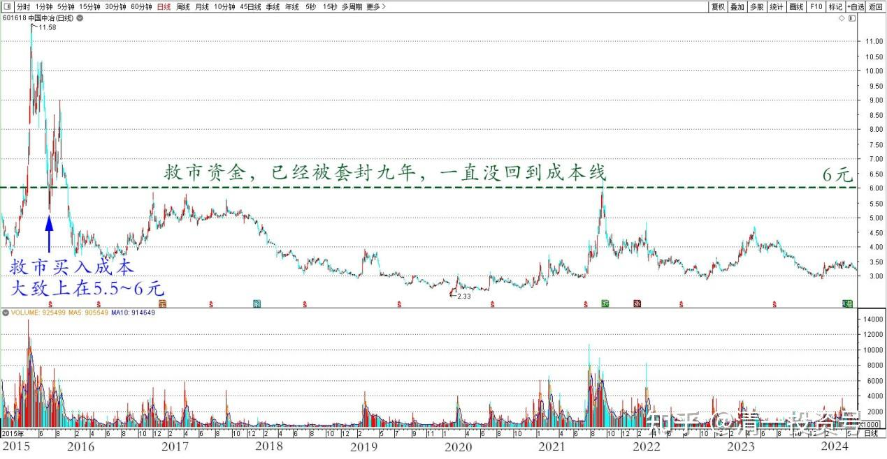
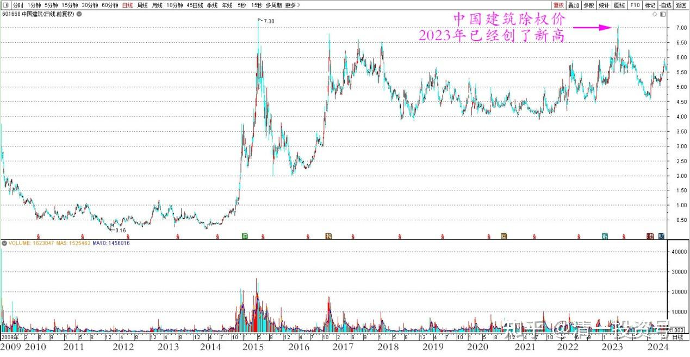

**87篇.中国中冶的筹码分析**

清一山长2024年5月29日

中国中冶的筹码分析：我判断A股的流动筹码大约只有20%多。因为大股东50%的筹码是不动的。十大股东中，外资股以外的筹码也是基本不动的！十大股东一起，持有的股票就超过75%了。因此，市场上的流动筹码也就是只有20%左右。

中国中冶2024年一季报十大股东

**十大股东的持仓成本，可以作为一个安全垫子来看**。经过研究发现：证金以及关联方，在2015年救市的时候，买了大把的中国中冶，当时的救市买入成本大致上在5.5～6元的样子。

中国中冶2015年半年报十大股东

中国中冶2015年三季报十大股东

中国中冶2015年日线图

我认为：可以说国家认为中国中冶的股票值6元。实际上中国中冶的净资产港股标志是8.1港币(比A股的高）。因此——说该票价值在6元左右的话，似乎也不是啥离谱的说法，只是一个正常的价格。我只花1.5元买进，怎么算都不会吃亏的！但——国家队的救市资金，已经高位被套封了九年了，一直都没有回到原来的成本线（中国建筑其实除权价去年已经创了新高的）。

中国中冶2015～2024年日线图

中国建筑2009～2024年日线图（前复权）

万一有一天，中国中冶的国家队解套了（我认为这是必然的），甚至创造了新高，我现在买入的中国中冶，难道不会涨四倍吗？也不过就是股价到6元而已，没啥不敢想的吧？想想就觉得精彩！

当然——也许我还要等8年才能等到这一天？**反正国家队9年了都不急，我急啥？慢慢等风起来，我相信中国中冶与中国建筑一样，都是不会垮的企业！**这个社会总在搞建筑，拆掉旧建筑，重新建新厂等等，似乎建筑企业总有事情干。比如钢铁企业升级换代，它的单子就不少！

（标题、图片为编者所加）

**文章音频**

[453篇.中国中冶的筹码分析](http://link.zhihu.com/?target=https%3A//www.ximalaya.com/sound/735288564)

**参考链接：**

[80篇.不要钱，只要股——啤酒股切换](https://zhuanlan.zhihu.com/p/695027042)

[81篇.惠泉跌破十元，再次进入十大](https://zhuanlan.zhihu.com/p/696066886)

[82篇.远离投机，踏实投资，才是正道](https://zhuanlan.zhihu.com/p/697366505)

[83篇.换股策略——高卖低买](https://zhuanlan.zhihu.com/p/698681371)

[84篇.赚股——卖出涨得好的，买入趴地下的](https://zhuanlan.zhihu.com/p/699932996)

[85篇.用涨了的天山铝业换没涨的中冶H](https://zhuanlan.zhihu.com/p/701250566)

[86篇.10元上下的啤酒操作](https://zhuanlan.zhihu.com/p/702432867)

