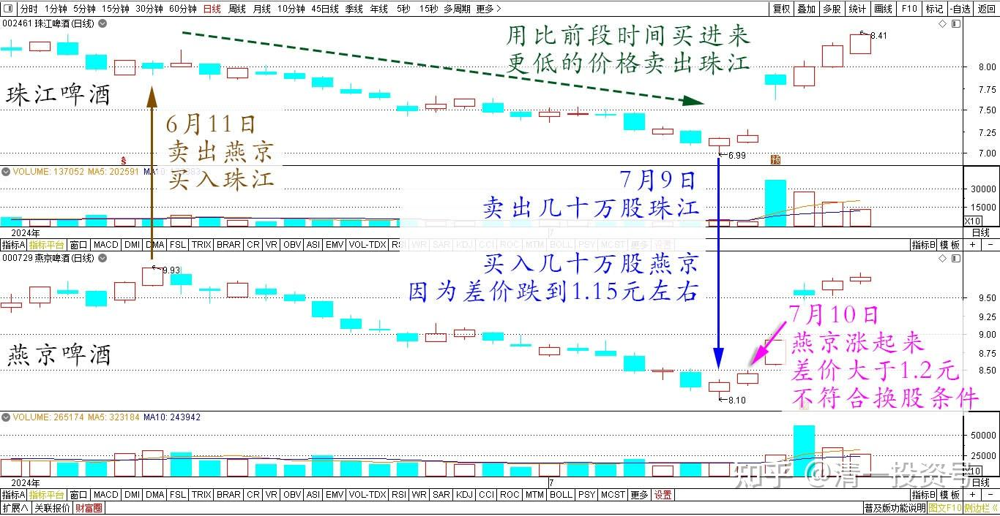
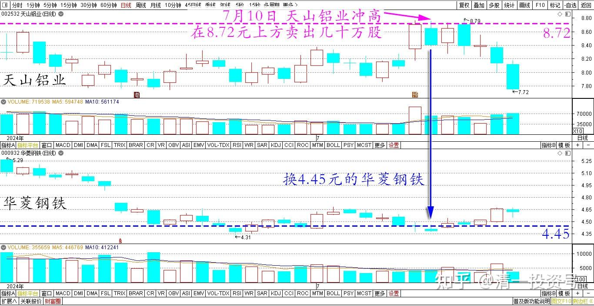

90篇.珠江换燕京，天山换华菱

清一山长 2024年7月10日

昨天我操作了一下养老账户，原来用燕京换了很多珠江，燕京减仓很多。账面利润喜人，是该账户最高盈利的股票。但珠江的总利润要差很多，因为总在高价买入，低价卖出（换股）。昨天我就用比前段时间买进来更低的价格，卖出了几十万股珠江啤酒，换了几十万股燕京回来。因为两股的差价，跌到1.15元左右了。这种情况下，我认为持有燕京才是正确的选择，所以昨日我就启动了换股的程序。今天早上忙写课件了，没看盘。10:30看了一下，燕京居然就涨起来了，每股赚了3毛钱？可惜与珠江的差距已经大于1.2元，不符合换股条件了。

珠江和燕京 2024年6月~7月 日线图

另外，天山铝业冲高，据说上半年的业绩特别靓丽。我就在8.72元上方卖出了几十万股，换了4.45元的华菱钢铁。**反正都是金属生产行业，钢铁和铝材我看着也差不多。就看谁的股票便宜，我就换谁好了。每天换股，股票增加就开心。账户金额是否增加不在意，总资产减少一些也不在意。这就是产业思维用在金融上了。不看浮盈多少，只看持有的资产是否真的增加了**！

天山铝业、华菱钢铁 2024年6月~7月 日线图

（标题、图片为编者所加）

**文章音频**

[463篇.珠江换燕京，天山换华菱_](http://link.zhihu.com/?target=https%3A//www.ximalaya.com/sound/742839081)

**参考链接：**

[85篇.用涨了的天山铝业换没涨的中冶H](https://zhuanlan.zhihu.com/p/701250566)

[86篇.10元上下的啤酒操作](https://zhuanlan.zhihu.com/p/702432867)

[87篇.中国中冶的筹码分析](https://zhuanlan.zhihu.com/p/703727743)

[88篇.燕京、珠江轮动——增厚账面利润](https://zhuanlan.zhihu.com/p/705006495)

[89篇.跌破新低，买回燕京](https://zhuanlan.zhihu.com/p/706301925)

