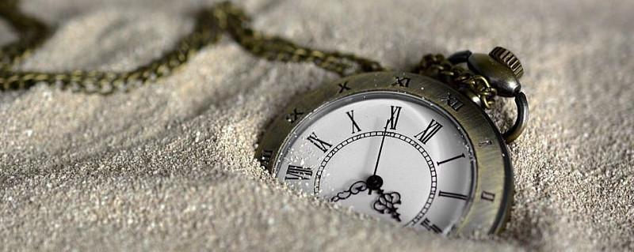
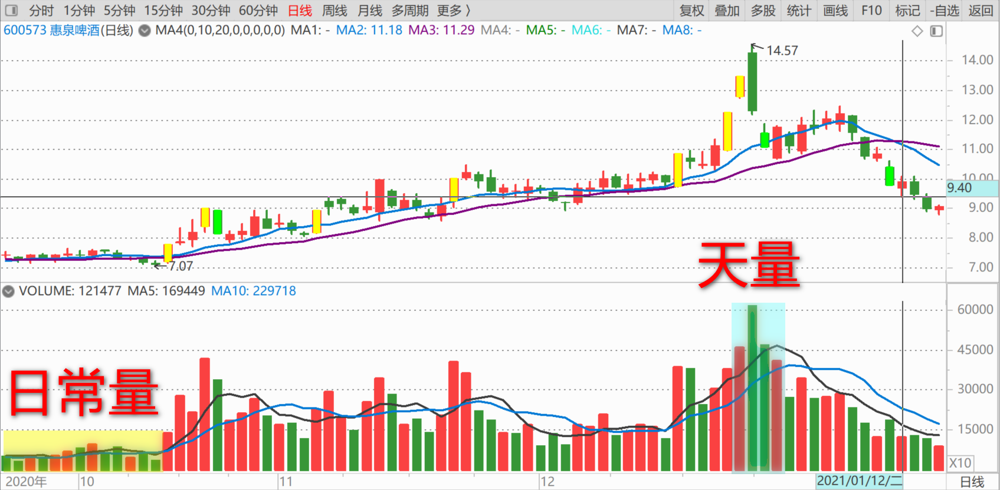
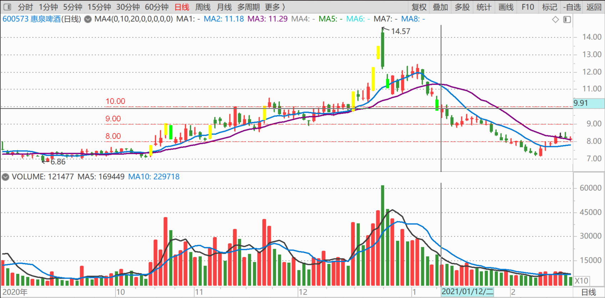
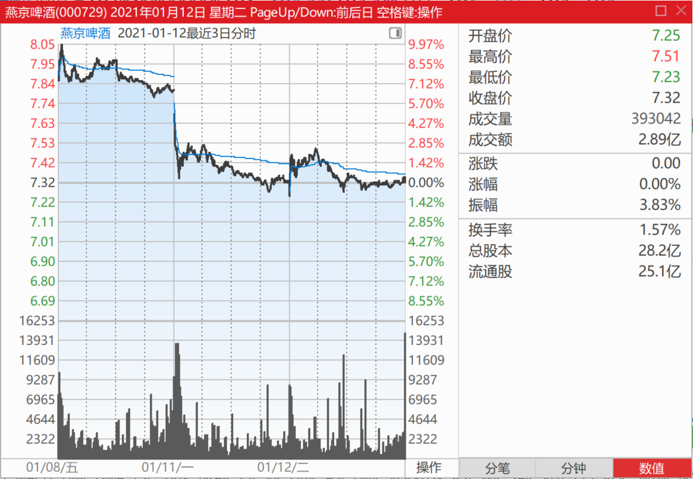
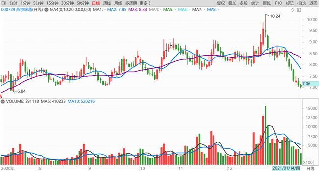
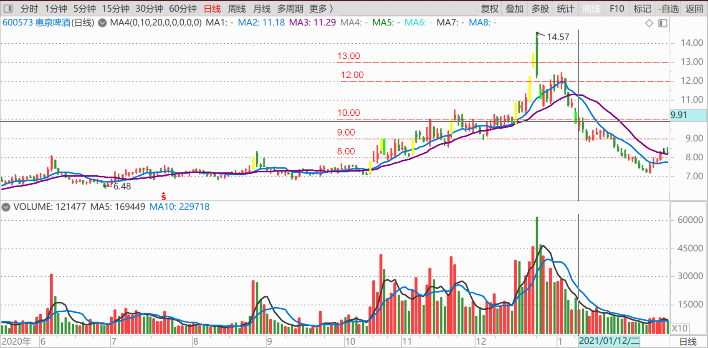
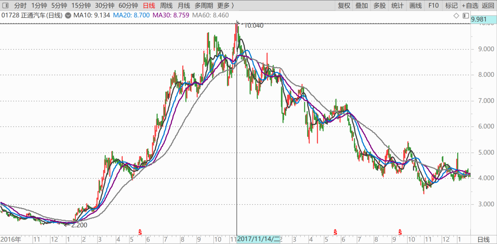
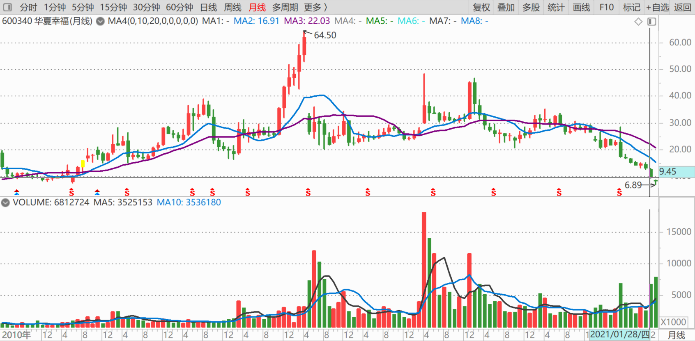
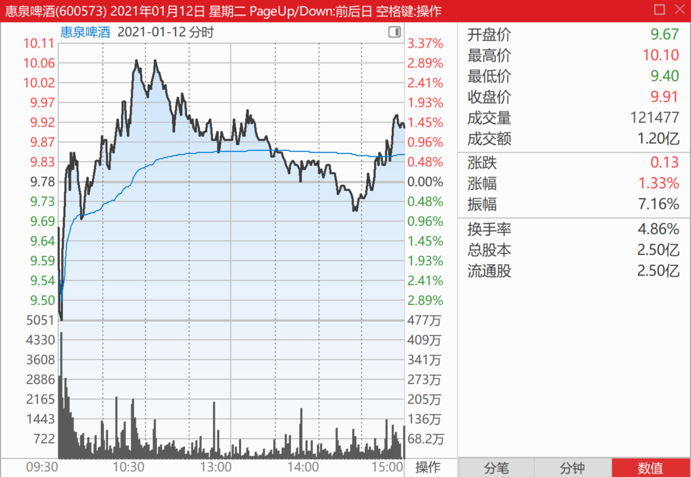
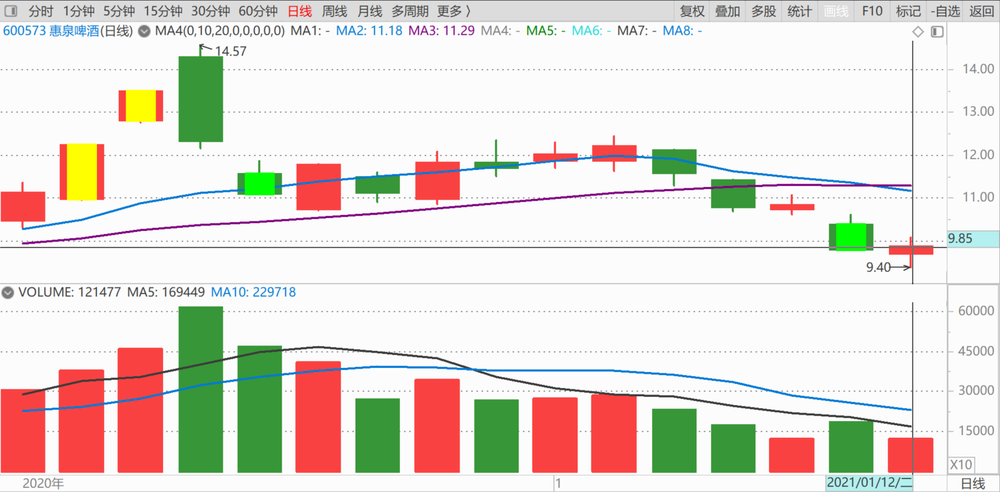

91篇.如何看进出时机？

清一山长2021年1月12日

**一、如何看进出时机？**

[$惠泉啤酒(SH600573)$](http://link.zhihu.com/?target=http%3A//xueqiu.com/S/SH600573) **今天刻意低开，也是故意来收智商税的。所以，聪明人会在一些特殊点时刻埋单等待机会。**

要看进出的时机，告诉各位一个方式，就是**看量。量放大到了天量（超出正常成交量很多），就该走了。**这一次惠泉天量的时候，我看着手中剩下的20多万股惠泉，纠结要不要全卖掉算了。因为我想怎么也留一百万股来陪它的。但看涨得太凶了，就忍不住使劲卖，还以为卖飞了。所以钱就用去买其他股票去了，比如中国海外宏洋等，因为跌太低了。没想到，惠泉又重新跌回原地，让我不得不到处筹钱重新拿回原来的仓位，继续当惠泉的十大。

技术上看，9元是惠泉长期调整的底，很难破的。(其实10元是支撑位，**跌破支撑位，如果长期回不来，就是主力出逃了，预后不良**）。但我认为：惠泉的主力玩得正欢，才不想撤退呢！10元的支撑位，很快就会收复的。

我估计很快惠泉又会让我闭嘴的（超过10元），当然，惠泉也可以真的继续来打我的脸，会继续向下跌破8元。真这样的话，我就真的要去抢二大来当了！我说话算话！[加油]

[采采芣苡采采葑菲](http://link.zhihu.com/?target=http%3A//xueqiu.com/n/%25E9%2587%2587%25E9%2587%2587%25E8%258A%25A3%25E8%258B%25A1%25E9%2587%2587%25E9%2587%2587%25E8%2591%2591%25E8%258F%25B2)回复[清一山长](http://link.zhihu.com/?target=http%3A//xueqiu.com/n/%25E6%25B8%2585%25E4%25B8%2580%25E5%25B1%25B1%25E9%2595%25BF)：

同问，燕京这跌破所有支撑位的咋办？

[清一山长](http://link.zhihu.com/?target=https%3A//xueqiu.com/9310099567)[2021-01-12 12:51](http://link.zhihu.com/?target=https%3A//xueqiu.com/9310099567/168442862)回复[采采芣苡采采葑菲](http://link.zhihu.com/?target=http%3A//xueqiu.com/n/%25E9%2587%2587%25E9%2587%2587%25E8%258A%25A3%25E8%258B%25A1%25E9%2587%2587%25E9%2587%2587%25E8%2591%2591%25E8%258F%25B2)：

不早说了吗？跌破五元不是梦。8元多，就说要跌停了，让你们赶快逃呀？我股份多，我来殿后！你们都走吧[加油]！你现在跑出来，问个啥呢[大笑]。

[崔正浩](http://link.zhihu.com/?target=http%3A//xueqiu.com/n/%25E5%25B4%2594%25E6%25AD%25A3%25E6%25B5%25A9)回复[清一山长](http://link.zhihu.com/?target=http%3A//xueqiu.com/n/%25E6%25B8%2585%25E4%25B8%2580%25E5%25B1%25B1%25E9%2595%25BF)：

我今天吐了九升老血[哭泣][哭泣]

[清一山长](http://link.zhihu.com/?target=https%3A//xueqiu.com/9310099567)回复[崔正浩](http://link.zhihu.com/?target=http%3A//xueqiu.com/n/%25E5%25B4%2594%25E6%25AD%25A3%25E6%25B5%25A9)：

是不是昨天跌停，你已经走了？[大笑]，昨天，我不是示范买入吗？就是要跟我反着做？

您真是庄家的好基友。惠泉13元的时候，您贷款来买主力手上的股票。现在主力手上没股票了，正缺筹码呢！你又赔钱，跌停卖掉惠泉交回给主力。我提议，主力应该授予你：股市风流人物奖！

疑问：前几天冲到12元，如果您卖掉了，昨天跌停补回来，您就已经赚钱了。为啥您12元不卖，9元多就卖？您是钱多多先生，是吗？[俏皮]

不过，没关系的，也许您是对的。我估计：惠泉可能会跌到8元的，我正在筹钱来准备这一天。

**二、燕京的黑帖子，为啥这么多？**

[互联网怪盗团](http://link.zhihu.com/?target=https%3A//xueqiu.com/8242980329) [发布于2021-01-05 20:44](http://link.zhihu.com/?target=https%3A//xueqiu.com/8242980329/167711038)

我不知道南极电商有没有造假，但我建议彻查A股某些机构的欺行霸市行为。

原文链接：[多个大V指责南极电商“造假”背后牵扯出机构欺行霸市？](http://link.zhihu.com/?target=https%3A//finance.sina.cn/fund/jjyj/2021-01-06/detail-iiznctkf0328037.d.html)

[https://finance.sina.cn/fund/jjyj/2021-01-06/detail-iiznctkf0328037.d.html](http://link.zhihu.com/?target=https%3A//finance.sina.cn/fund/jjyj/2021-01-06/detail-iiznctkf0328037.d.html)

[清一山长](http://link.zhihu.com/?target=https%3A//xueqiu.com/9310099567)（评论上贴）：

好文。各位要好好地研究学习一下本文，太有价值了。这篇文章中反映的，就是中国金融业的生存状况。你们就别相信券商，媒体公开的信息和推荐了，都是让你站岗的。他们的推荐，都是服务于这些“抱团”利益者的。

相反的案例：各位既然知道，**发一个不看好的帖子，都会招来无穷的打击。谁敢乱发黑帖？**

但是，但是，但是——燕京的黑帖子为啥这么多？您认为，这背后，又有什么猫腻没有？难道是一群“正义的研究员”，怕您买入了燕京啤酒吃亏吗？还是跟本文的逻辑一样？发黑文，也一样是服从这些股市大鳄的意志？

实话实说，我在中国股市生存27年了，**我的保命哲学，就是“不相信这些专家”；我的赚钱哲学，就是“跟他们反着干”！**[大笑]

各位忘了我正通汽车是如何2元多买，10元高位，就全部跑掉的？300万股呢！现在只有500股在手上了。就因为当时接近10元了，多家券商研究报告，说它“合理价格是14元”。我想：2元多的时候，你说值五元也算良心帖了。10元的时候，出来公开宣扬要值14元，危险的信号。所以，看到券商报道第二天，我就全跑光了。（如果没有报告，我估计还会拿一段时间的，真的等14元了）。

**三、量上不来，跌就是假跌**

[$华夏幸福(SH600340)$](http://link.zhihu.com/?target=http%3A//xueqiu.com/S/SH600340) 大家要小心一点华夏的走势不太好，纯技术上看，似乎前景不妙。因为最近一周股价创7来年的新低，新低其实也不可怕，可能是主力在有意打压。但低位它却在放量，前期下跌12～13元图中，其实量能已经明显收敛了，说明市场惜售，但现在**继续下跌了10～20%，量能反而开始放大，最近一周都在放大，而且越跌越多。这是不祥之兆！**说明有场内资金，在不计成本地外逃。有啥特别的坏消息吗？或者有人知道将有坏消息出台了？

当然，也可能现在是主力借势打压造成的放量，底部换筹充分，也许就会拉涨了，这样子就不知道了。比如中国中车，也是底部放量，我敢大力买入，就是赌美资抛完，内资接手，就没有压力了，不用太担心下跌。上涨多少不知道，但底部放量未必是坏事。

不过，以我的习惯，底部放量，除非有明确的理由，如上述的中国中车。其他未知情况，我会选择观望的。**我宁肯买底部缩量，所以要耐心收购的股，买了再跌我也不怕，因为量上不来，跌就是假跌的。一旦上涨，就恢复了活跃。**买低迷的股，底部就只能慢慢买。想多买，就只能等主力有意制造的跌停这样的机会了，如惠泉啤酒！今天早上的低开，只可以抢一点，但没多的给你的。

(标题、图片为编者所加)

**文章音频**：

[523篇.如何看进出时机？](http://link.zhihu.com/?target=https%3A//www.ximalaya.com/sound/790495534)

**参考链接：**

[84篇.我的啤酒股票，绝对不会“出清”](https://zhuanlan.zhihu.com/p/6035500140)

[85篇.这一轮珠江的底部和惠泉的底部](https://zhuanlan.zhihu.com/p/7361102270)

[86篇.吓人的目的是让你卖掉快逃](https://zhuanlan.zhihu.com/p/8712468814)

[87篇.早盘急拉代表什么？](https://zhuanlan.zhihu.com/p/10710257712)

[88篇.燕京还要趴多久？](https://zhuanlan.zhihu.com/p/11401524818)

[89篇.燕京我只关心两件事](https://zhuanlan.zhihu.com/p/13349235291)

[90篇.谁会是市场斩杀的对象](https://zhuanlan.zhihu.com/p/14718449608)
