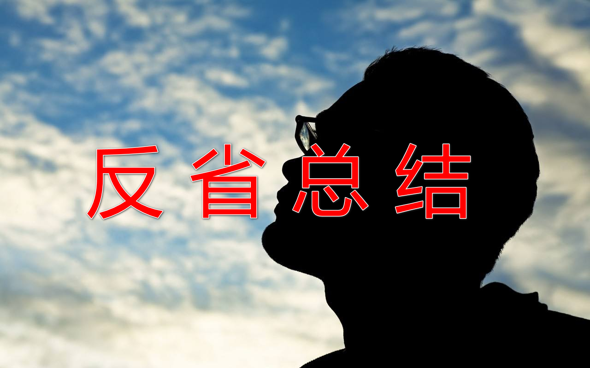
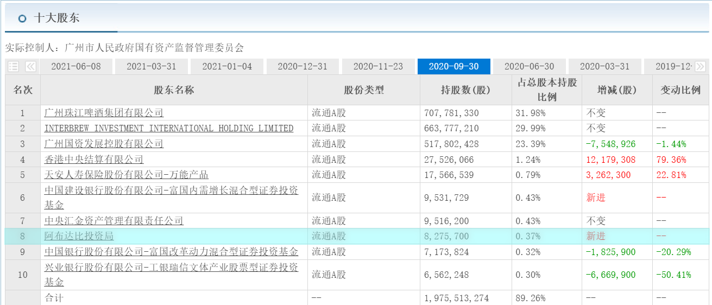
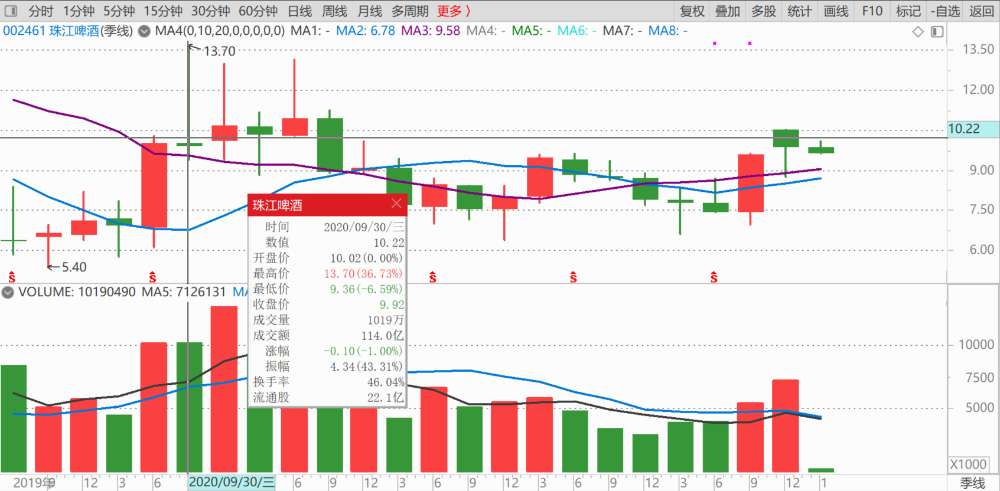
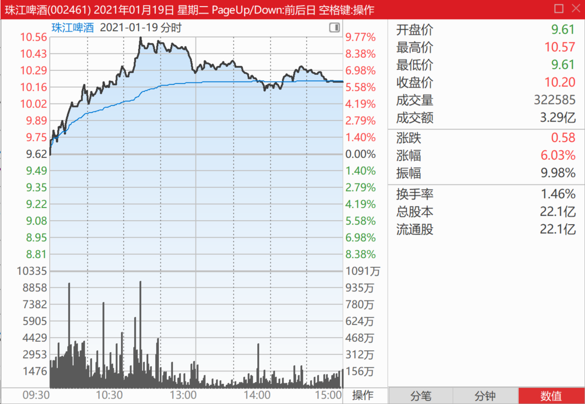
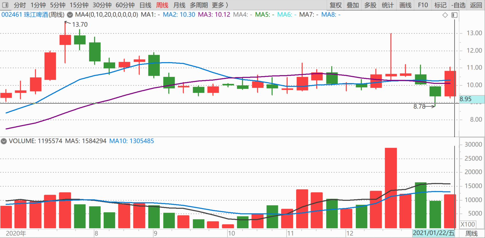
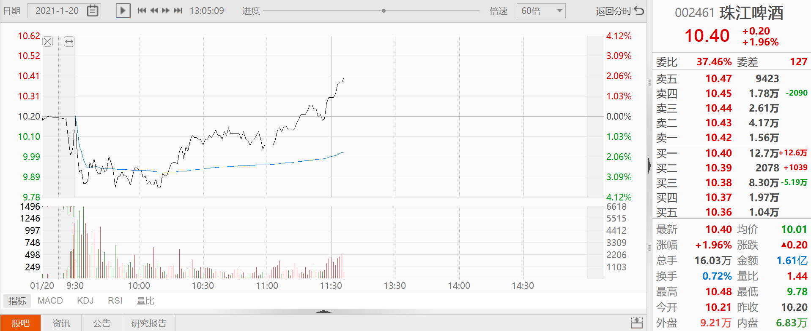

92篇.珠江投资的反省总结

清一山长2021年1月20日

[$珠江啤酒(SZ002461)$](http://link.zhihu.com/?target=http%3A//xueqiu.com/S/SZ002461) 珠江投资的反省总结：去年三季度，阿布拉比投资局入住十大股东。三季度的最低价是9.3元，最高价是13.70元，最高价出现在7月份。直到9月30日阿布达比投资局依然存在，可以肯定：它认为13.70元的价格不高，不值得出货，说不定它高位还买了一点（毕竟是中东土豪[大笑]）。

其实我高位已经几乎把原来持有的总共4M多的珠江出清了，剩余一点点货色，跌回来后，我根据三季度的价格走势，判断珠江9.3元就是这一轮调整的底部位置。**所以只要珠江接近这个价格我就使劲买。**最终仓位超过了两M，不到3M。没有买回4M多的原始仓位的原因，是这些多出来的资金，已经去了当时更低估的惠泉和燕京，珠江相对价格较高，看到惠泉相对最活跃，所以惠泉增仓明显。三季度显示从1.5M增加了差不多1M，到了2.448M的持仓量。这些资金基本上都是从珠江卖出后转战去惠泉的，所以，珠江自然就没钱多买了。这个决策其实是对的，这笔资金，在惠泉上取得了比死拿珠江更好的回报。后期果然珠江一直在9.3元以上盘整。去年12月再次冲到了13元，我12元多，就开始出货，总共出掉了一百多万股珠江，出货的原因，是一个原则：**只要碰涨停版，我就要出掉100万股减低成本**（昨天珠江差一分钱碰涨停。差一分钱我就要出一百万股了[大笑]）。

上一次冲13元没有全部出清的原因，是我认为珠江这一次破前高，应该是很正常的。因为它跌回来后，惠泉、燕京都相对涨了不少，但珠江一直没涨，这一次理论上，应该冲破前高创新高的。就是这种思维，害得我把剩下的一百多万股珠江，就死死捂住不放。其实**从技术上说，第二天冲高，放量回落，就是明显的调整标志**，我应该乘机及时出清的，结果犹豫了一下就没有出清。第二天珠江跌停，我就从跌停价开始，买回来不少高价卖出的珠江，权当做T成功了。我还是太乐观，没想到后期居然珠江会跌破9元，大跌眼镜。只好一路想方设法筹钱继续来买（上一次啤酒股的集体涨停潮，我卖掉的两M多的啤酒资金，你们一直跟随看帖的知道，相当部分我买了中国中车等跌得太惨的港股等）。持仓重新恢复到了2M多3M不到的位置，持仓成本降到了1.57元。可惜的是：如果我这一次操作更好一点、更耐心一点，珠江的这笔2～3M的持仓，本来可以降到0.5元左右成本的，多花了一元钱的成本[滴汗]！

现在的价格，我还不准备出货。我判断：珠江有可能会替换掉原来的惠泉的角色，成为三只啤酒股的“指标股”。甚至我怀疑，会不会是在惠泉上大有斩获的主力，现在已经移师一部分到了珠江“轮作”。因为从调整时间周期来看，珠江是调整得最到位的。惠泉调整的深度还可以，但时间上还不够。现在就拉上去，似乎不如转做珠江更好。甚至惠泉的市值太少了，由于惠泉主力已经至少赚了个翻倍，资金实力大大增加，近期打压惠泉特别厉害，估计是主力的资金走了不少，现在至少几个亿的资金没地方玩。直接拉太简单粗暴了，转战一下客场，现在来拉拉珠江这样的大家伙，正是绝妙的时候。**相对于惠泉来说，珠江能容纳的资本要大得多。当然，资金容量最大的是燕京，没个几十亿，还是别碰。**珠江的主力，十个亿一下就可以玩得很精彩了。所以，判断惠泉将从原来热火朝天的、跳上跳下的角色退下来装温柔，以后可能换珠江来做“示范股”了。惠泉似乎需要“休息”更长时间，来消磨掉一大批高位接盘者的持股信心。

上面的想法，纯属猜测，请勿据此操作，我的预测是经常被打脸的[俏皮]。目前持有惠泉也有2M了，但我不打算减仓惠泉，持仓成本现在是正数，不是负数了（去年底持有1M多是负成本的惠泉）。所以惠泉如果将来破产的话，我还是会有损失的[笑]。

[$珠江啤酒(SZ002461)$](http://link.zhihu.com/?target=http%3A//xueqiu.com/S/SZ002461) 看这个上攻盘面，基本没啥压盘的货。珠江已经把散户洗得差不多了。我妈从小告诫我：人多的地方不要去！股市上也一样——人少的地方才好发财[大笑]。

(标题、图片为编者所加)

**文章音频**：

[524篇.珠江投资的反省总结](http://link.zhihu.com/?target=https%3A//www.ximalaya.com/sound/791998883)

**参考链接：**

[86篇.吓人的目的是让你卖掉快逃](https://zhuanlan.zhihu.com/p/8712468814)

[87篇.早盘急拉代表什么？](https://zhuanlan.zhihu.com/p/10710257712)

[88篇.燕京还要趴多久？](https://zhuanlan.zhihu.com/p/11401524818)

[89篇.燕京我只关心两件事](https://zhuanlan.zhihu.com/p/13349235291)

[90篇.谁会是市场斩杀的对象](https://zhuanlan.zhihu.com/p/14718449608)

[91篇.如何看进出时机？](https://zhuanlan.zhihu.com/p/16488305045)
