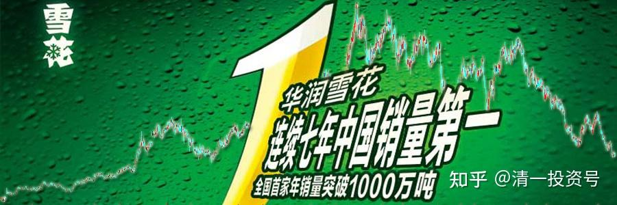
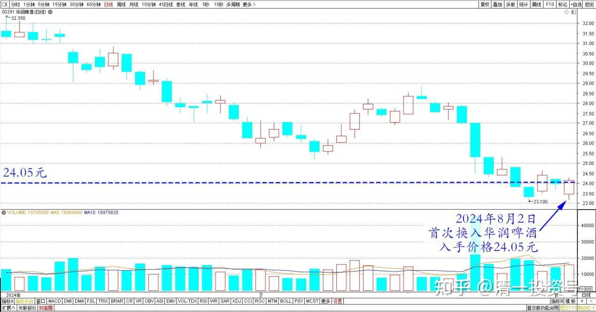
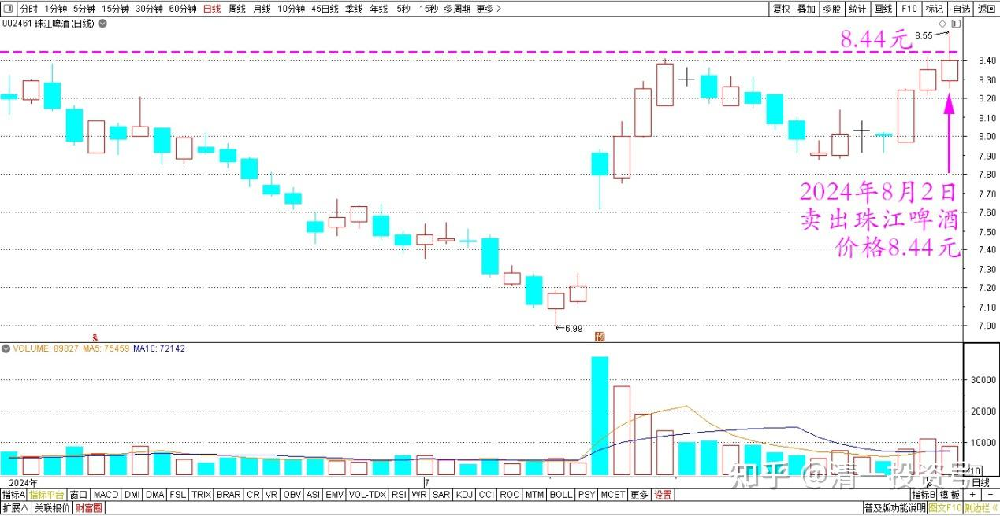
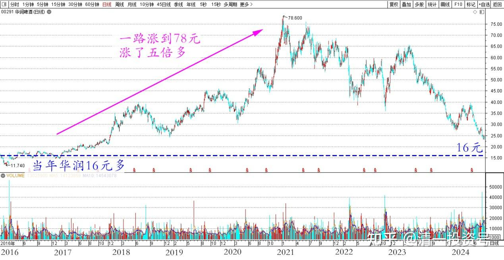
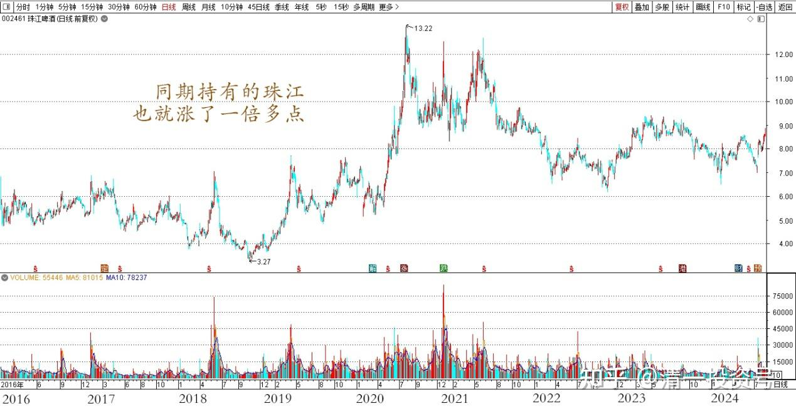
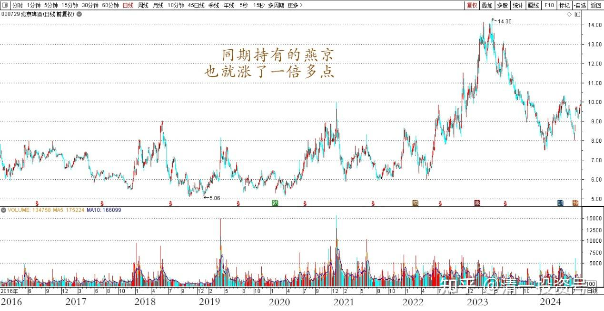
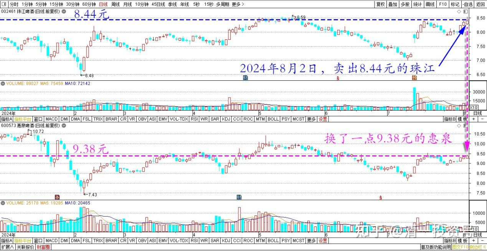
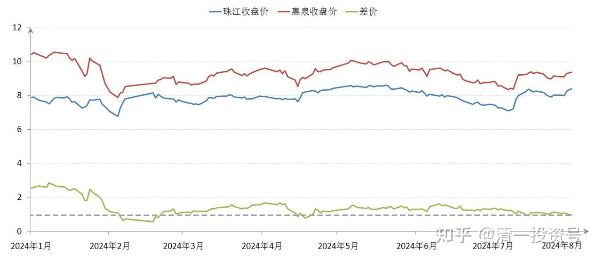

94篇.首次换入华润啤酒

清一山长2024年8月2日

今日首次换入一点华润啤酒：入手价格24.05元。是用8.44元卖出珠江啤酒换的。

华润啤酒2024年6～8月日线图

珠江啤酒2024年6～8月日线图

当年华润16元多，我居然没有买入低价的华润长期持有，一直怪我笨蛋思维，没有买龙头。后来看他一路居然涨到78元，目瞪口呆，居然就涨了五倍多。

华润啤酒2016～2024年日线图

同期我持有的珠江、燕京，也就涨了一倍多点。不过由于我融资持有啤酒A股，也算是赚了两倍了，没啥意见。

珠江啤酒2016～2024年日线图（前复权）

燕京啤酒2016～2024年日线图（前复权）

现在华润高位跌落，连续跌了几年，我就首次开始买入一丢丢——几万股，象征意义。主仓还是在A股上。毕竟——现在起而未起的架势，让我无法放弃！但跌到24元价位的华润，我认为风险几乎都释放了！买一点放在手上，也算是作为啤酒股爱好者的“收藏”习惯吧！**中国的几大啤酒公司，都持有一点，当做可口可乐一样长期放起来，也许就像巴菲特一样持有可乐30多年，传为佳话呢？**

另外——今日还用8.44元的珠江，还换了一点9.38元的惠泉。不到一元的差价，换换就换换！赔赚都无所谓了！全当无聊换了玩的！

珠江、惠泉啤酒2024年1月～8月日线图

珠江、惠泉啤酒2024年1月～8月收盘价

（标题、图片为编者所加）

**文章音频**

[471篇.首次换入华润啤酒](http://link.zhihu.com/?target=https%3A//www.ximalaya.com/sound/749573061)

**参考链接：**

[88篇.燕京、珠江轮动——增厚账面利润](https://zhuanlan.zhihu.com/p/705006495)

[89篇.跌破新低，买回燕京](https://zhuanlan.zhihu.com/p/706301925)

[90篇.珠江换燕京，天山换华菱](https://zhuanlan.zhihu.com/p/710097153)

[91篇.珠江喜迎涨停，换燕京和惠泉](https://zhuanlan.zhihu.com/p/711439700)

[92篇.差价0.9元，珠江换惠泉](https://zhuanlan.zhihu.com/p/711415396)

[93篇.补回天山，换入惠泉](https://zhuanlan.zhihu.com/p/713920895)

