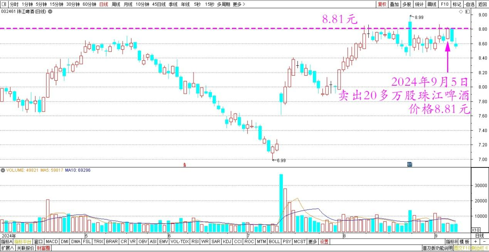
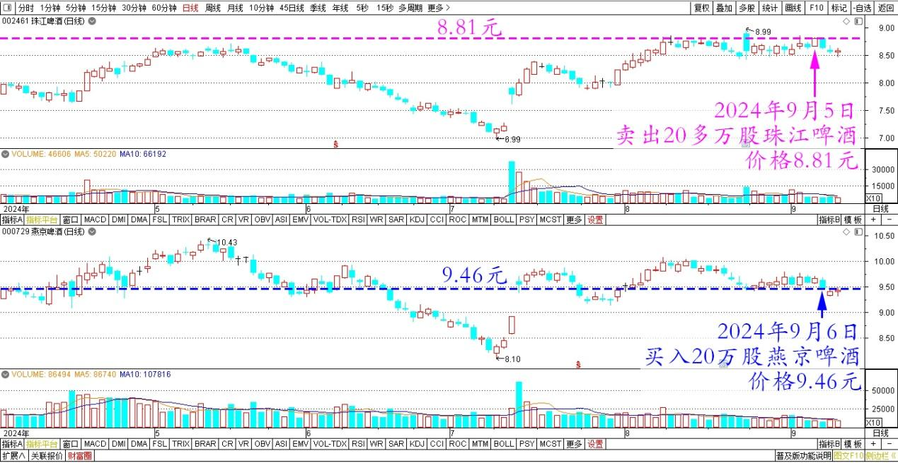
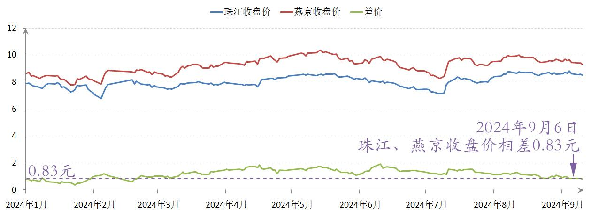
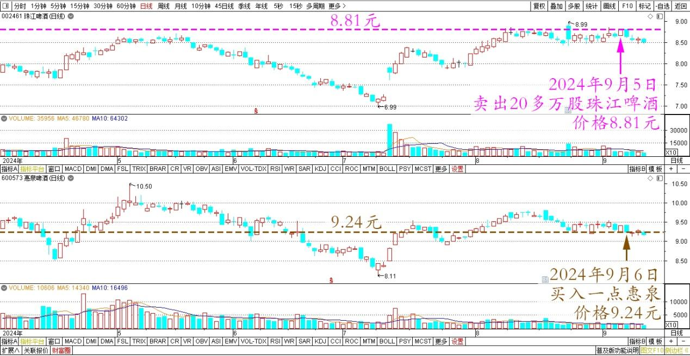
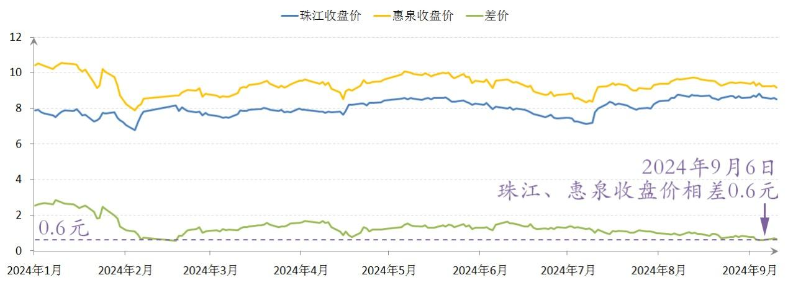

99篇.卖出珠江逢下跌，补回燕京和惠泉

清一山长2024年9月6日

好久没有动股票了。昨天、今天就操作了一下玩儿。昨天挂单8.81元，卖出了20多万股珠江啤酒，没多想补入的事情，只是想有机会切换一下其他股票。

珠江啤酒2024年4月～9月日线图

没想到今天啤酒就普跌，当然跌得也不多，就正好做一点小T，重新买入了20万股整数的燕京啤酒！**因为手上的这些珠江，本来就是原来的燕京上涨的时候换来的。现在有机会我就再换回去！重新T回来原来卖掉的头寸**。今天的买入价是9.46元！两股差价不到7毛钱了，我觉得还挺划算的！

珠江、燕京啤酒2024年4月～9月日线图

珠江、燕京啤酒2024年收盘价

另外还买了一点惠泉，9.24元买入的！两股4毛多的差价，真值！

珠江、惠泉啤酒2024年4月～9月日线图

珠江、惠泉啤酒2024年收盘价

反正我珠江手中还有大把，想换就换！昨天和今天的涨跌幅，这一笔做T的收益，不算换股的收益，至少也锁定了4000元的收益。算是一笔完美的切换吧！比打工划算！

(标题、图片为编者所加)

**文章音频**：

[481篇.卖出珠江逢下跌，补回燕京和惠泉](http://link.zhihu.com/?target=https%3A//www.ximalaya.com/sound/758775519)

**参考链接：**

[90篇.珠江换燕京，天山换华菱](https://zhuanlan.zhihu.com/p/710097153)

[91篇.珠江喜迎涨停，换燕京和惠泉](https://zhuanlan.zhihu.com/p/711439700)

[92篇.差价0.9元，珠江换惠泉](https://zhuanlan.zhihu.com/p/711415396)

[95篇.差价8毛多，珠江换惠泉](https://zhuanlan.zhihu.com/p/712702963)

[96篇.守低位风口，不天际追高](https://zhuanlan.zhihu.com/p/717712671)

[97篇.差价7毛多，珠江换惠泉](https://zhuanlan.zhihu.com/p/717710915)

[98篇.从消费数据看酒类投资前景](https://zhuanlan.zhihu.com/p/719002561)

