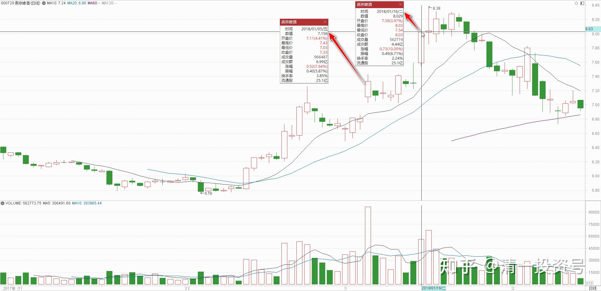
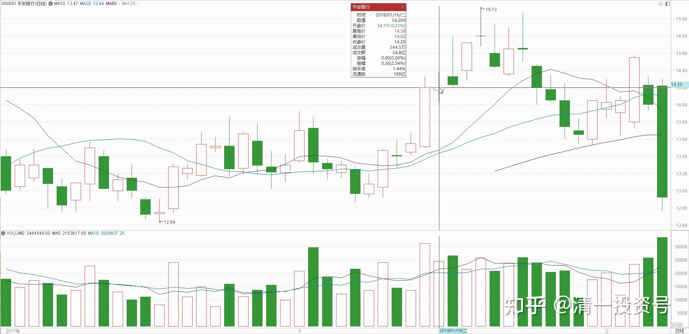
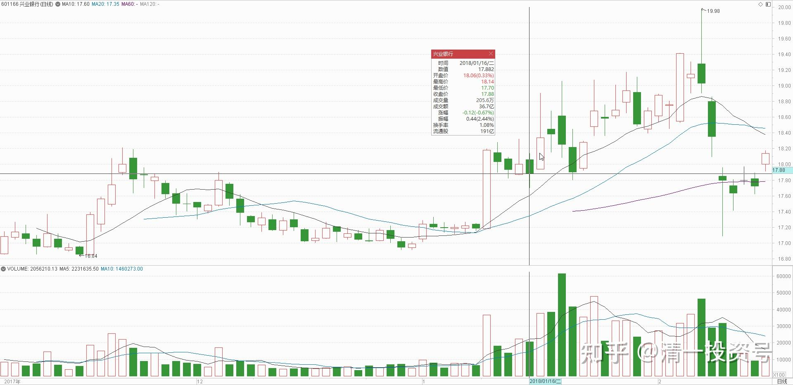
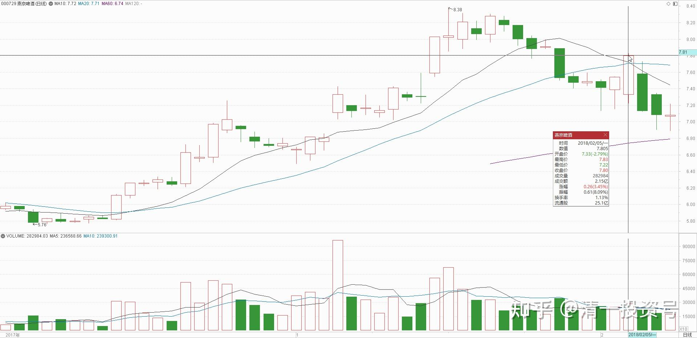
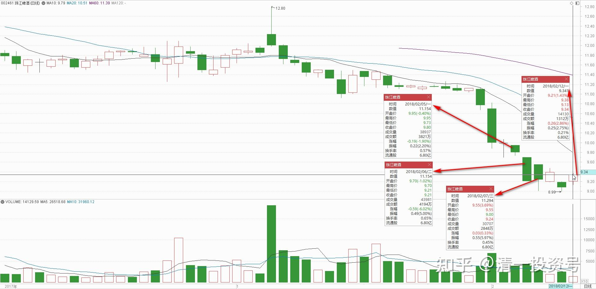
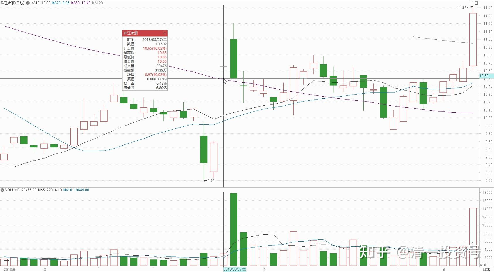

9篇.起码十年不涨就值得一起守候了

清一山长 2018年1月～2018年2月

**一、没有吸引力的暴力上涨**

清一山长2018-01-05 14:35:13

$燕京啤酒(SZ000729)$ 青啤都涨停了？燕京也开始了暴力上涨？可惜对我来说，这种上涨没有要我卖出的吸引力，我继续耐心持有好了。谁都知道，这些股票长期不涨，甚至还下跌。但质地是没问题，聪明人都想：等涨了我再来买进，提高资金收益率。可惜，**这些股票的涨法，都证明了一个真理：等它们真正开始上涨的时候，你根本就来不及买进的。**

清一山长2018-01-16 13:48:12

$燕京啤酒(SZ000729)$去年越跌越买的A股重仓燕京，今天居然涨停了，要不要卖出一点，表示庆祝呢？[赚大了]。还是重阳投资牛[很赞]。一买就涨！

守得云开见日月11回复清一山长（上贴续评）

卖吧！砸开板，让咱也买点[大笑]。

清一山长2018-01-16 15:33:15回复守得云开见日月11:

我已经尽力了——今天下午，使劲地砸了二十万股燕京出去，连一分钱也没弄动开[吐血]。主力实在太强了，我们还是歇歇手吧！别自不量力了（没砸出坑，但账上砸出了一笔资金，我拿来重新买进某没涨的消费股了。这个时候，我可不敢空仓傻等）[大笑]

麦秆008回复清一山长:（上贴续评）

山长老师抛出是觉得燕京已经不再低估？还是有更低估的标的股？

清一山长2018-01-16 18:38:32回复麦秆008:

第一：我只卖了一点点的持仓，还不到我10%的总仓位。

第二：**我会在我还能找到相对价格更低的标的的时候，卖出一些明明会涨的股票。因为我对增加股票的数量，比单纯地看到股票涨更有兴趣。我觉得后者增加了账户的浮盈，但没有增加我的股票。**所以是虚假的上涨。

第三：今天我还卖掉了一部分涨了超过50%的平安银行，换进来10万股我觉得就没涨的兴业银行。以保持我A股的银行头寸不变[大笑]。如果平安继续涨，我可能继续换

baishuanghe回复清一山长：（上贴续评）

山长在股市的存在，就是韭菜们的不幸。

清一山长2018-01-16 20:10:28回复baishuanghe：

我没觉得今天吃掉我这么多涨停单的是小韭菜，我认为是大鳄鱼[加油]。有可能认为是垃圾股，低价卖给我的是小韭菜[大笑]。问题是：韭菜既然想跑路，我好心接一点没人要的垃圾股，是在帮助他们去买想要的好股。

**二、涨了的再换个没涨的，大概率不会赔本**

清一山长2018-02-05 15:25:19

$燕京啤酒(SZ000729)$ 今天以7.79元和7.80元，卖出30万股燕京。再换入了25万股珠江啤酒，入手价9.80元。**理由——涨了的再换个没涨的，大概率不会赔本。反正不空仓。其实。更准确的说法，是我下午先买入了珠江啤酒。再等燕京冲高中，卖出了燕京的。**现在我在等中信H冲高后，计划卖出一部分，计划买入其他没涨的大金融股票。我持有的中信太多了，要卖掉一些才安心。

清一山长2018-02-05 16:05:09

$中信银行(00998)$ 今天在6.77元，卖出了20%的中信H持仓。计划明天买入其他低估的金融股。没有全部卖出中信银行的原因是，似乎中信的风来了，今天A股涨停，有龙头之相。等一等，也许有更好的价格。现在20%的仓位，就执行价值投资原则好了，剩下的用来“投机”了。

恐高症患者11回复清一山长:（上贴续评）

老师，你昨天买的珠江啤酒怎么操作的？

清一山长2018-02-06 15:22:53回复恐高症患者11:

没操作，持仓套牢装死中。今天又买了五万股珠江。9.21元，主动买套[吐血]。决心与大股东共进退，死守到底[加油]

清一山长2018-02-07 17:13:41

$珠江啤酒(SZ002461)$ 怎么不跌了？我怀疑这就是一个“假杀”变成“真杀”的案例。好！长期来看，这个价，这个股就没有人能赚钱[大笑]

好如意回复清一山长:(上贴续评)

啊？没人能赚钱？听不懂了。怎么办？我用私房钱买了点[为什么]

清一山长2018-02-07 19:37:39回复好如意:

大家千万别买珠江啤酒！经过调查，最近十年的市场历史上，长期投资的人，就没人能够从它身上赚钱。全都被套牢了，活埋了。极度危险，请注意！让我先派侦察队去探雷区，安全之后会发信号。如果没有信号，就是派去的队伍都死了[大笑]

清一山长2018-02-12 13:35:13：

$珠江啤酒(SZ002461)$ 珠江啤酒比燕京便宜吗？因为我用涨了的燕京，换了一些没涨的珠江，可能导致有人会这样理解。也有人盲目跟风，买入珠江。

其实，**如果从年度的产销量上来看，燕京啤酒比珠江高三倍。理论上市值也应该高三倍，实际市值是只高两倍，所以燕京啤酒比珠江更便宜。**

如果看市净率上来看，燕京1.48，珠江1.30，看上去珠江更便宜一些。

我买入的理由，依据“价值”已经算不清了，啤酒的利润如何释放我不知道。**我依据的是“投机”，**我觉得珠江的股价弹性更大，所以如果跌到了多年以来的低价平台位置，买入一点大概率不会太亏。不涨就死死持有算了。我主要是换股，从涨停的燕京换出来的。**我不愿意放弃持有的中国啤酒工业的股份，我总觉得啤酒应该总有人喝的。涨不涨俺无所谓。我是买企业，不是买股票。**所以大家不要盲目模仿，不然亏了别怪我。

**三、赚不赚先不谈，起码十年不涨就值得一起守候了**

清一山长 2018-03-26 14:59:45

$中国建筑(SH601668)$ 今天以8.74元的价格，买入了一点中国建筑，让我的中建持仓量恢复到了M级水平（不好意思，居然帮我赚钱最多的股，我之前只持有了一点点。主要我不太看好A股的估值，大多数资金都转战港股了）。今天买入不是为了低估啥的，接飞刀的原因主要是“念旧情”，对中国建筑如此低迷感到难过，用一点个人资金支持一下，反正没打算低价卖。买入后，中建的总持仓成本还是负数。再跌可能会再买，但如果持仓成本上升到0元之后，就不会再买入中建了。也就是说，**我只计划把中建的利润部分用来投资，不打算花本钱[大笑]**。因为我觉得中国交建H比它更便宜。多的钱，不如用来买交通建筑算了[赚大了]。

很搞笑的是：今天同样以8.74元的港币，买入了几十万股中国宏桥$中国宏桥(01378)$。让我的整体持仓成本从2.06元增加到了2.26元。本来我完全有机会让宏桥的持仓成本也变成负数的。只要按照我对中国建筑的操作手法来使用就够了。因为宏桥提供的机会其实比中国建筑更好，应该夺走我的中国建筑创造的个股利润最高记录。可惜的是我错过了机会。由于我个人太看好中国宏桥了，高位我只卖掉了少部分的持仓，大多数持仓都在坐电梯。所以，只好维持现在的持仓价格了。所以证明不要太爱一只股票，投入感情后，结局不太好的[哭泣]。如果宏桥继续下跌，不排除我会继续买入。直到持仓成本超过3元，就不再继续买入了。

申明：我今天买入不代表我认为股票不会跌了。按道理还会跌的，美股很可能来一个黑色星期一，很可能本周就是大跌周。反正我还有不少资金正在等待买入便宜货。今天只是旧情复发，买了一点老情人的股，表示支持罢了。不是理性投资的行为。因为我一向买股后都被套牢的。**主要靠躺倒装死来赚钱**[大笑]

家具特价咯回复清一山长:（评论上贴）

山长老师推荐的珠江啤酒涨停了，我刚买了就涨停了，太感谢您了，一路跟随您的博客至今有2年时间，您教会我很多[笑]

清一山长2018-03-27 12:31:19

回复家具特价咯: 特别说明：我没推荐过珠江，我不推荐任何股。我只是原来买入了珠江，并告诉你们，我买了它罢了。不构成推荐。**因为我不能担保你们赚钱，我只能担保我会赚钱，只要死不放手就行了**[大笑]。

恭喜，你们都是有福之人。这么快就涨停了，我还以为要等很久的。珠江跌破9元就是典型的黄金坑。不要白不要。我觉得便宜就买了，但我永远也不推荐股票，因为我不替公司站台，也不为券商打工，不负责推介股票，我没有推荐股票还要包赚不赔的义务和能力。

51nxp回复扶云而上:

你错了，如果说我2016年做新黄浦，2017年做天健都有投机的念头，现在做兴业，我觉得是市场在送钱给我。

清一山长2018-04-23 13:26:09回复51nxp:

前复权看兴业的股价，兴业现价可是处在高位的。如果这人真拿了十年，赚的钱，也不老少了，比买理财高多了。还哭啥呢？[大笑]。还想要更多的吗？眼看别的涨得更多的气不过？看看别的很多股，还有不少十年没涨呢！比如啤酒，买啤酒的人，不早就哭晕了。（我的人心好，看别人受难，不忍心，喜欢救人。**这就是我买啤酒股的基本宗旨。赚不赚先不谈，起码十年不涨就值得一起守候了。**）

**参考链接：**

[8篇.初谈燕京](https://zhuanlan.zhihu.com/p/594537053)

[10篇.啤顺鑫快速拉升引发的啤酒讨论](https://zhuanlan.zhihu.com/p/597816918)

[11篇.连连出台的质疑文让我加紧了买啤酒的行动](https://zhuanlan.zhihu.com/p/598382916)

[12篇.早期珠江啤酒、燕京啤酒的换仓记录](https://zhuanlan.zhihu.com/p/602033762)

[13篇.买卖操作后的富足之心](https://zhuanlan.zhihu.com/p/604162057)

[14篇.珠江的破位急跌，名曰跌停进货法](https://zhuanlan.zhihu.com/p/606062514)

[15篇.金融市场是考验心态和修为的地方](https://zhuanlan.zhihu.com/p/608010478)

