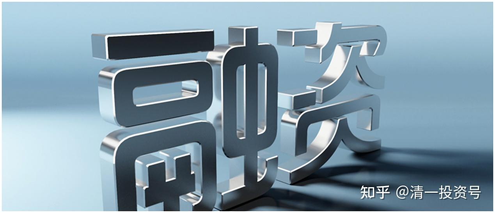

9篇.非高手不要玩融资——山长对话HIS1963

清一山长2018年7月3日～2018年8月7日

**一、普通人不要用融资，用融资的风险太大了**

[HIS1963](http://link.zhihu.com/?target=https%3A//xueqiu.com/1760673340)[发布于2018-07-03 16:09](http://link.zhihu.com/?target=https%3A//xueqiu.com/1760673340/109890249)

《[愿赌服输](http://link.zhihu.com/?target=https%3A//xueqiu.com/1760673340/109890249)》

雪球链接：[https://xueqiu.com/1760673340/109890249](http://link.zhihu.com/?target=https%3A//xueqiu.com/1760673340/109890249)

清一山长2018-07-03 22:15:36评论上帖：

我刚打赏了这篇帖子￥100.00，也推荐给你。敬佩遵守纪律的黑丝【农行330开始，每跌一毛，融资仓割肉5%，这个就是铁的纪律，不是赚钱的纪律，是保命的纪律!】

黑丝2015年守浦发的时候，我也是浦粉。只是没有坚持到底，涨了就换招商。2015年股灾守招商，2016年守兴业，2017年底还上融资买兴业，2018年年初吓跑了。现在也许该买农行了。

@HIS1963:回复@清一山长:

感谢大师100巨款赏赐[握手][握手]

HIS诚惶诚恐......[滴汗][滴汗]

希望能够成为农行的同志......[干杯][干杯]

清一山长2018-07-03 22:45:38回复@HIS1963:

记得去年你看好建行，好眼力[赞]。我2017年完美地错过了建行，银行股傻乎乎地守住兴业。幸亏今年兴业给了个机会跑了。我相信今年你对农行的坚守一定有你的道理。农行的盟军内部拿货（增发）都快4元了，3.3元拿农行，实在没什么好担忧的。

清一山长2018-07-03 22:57:56再次评论上帖：

说明一下：**我不支持普通人用融资，用融资的风险太大了，非高手不要玩融资。**高手不是砍别人厉害的叫高手，往往高手是割自己最狠的。断腕壮士的目的，是丢手不要丧身，留下身子，后来才会有翻本的机会，别舍不得玩完了。比如黑丝，就是融资的高手，但你们不要模仿他用融资，特别是高额度融资。

说实话，我知道自己也做不到黑丝这样的，对自己下手特狠心。他在涨停的前一天卖浦发。你们把这看做他的失败，我看做他的成功秘诀：**用了融资这把刀，砍人厉害。必要的时候，砍自己也要下得去手。如果下不了手的人，就别用融资。或者不贪心，涨了一点就赶快卖掉还融资。**

我胆小，对自己砍也很难下手，结果就是：2015年以来，我的融资上到20%就不敢继续了。宁肯错过，不要做错。2015年维持担保比例跌破170%的时候，我的融资总额比本金还多的时候，我的心理压力很大。虽然国家队救市让我创造了市值的新高。但没有国家队出手，或者我手上不是拿的招行等国家必救，我恐怕2015年就过不去了。就要学“93老股民”了。所以，2015年以后，我特别的胆小。虽然2015年我是赚了大钱的。

@簿记员回复清一山长:

他不是330拿农行，是330割农行啊！

清一山长2018-07-03 23:00:24回复簿记员：

如果他割掉100%的农行，我就不说他了。无非小散一个。

他割5%的农行，是为了保住95%的农行。目的不一样的。

**二、不用融资，进退都自如**

[HIS1963](http://link.zhihu.com/?target=https%3A//xueqiu.com/1760673340)发布于[2018-08-07 16:40](http://link.zhihu.com/?target=https%3A//xueqiu.com/1760673340/111748534)

《[走在繁华落尽前](http://link.zhihu.com/?target=https%3A//xueqiu.com/1760673340/111748534)》

雪球链接：[https://xueqiu.com/1760673340/111748534](http://link.zhihu.com/?target=https%3A//xueqiu.com/1760673340/111748534)

清一山长2018-08-07 17:36:25评论上帖：

HIS卸掉杠杠很好。主要是心理上轻松一些，没必要背这么大的负担。多赚的钱自己也用不了，赔掉的本金确实辛苦所得。

**不用融资，进退都自如，涨跌都无心了。我的原则，除非是有很大的确定性，否则不敢用融资。**

现在比2015年最高点还高四倍，很了不起的业绩了[很赞]。我才比2015年多一倍多[哭泣]。主要是融创没有重仓。

HIS1963:回复@清一山长:

非常赞同大师的投资和人生理念。[很赞][很赞][很赞]

清一山长：2018-08-07 19:59:53回复@HIS1963:

啥大师呀[滴汗]。我们是同龄人，同在股市中煎熬炼心罢了。认识你是因为2015年的浦发，我们当时是“战友”。今天我看账户，看到2015年的浦发交易记录，居然是主账户银行股里面利润最多的一只。但是买入成本跟现价比，差价才两元多一点。所以，很庆幸自己居然在几乎最高点（19.9元）跑掉浦发，而且一直坚持到现在，还没有买进。所以，幸运才是我的写照，而不是“炒股大师”的本事[笑]。

@回报和乐趣成反比回复清一山长:

自信能力足以长期战胜市场的话，其实没有必要上杠杆吧！确保在正确的方向上前进就是了，不摔跤跑慢点，其实最后看不是慢而是快了。以山长兄的实力，上满仓在旁人看来已经是很震撼很有冲击力了。[大笑]

清一山长2018-08-07 19:29:32回复回报和乐趣成反比:

本来没压力的，我看你居然空仓了，所以感觉还是有点“压力”了。我自己就只想赚点分红的钱[俏皮]！这样股市的涨跌，似乎都不影响我赚这种钱，所以真不需要什么勇气去持有的。更不需要“震撼”了。只要下跌不会让我爆仓，我就不怕满仓，也没有啥压力的。

不过现在的世道，不知道特朗普还会出什么招。为了有机会捡便宜货，我现在没有满仓。还是留出了两成的现金准备补仓。除了分红还没有用完之外，今天看中国建筑居然大涨，就赶快5.82元卖掉了，把中建的资金作为预备队来准备抄底了，反正我看市场上有大把比中建还便宜的股，就不死死地守住中建了。知会一下各位，中国建筑如果以后再跌就再买入，不跌就买别的股去。

[回报和乐趣成反比](http://link.zhihu.com/?target=https%3A//xueqiu.com/8824197519)2018-08-07 20:50回复清一山长：

我那两下对山长兄你哪有什么参考价值啊！您是大师级的佛系价投，看的是估值、价格、派息率。我充其量是个股市搬砖工，一天到晚折腾，想赚点趋势差价，在熊市中持频率更大，心态气度都不在一个层次噢！

刚才看了下H大居然股龄和我一样啊！连资产配置都差不多。只是年岁稍长，对他这份心境和经历深有体会。只是我自知水平有限，从不上杠杆而已，他现在做的也是我想了很久的，只是觉得经济实力还差了些，想坚持到五十岁再做[捂脸]。

参考链接：

[清一投资号：32篇.中国中车：敢于融资持有](https://zhuanlan.zhihu.com/p/508326510)（整理文）

[清一投资号：51篇.使用融资先要确保不爆仓](https://zhuanlan.zhihu.com/p/541118486)（整理文）

