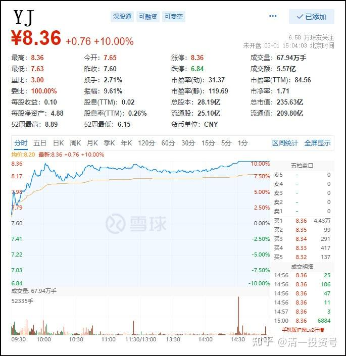
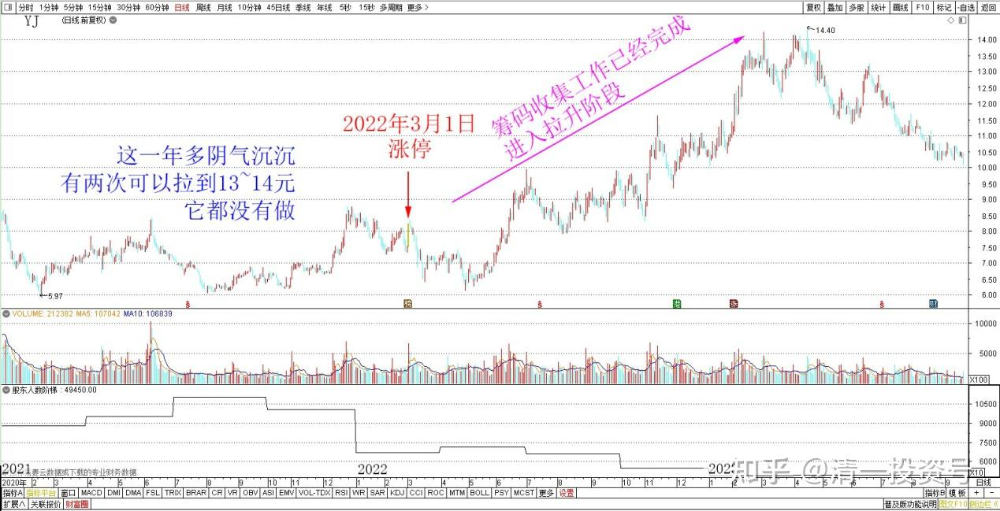
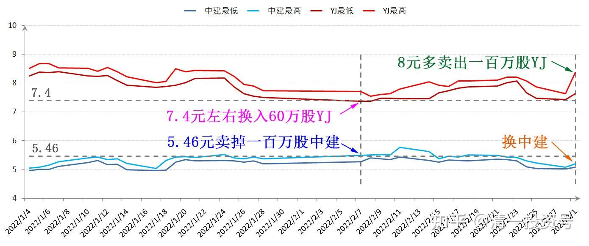

专篇24.涨停但不像拉升出货

清一山长 2022年3月1日

刚看到：YJ快涨停了。可能是看我们缺钱用，有人送钱来了。大家放心：吉人自有天相[大笑]！

今天午盘对YJ的走势分析：今天青岛开涨，YJ跟涨，而且惠泉冲涨停（这倒不奇怪，盘子很轻，且基本控股）。两个YJ系的股，居然都排啤酒板块的涨幅第一、二名，这是很不正常的。历史上很少见的。也可以说：YJ，从来是别人大涨，它小涨；别人不涨，它还跌的。**今天这样走，说明YJ的筹码收集工作已经完成了，该进入拉升阶段了**。今天一天就收复了原来十几天才勉强收复的失地。

但今天YJ的走势很异常，青岛和惠泉都冲了涨停，但YJ就是故意的不冲涨停，就差几分钱不动。一直故意在9%的样子徘徊，显得又强势又弱势的。为啥呢？因为它希望给点好处，就让其他人赶快走掉。**它不希望过于强势让散户们不愿意走，而是走得很勉强的样子，让人怕掉下来现在就赶快走**。所以，今天一过，YJ的股东人数会明显大降的。

*YJ 2022年3月1日分时图*

今天不像是主力要拉升出货的样子（主要从价位上看的。这个价位不可能出货，正常出货空间，必须在10元以上，一般来说为了出货更顺利，会拉到13～14元，参考惠泉的做法）。YJ这一年多都是阴气沉沉的，最近一年多它有两次可以拉到13～14元出货，它都没有做。而是故意拖拖拉拉的。所以，**现在的价位，YJ虽然冲涨停，也绝对不是走的时候**。

*YJ 2021～2023日线图*

不过，我可以大方一点，主动丢一些筹码给主力：如果今天YJ真的冲涨停的话，我还是愿意卖给主力一百万股的，表示友情赞助主力收集筹码。拿着这么久的散户，总得给主力一点甜头吃吧[大笑]！**别总想自己全都好处吃尽了，不让一些利润给主力也不够意思**。但如果今天不冲涨停，我就不想卖了，只看不动。现在啤酒才刚刚转势，卖啥卖呢？等一季报出来好了。

这一百万股，现在也正好中国建筑掉下来了，我可以转身补回来吧。上次我偷偷的5.46卖掉一百万股中建，7.4元左右换入了60万股YJ。今天我用8元多卖出去一百万股换中建，这生意应该是不亏的。**就算YJ继续涨，我看起来没有赚钱，但我通过这种转换，赚了更多的股票在手上，我也没亏**[大笑]。

*中建、YJ 2022年1～3月价格图*

好吧，分析完了，我去看看下午它怎么走吧？也许我可以倒腾一下好玩（请注意大家别模仿，我的主仓不变，YJ依然持有超过1800万股。卖一点几乎只是几个点的比例，不影响大局的）。

文章音频：

[375篇.涨停但不像拉升出货_清一投资号文章同步音频_免费在线阅读收听下载 - 喜马拉雅](http://link.zhihu.com/?target=https%3A//www.ximalaya.com/sound/668733392)

**参考链接：**

专篇1 [306篇.前缘1.雪球的最后一贴--胜利曙光都已经出现](http://link.zhihu.com/?target=https%3A//xueqiu.com/2017773236/247159187)

专篇2 [307篇.被特别关照的股--前缘2](http://link.zhihu.com/?target=https%3A//xueqiu.com/2017773236/247387457)

专篇3 [308篇.立此存照--前缘3](http://link.zhihu.com/?target=https%3A//xueqiu.com/2017773236/247580614)

专篇4 [309篇.见识传说中的拖拉机账户](http://link.zhihu.com/?target=https%3A//xueqiu.com/2017773236/247973779)

专篇5 [310篇. 拉升在即](http://link.zhihu.com/?target=https%3A//xueqiu.com/2017773236/248351982)

专篇6 [311篇. 进入右侧投资时代](http://link.zhihu.com/?target=https%3A//xueqiu.com/2017773236/248658236)

专篇7 [313篇. 小主力进货的阶段](http://link.zhihu.com/?target=https%3A//xueqiu.com/2017773236/249221851)

专篇8 [316篇.两轮回调对比](http://link.zhihu.com/?target=https%3A//xueqiu.com/2017773236/249675370)

[专篇9.主力的水军](https://zhuanlan.zhihu.com/p/619400004)

[专篇10.主力完成筹码收集](https://zhuanlan.zhihu.com/p/629948708)

[专篇11.主力、游资、右侧投机客纷纷进场](https://zhuanlan.zhihu.com/p/631628731)

[专篇12.进入震荡期](https://zhuanlan.zhihu.com/p/633057526)

[专篇13.永远回避风险，不亏损第一](https://zhuanlan.zhihu.com/p/635191087)

[专篇14.高位十字星缩量及主力操作的三个阶段](https://zhuanlan.zhihu.com/p/635191930)

[专篇15.准备起跳](https://zhuanlan.zhihu.com/p/636886203)

[专篇16.大幅回调，老手加高手](https://zhuanlan.zhihu.com/p/638552635)

[专篇17.股东数所传递的信息](https://zhuanlan.zhihu.com/p/639002631)

[专篇18.突](https://zhuanlan.zhihu.com/p/640000051)
[破9元是燕京的基本目标](https://zhuanlan.zhihu.com/p/640000051)

[专篇19.YJ、惠泉今天盘面语言对比](https://zhuanlan.zhihu.com/p/640550916)

[专篇20.暗示洗盘快结束](https://zhuanlan.zhihu.com/p/641509884)

[专篇21.现在是新主力的成本区](https://zhuanlan.zhihu.com/p/642330561)

[专篇22.成熟投资者的思考方式](https://zhuanlan.zhihu.com/p/655404597)

[专篇23.主力未走，迟早变盘](https://zhuanlan.zhihu.com/p/656816805)

