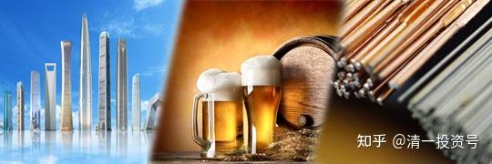
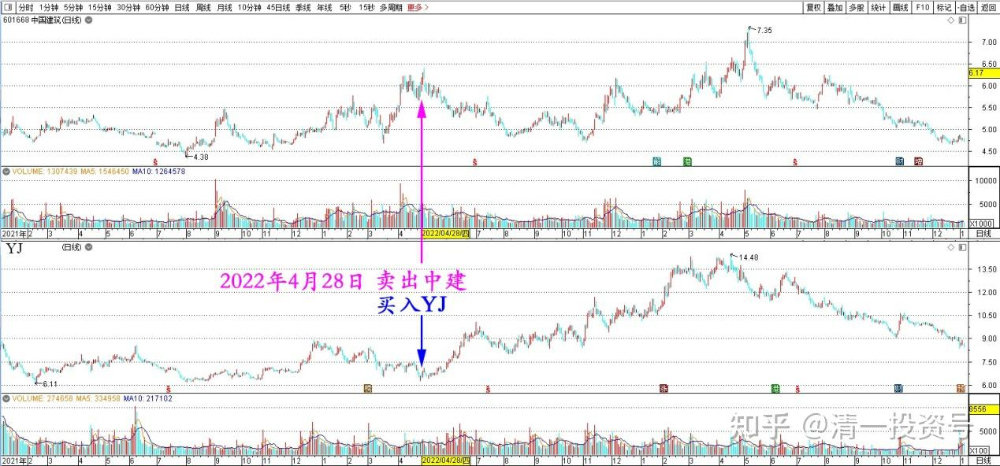
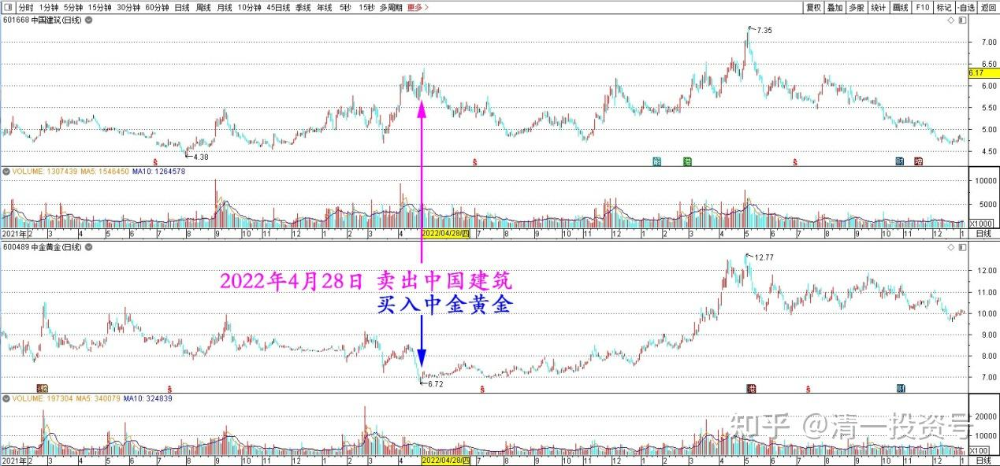
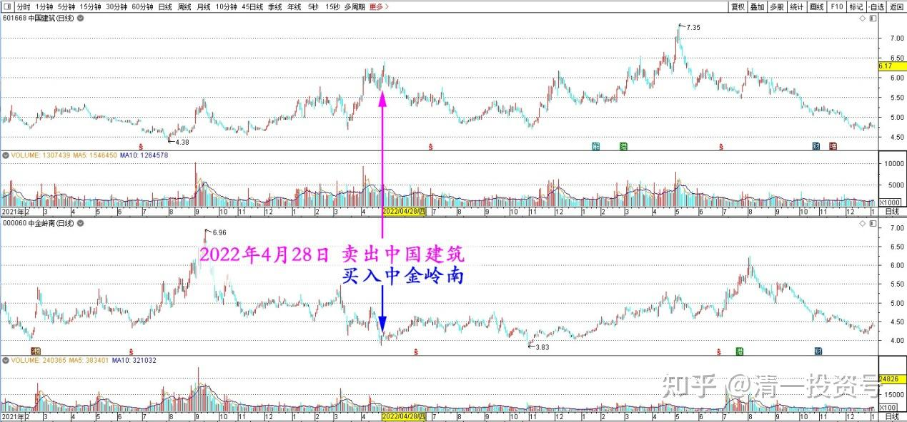

专篇31.中建换啤酒和资源股

清一山长 2022年4月28日

今天6.17元、6.16元，卖掉了几百万股中国建筑（还有上千万股持仓）。换回来的资金，买了燕京啤酒，还有中金黄金、中金岭南。我认为：资源股大跌很不正常，我就当矿老板、酒老板好了。俄罗斯的情况，已经证明了：美元可以印钞票。但最终资源国（俄罗斯）不认美元，美元就贬值了。将来大家都发现：原来拿钱在手里没用，拿资源才是真钱。最终资源股一定会上去的。所以，**我今天做“赔钱买卖”、卖掉大家抢的好股，去买大家都不要的烂股。[**囧]

*中国建筑、燕京啤酒 2021～2023 日线图*

*中国建筑、中金黄金 2021～2023 日线图*

*中国建筑、中金岭南 2021～2023 日线图*

芬兰能源研究中心CREA发布消息称：入侵乌克兰后，俄罗斯向欧盟出售能源的收入翻了一番。近两个月，欧盟共花费440亿欧元，用来进口俄罗斯的石油、煤炭和天然气，比去年同期的数据翻了一番。整个2021年，欧盟也不过进口了1400亿欧元的能源。——这就是西方的金融制裁无效了。手中握有资源的人说话才算数。俄罗斯靠资源赢了美国、西方的联合封锁，让大家看到了西方的伪善和空虚。将来大家都会把资金拿去储存物资的，不会放在美国的国库里面，买一堆没有实用价值的美元债券了。

[美发动对俄最严厉制裁俩月，俄能源收入大增_腾讯新闻](http://link.zhihu.com/?target=https%3A//new.qq.com/rain/a/20220428A0AGHQ00)

(标题、图片为编者所加)

**文章音频：**

[410篇.中建换啤酒和资源股_清一投资号文章同步音频_免费在线阅读收听下载 - 喜马拉雅](http://link.zhihu.com/?target=https%3A//www.ximalaya.com/sound/699932499)

**参考链接：**

[专篇21.现在是新主力的成本区](https://zhuanlan.zhihu.com/p/642330561)

[专篇22.成熟投资者的思考方式](https://zhuanlan.zhihu.com/p/655404597)

[专篇23.主力未走，迟早变盘](https://zhuanlan.zhihu.com/p/656816805)

[专篇24.涨停但不像拉升出货](https://zhuanlan.zhihu.com/p/657944680)

[专篇25.裘国根清仓式减持华能国际电力港股](https://zhuanlan.zhihu.com/p/659254254)

[专篇26.主力倒手，游资被动替主力杀跌](https://zhuanlan.zhihu.com/p/660162209)

[专篇27.看多不做多，主力在第二阶段](https://zhuanlan.zhihu.com/p/661469607)

[专篇28.走势打破正常思维，看空不做空](https://zhuanlan.zhihu.com/p/662755132)

[专篇29.股票•期货](https://zhuanlan.zhihu.com/p/665201830)

[专篇30.谁是真强势？谁是真弱势？](https://zhuanlan.zhihu.com/p/676527421)

